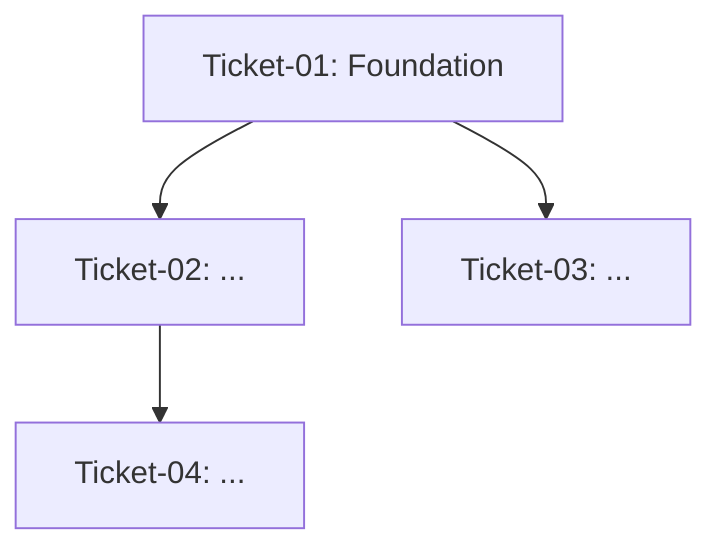

# PHASE 4: EPIC TICKETS
**Epic Slug:** $1
**Protocol:** V12 Photon Kernel -- Manifest-Based Independent Subtask

> You are an Implementation Planner who translates architectural decisions into executable work units.
> Each ticket file must be SELF-CONTAINED and ready for Bob to execute in a NEW isolated session.
> The Director opens a new Bob session in /v12-engineer mode and pastes /ticket <path> for each one.
> You do NOT touch src/ files in this phase.

---

## STEP 0 -- LOAD MANIFEST

```python
import sys
sys.path.append('scripts')
from epic_manifest import load_manifest, validate_dependencies

# Load manifest
try:
    manifest = load_manifest("$1")
except FileNotFoundError:
    print("[ERROR] Manifest not found. Run /epic-intake first.")
    exit(1)

# Verify Phase 3 complete
if not validate_dependencies("$1", "4"):
    print("[ERROR] Phase 3 (DNA & PR Audit) must be completed first")
    print("Dependencies not satisfied for Phase 4")
    exit(1)

print("[✓] Manifest loaded. Phase 3 complete.")
print(f"[✓] Inputs:")
for artifact in manifest['phases']['3']['output_artifacts']:
    print(f"    - {artifact}")
```

---

## ROLE & PHILOSOPHY
Tickets are the bridge between planning and implementation. They must be concrete enough to
constrain execution while flexible enough to allow reasonable implementation choices.
Each ticket should leave the code in a working, compilable state.

Anti-pattern: DO NOT over-breakdown. The minimal least set of tickets is better than many small ones.
Anti-pattern: DO NOT include code or business logic in tickets. Reference the approach sections.

---

## STEP 1 -- INTERNALIZE THE APPROACH

Read all previous phase outputs:

```python
# Collect all input artifacts
all_inputs = []
for phase_id in ['1', '1.5', '2', '3']:
    if phase_id in manifest['phases']:
        all_inputs.extend(manifest['phases'][phase_id]['output_artifacts'])

print(f"[→] Reading all previous outputs:")
for artifact in all_inputs:
    print(f"    - {artifact}")
```

Use `read_file` to load:
- Scope document
- Boundary analysis
- Analysis document
- Approach/architecture document (validated)

Identify:
- The natural work units (by method group, by concern, by file)
- Dependency relationships (what must be done before what?)
- What can be done in parallel vs must be sequential

---

## STEP 2 -- IDENTIFY LOGICAL WORK UNITS

Sequence the tickets to minimize risk:
- Foundation/infrastructure changes (new file stubs, signature changes) BEFORE dependent extractions
- Lower-risk isolated methods BEFORE methods with many callers
- Each ticket must leave the code COMPILABLE (no half-extracted states)
- Each ticket must leave complexity_audit.py results IMPROVED, not regressed

Granularity guidance:
- Group by method family or concern (not one ticket per sub-method)
- Each ticket should represent 1-2 hours of Bob implementation work
- A ticket that covers > 5 sub-method extractions is probably too big

---

## STEP 3 -- DRAFT EACH TICKET FILE

For each ticket, create `docs/brain/$1/ticket-XX-[short-name].md`:

Use this EXACT template (it is designed to work as a standalone Bob /ticket command):

```markdown
---
# TICKET $1-XX: [Short Name]
# Epic: $1
# Sequence: [N of M]
# Depends on: [ticket-XX or NONE]
---

## Objective
[One clear sentence: what this ticket accomplishes]

## Scope
IN scope:
- [specific files, methods, line ranges]

OUT of scope:
- [explicit exclusions]

## Context References
- Analysis: docs/brain/$1/01-analysis.md -- [relevant section]
- Approach: docs/brain/$1/02-approach.md -- [relevant section/decision]

## Implementation Instructions
[Concrete extraction instructions -- method names, signatures, call site changes]
[Reference the approach doc for decisions. DO NOT include full business logic here.]

Sub-methods to extract:
| New Method | Responsibility | Min LOC | Extracted From |
|------------|---------------|---------|---------------|
| Handle...  | ...           | 15      | [method L###] |

## V12 DNA Guardrails
- [ ] Zero new lock() statements
- [ ] Zero non-ASCII characters in string literals
- [ ] All sub-methods >= 15 LOC (extraction floor)
- [ ] Residual method CYC target: < 20
- [ ] No logic drift -- pure structural movement only

## Post-Edit Verification (Mandatory)
```powershell
# 1. Re-establish hard links (MANDATORY after every src/ edit)
powershell -File .\deploy-sync.ps1

# 2. Complexity verification
python scripts/complexity_audit.py

# 3. Lock regression (must return ZERO)
grep -r "lock(" src/

# 4. ASCII gate (must return ZERO)
grep -Prn "[^\x00-\x7F]" src/
```

## Acceptance Criteria
- [ ] All listed sub-methods created in the correct file
- [ ] Original method reduced to pure dispatcher role (< 20 CYC)
- [ ] deploy-sync.ps1 ASCII gate: PASS
- [ ] complexity_audit.py shows reduced CYC for target method
- [ ] lock() audit: ZERO matches
- [ ] Director presses F5 in NinjaTrader -- BUILD_TAG banner visible
```

---

## STEP 4 -- PRODUCE DEPENDENCY DIAGRAM

After all ticket files are created, produce a Mermaid diagram showing ticket dependencies:



---

## STEP 5 -- PRODUCE EXECUTION GUIDE

Create `docs/brain/$1/EXECUTION_GUIDE.md`:

```markdown
# Epic: $1 -- Execution Guide

## How to Execute Tickets (Bob Edition)

For each ticket in sequence order:
1. Open a NEW Bob session (separate from this planning session)
2. Switch to /v12-engineer mode
3. Type: /ticket docs/brain/$1/ticket-XX-[name].md
4. Bob will execute the PLAN-THEN-EXECUTE protocol
5. Await [EXTRACT-COMPLETE] or [PHASE7-COMPLETE] report
6. Director runs manual gates (deploy-sync, F5, complexity_audit)
7. Confirm ticket done before opening next ticket session

## Ticket Sequence
[numbered list of tickets with dependencies noted]

## Epic Success Criteria
[CYC scores before/after for all target methods]
[All DNA audits passing]
[BUILD_TAG bump committed]
```

---

## STEP 6 -- ADD TICKET PHASES TO MANIFEST

```python
from epic_manifest import add_ticket_phases
import os
import re

# Count ticket files created
ticket_files = [f for f in os.listdir(f"docs/brain/$1") if f.startswith("ticket-")]
ticket_count = len(ticket_files)

# Extract ticket names from files
ticket_names = []
for ticket_file in sorted(ticket_files):
    # Parse ticket name from filename: ticket-01-name.md -> name
    match = re.match(r'ticket-\d+-(.+)\.md', ticket_file)
    if match:
        ticket_names.append(match.group(1).replace('-', ' ').title())

print(f"[→] Adding {ticket_count} ticket phases to manifest...")

# Add ticket execution and verification phases
add_ticket_phases("$1", ticket_count, ticket_names)

print(f"[✓] Added phases 5.1 through 5.{ticket_count} (execution)")
print(f"[✓] Added phases 5.1.V through 5.{ticket_count}.V (verification)")
print(f"[✓] Added phase 6 (final review)")
```

---

## STEP 7 -- UPDATE MANIFEST

```python
from epic_manifest import update_manifest

# Collect output artifacts
outputs = [
    f"docs/brain/$1/EXECUTION_GUIDE.md"
]

# Add all ticket files
for ticket_file in sorted(ticket_files):
    outputs.append(f"docs/brain/$1/{ticket_file}")

# Update manifest
update_manifest(
    "$1",
    "4",
    "completed",
    outputs=outputs,
    notes=f"Generated {ticket_count} tickets with execution guide. Ticket phases added to manifest."
)

print(f"[✓] Phase 4 complete. Outputs:")
for output in outputs:
    print(f"    - {output}")
```

---

## !! DIRECTOR APPROVAL GATE !!
**STOP HERE.** Present:
1. The list of ticket files created with their scope
2. The dependency diagram
3. The execution guide
4. Manifest updated with ticket phases (5.1, 5.1.V, etc.)

Ask the Director to review:
- Does the scope boundary between tickets make sense?
- Is the sequencing correct?
- Are the verification steps sufficient?

**Do NOT tell the Director to execute anything until they explicitly approve the ticket breakdown.**

Output: "[TICKETS-GATE] $1 epic ticket breakdown complete. {ticket_count} tickets created. Awaiting Director approval to begin execution."
