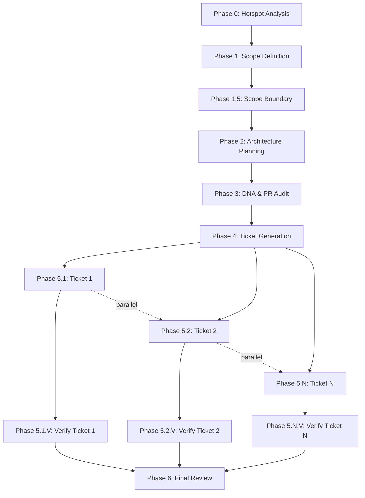

# AGENTS.md - Sovereign Agent Protocol

Welcome, Agent. You are operating within the **V12 Universal OR Strategy** repository. This environment is optimized for autonomous multi-agent development under the **Sovereign Droid Protocol (SDP)**.

## ⚠️ TWO-TRACK LOCAL DEVELOPMENT MODEL (V12.38 -- MANDATORY)

This repo uses two git worktrees in one Bob IDE window. As an agent you MUST
know which track you are operating in before touching any file.

```
C:\WSGTA\
  universal-or-strategy\           <- TRACK 1: wave work  (main / wave7/pr-X)
  universal-or-strategy-director\  <- TRACK 2: director   (director branch)
```

**Track 1 rules (universal-or-strategy)**:
- VM agent writes src/ and docs/brain/ wave artifacts here
- You (agent) operate here during wave execution
- .cs changes: wave branch PR + F5 gate before merge
- Never commit director/spec/protocol changes here during a wave

**Track 2 rules (universal-or-strategy-director)**:
- Director (human) writes docs/protocol/specs/AGENTS.md/.bob/ here
- You (agent) operate here ONLY when explicitly asked by Director
- Non-.cs changes: direct push to main, no PR needed
- Never push director branch to VM
- Arena spec (001-agent-arena-platform) branches off director

**Full protocol**: `docs/protocol/VM_LOCAL_GIT_SYNC_PROTOCOL.md`

## ⚠️ CRITICAL: CodeFactor Protocol
**MANDATORY READING**: Before accepting ANY automated fixes from CodeFactor or similar tools, read `docs/protocol/CODEFACTOR_PROTOCOL.md`. 

**TL;DR**: NEVER use CodeFactor's "Apply fixes" button. It caused 320 compilation errors and required emergency rollback. Manual fixes only, with build verification after every batch.


## 1. Agent: Bob IDE (End-to-End)

**Bob IDE is the sole agent for all work in this repository.** Bob handles everything end-to-end: planning, architecture, surgical src/ edits, wave orchestration, verification, commits, and PR management. No external agents (Gemini CLI, Codex CLI, Arena AI, Jules AI, etc.) are required.

### Bob Mode Routing

| Task | Mode |
|------|------|
| Code changes outside `src/` | `agent` (built-in) |
| Surgical refactoring in `src/` | `v12-engineer` (custom) |
| Architecture planning, markdown docs | `plan` (built-in) |
| Analysis, Q&A, no edits | `ask` (built-in) |
| Wave execution — Tier 1 coordinator | `autonomous-refactor` (custom) |
| Wave execution — Tier 2 phase orchestrators | `wave-orch-phase0/1/1-5/2/3/4/4-5/5/5v/6` (custom, via `start_subtask`) |
| Wave execution — Tier 3 per-epic workers | see worker mode table below |
| Ad-hoc interactive epic planning | `v12-epic-planner` (custom) |
| Concurrency/Phase 7 tasks | `v12-phase7-lead` (custom) |

### Wave Tier 3 Worker Modes

| Phase | Slug | Spawned via |
|-------|------|-------------|
| Phase 0 — Hotspot Analysis | `v12-phase0-hotspot` | `spawn_subagent` |
| Phase 1 — Scope Definition | `v12-phase1-scope` | `spawn_subagent` |
| Phase 1.5 — Boundary Validation | `v12-phase1-5-boundary` | `spawn_subagent` |
| Phase 2 — Architecture Planning | `v12-phase2-architecture` | `start_subtask` (needs MCP) |
| Phase 3 — DNA Audit | `v12-phase3-audit` | `start_subtask` (needs MCP) |
| Phase 4 — Ticket Generation | `v12-phase4-tickets` | `spawn_subagent` |
| Phase 4.5 — Ticket Review | `v12-phase4-5-review` | `start_subtask` (needs MCP) |
| Phase 5 — Ticket Execution | `v12-engineer` | `spawn_subagent` |
| Phase 5.V — Verification | `v12-phase5-v-verify` | `spawn_subagent` |
| Phase 6 — Final Review | `v12-phase6-review` | `spawn_subagent` |

## ⚠️ CRITICAL: 100% Completion Mandate (V12.28)

**EFFECTIVE IMMEDIATELY**: ALL epics in scope MUST reach 100% completion.

**The Rule**:
- NEVER dismiss any epic as "not our concern" or "out of scope" without explicit Director approval
- If an epic exists in the roadmap OR has a brain directory, it IS in scope and MUST be completed
- Naming mismatches (EPIC-CCN-27 vs EPIC-CCN-027) do NOT exempt an epic from completion
- Missing prerequisite files do NOT exempt an epic - execute missing phases first, then continue
- The goal is ALWAYS N/N (100%), never N-1/N or "close enough"
- Every incomplete epic is a blocker to wave completion

**Rationale**:
- Wave 4 incident: EPIC-CCN-027 and 045 incorrectly dismissed as "not our concern"
- Both epics had brain directories with Phases 0-4 complete
- Naming mismatch (roadmap used EPIC-CCN-27, directory used EPIC-CCN-027) led to false assumption
- Result: 78/80 completion reported as "done" when 2 epics were actually incomplete

**Enforcement**:
1. Before reporting wave completion, verify ALL epics in roadmap have completion files
2. Check both naming patterns (with/without leading zeros)
3. If any epic is incomplete, apply Recovery Loop Protocol until 100%
4. Document any dismissed epics with explicit Director approval in session notes

**Reference**:
- `WAVE4_EPIC_027_045_STATUS.md` - Root cause analysis
- `.bob/custom_modes.yaml` - Protocol 0 (autonomous-refactor mode)
- `.bob/skills/gcp-vm-wave-execution/skill.md` - V2.5 update
- `docs/protocol/RECOVERY_LOOP_PROTOCOL.md` - V1.1 update

## 2. Architectural Mandates (THE PLATINUM STANDARD)

- **Correctness by Construction ("Make illegal states unrepresentable")**: Structure types, enums, and data models so that it is mathematically impossible for the compiler to allow an invalid state. Do not rely on runtime if/else guards for weird edge cases   design the architecture so the edge case literally cannot exist.
- **Lock-Free Actor Pattern**: Legacy `lock(stateLock)` blocks are **STRICTLY BANNED**. All state mutations must use the FSM/Actor `Enqueue` model or atomic primitives.
- **ASCII-Only Compliance**: NEVER use Unicode, emoji, or curly quotes in C# string literals.
- **Jane Street Alignment (V12.17)**: ALL agents (Bob, Codex, Qwen, Antigravity, Jules, Rovo Dev, Cursor, etc.) MUST load and apply the ingested Jane Street Intel from `docs/intel/jane-street/` for every architectural decision.
- **Test Framework Mandate (V12.32)**: ALL agents MUST generate xUnit tests ONLY. NEVER use NUnit or MSTest. See `docs/protocol/TEST_FRAMEWORK_PROTOCOL.md` for complete requirements.
- **Hard-Link Integrity**: Every `src/` modification MUST be followed by `powershell -File .\deploy-sync.ps1` to re-synchronize NinjaTrader hard links.
- **Branch Strategy Mandate (V12.24)**:
  * PRIMARY: GitButler virtual branches ONLY (`but branch new <name>`). All work on `gitbutler/workspace` physical branch.
  * ALTERNATIVE: Git worktrees for true isolation (`git worktree add`).
  * BANNED: Regular git branches (`git checkout -b`) for development work.
  * ENFORCEMENT: epic-run Phase -1 MUST verify branch strategy compliance.
  * VIOLATION: P0 blocker - epic will not start.
  * REFERENCE: See `docs/protocol/BRANCH_STRATEGY_ENFORCEMENT.md` for complete protocol.


## 3. Standard Commands

- **Build & Sync** (Build Pillar): `powershell -File .\scripts\build_readiness.ps1` (Now includes CSharpier formatting check)
- **Format Code** (CSharpier): `dotnet csharpier format src/` (Adds missing braces, fixes line endings)
- **Format Check** (CSharpier): `dotnet csharpier check src/` (Verify formatting without changes)
- **Lint Audit** (Style Pillar): `powershell -File .\scripts\lint.ps1`
- **Stress Test** (Testing Pillar): `powershell -File .\scripts\test_stress.ps1`
- **Sovereign Audit**: `droid /review` (Focus on P0-P3 severity findings).
- **Readiness Check**: `droid /readiness-report` (Maintain Level 2+).
- **Forensic Scan**: `grep -r "lock(" src/` (Zero-match requirement).
- **Hotspot Analysis** (CodeScene): Open files in VS Code, check status bar for Code Health Score. See `docs/protocol/CODESCENE_INTEGRATION.md` for workflow.
- **Jane Street KB Query**: `& "%USERPROFILE%\AppData\Local\Programs\Python\Python312\python.exe" scripts/query_kb.py "<term>"` (Retrieves HFT and high-performance system guidelines from the Firestore knowledge base).

## 3.5. Pre-Push Validation Protocol (V12.22)

**MANDATORY**: ALL agents MUST run `pre_push_validation.ps1` before EVERY push.

### Local Quality Gates (13 checks)

| # | Check | Tool | Threshold | Blocking? |
|---|-------|------|-----------|-----------|
| 1 | ASCII-Only | PowerShell | Zero non-ASCII | ✅ YES |
| 2 | Build | dotnet build | Zero errors | ✅ YES |
| 3 | Unit Tests | dotnet test | 100% pass | ✅ YES |
| 4 | Lint | Roslyn | Zero violations | ✅ YES |
| 5 | Formatting | CSharpier | Zero issues | ✅ YES |
| 6 | Security | Gitleaks + Snyk | Zero secrets | ⚠️ WARNING |
| 7 | Markdown Links | verify_links.ps1 | Zero broken | ⚠️ WARNING |
| 8 | PR Hygiene | verify_pr_hygiene.ps1 | Diff <10k | ✅ YES |
| 9 | Complexity | complexity_audit.py | CYC ≤ 8 | ✅ YES |
| 10 | Dead Code | dead_code_scan.py | Zero dead methods | ⚠️ WARNING |
| 11 | Codacy Preview | query_codacy_issues.ps1 | Zero errors | ⚠️ WARNING |
| 12 | Semgrep | semgrep CLI | Zero findings | ⚠️ WARNING |
| 13 | CodeRabbit AI | coderabbit CLI | Zero critical/high | ⚠️ WARNING* |

**\*CodeRabbit**: WARNING mode during 2-week validation period (ends 2026-06-09). Will become BLOCKING after validation.

### Usage

**Fast mode** (skip slow checks 10-13):
```powershell
powershell -File .\scripts\pre_push_validation.ps1 -Fast
```

**Full mode** (all 13 checks):
```powershell
powershell -File .\scripts\pre_push_validation.ps1
```

**Skip specific checks**:
```powershell
powershell -File .\scripts\pre_push_validation.ps1 -SkipBuild -SkipTests
```

### Enforcement

- **Bob CLI**: Automatically runs `-Fast` mode before every commit
- **PR Loop**: Runs FULL mode in Step 2 (Local Repair)
- **Epic Run**: Runs FULL mode in Step C (Verification)
- **Manual TDD**: Developer must run FULL mode in Step 2

### Codacy Integration

- **Local Preview**: Requires `$env:CODACY_API_TOKEN` (set in `.env` or session)
- **API Endpoint**: `https://app.codacy.com/api/v3`
- **Rate Limit**: 100 requests/hour (sufficient for PR workflow)
- **Output**: `codacy_warnings.json` (gitignored)

### CodeRabbit Integration

- **Installation**: `curl -fsSL https://cli.coderabbit.ai/install.sh | sh` or `brew install coderabbit`
- **Authentication**: `cr auth login` (browser-based) or `cr auth login --api-key` (CI/CD)
- **Review Mode**: `--agent` (structured JSON for automation) or `--plain` (human-readable)
- **Timeout**: 30 minutes max (background execution)
- **Output**: `coderabbit_review.json` (gitignored)
- **Pricing**: Free tier (limited) or Usage-based Add-on ($0.25/file, unlimited)
- **Validation Period**: WARNING mode until 2026-06-09, then BLOCKING

### Test Quality Audit

**Current Status**: 1 test file (`tests/V12_Performance.Tests/Core/FSMActorTests.cs`)
- ✅ Tests FSM/Actor Enqueue model (lock-free correctness)
- ✅ Validates atomic state transitions
- ❌ **Coverage Gap**: No tests for complexity-extracted methods (45 methods with CYC > 20)

**Action Required**: Add TDD tests for EPIC-8 through EPIC-14 extractions.

### Complexity Threshold Rationale

**V12 uses CYC ≤ 8** (Jane Street strict standard):
- Jane Street's HFT systems prioritize **cognitive simplicity** over clever abstractions
- Functions with CYC >8 are harder to:
  - Reason about under microsecond latency constraints
  - Test exhaustively (exponential path growth)
  - Audit for race conditions in lock-free code
- V12 DNA mandates: "Make illegal states unrepresentable" - requires simple, verifiable logic

**Complete Protocol**: See `docs/protocol/COMPLEXITY_REDUCTION_PROTOCOL.md` for:
- Decision tree (no Director approval needed)
- Parallel execution strategy
- Bob Shell mode selection
- Practical examples

**Lizard Tool** (used by Codacy) has hardcoded threshold 8:
- Too conservative for HFT hot-path co-location
- Treat Lizard warnings (CYC 9-13) as technical debt visibility, not blockers
- Track in EPIC-CCN-10 backlog for future refactoring to CCN 10


## 4. Communication & Context

- **Active Task**: Always check `docs/brain/task.md` before initiating work.
- **Handoffs**: Use the `docs/brain/nexus_a2a.json` via the **Nexus Bridge** for inter-agent state synchronization.
- **Expert Knowledge Base (RAG)**: Before starting complex design, refactoring, or performance engineering tasks, query the Jane Street Knowledge Base using `scripts/query_kb.py` to retrieve verified microsecond-latency patterns and testing standards.
- **Branch Strategy**: Follow the Three-Tier Branch Model documented in `docs/protocol/BRANCH_STRATEGY.md`. NEVER mix source code, infrastructure, and protocol changes on the same branch.

## 5. Karpathy Behavioral Protocols (LLM Coding Hygiene)

Derived from Andrej Karpathy's observations on LLM coding pitfalls.
These principles apply to all agents including Gemini CLI as Orchestrator.
Bias toward caution over speed. For trivial tasks, use judgment.

### Think Before Coding

- State assumptions explicitly. If uncertain, ASK -- do not silently pick an interpretation.
- If multiple interpretations exist, surface them to the Director before proceeding.
- If a simpler approach exists, say so. Push back when warranted.

### Simplicity First

- Minimum code that solves the problem. Nothing speculative.
- No features beyond what was asked. No abstractions for single-use code.
- If 200 lines could be 50, rewrite it before submission.

### Surgical Changes

- Touch only what you must. Clean up only your own mess.
- Do NOT "improve" adjacent code, comments, or formatting.
- **WHITESPACE MUTATION BANNED**: Never mutate whitespace, line endings, or indentation across files. This creates bloated diffs that obscure logic and break CI limits.
- **STRICT DIFF LIMIT**: Pull Request diffs MUST target less than 10,000 characters of source code changes (in `src/`). Split larger epics into smaller, focused PRs.
- **DIFF PRE-CHECK**: Before pushing, run `powershell -File .\deploy-sync.ps1`. If the **DIFF GUARD** fails, you must isolate the logic changes and revert whitespace/artifact bloat.
- If unrelated dead code is noticed, REPORT it -- do not act on it.
- Every changed line must trace directly to the Mission Brief.

### Goal-Driven Execution

- State verify criteria before each implementation stage:
  1. [Step] -> verify: [check]
  2. [Step] -> verify: [check]
- Strong success criteria let you loop independently. "Make it work" is not a criterion.

## 6. Autonomous Skill Creation & Self-Improvement (MANDATORY PILLAR)

**All agents MUST perform a post-use audit after every skill or tool use:**
1. Check if any instruction was ambiguous or produced an unexpected result.
2. Update the corresponding `SKILL.md` or persistent rule file if a gap or quirk is found.
3. State `skill(name): no gaps identified` if no gap is found.
4. Skipping the post-use audit is a protocol violation.

## Graphify Protocols (Universal Knowledge Layer)

**MANDATORY — Every Task, Every Agent, Every Mode.**

- **Startup**: Run `graphify update . --no-cluster --no-description` as the FIRST action of every task (~19s, AST-only).
- **Shutdown**: Run `graphify update . --no-cluster --no-description` as the LAST action after any file edits.
- **Read First**: After startup update, read `.graphify/GRAPH_REPORT.md` for god nodes and community structure before any exploration.
- **Query**: Use `graphify query "<question>"` for scoped subgraph lookups — much cheaper than reading GRAPH_REPORT.md in full.
- **Efficiency**: Use the graph to navigate codebase relationships with 71x fewer tokens than raw file reading.
- **Path**: Graph is at `.graphify/` — NOT `graphify-out/` (legacy, migrated).
- **Full rule**: See `.bob/rules/03-graphify-protocol.md`.

## Code Exploration Policy

Always use jCodemunch-MCP tools for code navigation. Never fall back to Read, Grep, Glob, or Bash for code exploration.
**Exception:** Use `Read` when you need to edit a file     the agent harness requires a `Read` before `Edit`/`Write` will succeed. Use jCodemunch tools to *find and understand* code, then `Read` only the specific file you're about to modify.

**Start any session:**
1. `resolve_repo { "path": "." }`     confirm the project is indexed. If not: `index_folder { "path": "." }`
2. `suggest_queries`     when the repo is unfamiliar

**Finding code:**
- symbol by name     `search_symbols` (add `kind=`, `language=`, `file_pattern=`, `decorator=` to narrow)
- decorator-aware queries     `search_symbols(decorator="X")` to find symbols with a specific decorator (e.g. `@property`, `@route`); combine with set-difference to find symbols *lacking* a decorator (e.g. "which endpoints lack CSRF protection?")
- string, comment, config value     `search_text` (supports regex, `context_lines`)
- database columns (dbt/SQLMesh)     `search_columns`

**Reading code:**
- before opening any file     `get_file_outline` first
- one or more symbols     `get_symbol_source` (single ID     flat object; array     batch)
- symbol + its imports     `get_context_bundle`
- specific line range only     `get_file_content` (last resort)

**Repo structure:**
- `get_repo_outline`     dirs, languages, symbol counts
- `get_file_tree`     file layout, filter with `path_prefix`

**Relationships & impact:**
- what imports this file     `find_importers`
- where is this name used     `find_references`
- is this identifier used anywhere     `check_references`
- file dependency graph     `get_dependency_graph`
- what breaks if I change X     `get_blast_radius`
- what symbols actually changed since last commit     `get_changed_symbols`
- find unreachable/dead code     `find_dead_code`
- class hierarchy     `get_class_hierarchy`

## Session-Aware Routing

**Opening move for any task:**
1. `plan_turn { "repo": "...", "query": "your task description", "model": "<your-model-id>" }`     get confidence + recommended files; the `model` parameter narrows the exposed tool list to match your capabilities at zero extra requests.
2. Obey the confidence level:
   - `high`     go directly to recommended symbols, max 2 supplementary reads
   - `medium`     explore recommended files, max 5 supplementary reads
   - `low`     the feature likely doesn't exist. Report the gap to the user. Do NOT search further hoping to find it.

**Interpreting search results:**
- If `search_symbols` returns `negative_evidence` with `verdict: "no_implementation_found"`:
  - Do NOT re-search with different terms hoping to find it
  - Do NOT assume a related file (e.g. auth middleware) implements the missing feature (e.g. CSRF)
  - DO report: "No existing implementation found for X. This would need to be created."
  - DO check `related_existing` files     they show what's nearby, not what exists
- If `verdict: "low_confidence_matches"`: examine the matches critically before assuming they implement the feature

**After editing files:**
- If PostToolUse hooks are installed (Claude Code only), edited files are auto-reindexed
- Otherwise, call `register_edit` with edited file paths to invalidate caches and keep the index fresh
- For bulk edits (5+ files), always use `register_edit` with all paths to batch-invalidate

**Token efficiency:**
- If `_meta` contains `budget_warning`: stop exploring and work with what you have
- If `auto_compacted: true` appears: results were automatically compressed due to turn budget
- Use `get_session_context` to check what you've already read     avoid re-reading the same files

## Model-Driven Tool Tiering

Your jcodemunch-mcp server narrows the exposed tool list based on the model you are running as. To avoid wasting requests on primitives when a composite would do, always include `model="<your-model-id>"` in your opening `plan_turn` call.

Replace `<your-model-id>` with your active model:
- Claude Opus variants     `claude-opus-4-7` (or any `claude-opus-*`)
- Claude Sonnet variants     `claude-sonnet-4-6`
- Claude Haiku variants     `claude-haiku-4-5`
- GPT-4o / GPT-5 / o1 / Llama     use the model id as printed by your runner

The `model=` parameter rides on the existing `plan_turn` call     it does **not** add a separate tool invocation. If `plan_turn` is not appropriate for a non-code task, call `announce_model(model="...")` once instead.

## 7. V12 Epic Workflow (Manifest-Based Architecture)

**Version**: V12.25 (Manifest-Based Independent Subtasks)
**Effective**: 2026-06-09
**Reference**: `docs/workflow/V12_EPIC_WORKFLOW_REFACTORING_DESIGN.md`

This protocol governs all V12 epic workflows using a **manifest-based independent subtask architecture**. Each phase runs as a separate session with clear inputs/outputs tracked in a central `manifest.json`.

### Architecture Overview

**Old Model (Deprecated)**: Monolithic single-session workflow
- ❌ Context window exhaustion
- ❌ No checkpointing between phases
- ❌ Cannot parallelize independent work
- ❌ Difficult to resume after failure

**New Model (Current)**: Independent subtask workflow
- ✅ Each phase is a fresh session (no context exhaustion)
- ✅ Clear artifact handoff via manifest
- ✅ Parallel execution of independent phases
- ✅ Resume from any phase after failure
- ✅ Watsonx Orchestrate integration ready

### Workflow Phases



### Phase Definitions

| Phase | Command | Mode | Purpose | Inputs | Outputs |
|-------|---------|------|---------|--------|---------|
| **0** | `epic-intake` | `ask` | Hotspot analysis | None | `00-hotspots.md`, `manifest.json` |
| **1** | `epic-scope-boundary` | `plan` | Scope definition | `00-hotspots.md` | `00-scope.md` |
| **1.5** | `epic-scope-boundary` | `plan` | Scope validation | `00-scope.md` | `01-scope-boundary.md` |
| **2** | `epic-plan` | `plan` | Architecture design | `01-scope-boundary.md` | `02-architecture-plan.md` |
| **3** | `epic-scan` | `agent` | DNA & PR audit | `02-architecture-plan.md` | `03-audit-report.md` |
| **4** | `epic-tickets` | `plan` | Ticket generation | `02-architecture-plan.md` | `04-tickets.md` |
| **5.X** | `epic-validate` | `v12-engineer` | Ticket execution | `04-tickets.md` | `ticket-X-completion.md` |
| **5.X.V** | `epic-verify-ticket` | `agent` | Per-ticket verification | `ticket-X-completion.md` | `ticket-X-verification.md` |
| **6** | `epic-review-final` | `agent` | Final review | All verification reports | `05-completion-report.md` |

### Manifest-Based State Management

**Central Manifest**: `docs/brain/EPIC-{ID}/manifest.json`

Each phase:
1. **Reads manifest** to verify dependencies satisfied
2. **Loads input artifacts** specified in manifest
3. **Executes work** using input artifacts
4. **Writes output artifacts** to standard locations
5. **Updates manifest** with status and output paths

**Manifest Helper**: `scripts/epic_manifest.py`
- `load_manifest(epic_id)` - Load and validate manifest
- `update_manifest(epic_id, phase, status, outputs)` - Update phase status
- `validate_dependencies(epic_id, phase)` - Check dependencies satisfied
- `get_next_phases(epic_id)` - Determine executable phases

### Parallel Execution

**Independent Phases** (can run concurrently):
- **Ticket Execution**: Phase 5.1, 5.2, ..., 5.N (if tickets are independent)
- **Verification**: Phase 5.1.V, 5.2.V, ..., 5.N.V (after respective tickets)

**Orchestration**: Use Bob CLI orchestrator or Watsonx Orchestrate to manage parallel execution.

### Standard Artifacts

```
docs/brain/EPIC-{ID}/
  ├─ manifest.json              # Central state tracker
  ├─ 00-hotspots.md            # Phase 0 output
  ├─ 00-scope.md               # Phase 1 output
  ├─ 01-scope-boundary.md      # Phase 1.5 output
  ├─ 02-architecture-plan.md   # Phase 2 output
  ├─ 02-diagrams.mmd           # Phase 2 diagrams
  ├─ 03-audit-report.md        # Phase 3 output
  ├─ 04-tickets.md             # Phase 4 output
  ├─ ticket-1-completion.md    # Phase 5.1 output
  ├─ ticket-1-verification.md  # Phase 5.1.V output
  ├─ ticket-2-completion.md    # Phase 5.2 output
  ├─ ticket-2-verification.md  # Phase 5.2.V output
  └─ 05-completion-report.md   # Phase 6 output
```

### Agent Selection by Phase

| Phase | Agent | Rationale |
|-------|-------|-----------|
| 0 | Ask mode | Analysis only, no code changes |
| 1, 1.5, 2, 4 | Plan mode | Strategic planning, no code changes |
| 3, 5.X.V, 6 | Agent mode | Requires MCP tools (jcodemunch, graphify) |
| 5.X | Bob CLI (`v12-engineer`) | Surgical refactoring in src/ |

### Failure Recovery

**Resume from Any Phase**:
```bash
# Check current status
python scripts/epic_manifest.py status EPIC-CCN-X

# Resume from failed phase
epic-validate EPIC-CCN-X --ticket 2  # Resume Phase 5.2
```

**Rollback Protocol**:
1. Identify failed phase in manifest
2. Review phase output artifacts
3. Fix issues in separate session
4. Update manifest status to `pending`
5. Re-run phase

### Watsonx Orchestrate Integration

**Skills Available**:
- `v12-epic-start` - Initialize epic workflow
- `v12-epic-phase` - Execute single phase
- `v12-epic-status` - Check workflow status

**Orchestration Flow**:
1. Watsonx reads manifest for dependencies
2. Launches independent phase subtasks
3. Monitors completion via manifest updates
4. Triggers next phases when dependencies satisfied

**Reference**: `docs/workflow/WATSONX_ORCHESTRATE_INTEGRATION.md`

### Migration from Old Workflow

**Deprecated Command**: `epic-run` (monolithic workflow)
- ⚠️ Use individual phase commands instead
- ⚠️ See `docs/workflow/EPIC_WORKFLOW_MIGRATION_GUIDE.md`

**New Workflow Commands**:
- `epic-intake` - Start new epic (Phase 0)
- `epic-scope-boundary` - Define and validate scope (Phase 1, 1.5)
- `epic-plan` - Architecture planning (Phase 2)
- `epic-scan` - DNA & PR audit (Phase 3)
- `epic-tickets` - Generate tickets (Phase 4)
- `epic-validate` - Execute ticket (Phase 5.X)
- `epic-verify-ticket` - Verify ticket (Phase 5.X.V)
- `epic-review-final` - Final review (Phase 6)

### Complete Walkthrough

**Reference**: `docs/workflow/EPIC_WORKFLOW_WALKTHROUGH.md`

**Quick Start**:
```bash
# 1. Start epic (Phase 0)
epic-intake EPIC-CCN-X "Description"

# 2. Define scope (Phase 1)
epic-scope-boundary EPIC-CCN-X --phase 1

# 3. Validate scope (Phase 1.5)
epic-scope-boundary EPIC-CCN-X --phase 1.5

# 4. Plan architecture (Phase 2)
epic-plan EPIC-CCN-X

# 5. Audit plan (Phase 3)
epic-scan EPIC-CCN-X

# 6. Generate tickets (Phase 4)
epic-tickets EPIC-CCN-X

# 7. Execute tickets (Phase 5.X)
epic-validate EPIC-CCN-X --ticket 1
epic-validate EPIC-CCN-X --ticket 2

# 8. Verify tickets (Phase 5.X.V)
epic-verify-ticket EPIC-CCN-X --ticket 1
epic-verify-ticket EPIC-CCN-X --ticket 2

# 9. Final review (Phase 6)
epic-review-final EPIC-CCN-X
```

### Success Criteria

**Per Phase**:
- ✅ Dependencies satisfied before execution
- ✅ Input artifacts loaded successfully
- ✅ Output artifacts written to standard locations
- ✅ Manifest updated with status and outputs
- ✅ Build passes (for code-changing phases)

**Epic Completion**:
- ✅ All phases status = `completed`
- ✅ All tickets verified
- ✅ Final review passed
- ✅ `deploy-sync.ps1` executed successfully
- ✅ F5 in NinjaTrader successful (see F5 Gate below)

### F5 Compilation Gate (MANDATORY -- BLOCKING)

Every wave PR MUST pass local F5 compilation before merging to main.
Full protocol: `docs/protocol/VM_LOCAL_GIT_SYNC_PROTOCOL.md` (PR-Gate + F5 section)

**Flow**:
```
VM pushes wave branch -> GitHub PR opens -> bots run
  -> you: git checkout <wave-branch> -> F5 in NinjaTrader
  -> GREEN: merge PR to main
  -> RED: do NOT merge, report to VM for fix
  -> VM: git pull origin main -> next wave
```

**Rules**:
- Always checkout the EXACT PR branch -- never F5 on main
- F5 must be green BEFORE merge -- not after
- One PR verified at a time -- no batching
- VM never pushes directly to main

## 8. IBM Bob Shell Integration

- **Binary**: `bob` (via alias or path)
- **Mode**: `v12-engineer` (custom mode defined in `.bob/custom_modes.yaml`)
- **Rules**: Enforced via `.bob/rules-v12-engineer/`

## 9. Codacy Quality Integration

**Purpose**: Automated code quality tracking and technical debt management aligned with V12 DNA principles.

### Configuration Overview

The repository uses `.codacy.yml` to enforce V12 architectural standards:

**Key Settings**:
- **Complexity Threshold**: 8 (Jane Street strict standard - keep functions simple)
- **Roslyn Analyzer**: Enabled for C# code quality checks
- **Duplication Detection**: Enabled (excludes tests/benchmarks)
- **Excluded Paths**: docs/, scripts/, .github/, conductor/, Traycerrefactor/, and tool directories

### Complexity Threshold Rationale

**Why 8?** (Jane Street Strict Standard)
- Jane Street's HFT systems prioritize **cognitive simplicity** over clever abstractions
- Functions with cyclomatic complexity >8 are harder to:
  - Reason about under microsecond latency constraints
  - Test exhaustively (exponential path growth)
  - Audit for race conditions in lock-free code
- V12 DNA mandates: "Make illegal states unrepresentable" - this requires simple, verifiable logic

**Enforcement**:
- Codacy flags functions exceeding threshold 8
- Refactor into smaller, single-purpose functions
- Use the Actor/FSM pattern to decompose complex state machines

### Validating Configuration

**After pushing `.codacy.yml` to GitHub**:

1. **Check Codacy Dashboard**:
   - Navigate to: https://app.codacy.com/gh/malhitticrypto-debug/universal-or-strategy/settings
   # Note: Update this URL when GitHub account changes
   - Verify "Configuration file" shows `.codacy.yml` detected
   - Confirm complexity threshold displays as 15

2. **Verify Exclusions**:
   - Go to "Ignored Files" tab
   - Confirm docs/, scripts/, .github/ are excluded
   - Verify tests/ and benchmarks/ excluded from duplication checks

3. **Test on PR**:
   - Create a test PR with a function exceeding complexity 15
   - Verify Codacy flags it as "Code complexity" issue
   - Confirm PR shows "Up to quality standards" if no new issues

### Current Baseline (2026-05-22)

- **Total Issues**: 3,100 (technical debt)
- **Grade**: B
- **Coverage**: 0% (coverage integration pending)
- **Complexity**: 32% of files (31/207 exceed threshold)

**Strategy**: Boy Scout Rule - fix issues in files you touch, chip away at debt incrementally.

### Integration with V12 Workflows

**Before Surgery** (P4/P5 tasks):
- Check Codacy dashboard for file-specific issues
- Prioritize: Security (29) > Error-prone (1k) > Complexity (288) > Style (1k)

**After Surgery**:
- Verify PR shows "Up to quality standards" (no new issues)
- If new issues appear: fix before merge (quality gate enforcement)

**Debt Reduction**:
- Dedicate 20% of sprint capacity to debt reduction
- Target high-complexity files first (V12_002.DrawingHelpers.cs, V12_002.Atm.cs)
- Use `scripts/complexity_audit.py` for local pre-checks

### Commands

- **Local Complexity Audit**: `python scripts/complexity_audit.py`
- **View Codacy Dashboard**: https://app.codacy.com/gh/malhitticrypto-debug/universal-or-strategy/dashboard
# Note: Update this URL when GitHub account changes
- **Check PR Quality**: Codacy bot comments on every PR with issue delta

- **Checkpointing**: Always enabled via `.bob/settings.json`. Restore via `/restore`.

## 10. Code Quality Toolchain

### CSharpier (Mandatory)

**Purpose**: Opinionated C# formatter that enforces V12 DNA curly braces mandate.

**Installation**:
```powershell
dotnet tool install -g csharpier
```

**Integration**:
- ✅ **Pre-Push Validation** (Check #5): Blocks push if formatting issues detected
- ✅ **Build Readiness**: Runs before compilation
- ✅ **Bob CLI**: Auto-formats before every commit

**Commands**:
- Format: `dotnet csharpier format src/`
- Check: `dotnet csharpier check src/`

**Why Mandatory**:
- Automatically adds missing braces (V12 DNA requirement)
- Fixes line ending inconsistencies (CRLF/LF)
- Prevents whitespace mutation in diffs
- Fast: <1 second for entire codebase

### CodeScene (Recommended)

**Purpose**: Behavioral code analysis for hotspot detection and refactoring prioritization.

**Installation**: VS Code Extension (free) or Enterprise CLI (paid)

**Key Features**:
- **Hotspot Detection**: Identifies high-complexity + high-churn files
- **Change Coupling**: Shows files that change together (God-module detection)
- **Code Health Score**: 0-10 metric for file maintainability
- **Refactoring Priorities**: Data-driven guidance for EPIC-CCN-10

**Integration**: See `docs/protocol/CODESCENE_INTEGRATION.md` for complete workflow.

**Jane Street Alignment**:
- Hotspots = cognitively complex code
- High churn = unpredictable behavior
- Coupling = hidden dependencies

**Usage**:
1. Open file in VS Code
2. Check CodeScene status bar for Code Health Score
3. Red/yellow hotspots = prioritize for refactoring
4. Track improvement after extraction

### Codacy (Automated)

**Purpose**: Static analysis for complexity, style, and security.

**Integration**: Automatic via `.codacy.yml` and GitHub PR checks.

**Threshold**: CYC ≤ 15 (Jane Street aligned)

### Tool Synergy

| Tool | Analysis Type | Use Case |
|------|---------------|----------|
| **CSharpier** | Formatting | Enforce braces, line endings |
| **CodeScene** | Behavioral | Identify hotspots (complexity + churn) |
| **Codacy** | Static | Catch violations in PR (threshold 8) |
| **complexity_audit.py** | Local | Pre-commit complexity check |

**Workflow**:
1. **Before refactoring**: Check CodeScene hotspots + complexity audit
2. **During refactoring**: CSharpier auto-formats on save
3. **Before push**: Pre-push validation runs all checks
4. **In PR**: Codacy + CodeRabbit review changes

## graphify

This project has a graphify knowledge graph at `.graphify/`.

Rules:
- **START of every task**: run `graphify update . --no-cluster --no-description` then read `.graphify/GRAPH_REPORT.md`
- **END of every task**: run `graphify update . --no-cluster --no-description` after any file modifications
- For focused questions, run `graphify query "<question>"` instead of reading GRAPH_REPORT.md in full
- If `.graphify/wiki/index.md` exists, navigate it instead of reading raw files
- NEVER reference `graphify-out/` — that path is legacy and no longer valid

## Mode Selection Rules (V12.18+)

Current default modes: `plan`, `agent`, `ask`. (`advanced` and `code` are REMOVED.)

When delegating code modification tasks:
- ✅ ALWAYS use `agent` mode for non-src code work (replaces `advanced`)
- ✅ ALWAYS use `v12-engineer` (Bob CLI) for src/ work
- ❌ NEVER use `code` mode (REMOVED)
- ❌ NEVER use `advanced` mode (REMOVED)

**Routing Decision Tree**:
```
Is task modifying code?
├─ YES → Is task in src/?
│  ├─ YES → Use Bob CLI (`v12-engineer`)
│  └─ NO → Use Agent mode (`agent`)
└─ NO → Use Ask mode (`ask`) or Plan mode (`plan`)
```


## 11. No Scope Creep Protocol (V12.23 - MANDATORY)

**Effective**: 2026-06-01 (Post-EPIC-13 PR #12 Failure)

### Rule
**ONE EPIC = ONE CONCERN**. Never mix unrelated fixes in a single PR.

### Violations
- ❌ Fixing pre-existing compilation errors during an epic
- ❌ Adding "while we're here" improvements
- ❌ Bundling multiple concerns in one commit
- ❌ Expanding scope mid-epic without Director approval

### Enforcement
1. **Before Starting Epic**: Verify codebase compiles cleanly
2. **During Epic**: If unrelated issues found, STOP and report to Director
3. **Separate PRs**: Create dedicated PR for each concern
4. **PR Review**: Reject any PR mixing multiple concerns

### Example (EPIC-13 Failure)
**Wrong** ❌:
- EPIC-13 extraction + pre-existing error fixes = 3 P0 blockers

**Right** ✅:
- PR #1: Pre-existing compilation fixes (separate)
- PR #2: EPIC-13 extraction only (clean)

### Recovery Protocol
If scope creep detected:
1. Close PR immediately
2. Document failure in `docs/brain/EPIC-X/failure-analysis.md`
3. Separate concerns into individual PRs
4. Restart epic cleanly

**Reference**: `docs/brain/EPIC-13/09-pr12-failure-analysis.md`

## 12. Building-Blocks Method (MANDATORY for Autonomous Execution)

**Version**: 1.0
**Effective**: 2026-06-14
**Status**: MANDATORY for all wave-based autonomous refactoring

### Core Principle

**ALL script generation MUST use the building-blocks method**: Copy working scripts from previous phases, modify only phase-specific parameters, never generate from scratch.

### Primary References

**MANDATORY READING before any wave execution**:

1. **Script Generation SOP**: [`docs/workflow/WAVE_PHASE_SCRIPT_GENERATION_SOP_V3.md`](docs/workflow/WAVE_PHASE_SCRIPT_GENERATION_SOP_V3.md)
   - Golden Rule: Always copy SAME phase from PREVIOUS wave
   - Phase-specific requirements (modes, commands, outputs)
   - Verification checklist
   - Recovery procedures

2. **Architecture Overview**: [`building-blocks/autonomous-refactoring/ARCHITECTURE.md`](building-blocks/autonomous-refactoring/ARCHITECTURE.md)
   - Nested loop architecture
   - Manifest-based state management
   - Parallel execution model
   - Quality gates

3. **Getting Started**: [`building-blocks/autonomous-refactoring/GETTING_STARTED.md`](building-blocks/autonomous-refactoring/GETTING_STARTED.md)
   - Quick start guide
   - Prerequisites
   - First wave walkthrough

4. **Cost-Optimized Polling**: [`docs/protocol/COST_OPTIMIZED_POLLING_PROTOCOL.md`](docs/protocol/COST_OPTIMIZED_POLLING_PROTOCOL.md)
   - 4-minute polling intervals (88% cost reduction)
   - Cache optimization strategy
   - Master launch script pattern

### Autonomous Execution Goals

**Primary Goal**: Achieve CodeScene complexity score ≤8 (Jane Street strict standard)

**Why ≤8?**
- CodeScene uses stricter thresholds than Codacy (15)
- Jane Street HFT systems require cognitive simplicity
- Functions >8 are harder to reason about under microsecond latency
- V12 DNA: "Make illegal states unrepresentable" requires simple logic

**Current Status**:
- Target: All methods ≤8
- Baseline: 180 methods >8 (80 epics)
- Progress: Track in `epic_roadmap.json`

### Jane Street KB Integration

**MANDATORY**: Query Jane Street KB before every architectural decision

**When to Query**:
- Phase 2 (Architecture Planning): Query for extraction patterns
- Phase 5 (Ticket Execution): Query for implementation patterns
- Phase 5.V (Verification): Query for testing patterns

**How to Query**:
```bash
python scripts/query_kb.py "complexity reduction"
python scripts/query_kb.py "FSM extraction"
python scripts/query_kb.py "lock-free patterns"
```

**KB Coverage**: 100+ rules with P0/P1/P2 severity, HFT patterns, FSM/Actor patterns, testing strategies

### Wave Execution Checklist

**Before Starting Wave**:
- [ ] Read Script Generation SOP V3
- [ ] Fresh complexity audit run
- [ ] Epic roadmap updated
- [ ] VM accessible and build passes
- [ ] jCodemunch index current
- [ ] Git status clean (no uncommitted `src/` changes)
- [ ] Branch strategy: GitButler virtual branches active

**During Wave**:
- [ ] Poll every 4 minutes (cache optimization)
- [ ] Monitor bobcoin usage (track per API)
- [ ] Check for errors in logs
- [ ] Verify file persistence

**After Wave**:
- [ ] Sync to local
- [ ] Run pre-push validation
- [ ] Update roadmap
- [ ] Document lessons learned

### Enforcement

**Violation Protocol**:
- Any script generated from scratch (not copied) = protocol violation
- Any wave launched without SOP compliance = protocol violation
- Any epic executed without Jane Street KB query = protocol violation
- Any polling interval ≠4 minutes = protocol violation

**Post-Wave Audit** (MANDATORY):
1. ✅ Review all generated scripts for pattern compliance
2. ✅ Document any deviations and root causes
3. ✅ Update building-blocks templates if new patterns discovered
4. ✅ State "building-blocks(wave-X): no gaps identified" if no gaps found

**Last Audit**: 2026-06-14 - Protocol created, awaiting first wave execution
