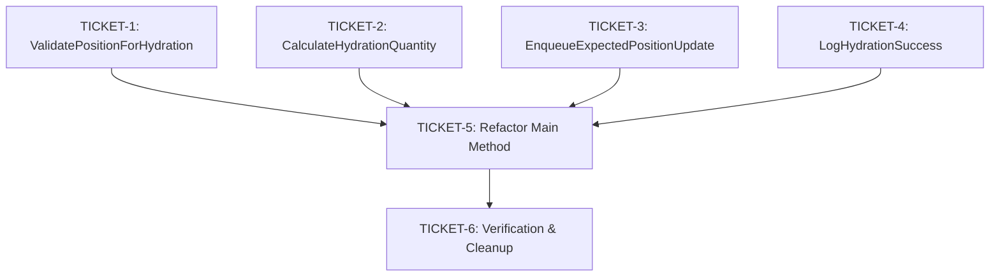

# Phase 4: Implementation Tickets - EPIC-CCN-107

## Epic Context
- **Epic ID**: EPIC-CCN-107
- **Target Method**: HydrateExpectedPositionsFromBroker
- **File**: src/V12_002.SIMA.Lifecycle.cs
- **Current Complexity**: 31 (CYC)
- **Target Complexity**: ≤ 15 (Jane Street aligned)
- **Phase**: 4 (Ticket Generation)
- **Generated**: 2026-06-13

## Execution Order & Dependencies

**Execution Strategy**: Tickets 1-4 are independent and can be executed in parallel. Ticket 5 depends on all extractions. Ticket 6 is final verification.
