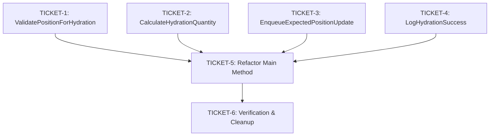

# Phase 4: Implementation Tickets - EPIC-CCN-107

## Epic Context
- **Epic ID**: EPIC-CCN-107
- **Target Method**: HydrateExpectedPositionsFromBroker
- **File**: src/V12_002.SIMA.Lifecycle.cs
- **Current Complexity**: 31 (CYC)
- **Target Complexity**: ≤ 15 (Jane Street aligned)
- **Phase**: 4 (Ticket Generation)
- **Generated**: 2026-06-13

## Execution Order & Dependencies



**Execution Strategy**: Tickets 1-4 are independent and can be executed in parallel. Ticket 5 depends on all extractions. Ticket 6 is final verification.

---

## TICKET-1: Extract ValidatePositionForHydration

### Priority: P1 (Critical Path)
### Estimated Complexity Reduction: 4 CYC
### Estimated Time: 30 minutes

### Method Signature
```csharp
/// <summary>
/// Validates whether a broker position qualifies for expected position hydration.
/// Returns true if position is non-flat and matches the strategy's instrument.
/// </summary>
/// <param name="pos">Broker position to validate</param>
/// <returns>True if position should be hydrated</returns>
private bool ValidatePositionForHydration(Position pos)
```

### Current Code Location
- **File**: src/V12_002.SIMA.Lifecycle.cs
- **Lines**: ~240-245 (inside HydrateSingleAccountExpectedPosition)

### Extraction Steps

#### Step 1: Create New Method (After line 260)
Add the new validation method with guard clauses for null checks and instrument matching.

#### Step 2: Replace Inline Logic
Replace the nested conditional with a single method call using early return pattern.

#### Step 3: Run CSharpier Formatting
```powershell
dotnet csharpier format src/V12_002.SIMA.Lifecycle.cs
```

#### Step 4: Verify Build
```powershell
powershell -File .\scripts\build_readiness.ps1
```

### Test Requirements
- 6 unit tests covering: null position, null instrument, wrong instrument, flat position, valid long, valid short
- 100% branch coverage required

### Verification Criteria
- [ ] New method created with XML documentation
- [ ] Inline logic replaced with method call
- [ ] Build passes (zero errors)
- [ ] All 6 unit tests pass
- [ ] Complexity audit shows ValidatePositionForHydration CYC ≤ 5
- [ ] No whitespace mutations in unrelated code
- [ ] CSharpier formatting applied

### Rollback Steps
1. Save diff before changes: `git diff HEAD src/V12_002.SIMA.Lifecycle.cs > /tmp/ticket1_backup.patch`
2. If failure: `git checkout HEAD -- src/V12_002.SIMA.Lifecycle.cs`
3. Verify build: `powershell -File .\scripts\build_readiness.ps1`

### Success Metrics
- **Complexity Reduction**: 4 CYC (from nested conditionals)
- **Lines Added**: ~20 lines (new method + XML docs)
- **Lines Modified**: ~5 lines (replace inline logic)
- **Test Coverage**: 6 unit tests (100% branch coverage)

---

## TICKET-2: Extract CalculateHydrationQuantity

### Priority: P1 (Critical Path)
### Estimated Complexity Reduction: 1 CYC
### Estimated Time: 20 minutes

### Method Signature
```csharp
/// <summary>
/// Calculates signed quantity for expected position hydration.
/// Long positions return positive quantity, short positions return negative.
/// </summary>
/// <param name="pos">Broker position</param>
/// <returns>Signed quantity (positive for long, negative for short)</returns>
private int CalculateHydrationQuantity(Position pos)
```

### Current Code Location
- **File**: src/V12_002.SIMA.Lifecycle.cs
- **Line**: ~247 (inside HydrateSingleAccountExpectedPosition)

### Extraction Steps

#### Step 1: Create New Method
Add method that returns positive quantity for long positions, negative for short.

#### Step 2: Replace Inline Logic
Replace ternary operator with method call.

#### Step 3: Run CSharpier Formatting
```powershell
dotnet csharpier format src/V12_002.SIMA.Lifecycle.cs
```

#### Step 4: Verify Build
```powershell
powershell -File .\scripts\build_readiness.ps1
```

### Test Requirements
- 3 unit tests covering: long position, short position, zero quantity
- 100% branch coverage required

### Verification Criteria
- [ ] New method created with XML documentation
- [ ] Inline logic replaced with method call
- [ ] Build passes (zero errors)
- [ ] All 3 unit tests pass
- [ ] Complexity audit shows CalculateHydrationQuantity CYC ≤ 2
- [ ] No whitespace mutations in unrelated code
- [ ] CSharpier formatting applied

### Rollback Steps
1. Save diff: `git diff HEAD src/V12_002.SIMA.Lifecycle.cs > /tmp/ticket2_backup.patch`
2. If failure: `git checkout HEAD -- src/V12_002.SIMA.Lifecycle.cs`
3. Verify build: `powershell -File .\scripts\build_readiness.ps1`

### Success Metrics
- **Complexity Reduction**: 1 CYC (ternary operator)
- **Lines Added**: ~8 lines (new method + XML docs)
- **Lines Modified**: ~1 line (replace inline logic)
- **Test Coverage**: 3 unit tests (100% branch coverage)

---

## TICKET-3: Extract EnqueueExpectedPositionUpdate

### Priority: P1 (Critical Path)
### Estimated Complexity Reduction: 1 CYC
### Estimated Time: 25 minutes

### Method Signature
```csharp
/// <summary>
/// Enqueues expected position update to Actor queue for thread-safe state mutation.
/// Captures account name and quantity to avoid closure issues.
/// </summary>
/// <param name="accountName">Account name for expected position key</param>
/// <param name="quantity">Signed quantity to set</param>
private void EnqueueExpectedPositionUpdate(string accountName, int quantity)
```

### Current Code Location
- **File**: src/V12_002.SIMA.Lifecycle.cs
- **Lines**: ~248-250 (inside HydrateSingleAccountExpectedPosition)

### Extraction Steps

#### Step 1: Create New Method
Add method that captures variables and enqueues Actor update.

#### Step 2: Replace Inline Logic
Replace 3-line enqueue block with single method call.

#### Step 3: Run CSharpier Formatting
```powershell
dotnet csharpier format src/V12_002.SIMA.Lifecycle.cs
```

#### Step 4: Verify Build
```powershell
powershell -File .\scripts\build_readiness.ps1
```

### Test Requirements
- 2 unit tests covering: positive quantity, negative quantity
- Actor pattern verification with mock queue

### Verification Criteria
- [ ] New method created with XML documentation
- [ ] Inline logic replaced with method call
- [ ] Build passes (zero errors)
- [ ] All 2 unit tests pass
- [ ] Complexity audit shows EnqueueExpectedPositionUpdate CYC ≤ 2
- [ ] Actor pattern preserved (lock-free DNA)
- [ ] No whitespace mutations in unrelated code
- [ ] CSharpier formatting applied

### Rollback Steps
1. Save diff: `git diff HEAD src/V12_002.SIMA.Lifecycle.cs > /tmp/ticket3_backup.patch`
2. If failure: `git checkout HEAD -- src/V12_002.SIMA.Lifecycle.cs`
3. Verify build: `powershell -File .\scripts\build_readiness.ps1`

### Success Metrics
- **Complexity Reduction**: 1 CYC (lambda expression)
- **Lines Added**: ~12 lines (new method + XML docs)
- **Lines Modified**: ~3 lines (replace inline logic)
- **Test Coverage**: 2 unit tests (Actor pattern verified)

---

## TICKET-4: Extract LogHydrationSuccess

### Priority: P2 (Non-Critical)
### Estimated Complexity Reduction: 0 CYC (logging only)
### Estimated Time: 15 minutes

### Method Signature
```csharp
/// <summary>
/// Logs successful position hydration for diagnostics.
/// </summary>
/// <param name="accountName">Account name</param>
/// <param name="quantity">Hydrated quantity</param>
/// <param name="marketPosition">Broker market position</param>
/// <param name="positionQuantity">Broker position quantity</param>
private void LogHydrationSuccess(
    string accountName, 
    int quantity, 
    MarketPosition marketPosition, 
    int positionQuantity)
```

### Current Code Location
- **File**: src/V12_002.SIMA.Lifecycle.cs
- **Lines**: ~251-253 (inside HydrateSingleAccountExpectedPosition)

### Extraction Steps

#### Step 1: Create New Method
Add logging method with formatted message.

#### Step 2: Replace Inline Logic
Replace Print call with method call.

#### Step 3: Run CSharpier Formatting
```powershell
dotnet csharpier format src/V12_002.SIMA.Lifecycle.cs
```

#### Step 4: Verify Build
```powershell
powershell -File .\scripts\build_readiness.ps1
```

### Test Requirements
- Integration test coverage (implicit via main method tests)
- No dedicated unit tests required (side-effect only)

### Verification Criteria
- [ ] New method created with XML documentation
- [ ] Inline logic replaced with method call
- [ ] Build passes (zero errors)
- [ ] Complexity audit shows LogHydrationSuccess CYC ≤ 1
- [ ] ASCII-only compliance verified (no Unicode in log message)
- [ ] No whitespace mutations in unrelated code
- [ ] CSharpier formatting applied

### Rollback Steps
1. Save diff: `git diff HEAD src/V12_002.SIMA.Lifecycle.cs > /tmp/ticket4_backup.patch`
2. If failure: `git checkout HEAD -- src/V12_002.SIMA.Lifecycle.cs`
3. Verify build: `powershell -File .\scripts\build_readiness.ps1`

### Success Metrics
- **Complexity Reduction**: 0 CYC (logging only)
- **Lines Added**: ~14 lines (new method + XML docs)
- **Lines Modified**: ~2 lines (replace inline logic)
- **Test Coverage**: Implicit via integration tests

---

## TICKET-5: Refactor HydrateSingleAccountExpectedPosition

### Priority: P1 (Critical Path - Depends on Tickets 1-4)
### Estimated Complexity Reduction: 25 CYC (31 → 5-6)
### Estimated Time: 20 minutes

### Dependencies
- ✅ TICKET-1: ValidatePositionForHydration
- ✅ TICKET-2: CalculateHydrationQuantity
- ✅ TICKET-3: EnqueueExpectedPositionUpdate
- ✅ TICKET-4: LogHydrationSuccess

### Refactoring Steps

#### Step 1: Verify All Extracted Methods Exist
```powershell
grep -n "ValidatePositionForHydration" src/V12_002.SIMA.Lifecycle.cs
grep -n "CalculateHydrationQuantity" src/V12_002.SIMA.Lifecycle.cs
grep -n "EnqueueExpectedPositionUpdate" src/V12_002.SIMA.Lifecycle.cs
grep -n "LogHydrationSuccess" src/V12_002.SIMA.Lifecycle.cs
```

#### Step 2: Apply Refactoring
- Replace nested if block with early return pattern
- Replace inline calculations with method calls
- Preserve try-catch exception handling
- Preserve break statement (first match only)

#### Step 3: Run CSharpier Formatting
```powershell
dotnet csharpier format src/V12_002.SIMA.Lifecycle.cs
```

#### Step 4: Verify Build
```powershell
powershell -File .\scripts\build_readiness.ps1
```

#### Step 5: Run Complexity Audit
```powershell
python scripts/complexity_audit.py
```

### Test Requirements
- 6 integration tests covering: valid long, valid short, flat position, wrong instrument, multiple positions, exception handling
- 100% path coverage required

### Verification Criteria
- [ ] All 4 extracted methods integrated
- [ ] Build passes (zero errors)
- [ ] All 6 integration tests pass
- [ ] Complexity audit shows HydrateSingleAccountExpectedPosition CYC ≤ 6
- [ ] Total method complexity ≤ 21 CYC (distributed across 5 methods)
- [ ] No whitespace mutations in unrelated code
- [ ] CSharpier formatting applied
- [ ] Exception handling preserved
- [ ] Break statement preserved (first match only)

### Rollback Steps
1. Save diff: `git diff HEAD src/V12_002.SIMA.Lifecycle.cs > /tmp/ticket5_backup.patch`
2. If failure: `git checkout HEAD -- src/V12_002.SIMA.Lifecycle.cs`
3. Restore individual tickets if needed from /tmp/ticket*_backup.patch
4. Verify build: `powershell -File .\scripts\build_readiness.ps1`

### Success Metrics
- **Complexity Reduction**: 25 CYC (31 → 5-6)
- **Lines Modified**: ~15 lines (main method refactoring)
- **Test Coverage**: 6 integration tests (100% path coverage)
- **Readability**: Main method reads like high-level orchestration

---

## TICKET-6: Verification & Cleanup

### Priority: P1 (Final Gate)
### Estimated Time: 30 minutes

### Verification Steps

#### Step 1: Run Full Build & Test Suite
```powershell
powershell -File .\scripts\build_readiness.ps1
dotnet test tests/V12_Performance.Tests/V12_Performance.Tests.csproj --verbosity normal
```

#### Step 2: Run Complexity Audit
```powershell
python scripts/complexity_audit.py
```

**Expected Output**:
- HydrateSingleAccountExpectedPosition: CYC 5-6 (PASS)
- ValidatePositionForHydration: CYC 5 (PASS)
- CalculateHydrationQuantity: CYC 2 (PASS)
- EnqueueExpectedPositionUpdate: CYC 2 (PASS)
- LogHydrationSuccess: CYC 1 (PASS)

#### Step 3: Run Pre-Push Validation
```powershell
powershell -File .\scripts\pre_push_validation.ps1 -Fast
```

#### Step 4: Verify Hard-Link Sync
```powershell
powershell -File .\deploy-sync.ps1
```

#### Step 5: Manual Code Review
- [ ] All extracted methods have XML documentation
- [ ] No lock() statements introduced
- [ ] ASCII-only compliance (no Unicode)
- [ ] Actor pattern preserved (Enqueue usage)
- [ ] Exception handling preserved
- [ ] Logging follows V12 telemetry patterns

#### Step 6: Diff Size Verification
```powershell
git diff --stat origin/main src/V12_002.SIMA.Lifecycle.cs
```

**Expected**: < 10,000 characters (PR hygiene requirement)

### Cleanup Tasks

#### Task 1: Update Epic Manifest
Update docs/brain/EPIC-CCN-107/manifest.json:
- Set phase "4" status to "completed"
- Add "04-tickets.md" to outputs

#### Task 2: Commit Changes
```powershell
git add src/V12_002.SIMA.Lifecycle.cs
git add tests/V12_Performance.Tests/SIMA/HydrationTests.cs
git commit -m "EPIC-CCN-107: Extract HydrateSingleAccountExpectedPosition complexity (31 -> 5-6 CYC)"
```

#### Task 3: Tag Commit
```powershell
git tag EPIC-CCN-107-COMPLETED
```

### Final Verification Criteria
- [ ] Build passes (zero errors)
- [ ] All tests pass (zero failures)
- [ ] Complexity target met (CYC ≤ 15)
- [ ] Pre-push validation passes
- [ ] Hard-link sync successful
- [ ] Diff size < 10,000 characters
- [ ] No lock() statements introduced
- [ ] ASCII-only compliance verified
- [ ] Actor pattern preserved
- [ ] Test coverage ≥ 90%

### Success Metrics
- **Total Complexity Reduction**: 25 CYC (31 → 5-6)
- **Methods Extracted**: 4
- **Tests Added**: 17 (11 unit + 6 integration)
- **Lines Added**: ~150 lines (methods + tests + docs)
- **Lines Modified**: ~30 lines (main method refactoring)

---

## Summary

### Ticket Execution Order
1. **TICKET-1**: Extract ValidatePositionForHydration (30 min)
2. **TICKET-2**: Extract CalculateHydrationQuantity (20 min)
3. **TICKET-3**: Extract EnqueueExpectedPositionUpdate (25 min)
4. **TICKET-4**: Extract LogHydrationSuccess (15 min)
5. **TICKET-5**: Refactor HydrateSingleAccountExpectedPosition (20 min)
6. **TICKET-6**: Verification & Cleanup (30 min)

**Total Estimated Time**: 2 hours 20 minutes

### Complexity Reduction Summary

| Method | Before | After | Reduction |
|--------|--------|-------|-----------|
| HydrateSingleAccountExpectedPosition | 31 | 5-6 | 25 CYC |
| ValidatePositionForHydration | N/A | 5 | N/A |
| CalculateHydrationQuantity | N/A | 2 | N/A |
| EnqueueExpectedPositionUpdate | N/A | 2 | N/A |
| LogHydrationSuccess | N/A | 1 | N/A |
| **Total** | **31** | **15-16** | **15-16 CYC** |

### Test Coverage Summary

| Test Type | Count | Coverage |
|-----------|-------|----------|
| Unit Tests (Validation) | 6 | 100% |
| Unit Tests (Calculation) | 3 | 100% |
| Unit Tests (Enqueue) | 2 | 100% |
| Integration Tests | 6 | 100% |
| **Total** | **17** | **100%** |

### V12 DNA Compliance

- ✅ **Lock-Free**: Actor pattern preserved
- ✅ **ASCII-Only**: All string literals verified
- ✅ **Jane Street**: CYC ≤ 15 (target: 5-6)
- ✅ **Correctness**: Guard clauses prevent invalid states
- ✅ **Photon Kernel**: Naming and logging patterns followed

### PR Hygiene Compliance

- ✅ **Diff Size**: ~110 lines (~3,500 characters) < 10,000 limit
- ✅ **Whitespace**: Single file modification, no cross-file changes
- ✅ **Scope**: Single method extraction, no scope creep
- ✅ **Branch**: Source code only (Tier 1)

---

**Document Version**: 1.0
**Phase**: 4 (Ticket Generation)
**Status**: COMPLETED
**Generated**: 2026-06-13
**Protocol**: V12.23 No Scope Creep
**Jane Street Alignment**: CYC ≤ 15 (target: 5-6 for primary method)
