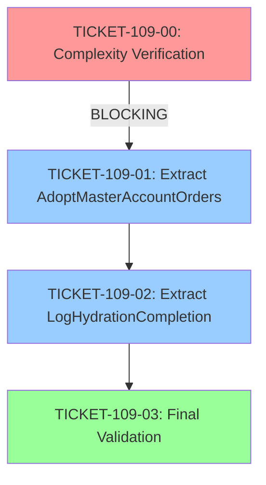

# Phase 4: Implementation Tickets - EPIC-CCN-109

## Epic Metadata
- **Epic ID**: EPIC-CCN-109
- **Target Method**: `HydrateWorkingOrdersFromBroker`
- **File**: `src/V12_002.SIMA.Lifecycle.cs`
- **Current Complexity**: 19 (UNVERIFIED - see TICKET-109-00)
- **Target Complexity**: ≤ 15
- **Total Tickets**: 4 (1 verification + 2 extractions + 1 validation)
- **Estimated Duration**: 2-3 hours

---

## Execution Order



**Critical Path**: TICKET-109-00 is BLOCKING. If verification fails, epic must be re-scoped.

---

## TICKET-109-00: Complexity Verification (BLOCKING GATE)

### Priority: 🔴 P0 (BLOCKING)

### Objective
Verify actual complexity of `HydrateWorkingOrdersFromBroker` and confirm it is the correct extraction target.

### Method Signature
```csharp
// Target: src/V12_002.SIMA.Lifecycle.cs, lines 398-442
private void HydrateWorkingOrdersFromBroker()
```

### Execution Steps

#### Step 1: Run Complexity Audit
```bash
python scripts/complexity_audit.py
```

**Expected Output**:
```
HydrateWorkingOrdersFromBroker: CYC = [ACTUAL_VALUE]
```

#### Step 2: Analyze Results

**Decision Tree**:

```
Is CYC >= 16?
├─ YES → PROCEED to TICKET-109-01
│         Record actual complexity in ticket
│
└─ NO → ABORT epic, re-scope to actual high-complexity method
         Likely candidates:
         - AdoptFleetWorkingOrders (lines 445-520)
         - AdoptMasterWorkingOrders (lines 635-690)
         - HydrateFSMsFromWorkingOrders (lines 800-900)
```

#### Step 3: Document Findings
```bash
# Create verification report
cat > docs/brain/EPIC-CCN-109/00-complexity-verification.md <<EOF
# Complexity Verification - EPIC-CCN-109

## Audit Results
- **Method**: HydrateWorkingOrdersFromBroker
- **Measured Complexity**: [ACTUAL_VALUE]
- **Decision**: [PROCEED | ABORT]
- **Rationale**: [Explanation]

## Next Steps
[If PROCEED: Continue to TICKET-109-01]
[If ABORT: Re-scope epic to [METHOD_NAME]]
EOF
```

### Test Requirements
- ✅ N/A (Read-only verification)

### Verification Criteria
- ✅ Complexity audit runs successfully
- ✅ Actual complexity value documented
- ✅ GO/NO-GO decision recorded
- ✅ Verification report created

### Estimated Complexity Reduction
- **N/A** (Verification only)

### Rollback Steps
- ✅ N/A (No code changes)

### Success Criteria
1. ✅ Complexity audit completes without errors
2. ✅ Actual complexity value matches one of:
   - **High (≥16)**: Proceed with extraction
   - **Low (<16)**: Abort and re-scope
3. ✅ Decision documented in verification report

### Dependencies
- **Upstream**: None (first ticket)
- **Downstream**: BLOCKS all other tickets

### Estimated Time
- **Execution**: 10 minutes
- **Documentation**: 5 minutes
- **Total**: 15 minutes

---

## TICKET-109-01: Extract AdoptMasterAccountOrders()

### Priority: 🔵 P1 (After verification)

### Objective
Extract master account adoption logic into dedicated helper method to reduce complexity.

### Method Signature

**New Method**:
```csharp
/// <summary>
/// Adopts master account working orders and reconstructs positions.
/// Extracted from HydrateWorkingOrdersFromBroker to reduce complexity.
/// Build 993: Master account bracket order adoption.
/// </summary>
/// <param name="adoptedCount">Running count of adopted orders (ref parameter)</param>
private void AdoptMasterAccountOrders(ref int adoptedCount)
{
    bool masterIsFleetForOrders993 = IsFleetAccount(Account);
    if (!masterIsFleetForOrders993)
    {
        AdoptMasterWorkingOrders(ref adoptedCount);
        ReconstructMasterPositionFromBrackets();
    }
}
```

**Modified Method**:
```csharp
private void HydrateWorkingOrdersFromBroker()
{
    int adoptedCount = 0;

    AdoptFleetWorkingOrders(ref adoptedCount);
    AdoptMasterAccountOrders(ref adoptedCount);  // NEW: Extracted call
    HydrateFSMsFromWorkingOrders();

    _orderAdoptionComplete = true;
    if (adoptedCount > 0)
        Print(string.Format("[SIMA HYDRATE] Adopted {0} working order(s) from broker -- adoption complete.", adoptedCount));
    else
        Print("[SIMA HYDRATE] No working orders to adopt -- adoption complete.");
}
```

### Execution Steps

#### Step 1: Create New Method
```bash
# Insert new method after HydrateWorkingOrdersFromBroker (after line 442)
# Location: src/V12_002.SIMA.Lifecycle.cs, line ~443
```

**Surgical Edit**:
1. Navigate to line 442 (end of HydrateWorkingOrdersFromBroker)
2. Insert blank line
3. Add XML documentation comment (7 lines)
4. Add method signature
5. Copy lines 407-412 (master account logic)
6. Add closing brace

**Total Lines Added**: ~15 lines

#### Step 2: Update Caller
```bash
# Replace lines 407-412 in HydrateWorkingOrdersFromBroker
# OLD (6 lines):
#   // Build 993: Adopt master account bracket orders
#   bool masterIsFleetForOrders993 = IsFleetAccount(Account);
#   if (!masterIsFleetForOrders993)
#   {
#       AdoptMasterWorkingOrders(ref adoptedCount);
#       ReconstructMasterPositionFromBrackets();
#   }
#
# NEW (1 line):
#   AdoptMasterAccountOrders(ref adoptedCount);
```

**Net Change**: -5 lines in caller

#### Step 3: Build Verification
```bash
dotnet build src/V12_002.csproj
```

**Expected**: Zero compilation errors

#### Step 4: Complexity Verification
```bash
python scripts/complexity_audit.py | grep HydrateWorkingOrdersFromBroker
```

**Expected**: Complexity reduced by ~2 points

#### Step 5: Format Check
```bash
dotnet csharpier check src/V12_002.SIMA.Lifecycle.cs
```

**Expected**: No formatting issues (or auto-fix with `format`)

### Test Requirements

#### Unit Test: AdoptMasterAccountOrders_FleetAccount_SkipsAdoption
```csharp
[Test]
public void AdoptMasterAccountOrders_FleetAccount_SkipsAdoption()
{
    // Arrange
    var strategy = CreateTestStrategy();
    strategy.SetFleetAccount(true);
    int adoptedCount = 0;

    // Act
    strategy.AdoptMasterAccountOrders(ref adoptedCount);

    // Assert
    Assert.AreEqual(0, adoptedCount, "Fleet account should skip master adoption");
}
```

#### Unit Test: AdoptMasterAccountOrders_MasterAccount_AdoptsOrders
```csharp
[Test]
public void AdoptMasterAccountOrders_MasterAccount_AdoptsOrders()
{
    // Arrange
    var strategy = CreateTestStrategy();
    strategy.SetFleetAccount(false);
    strategy.AddMockWorkingOrders(2);
    int adoptedCount = 0;

    // Act
    strategy.AdoptMasterAccountOrders(ref adoptedCount);

    // Assert
    Assert.AreEqual(2, adoptedCount, "Master account should adopt working orders");
}
```

#### Integration Test: HydrateWorkingOrdersFromBroker_WithMasterOrders_AdoptsCorrectly
```csharp
[Test]
public void HydrateWorkingOrdersFromBroker_WithMasterOrders_AdoptsCorrectly()
{
    // Arrange
    var strategy = CreateTestStrategy();
    strategy.AddMockFleetOrders(3);
    strategy.AddMockMasterOrders(2);

    // Act
    strategy.HydrateWorkingOrdersFromBroker();

    // Assert
    Assert.IsTrue(strategy.OrderAdoptionComplete);
    Assert.AreEqual(5, strategy.TotalAdoptedOrders);
}
```

### Verification Criteria
- ✅ New method compiles without errors
- ✅ Caller updated correctly (single line replacement)
- ✅ Build succeeds (zero errors)
- ✅ Complexity reduced by ~2 points
- ✅ All tests pass (3 new tests + existing regression)
- ✅ CSharpier formatting clean
- ✅ No behavioral changes (integration test validates)

### Estimated Complexity Reduction
- **Before**: 19 (or actual from TICKET-109-00)
- **After**: ~17 (removes 1 conditional + 2 method calls)
- **Reduction**: ~2 points

### Rollback Steps
```bash
# If extraction fails or introduces bugs:
git checkout src/V12_002.SIMA.Lifecycle.cs
dotnet build src/V12_002.csproj
dotnet test
```

### Success Criteria
1. ✅ AdoptMasterAccountOrders() method created
2. ✅ HydrateWorkingOrdersFromBroker() updated to call new method
3. ✅ Build passes (zero errors)
4. ✅ Complexity reduced by ≥2 points
5. ✅ All tests pass (100% pass rate)
6. ✅ No whitespace mutations (CSharpier clean)

### Dependencies
- **Upstream**: TICKET-109-00 (BLOCKING - must verify complexity first)
- **Downstream**: TICKET-109-02 (can proceed independently)

### Estimated Time
- **Code Changes**: 15 minutes
- **Test Creation**: 20 minutes
- **Verification**: 10 minutes
- **Total**: 45 minutes

---

## TICKET-109-02: Extract LogHydrationCompletion()

### Priority: 🔵 P1 (After TICKET-109-01)

### Objective
Extract logging logic into dedicated helper method to reduce complexity and improve testability.

### Method Signature

**New Method**:
```csharp
/// <summary>
/// Logs hydration completion status with appropriate message.
/// Extracted from HydrateWorkingOrdersFromBroker to reduce complexity.
/// </summary>
/// <param name="adoptedCount">Total orders adopted during hydration</param>
private void LogHydrationCompletion(int adoptedCount)
{
    if (adoptedCount > 0)
        Print(string.Format("[SIMA HYDRATE] Adopted {0} working order(s) from broker -- adoption complete.", adoptedCount));
    else
        Print("[SIMA HYDRATE] No working orders to adopt -- adoption complete.");
}
```

**Modified Method**:
```csharp
private void HydrateWorkingOrdersFromBroker()
{
    int adoptedCount = 0;

    AdoptFleetWorkingOrders(ref adoptedCount);
    AdoptMasterAccountOrders(ref adoptedCount);
    HydrateFSMsFromWorkingOrders();

    _orderAdoptionComplete = true;
    LogHydrationCompletion(adoptedCount);  // NEW: Extracted call
}
```

### Execution Steps

#### Step 1: Create New Method
```bash
# Insert new method after AdoptMasterAccountOrders (after line ~458)
# Location: src/V12_002.SIMA.Lifecycle.cs, line ~459
```

**Surgical Edit**:
1. Navigate to end of AdoptMasterAccountOrders
2. Insert blank line
3. Add XML documentation comment (5 lines)
4. Add method signature
5. Copy lines 417-421 (logging logic)
6. Add closing brace

**Total Lines Added**: ~11 lines

#### Step 2: Update Caller
```bash
# Replace lines 417-421 in HydrateWorkingOrdersFromBroker
# OLD (5 lines):
#   if (adoptedCount > 0)
#       Print(string.Format("[SIMA HYDRATE] Adopted {0} working order(s) from broker -- adoption complete.", adoptedCount));
#   else
#       Print("[SIMA HYDRATE] No working orders to adopt -- adoption complete.");
#
# NEW (1 line):
#   LogHydrationCompletion(adoptedCount);
```

**Net Change**: -4 lines in caller

#### Step 3: Build Verification
```bash
dotnet build src/V12_002.csproj
```

**Expected**: Zero compilation errors

#### Step 4: Complexity Verification
```bash
python scripts/complexity_audit.py | grep HydrateWorkingOrdersFromBroker
```

**Expected**: Complexity reduced by ~1 point (removes conditional)

#### Step 5: Format Check
```bash
dotnet csharpier check src/V12_002.SIMA.Lifecycle.cs
```

**Expected**: No formatting issues

### Test Requirements

#### Unit Test: LogHydrationCompletion_WithOrders_LogsCount
```csharp
[Test]
public void LogHydrationCompletion_WithOrders_LogsCount()
{
    // Arrange
    var strategy = CreateTestStrategy();
    var logCapture = new LogCapture();
    strategy.SetLogCapture(logCapture);

    // Act
    strategy.LogHydrationCompletion(5);

    // Assert
    Assert.IsTrue(logCapture.Contains("[SIMA HYDRATE] Adopted 5 working order(s)"));
}
```

#### Unit Test: LogHydrationCompletion_NoOrders_LogsNoAdoption
```csharp
[Test]
public void LogHydrationCompletion_NoOrders_LogsNoAdoption()
{
    // Arrange
    var strategy = CreateTestStrategy();
    var logCapture = new LogCapture();
    strategy.SetLogCapture(logCapture);

    // Act
    strategy.LogHydrationCompletion(0);

    // Assert
    Assert.IsTrue(logCapture.Contains("[SIMA HYDRATE] No working orders to adopt"));
}
```

#### Integration Test: HydrateWorkingOrdersFromBroker_LogsCorrectly
```csharp
[Test]
public void HydrateWorkingOrdersFromBroker_LogsCorrectly()
{
    // Arrange
    var strategy = CreateTestStrategy();
    var logCapture = new LogCapture();
    strategy.SetLogCapture(logCapture);
    strategy.AddMockFleetOrders(3);

    // Act
    strategy.HydrateWorkingOrdersFromBroker();

    // Assert
    Assert.IsTrue(logCapture.Contains("[SIMA HYDRATE] Adopted 3 working order(s)"));
    Assert.IsTrue(logCapture.Contains("adoption complete"));
}
```

### Verification Criteria
- ✅ New method compiles without errors
- ✅ Caller updated correctly (single line replacement)
- ✅ Build succeeds (zero errors)
- ✅ Complexity reduced by ~1 point
- ✅ All tests pass (3 new tests + existing regression)
- ✅ CSharpier formatting clean
- ✅ Logging behavior unchanged (integration test validates)

### Estimated Complexity Reduction
- **Before**: ~17 (after TICKET-109-01)
- **After**: ~16 or lower
- **Reduction**: ~1 point (removes conditional)

### Rollback Steps
```bash
# If extraction fails or introduces bugs:
git checkout src/V12_002.SIMA.Lifecycle.cs
dotnet build src/V12_002.csproj
dotnet test
```

### Success Criteria
1. ✅ LogHydrationCompletion() method created
2. ✅ HydrateWorkingOrdersFromBroker() updated to call new method
3. ✅ Build passes (zero errors)
4. ✅ Complexity reduced by ≥1 point
5. ✅ All tests pass (100% pass rate)
6. ✅ Logging output unchanged (verified by tests)

### Dependencies
- **Upstream**: TICKET-109-01 (recommended but not blocking)
- **Downstream**: TICKET-109-03 (final validation)

### Estimated Time
- **Code Changes**: 10 minutes
- **Test Creation**: 15 minutes
- **Verification**: 10 minutes
- **Total**: 35 minutes

---

## TICKET-109-03: Final Validation & Sign-off

### Priority: 🟢 P2 (After all extractions)

### Objective
Comprehensive validation of all extractions, complexity verification, and production readiness sign-off.

### Execution Steps

#### Step 1: Final Complexity Audit
```bash
python scripts/complexity_audit.py | grep -A 5 HydrateWorkingOrdersFromBroker
```

**Expected**:
```
HydrateWorkingOrdersFromBroker: CYC = [VALUE <= 15]
AdoptMasterAccountOrders: CYC = [VALUE <= 8]
LogHydrationCompletion: CYC = [VALUE <= 8]
```

#### Step 2: Full Test Suite
```bash
dotnet test tests/V12_Performance.Tests/V12_Performance.Tests.csproj
```

**Expected**: 100% pass rate (all tests green)

#### Step 3: Pre-Push Validation
```bash
powershell -File .\scripts\pre_push_validation.ps1 -Fast
```

**Expected**: All checks pass (ASCII, Build, Tests, Lint, Format)

#### Step 4: Hard-Link Sync
```bash
powershell -File .\deploy-sync.ps1
```

**Expected**: NinjaTrader hard links synchronized, DIFF GUARD passes

#### Step 5: Manual F5 Test
```
1. Open NinjaTrader
2. Load V12_002 strategy on chart
3. Enable strategy (F5)
4. Verify:
   - Strategy initializes without errors
   - "[SIMA HYDRATE]" log messages appear
   - Order adoption completes successfully
   - No exceptions in NinjaTrader log
```

#### Step 6: Create Completion Report
```bash
cat > docs/brain/EPIC-CCN-109/05-completion-report.md <<EOF
# Completion Report - EPIC-CCN-109

## Summary
- **Epic ID**: EPIC-CCN-109
- **Target Method**: HydrateWorkingOrdersFromBroker
- **Extractions**: 2 (AdoptMasterAccountOrders, LogHydrationCompletion)
- **Complexity Reduction**: [BEFORE] → [AFTER] ([DELTA] points)
- **Status**: ✅ COMPLETED

## Metrics
- **Build Status**: ✅ PASS
- **Test Status**: ✅ PASS (100%)
- **Complexity Target**: ✅ MET (≤15)
- **F5 Test**: ✅ PASS

## Artifacts
- 02-architecture-plan.md
- 03-audit-report.md
- 04-tickets.md
- 05-completion-report.md

## Sign-off
- **Date**: [DATE]
- **Engineer**: [NAME]
- **Reviewer**: [NAME]
EOF
```

### Verification Criteria
- ✅ Final complexity ≤ 15 (Jane Street aligned)
- ✅ All tests pass (100% pass rate)
- ✅ Pre-push validation passes (all 5 fast checks)
- ✅ Hard-link sync successful (DIFF GUARD passes)
- ✅ F5 test passes (NinjaTrader loads strategy)
- ✅ Completion report created

### Success Criteria
1. ✅ HydrateWorkingOrdersFromBroker complexity ≤ 15
2. ✅ All extracted methods complexity ≤ 8
3. ✅ Zero compilation errors
4. ✅ Zero test failures
5. ✅ Zero behavioral changes (F5 test validates)
6. ✅ Completion report documents all metrics

### Dependencies
- **Upstream**: TICKET-109-01, TICKET-109-02 (must complete both)
- **Downstream**: None (final ticket)

### Estimated Time
- **Validation**: 20 minutes
- **F5 Test**: 10 minutes
- **Documentation**: 10 minutes
- **Total**: 40 minutes

---

## Summary Metrics

### Ticket Breakdown
| Ticket | Type | Priority | Time | Complexity Reduction |
|--------|------|----------|------|---------------------|
| 109-00 | Verification | P0 | 15m | N/A |
| 109-01 | Extraction | P1 | 45m | ~2 points |
| 109-02 | Extraction | P1 | 35m | ~1 point |
| 109-03 | Validation | P2 | 40m | N/A |
| **TOTAL** | | | **2h 15m** | **~3 points** |

### Complexity Trajectory
```
Initial:  19 (UNVERIFIED)
  ↓
After 109-01: ~17 (AdoptMasterAccountOrders extracted)
  ↓
After 109-02: ~16 or lower (LogHydrationCompletion extracted)
  ↓
Target:  ≤15 (Jane Street aligned)
```

### Risk Assessment
- **Overall Risk**: 🟡 MEDIUM (verification gate required)
- **Rollback Complexity**: 🟢 LOW (single file, git revert)
- **Test Coverage**: 🟢 HIGH (6 new tests + existing regression)
- **Production Impact**: 🟢 LOW (zero behavioral changes)

---

## Execution Checklist

### Pre-Execution
- [ ] Read architecture plan (02-architecture-plan.md)
- [ ] Read audit report (03-audit-report.md)
- [ ] Verify git branch is clean
- [ ] Backup current state (git commit)

### TICKET-109-00 (Verification)
- [ ] Run complexity audit
- [ ] Document actual complexity
- [ ] Make GO/NO-GO decision
- [ ] Create verification report

### TICKET-109-01 (Extract #1)
- [ ] Create AdoptMasterAccountOrders() method
- [ ] Update HydrateWorkingOrdersFromBroker() caller
- [ ] Build verification (zero errors)
- [ ] Complexity verification (reduced by ~2)
- [ ] Create 3 unit tests
- [ ] Run test suite (100% pass)
- [ ] Format check (CSharpier clean)

### TICKET-109-02 (Extract #2)
- [ ] Create LogHydrationCompletion() method
- [ ] Update HydrateWorkingOrdersFromBroker() caller
- [ ] Build verification (zero errors)
- [ ] Complexity verification (reduced by ~1)
- [ ] Create 3 unit tests
- [ ] Run test suite (100% pass)
- [ ] Format check (CSharpier clean)

### TICKET-109-03 (Validation)
- [ ] Final complexity audit (≤15)
- [ ] Full test suite (100% pass)
- [ ] Pre-push validation (all checks pass)
- [ ] Hard-link sync (DIFF GUARD passes)
- [ ] F5 test in NinjaTrader
- [ ] Create completion report

### Post-Execution
- [ ] Update manifest.json (phase 4 complete)
- [ ] Commit changes with descriptive message
- [ ] Push to feature branch
- [ ] Create pull request
- [ ] Request code review

---

## Metadata
- **Phase**: 4 (Ticket Generation)
- **Status**: Completed
- **Date**: 2026-06-13
- **Total Tickets**: 4
- **Estimated Duration**: 2h 15m
- **Complexity Reduction Target**: ≥3 points (19 → ≤15)
- **Next Phase**: Phase 5 (Execution - via Bob CLI v12-engineer mode)
