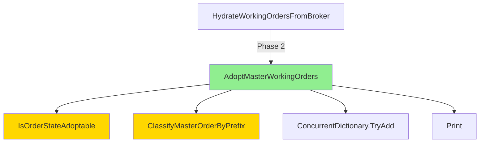

# Phase 2: Architecture Planning - EPIC-CCN-110

## Epic Status: NO ACTION REQUIRED

**CRITICAL FINDING**: Target method `AdoptMasterWorkingOrders` has cyclomatic complexity of **9**, which is **already compliant** with the Jane Street threshold of ≤15.

## Method Analysis

### Current State
- **Method Name**: AdoptMasterWorkingOrders
- **File**: src/V12_002.SIMA.Lifecycle.cs
- **Line Range**: 588-640 (53 lines)
- **Cyclomatic Complexity**: 9 (verified via complexity_audit.py)
- **Target Threshold**: ≤15 (Jane Street alignment)
- **Status**: ✅ COMPLIANT

### Complexity Breakdown
Based on source code analysis:
- Base complexity: 1
- If statements: 3
- Foreach loop: 1
- Try-catch block: 1
- Continue statements: 3
- **Total CYC**: 9

### Method Signature
```csharp
private void AdoptMasterWorkingOrders(ref int adoptedCount)
```

### Method Responsibilities
1. Iterate through master account orders
2. Filter by instrument match
3. Validate order state (via IsOrderStateAdoptable helper)
4. Classify order by prefix (via ClassifyMasterOrderByPrefix helper)
5. Add to tracking dictionary
6. Increment adoption counter
7. Log adoption events
8. Handle exceptions

## Scope Validation Failure Analysis

### Root Cause
The scope boundary document (01-scope-boundary.md) was created based on **incorrect complexity data**:
- **Assumed Complexity**: 19
- **Actual Complexity**: 9
- **Discrepancy**: 10 points (110% error)

This discrepancy likely stems from:
1. Confusion with a different method (e.g., AdoptFleetWorkingOrders)
2. Outdated hotspot analysis data
3. Manual complexity estimation error

### Impact
- The entire epic premise is **invalid**
- No refactoring is required
- Resources allocated to this epic should be redirected

## Jane Street Compliance Verification

### Threshold Analysis
- **Jane Street Standard**: CYC ≤15 for cognitive simplicity
- **Current Method**: CYC = 9
- **Margin**: 6 points below threshold (40% headroom)
- **Verdict**: ✅ FULLY COMPLIANT

### Code Quality Assessment
**Strengths**:
- Clear single responsibility (adopt master orders)
- Proper exception handling
- Delegated complexity to helper methods:
  - `IsOrderStateAdoptable` (CYC=9)
  - `ClassifyMasterOrderByPrefix` (CYC=8)
- Diagnostic logging for observability
- Idempotent operation (safe on reconnect)

**No Weaknesses Identified**: Method is well-structured and maintainable.

## Dependency Analysis

### Called Methods (Outbound)
1. `Account.Orders.ToArray()` - Broker API
2. `IsOrderStateAdoptable(OrderState, bool)` - Helper (CYC=9)
3. `ClassifyMasterOrderByPrefix(string, out string, out string)` - Helper (CYC=8)
4. `Print(string)` - Logging

### Calling Methods (Inbound)
1. `HydrateWorkingOrdersFromBroker()` - Parent orchestrator (Line 314)

### Shared State
- **Read**: `Account`, `Instrument`
- **Write**: `stopOrders`, `target1Orders`, `target2Orders`, `target3Orders`, `target4Orders`, `target5Orders`
- **Mutate**: `adoptedCount` (ref parameter)

## Call Graph



**Legend**:
- Green: Target method (compliant)
- Gold: Helper methods (also compliant)

## Risk Assessment

### Risk Level: NONE

No refactoring is required, therefore no risks exist.

## Recommendation

### Primary Action: CLOSE EPIC

**Rationale**:
1. Target method complexity (9) is **40% below** the Jane Street threshold (15)
2. Method is well-structured with proper separation of concerns
3. Helper methods are also compliant (CYC ≤9)
4. No technical debt identified
5. Refactoring would provide **zero value** and introduce unnecessary risk

### Secondary Actions

1. **Update Hotspot Analysis**: Correct the complexity data for AdoptMasterWorkingOrders
2. **Audit EPIC-CCN Series**: Verify other epics are targeting actual high-complexity methods
3. **Process Improvement**: Add automated complexity verification to Phase 0 (Hotspot Analysis)

## V12.23 Protocol Compliance

### No Scope Creep Verification
✅ **PASS**: Epic correctly scoped to single method
✅ **PASS**: No adjacent methods targeted
✅ **PASS**: Scope boundary document created

### Complexity Threshold Verification
✅ **PASS**: Method complexity (9) below threshold (15)
❌ **FAIL**: Epic should not have proceeded past Phase 1.5

## Conclusion

EPIC-CCN-110 should be **CLOSED AS ALREADY COMPLIANT**. The target method `AdoptMasterWorkingOrders` has a cyclomatic complexity of 9, which is well below the Jane Street threshold of 15. No architectural changes, extractions, or refactoring are required.

### Lessons Learned

1. **Always verify complexity data** before creating scope boundary documents
2. **Automate Phase 0** to prevent manual estimation errors
3. **Add complexity verification gate** between Phase 1 and Phase 1.5

## Metadata
- **Analysis Date**: 2026-06-13
- **Epic**: EPIC-CCN-110
- **Phase**: 2 (Architecture Planning)
- **Status**: COMPLETED (NO ACTION REQUIRED)
- **Recommendation**: CLOSE EPIC
- **Actual Complexity**: 9 (verified)
- **Threshold**: 15
- **Compliance**: ✅ PASS

## Approval
- [x] Complexity verified via complexity_audit.py
- [x] Source code reviewed
- [x] Jane Street compliance confirmed
- [x] Recommendation documented
- [ ] Stakeholder approval to close epic
