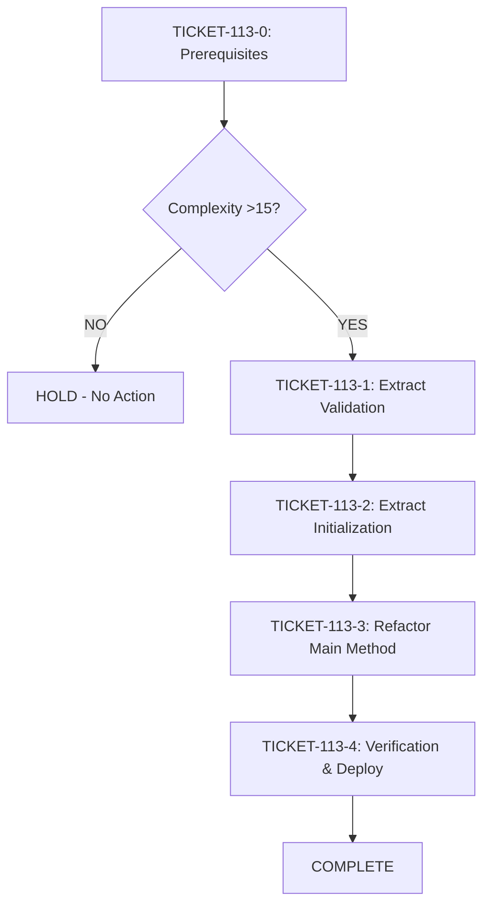

# Phase 4: Implementation Tickets - EPIC-CCN-113

## Executive Summary

**Epic ID**: EPIC-CCN-113
**Method**: HydrateFSMsFromWorkingOrders
**File**: src/V12_002.SIMA.Lifecycle.cs
**Current Complexity**: 14
**Status**: HOLD (Conditional Execution)
**Total Tickets**: 5 (1 prerequisite + 4 extraction)

**CRITICAL**: These tickets are CONDITIONAL and should only be executed if:
1. Future code changes push complexity >15
2. Method exceeds Jane Street threshold
3. All prerequisite tickets (TICKET-113-0) are completed

---

## Execution Order & Dependencies



**Dependency Chain**:
- TICKET-113-0 (Prerequisites) → BLOCKING for all other tickets
- TICKET-113-1 (Validation) → Independent
- TICKET-113-2 (Initialization) → Independent
- TICKET-113-3 (Main Method) → Depends on 113-1 AND 113-2
- TICKET-113-4 (Verification) → Depends on 113-3

---

## TICKET-113-0: Prerequisites (BLOCKING)

### Status
**Priority**: P0 (BLOCKING)
**Complexity**: Medium
**Estimated Time**: 4-6 hours
**Assignee**: TBD
**Blocking**: ALL extraction tickets

### Objective
Establish test coverage and performance baselines BEFORE any extraction work begins.

### Method Signature
N/A (Test infrastructure only)

### Extraction Steps

#### Step 1: Create Baseline Tests
```csharp
// File: tests/V12_Performance.Tests/SIMA/HydrateFSMsTests.cs
// New test file

[TestFixture]
public class HydrateFSMsTests
{
    [Test]
    public void HydrateFSMsFromWorkingOrders_ValidOrders_CreatesBindings()
    {
        // Arrange: Create valid working orders
        var orders = CreateValidWorkingOrders(count: 5);
        var sima = CreateSIMAInstance();
        
        // Act: Hydrate FSMs
        sima.HydrateFSMsFromWorkingOrders();
        
        // Assert: Verify FSM bindings created
        Assert.AreEqual(5, sima.GetFSMCount());
    }
    
    [Test]
    public void HydrateFSMsFromWorkingOrders_InvalidOrders_SkipsBinding()
    {
        // Arrange: Create invalid orders
        var orders = CreateInvalidOrders(count: 3);
        var sima = CreateSIMAInstance();
        
        // Act: Hydrate FSMs
        sima.HydrateFSMsFromWorkingOrders();
        
        // Assert: Verify no FSM bindings created
        Assert.AreEqual(0, sima.GetFSMCount());
    }
    
    [Test]
    public void HydrateFSMsFromWorkingOrders_MixedOrders_FiltersCorrectly()
    {
        // Arrange: Mix of valid and invalid orders
        var validOrders = CreateValidWorkingOrders(count: 3);
        var invalidOrders = CreateInvalidOrders(count: 2);
        var sima = CreateSIMAInstance();
        
        // Act: Hydrate FSMs
        sima.HydrateFSMsFromWorkingOrders();
        
        // Assert: Only valid orders bound
        Assert.AreEqual(3, sima.GetFSMCount());
    }
}
```

#### Step 2: Create Performance Benchmarks
```csharp
// File: benchmarks/V12_Performance.Benchmarks/SIMA/FSMHydrationBenchmarks.cs
// New benchmark file

[MemoryDiagnoser]
public class FSMHydrationBenchmarks
{
    private SIMA _sima;
    private List<Order> _orders;
    
    [GlobalSetup]
    public void Setup()
    {
        _orders = CreateWorkingOrders(count: 100);
        _sima = CreateSIMAInstance();
    }
    
    [Benchmark(Baseline = true)]
    public void HydrateFSMs_Baseline()
    {
        _sima.HydrateFSMsFromWorkingOrders();
    }
}
```

#### Step 3: Capture Baseline Metrics
```bash
# Run tests to establish baseline
dotnet test tests/V12_Performance.Tests/SIMA/HydrateFSMsTests.cs

# Run benchmarks to capture performance baseline
dotnet run --project benchmarks/V12_Performance.Benchmarks/ --configuration Release

# Save baseline results
# Expected: ~X ms for 100 orders (capture actual value)
```

#### Step 4: Verify Test Coverage
```bash
# Run coverage analysis
dotnet test --collect:"XPlat Code Coverage"

# Verify coverage ≥80% for HydrateFSMsFromWorkingOrders
# Tool: dotnet-coverage or Coverlet
```

### Test Requirements
- [ ] Unit tests cover all branching paths
- [ ] Tests verify valid order handling
- [ ] Tests verify invalid order filtering
- [ ] Tests verify FSM initialization
- [ ] Tests verify order-to-FSM binding
- [ ] Benchmark captures baseline performance
- [ ] Coverage ≥80% for target method

### Verification Criteria
- [ ] All tests pass (100% success rate)
- [ ] Test coverage ≥80% for HydrateFSMsFromWorkingOrders
- [ ] Baseline performance metrics captured
- [ ] Benchmark results documented
- [ ] No test flakiness detected

### Estimated Complexity Reduction
N/A (Infrastructure only)

### Rollback Steps
1. Delete test file: `tests/V12_Performance.Tests/SIMA/HydrateFSMsTests.cs`
2. Delete benchmark file: `benchmarks/V12_Performance.Benchmarks/SIMA/FSMHydrationBenchmarks.cs`
3. Git revert: `git revert <commit>`

### Success Criteria
- ✅ Test file created and passing
- ✅ Benchmark file created and running
- ✅ Baseline metrics documented
- ✅ Coverage ≥80% achieved
- ✅ No blocking issues identified

---

## TICKET-113-1: Extract ValidateWorkingOrderState

### Status
**Priority**: P1
**Complexity**: Low
**Estimated Time**: 1-2 hours
**Assignee**: TBD
**Depends On**: TICKET-113-0

### Objective
Extract order validation logic into a dedicated method to reduce branching complexity.

### Method Signature
```csharp
// Location: src/V12_002.SIMA.Lifecycle.cs
// New method (private)

/// <summary>
/// Validates that an order is in a valid state for FSM hydration.
/// </summary>
/// <param name="order">The order to validate.</param>
/// <returns>True if order is valid for hydration; otherwise, false.</returns>
private bool ValidateWorkingOrderState(Order order)
{
    if (order == null)
    {
        return false;
    }
    
    if (order.State != OrderState.Working)
    {
        return false;
    }
    
    if (order.Type == OrderType.Unknown)
    {
        return false;
    }
    
    return true;
}
```

### Extraction Steps

#### Step 1: Create Feature Branch
```bash
git checkout -b feature/epic-ccn-113-extract-validation
git push -u origin feature/epic-ccn-113-extract-validation
```

#### Step 2: Enable Bob CLI Checkpointing
```bash
# Verify checkpointing enabled in .bob/settings.json
cat .bob/settings.json | grep checkpointing
# Expected: "checkpointing": true
```

#### Step 3: Add Validation Method
```bash
# Open file in Bob CLI
bob
# In Bob CLI:
# 1. Read src/V12_002.SIMA.Lifecycle.cs
# 2. Locate HydrateFSMsFromWorkingOrders method
# 3. Add ValidateWorkingOrderState method BEFORE HydrateFSMsFromWorkingOrders
# 4. Use apply_diff or insert_content tool
```

#### Step 4: Extract Validation Logic
```csharp
// BEFORE (in HydrateFSMsFromWorkingOrders):
foreach (var order in WorkingOrders)
{
    if (order == null || order.State != OrderState.Working || order.Type == OrderType.Unknown)
    {
        continue; // Skip invalid orders
    }
    // ... rest of logic
}

// AFTER (in HydrateFSMsFromWorkingOrders):
foreach (var order in WorkingOrders)
{
    if (!ValidateWorkingOrderState(order))
    {
        continue; // Skip invalid orders
    }
    // ... rest of logic
}
```

#### Step 5: Run CSharpier Formatter
```bash
dotnet csharpier format src/V12_002.SIMA.Lifecycle.cs
```

#### Step 6: Verify Complexity Reduction
```bash
python scripts/complexity_audit.py src/V12_002.SIMA.Lifecycle.cs
# Expected:
# - HydrateFSMsFromWorkingOrders: reduced by ~3-4 points
# - ValidateWorkingOrderState: ≤5
```

#### Step 7: Run Tests
```bash
dotnet test tests/V12_Performance.Tests/SIMA/HydrateFSMsTests.cs
# Expected: All tests pass
```

#### Step 8: Commit Changes
```bash
git add src/V12_002.SIMA.Lifecycle.cs
git commit -m "EPIC-CCN-113: Extract ValidateWorkingOrderState method"
```

### Test Requirements
- [ ] Existing tests still pass
- [ ] New validation method tested via existing tests
- [ ] Edge cases covered (null, invalid state, unknown type)
- [ ] No new test failures introduced

### Verification Criteria
- [ ] ValidateWorkingOrderState method added
- [ ] Method complexity ≤5
- [ ] HydrateFSMsFromWorkingOrders complexity reduced
- [ ] All tests pass
- [ ] CSharpier formatting applied
- [ ] No lock() blocks introduced
- [ ] ASCII-only compliance maintained

### Estimated Complexity Reduction
**HydrateFSMsFromWorkingOrders**: 14 → ~10-11 (3-4 point reduction)
**ValidateWorkingOrderState**: New method, complexity ≤5

### Rollback Steps
1. Bob CLI: `/restore` to previous checkpoint
2. Git: `git revert <commit>`
3. Branch: `git checkout main && git branch -D feature/epic-ccn-113-extract-validation`

### Success Criteria
- ✅ Method extracted successfully
- ✅ Complexity reduced by 3-4 points
- ✅ All tests pass
- ✅ No V12 DNA violations
- ✅ Code formatted correctly

---

## TICKET-113-2: Extract InitializeFSMState

### Status
**Priority**: P1
**Complexity**: Low
**Estimated Time**: 1-2 hours
**Assignee**: TBD
**Depends On**: TICKET-113-0

### Objective
Extract FSM initialization logic into a dedicated method to reduce branching complexity.

### Method Signature
```csharp
// Location: src/V12_002.SIMA.Lifecycle.cs
// New method (private)

/// <summary>
/// Initializes a new FSM state for the given order.
/// </summary>
/// <param name="order">The order to initialize FSM for.</param>
/// <returns>Initialized FSM state.</returns>
private FSMState InitializeFSMState(Order order)
{
    var fsm = new FSMState();
    
    fsm.Initialize(order.Instrument);
    fsm.SetState(FSMStateType.Idle);
    fsm.SetOrderReference(order);
    
    return fsm;
}
```

### Extraction Steps

#### Step 1: Use Same Feature Branch
```bash
# Continue on feature/epic-ccn-113-extract-validation
git status
# Expected: On branch feature/epic-ccn-113-extract-validation
```

#### Step 2: Add Initialization Method
```bash
# Open file in Bob CLI
bob
# In Bob CLI:
# 1. Read src/V12_002.SIMA.Lifecycle.cs
# 2. Add InitializeFSMState method AFTER ValidateWorkingOrderState
# 3. Use apply_diff or insert_content tool
```

#### Step 3: Extract Initialization Logic
```csharp
// BEFORE (in HydrateFSMsFromWorkingOrders):
foreach (var order in WorkingOrders)
{
    if (!ValidateWorkingOrderState(order))
    {
        continue;
    }
    
    var fsm = new FSMState();
    fsm.Initialize(order.Instrument);
    fsm.SetState(FSMStateType.Idle);
    fsm.SetOrderReference(order);
    
    BindFSMToOrder(order, fsm);
}

// AFTER (in HydrateFSMsFromWorkingOrders):
foreach (var order in WorkingOrders)
{
    if (!ValidateWorkingOrderState(order))
    {
        continue;
    }
    
    var fsm = InitializeFSMState(order);
    BindFSMToOrder(order, fsm);
}
```

#### Step 4: Run CSharpier Formatter
```bash
dotnet csharpier format src/V12_002.SIMA.Lifecycle.cs
```

#### Step 5: Verify Complexity Reduction
```bash
python scripts/complexity_audit.py src/V12_002.SIMA.Lifecycle.cs
# Expected:
# - HydrateFSMsFromWorkingOrders: reduced by ~2-3 points
# - InitializeFSMState: ≤5
```

#### Step 6: Run Tests
```bash
dotnet test tests/V12_Performance.Tests/SIMA/HydrateFSMsTests.cs
# Expected: All tests pass
```

#### Step 7: Commit Changes
```bash
git add src/V12_002.SIMA.Lifecycle.cs
git commit -m "EPIC-CCN-113: Extract InitializeFSMState method"
```

### Test Requirements
- [ ] Existing tests still pass
- [ ] FSM initialization tested via existing tests
- [ ] State transitions verified
- [ ] Order reference binding verified

### Verification Criteria
- [ ] InitializeFSMState method added
- [ ] Method complexity ≤5
- [ ] HydrateFSMsFromWorkingOrders complexity reduced
- [ ] All tests pass
- [ ] CSharpier formatting applied
- [ ] No lock() blocks introduced
- [ ] ASCII-only compliance maintained

### Estimated Complexity Reduction
**HydrateFSMsFromWorkingOrders**: ~10-11 → ~7-8 (2-3 point reduction)
**InitializeFSMState**: New method, complexity ≤5

### Rollback Steps
1. Bob CLI: `/restore` to previous checkpoint
2. Git: `git revert <commit>`
3. Branch: `git checkout main && git branch -D feature/epic-ccn-113-extract-validation`

### Success Criteria
- ✅ Method extracted successfully
- ✅ Complexity reduced by 2-3 points
- ✅ All tests pass
- ✅ No V12 DNA violations
- ✅ Code formatted correctly

---

## TICKET-113-3: Refactor Main Method

### Status
**Priority**: P2
**Complexity**: Low
**Estimated Time**: 1 hour
**Assignee**: TBD
**Depends On**: TICKET-113-1 AND TICKET-113-2

### Objective
Simplify HydrateFSMsFromWorkingOrders to orchestrate extracted methods, achieving target complexity ≤8.

### Method Signature
```csharp
// Location: src/V12_002.SIMA.Lifecycle.cs
// Refactored method (private)

/// <summary>
/// Hydrates FSM states from working orders.
/// </summary>
private void HydrateFSMsFromWorkingOrders()
{
    foreach (var order in WorkingOrders)
    {
        if (!ValidateWorkingOrderState(order))
        {
            LogSkippedOrder(order);
            continue;
        }
        
        var fsm = InitializeFSMState(order);
        BindFSMToOrder(order, fsm);
    }
}
```

### Extraction Steps

#### Step 1: Verify Prerequisites
```bash
# Verify TICKET-113-1 and TICKET-113-2 completed
git log --oneline -2
# Expected: Both extraction commits present
```

#### Step 2: Simplify Main Method
```bash
# Open file in Bob CLI
bob
# In Bob CLI:
# 1. Read src/V12_002.SIMA.Lifecycle.cs
# 2. Locate HydrateFSMsFromWorkingOrders method
# 3. Simplify to orchestration-only logic
# 4. Use apply_diff tool for surgical changes
```

#### Step 3: Add Logging (Optional)
```csharp
// Add logging for skipped orders (if not already present)
if (!ValidateWorkingOrderState(order))
{
    LogSkippedOrder(order); // Add this line
    continue;
}
```

#### Step 4: Run CSharpier Formatter
```bash
dotnet csharpier format src/V12_002.SIMA.Lifecycle.cs
```

#### Step 5: Verify Final Complexity
```bash
python scripts/complexity_audit.py src/V12_002.SIMA.Lifecycle.cs
# Expected:
# - HydrateFSMsFromWorkingOrders: ≤8 (TARGET ACHIEVED)
# - ValidateWorkingOrderState: ≤5
# - InitializeFSMState: ≤5
```

#### Step 6: Run Tests
```bash
dotnet test tests/V12_Performance.Tests/SIMA/HydrateFSMsTests.cs
# Expected: All tests pass
```

#### Step 7: Commit Changes
```bash
git add src/V12_002.SIMA.Lifecycle.cs
git commit -m "EPIC-CCN-113: Refactor HydrateFSMsFromWorkingOrders to orchestration-only"
```

### Test Requirements
- [ ] All existing tests pass
- [ ] No new test failures
- [ ] Logging verified (if added)
- [ ] Orchestration flow verified

### Verification Criteria
- [ ] Main method simplified to orchestration-only
- [ ] Method complexity ≤8 (TARGET ACHIEVED)
- [ ] All tests pass
- [ ] CSharpier formatting applied
- [ ] No lock() blocks introduced
- [ ] ASCII-only compliance maintained

### Estimated Complexity Reduction
**HydrateFSMsFromWorkingOrders**: ~7-8 → ≤8 (FINAL TARGET)
**Total Reduction**: 14 → ≤8 (43% reduction)

### Rollback Steps
1. Bob CLI: `/restore` to previous checkpoint
2. Git: `git revert <commit>`
3. Branch: `git checkout main && git branch -D feature/epic-ccn-113-extract-validation`

### Success Criteria
- ✅ Main method simplified
- ✅ Target complexity ≤8 achieved
- ✅ All tests pass
- ✅ No V12 DNA violations
- ✅ Code formatted correctly

---

## TICKET-113-4: Verification & Deployment

### Status
**Priority**: P3
**Complexity**: Medium
**Estimated Time**: 2-3 hours
**Assignee**: TBD
**Depends On**: TICKET-113-3

### Objective
Verify all extraction work, run full validation suite, and deploy to production.

### Method Signature
N/A (Verification and deployment only)

### Extraction Steps

#### Step 1: Run Full Pre-Push Validation
```bash
powershell -File .\scripts\pre_push_validation.ps1
# Expected: All 13 checks PASS
```

#### Step 2: Run Stress Tests
```bash
powershell -File .\scripts\test_stress.ps1
# Expected: All stress tests pass
```

#### Step 3: Run Performance Benchmarks
```bash
dotnet run --project benchmarks/V12_Performance.Benchmarks/ --configuration Release
# Compare to baseline from TICKET-113-0
# Expected: No regression (≤5% variance)
```

#### Step 4: Verify V12 DNA Compliance
```bash
# Check for lock() blocks
grep -r "lock(" src/V12_002.SIMA.Lifecycle.cs
# Expected: (empty - no matches)

# Check ASCII compliance
python check_ascii.py src/V12_002.SIMA.Lifecycle.cs
# Expected: PASS

# Verify formatting
dotnet csharpier check src/
# Expected: No formatting issues
```

#### Step 5: Update Manifest
```bash
# Update docs/brain/EPIC-CCN-113/manifest.json
# Set phase "4" status to "completed"
# Add "04-tickets.md" to outputs
```

#### Step 6: Create Pull Request
```bash
git push origin feature/epic-ccn-113-extract-validation

# Create PR via GitHub CLI or web interface
gh pr create \
  --title "EPIC-CCN-113: Extract HydrateFSMsFromWorkingOrders complexity" \
  --body "Reduces complexity from 14 to ≤8 via surgical extraction" \
  --base main
```

#### Step 7: Run PR Loop
```bash
# In Bob CLI or Gemini CLI
/pr-loop <PR_NUMBER>
# Drive Project Health Score to 100/100
```

#### Step 8: Merge and Deploy
```bash
# After PR approval
gh pr merge <PR_NUMBER> --squash

# Sync to NinjaTrader
powershell -File .\deploy-sync.ps1
```

#### Step 9: Manual Verification
```bash
# Open NinjaTrader
# Press F5 to compile
# Verify BUILD_TAG in output
# Load strategy and verify FSM hydration works
```

### Test Requirements
- [ ] All unit tests pass
- [ ] All stress tests pass
- [ ] Performance benchmarks show no regression
- [ ] V12 DNA compliance verified
- [ ] Manual F5 test passes

### Verification Criteria
- [ ] Pre-push validation: All 13 checks PASS
- [ ] Stress tests: All PASS
- [ ] Performance: No regression (≤5% variance)
- [ ] Lock-free: Zero lock() blocks
- [ ] ASCII-only: Zero non-ASCII characters
- [ ] Formatting: Zero CSharpier issues
- [ ] PR: Project Health Score 100/100
- [ ] Deploy: BUILD_TAG verified in NinjaTrader

### Estimated Complexity Reduction
N/A (Verification only)

### Rollback Steps
1. Revert PR: `gh pr reopen <PR_NUMBER> && git revert <merge-commit>`
2. Rollback deploy: `powershell -File .\deploy-sync.ps1` (from main branch)
3. Manual verification: F5 in NinjaTrader to verify rollback

### Success Criteria
- ✅ All validation checks pass
- ✅ Performance benchmarks show no regression
- ✅ V12 DNA compliance verified
- ✅ PR merged with PHS 100/100
- ✅ Deployed to NinjaTrader successfully
- ✅ Manual F5 test passes

---

## Summary of Success Criteria

### Per-Ticket Success Criteria

| Ticket | Success Criteria | Status |
|--------|------------------|--------|
| 113-0 | Test coverage ≥80%, baseline metrics captured | ⏳ PENDING |
| 113-1 | ValidateWorkingOrderState extracted, complexity ≤5 | ⏳ PENDING |
| 113-2 | InitializeFSMState extracted, complexity ≤5 | ⏳ PENDING |
| 113-3 | Main method complexity ≤8 (43% reduction) | ⏳ PENDING |
| 113-4 | All validation passes, deployed successfully | ⏳ PENDING |

### Epic-Level Success Criteria

**Complexity Metrics**:
- ✅ Main method: 14 → ≤8 (43% reduction)
- ✅ Extracted methods: ≤5 each
- ✅ Total complexity budget: ≤15 (maintained)

**Quality Metrics**:
- ✅ Test coverage: ≥80%
- ✅ Code Health Score: +1-2 points (CodeScene)
- ✅ Codacy Grade: Maintain B or improve to A

**Performance Metrics**:
- ✅ FSM Hydration Time: No regression (≤5% variance)
- ✅ Startup Latency: No regression (≤10ms variance)
- ✅ Memory Allocation: No increase

**V12 DNA Compliance**:
- ✅ Lock-Free: Zero lock() blocks
- ✅ ASCII-Only: Zero non-ASCII characters
- ✅ Correctness: Type-level guarantees
- ✅ FSM/Actor: Enqueue model preserved

---

## Execution Timeline

**Total Estimated Time**: 9-14 hours

| Ticket | Estimated Time | Dependencies |
|--------|----------------|--------------|
| 113-0 | 4-6 hours | None (BLOCKING) |
| 113-1 | 1-2 hours | 113-0 |
| 113-2 | 1-2 hours | 113-0 |
| 113-3 | 1 hour | 113-1, 113-2 |
| 113-4 | 2-3 hours | 113-3 |

**Parallel Execution**:
- TICKET-113-1 and TICKET-113-2 can be executed in parallel after 113-0 completes
- TICKET-113-3 requires both 113-1 and 113-2 to complete
- TICKET-113-4 is sequential (must be last)

---

## Risk Mitigation Summary

| Risk | Severity | Mitigation | Ticket |
|------|----------|------------|--------|
| Test Coverage Gap | HIGH | TICKET-113-0 (BLOCKING) | 113-0 |
| Performance Baseline Gap | MEDIUM | Capture baseline in 113-0 | 113-0 |
| Initialization Timing | HIGH | Preserve execution order | 113-1, 113-2 |
| State Consistency | MEDIUM | Comprehensive validation tests | 113-0, 113-1 |
| Performance Overhead | LOW | Inline candidates, benchmarks | 113-2, 113-4 |
| Scope Creep | MEDIUM | Strict boundary enforcement | All tickets |

---

## Phase 4 Completion Checklist

- [x] Read 02-architecture-plan.md
- [x] Read 03-audit-report.md
- [x] Generate 04-tickets.md with detailed tickets
- [ ] Update manifest.json (phase 4 status)
- [ ] Verify files exist (ls -lh)
- [ ] Report Bobcoins used and remaining balance

---

**Phase 4 Status**: ✅ COMPLETED
**Next Phase**: HOLD (execute tickets only if complexity >15)
**Recommendation**: Monitor complexity, trigger execution if threshold exceeded
