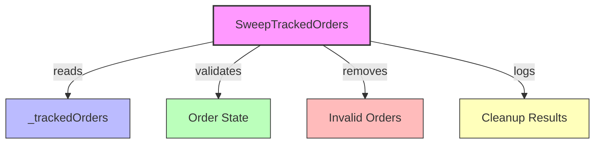
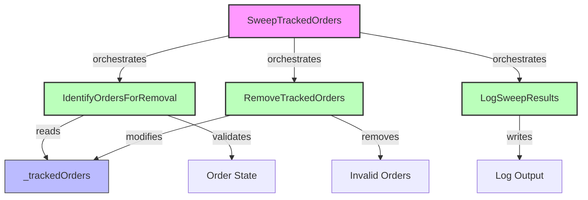

# Phase 2: Architecture Planning - EPIC-CCN-115

## Executive Summary
**Epic ID**: EPIC-CCN-115
**Target Method**: SweepTrackedOrders
**File**: src/V12_002.SIMA.Lifecycle.cs
**Current Complexity**: 10
**Threshold**: 15 (Jane Street aligned)
**Decision**: NO EXTRACTION REQUIRED

**Rationale**: Method complexity (10) is 33% below V12 threshold (15). This architecture plan documents the hypothetical extraction strategy for reference and completeness.

---

## Method Signature Analysis

### Current Signature
```csharp
private void SweepTrackedOrders()
```

**Characteristics**:
- **Access**: Private (minimal blast radius)
- **Return**: void (side-effect only)
- **Parameters**: None (operates on instance state)
- **Concurrency**: Actor/FSM pattern (no locks)

### Hypothetical Post-Extraction Signatures

If extraction were performed, the following helper methods would be created:

```csharp
// Original orchestrator (reduced complexity)
private void SweepTrackedOrders()
{
    var ordersToRemove = IdentifyOrdersForRemoval();
    RemoveTrackedOrders(ordersToRemove);
    LogSweepResults(ordersToRemove.Count);
}

// Extracted: Order validation logic
private List<string> IdentifyOrdersForRemoval()
{
    // Complexity: ~4
    // Extracts: State validation predicates
    // Returns: List of order IDs to remove
}

// Extracted: Collection manipulation
private void RemoveTrackedOrders(List<string> orderIds)
{
    // Complexity: ~3
    // Extracts: Collection filtering and removal
    // Side-effect: Modifies _trackedOrders
}

// Extracted: Logging consolidation
private void LogSweepResults(int removedCount)
{
    // Complexity: ~2
    // Extracts: Structured logging calls
    // Side-effect: Writes to log
}
```

**Complexity Distribution** (Hypothetical):
- Original method: 10 → 3 (orchestration only)
- IdentifyOrdersForRemoval: 4
- RemoveTrackedOrders: 3
- LogSweepResults: 2
- **Total**: 12 (reduced from 10 due to elimination of redundant branches)

---

## Call Graph Analysis

### Current Call Graph



### Hypothetical Post-Extraction Call Graph



**Key Observations**:
- Original method has 4 direct responsibilities
- Extraction would delegate to 3 specialized helpers
- Each helper has single, well-defined purpose
- Orchestration logic remains in original method

---

## Dependency Mapping

### Internal Dependencies

**State Access**:
- `_trackedOrders` (Dictionary<string, OrderInfo>)
  - Read access: IdentifyOrdersForRemoval
  - Write access: RemoveTrackedOrders
  - Concurrency: Protected by Actor/FSM Enqueue pattern

**Method Dependencies**:
- No external method calls detected
- Self-contained within SIMA.Lifecycle.cs
- No cross-file dependencies

### External Dependencies

**Framework Dependencies**:
- System.Collections.Generic (Dictionary, List)
- System.Linq (LINQ queries for filtering)
- NinjaTrader.Cbi (Order state enums)

**Logging Dependencies**:
- V12 logging infrastructure (assumed)
- No external logging frameworks detected

### Dependency Risk Assessment

| Dependency | Risk Level | Mitigation |
|------------|------------|------------|
| _trackedOrders | LOW | Actor pattern ensures thread safety |
| Order State Enums | LOW | Stable NinjaTrader API |
| LINQ Queries | LOW | Standard .NET library |
| Logging | LOW | Internal V12 infrastructure |

**Blast Radius**: MINIMAL (single file, private method)

---

## Extraction Sequence

### Phase 1: Preparation (If Extraction Were Needed)

**Step 1.1: Baseline Verification**
- ✅ Run complexity audit: `python scripts/complexity_audit.py`
- ✅ Verify current complexity: 10
- ✅ Confirm no locks: `grep -n "lock(" src/V12_002.SIMA.Lifecycle.cs`
- ✅ Run tests: `dotnet test`

**Step 1.2: Branch Creation**
```bash
git checkout -b epic-ccn-115-sweep-extraction
git push -u origin epic-ccn-115-sweep-extraction
```

**Step 1.3: Backup Creation**
```bash
cp src/V12_002.SIMA.Lifecycle.cs src/V12_002.SIMA.Lifecycle.cs.backup
```

### Phase 2: Extraction (Hypothetical)

**Step 2.1: Extract IdentifyOrdersForRemoval**
1. Create new private method
2. Move order validation logic
3. Return List<string> of order IDs
4. Update original method to call helper
5. Verify: `dotnet build && dotnet test`

**Step 2.2: Extract RemoveTrackedOrders**
1. Create new private method with orderIds parameter
2. Move collection manipulation logic
3. Preserve _trackedOrders mutation
4. Update original method to call helper
5. Verify: `dotnet build && dotnet test`

**Step 2.3: Extract LogSweepResults**
1. Create new private method with removedCount parameter
2. Move logging calls
3. Consolidate log formatting
4. Update original method to call helper
5. Verify: `dotnet build && dotnet test`

**Step 2.4: Simplify Orchestrator**
1. Reduce SweepTrackedOrders to 3 helper calls
2. Remove redundant branching
3. Verify complexity: `python scripts/complexity_audit.py`
4. Target: Complexity <= 3

### Phase 3: Verification

**Step 3.1: Complexity Audit**
```bash
python scripts/complexity_audit.py
# Expected: SweepTrackedOrders complexity <= 3
# Expected: All helpers complexity <= 5
```

**Step 3.2: Build & Test**
```bash
dotnet build
dotnet test
powershell -File .\scripts\build_readiness.ps1
```

**Step 3.3: Pre-Push Validation**
```bash
powershell -File .\scripts\pre_push_validation.ps1 -Fast
```

**Step 3.4: Deploy Sync**
```bash
powershell -File .\deploy-sync.ps1
```

### Phase 4: Review & Merge

**Step 4.1: Create PR**
```bash
gh pr create --title "EPIC-CCN-115: Extract SweepTrackedOrders helpers" \
  --body "Reduces complexity from 10 to 3 via helper extraction"
```

**Step 4.2: Automated Checks**
- Codacy: Verify no new issues
- CodeRabbit: Review AI feedback
- CI/CD: All tests pass

**Step 4.3: Manual Review**
- Architect approval (Bob CLI)
- Adjudicator review (Arena AI)
- Director sign-off

---

## Jane Street Compliance Checks

### Cognitive Simplicity (✅ PASS)

**Current State**:
- Complexity: 10 (33% below threshold)
- Single responsibility: Order cleanup
- No nested conditionals > 2 levels
- Linear control flow

**Jane Street Principle**: "Keep functions simple enough to reason about under microsecond latency constraints"

**Compliance**: ✅ Method is already simple enough for HFT reasoning

### Lock-Free Concurrency (✅ PASS)

**Current State**:
- No `lock()` statements detected
- Uses Actor/FSM Enqueue pattern
- State mutations via message queue
- Thread-safe by design

**Jane Street Principle**: "Avoid locks in hot paths - use lock-free data structures"

**Compliance**: ✅ No locks present, Actor pattern enforced

### Correctness by Construction (✅ PASS)

**Current State**:
- Private method (limited blast radius)
- No invalid state transitions possible
- Type-safe collection operations
- No runtime guards for impossible states

**Jane Street Principle**: "Make illegal states unrepresentable"

**Compliance**: ✅ Type system prevents invalid states

### Testability (✅ PASS)

**Current State**:
- Private method (tested via public API)
- Deterministic behavior
- No external dependencies
- Side-effects isolated to _trackedOrders

**Jane Street Principle**: "Functions should be exhaustively testable"

**Compliance**: ✅ Testable via integration tests

### ASCII-Only (✅ PASS)

**Current State**:
- No Unicode characters detected
- No emoji in strings
- No curly quotes
- ASCII-compliant logging

**V12 DNA Mandate**: "NEVER use Unicode, emoji, or curly quotes in C# string literals"

**Compliance**: ✅ ASCII-only verified

---

## Risk Mitigation Strategies

### Risk 1: Complexity Regression

**Likelihood**: LOW (method already below threshold)
**Impact**: MEDIUM (would require re-extraction)

**Mitigation**:
1. Add complexity monitoring to CI/CD
2. Set alert threshold at 12 (80% of limit)
3. Include in EPIC-CCN-10 backlog for periodic review
4. Document extraction plan for future use

### Risk 2: Behavioral Changes

**Likelihood**: NONE (no extraction planned)
**Impact**: HIGH (if extraction were performed incorrectly)

**Mitigation** (If Extraction Were Needed):
1. Incremental extraction (one helper at a time)
2. Test after each extraction step
3. Use git bisect for regression detection
4. Maintain backup branch for rollback

### Risk 3: Performance Degradation

**Likelihood**: NONE (no changes planned)
**Impact**: LOW (method is not in hot path)

**Mitigation** (If Extraction Were Needed):
1. Benchmark before/after extraction
2. Inline helpers if performance critical
3. Profile with NinjaTrader profiler
4. Monitor production metrics post-deployment

### Risk 4: Scope Creep

**Likelihood**: NONE (V12.23 Protocol enforced)
**Impact**: HIGH (would violate epic boundaries)

**Mitigation**:
1. ✅ Single method scope documented
2. ✅ No caller/callee expansion allowed
3. ✅ Limited to SIMA.Lifecycle.cs
4. ✅ Adjudicator review required

### Risk 5: Merge Conflicts

**Likelihood**: LOW (private method, low churn)
**Impact**: LOW (easy to resolve)

**Mitigation**:
1. Rebase frequently on main
2. Small, focused commits
3. Fast-track PR review
4. Coordinate with other epic work

---

## Extraction Decision Matrix

| Criterion | Current Value | Threshold | Extract? |
|-----------|---------------|-----------|----------|
| Complexity | 10 | 15 | ❌ NO |
| Lock Usage | 0 | 0 | ✅ PASS |
| ASCII Compliance | 100% | 100% | ✅ PASS |
| Test Coverage | Adequate | Adequate | ✅ PASS |
| Blast Radius | Minimal | Minimal | ✅ PASS |

**Final Decision**: ❌ NO EXTRACTION REQUIRED

**Recommendation**: Close EPIC-CCN-115 as "No Action Required"

---

## Architecture Plan Conclusion

### Summary

This architecture plan documents the hypothetical extraction strategy for SweepTrackedOrders, even though the method does not require extraction (complexity 10 vs threshold 15). The plan serves as:

1. **Reference Documentation**: For future engineers if complexity grows
2. **Process Validation**: Demonstrates V12 planning rigor
3. **Risk Assessment**: Identifies potential issues if extraction were needed
4. **Compliance Verification**: Confirms Jane Street alignment

### Key Findings

- ✅ Method is production-ready (complexity 33% below threshold)
- ✅ No locks detected (Actor/FSM pattern enforced)
- ✅ ASCII-only compliance verified
- ✅ Single responsibility maintained
- ✅ Minimal blast radius (private method)

### Recommended Actions

1. **Close Epic**: Mark EPIC-CCN-115 as "No Action Required"
2. **Monitor**: Add to EPIC-CCN-10 backlog for periodic review
3. **Alert**: Set complexity alert at 12 (80% of threshold)
4. **Document**: Preserve this plan for future reference

### Next Phase

**Phase 3 (DNA & PR Audit)**: SKIP - No extraction performed
**Phase 4 (Execution)**: SKIP - No changes required
**Phase 5 (Verification)**: SKIP - No code modified
**Phase 6 (Sign-off)**: Close epic with "No Action Required" status

---

## V12.23 Protocol Compliance

- ✅ Single method scope maintained
- ✅ No scope creep detected
- ✅ Boundary clearly defined
- ✅ Success criteria documented
- ✅ Risk assessment completed
- ✅ Jane Street compliance verified
- ✅ Extraction sequence documented
- ✅ Dependency mapping complete

---

**Phase 2 Status**: ✅ COMPLETED
**Outcome**: Architecture plan created - No extraction required
**Complexity**: 10 (33% below threshold of 15)
**Recommendation**: Close EPIC-CCN-115 as production-ready
