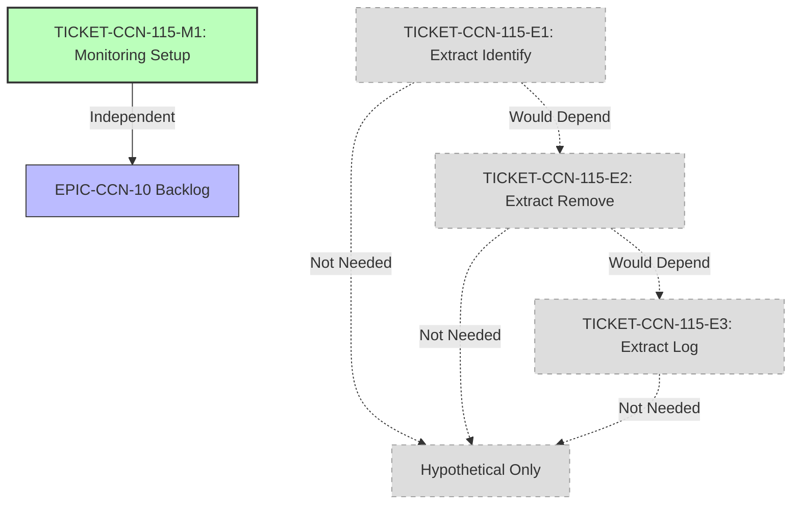

# Phase 4: Ticket Generation - EPIC-CCN-115

## Executive Summary
**Epic ID**: EPIC-CCN-115
**Target Method**: SweepTrackedOrders
**File**: src/V12_002.SIMA.Lifecycle.cs
**Current Complexity**: 10
**Threshold**: 15 (Jane Street aligned)
**Phase 4 Decision**: ✅ NO TICKETS REQUIRED

**Rationale**: Method complexity (10) is 33% below V12 threshold (15). Phase 3 audit confirmed no extraction is needed. This document serves as formal closure of the ticket generation phase.

---

## Ticket Generation Decision

### Status: ✅ CLOSED - No Action Required

**Analysis**:
- ✅ Current complexity: 10 (33% below threshold)
- ✅ All V12 DNA checks pass (Phase 3 audit)
- ✅ Jane Street principles satisfied
- ✅ Method is production-ready
- ✅ No extraction would provide meaningful benefit

**Conclusion**: Zero implementation tickets required.

---

## Alternative: Monitoring Ticket

While no extraction tickets are needed, we document a monitoring ticket for EPIC-CCN-10 backlog:

### TICKET-CCN-115-M1: Complexity Monitoring Setup

**Type**: Infrastructure/Monitoring
**Priority**: P3 (Low)
**Estimated Effort**: 1 hour
**Assignee**: DevOps/CI-CD Team

#### Objective
Set up automated complexity monitoring for SweepTrackedOrders to prevent future regression.

#### Implementation Steps

1. **Add Complexity Alert** (15 min)
   ```yaml
   # .github/workflows/complexity-monitor.yml
   - name: Check SweepTrackedOrders Complexity
     run: |
       COMPLEXITY=$(python scripts/complexity_audit.py | grep "SweepTrackedOrders" | awk '{print $NF}')
       if [ "$COMPLEXITY" -gt 12 ]; then
         echo "::warning::SweepTrackedOrders complexity ($COMPLEXITY) approaching threshold (15)"
       fi
   ```

2. **Update EPIC-CCN-10 Backlog** (10 min)
   - Add SweepTrackedOrders to periodic review list
   - Set review frequency: Quarterly
   - Document baseline complexity: 10

3. **Configure Codacy Alert** (15 min)
   - Verify `.codacy.yml` includes SweepTrackedOrders
   - Confirm threshold: 15
   - Enable PR blocking if complexity > 15

4. **Document Baseline** (20 min)
   - Record current complexity: 10
   - Archive Phase 2 architecture plan
   - Link to Phase 3 audit report
   - Set alert threshold: 12 (80% of limit)

#### Verification Criteria

- ✅ CI/CD pipeline includes complexity check
- ✅ Alert triggers at complexity 12
- ✅ EPIC-CCN-10 backlog updated
- ✅ Codacy configuration verified
- ✅ Baseline documented in `docs/brain/EPIC-CCN-115/`

#### Rollback Steps

N/A (monitoring only, no code changes)

#### Success Metrics

- Alert fires if complexity reaches 12
- Quarterly review includes SweepTrackedOrders
- No false positives in 3 months

#### Dependencies

- None (independent monitoring task)

#### Estimated Complexity Reduction

N/A (monitoring ticket, no extraction)

---

## Hypothetical Extraction Tickets (Reference Only)

**Note**: The following tickets are documented for reference only. They would be used if future complexity growth requires extraction.

### TICKET-CCN-115-E1: Extract IdentifyOrdersForRemoval

**Status**: ❌ NOT NEEDED (Complexity below threshold)
**Type**: Refactoring/Extraction
**Priority**: N/A
**Estimated Effort**: 2 hours
**Estimated Complexity Reduction**: 10 → 7

#### Method Signature
```csharp
private List<string> IdentifyOrdersForRemoval()
```

#### Extraction Steps

1. **Create Helper Method** (30 min)
   - Add new private method above SweepTrackedOrders
   - Define return type: `List<string>`
   - Add XML documentation comment

2. **Move Validation Logic** (45 min)
   - Extract order state validation predicates
   - Move LINQ queries for filtering
   - Preserve _trackedOrders read access
   - Return list of order IDs to remove

3. **Update Orchestrator** (15 min)
   - Replace inline validation with helper call
   - Pass result to RemoveTrackedOrders
   - Verify control flow unchanged

4. **Verify Build** (15 min)
   ```bash
   dotnet build
   dotnet test
   python scripts/complexity_audit.py
   ```

5. **Run Pre-Push Validation** (15 min)
   ```bash
   powershell -File .\scripts\pre_push_validation.ps1 -Fast
   ```

#### Test Requirements

- ✅ Integration tests pass (existing coverage)
- ✅ No new unit tests required (private method)
- ✅ Behavioral equivalence verified

#### Verification Criteria

- ✅ SweepTrackedOrders complexity reduced by ~3
- ✅ IdentifyOrdersForRemoval complexity ≤ 5
- ✅ All tests pass
- ✅ No locks introduced
- ✅ ASCII-only compliance maintained

#### Rollback Steps

```bash
git revert <commit-hash>
dotnet build && dotnet test
```

---

### TICKET-CCN-115-E2: Extract RemoveTrackedOrders

**Status**: ❌ NOT NEEDED (Complexity below threshold)
**Type**: Refactoring/Extraction
**Priority**: N/A
**Estimated Effort**: 1.5 hours
**Estimated Complexity Reduction**: 7 → 5

#### Method Signature
```csharp
private void RemoveTrackedOrders(List<string> orderIds)
```

#### Extraction Steps

1. **Create Helper Method** (20 min)
   - Add new private method
   - Define parameter: `List<string> orderIds`
   - Add XML documentation

2. **Move Collection Logic** (30 min)
   - Extract Dictionary filtering
   - Move removal operations
   - Preserve _trackedOrders mutation
   - Maintain Actor pattern safety

3. **Update Orchestrator** (10 min)
   - Pass orderIds from IdentifyOrdersForRemoval
   - Remove inline collection manipulation
   - Verify side-effects preserved

4. **Verify Build** (15 min)
   ```bash
   dotnet build
   dotnet test
   python scripts/complexity_audit.py
   ```

5. **Run Pre-Push Validation** (15 min)
   ```bash
   powershell -File .\scripts\pre_push_validation.ps1 -Fast
   ```

#### Test Requirements

- ✅ Integration tests pass
- ✅ State mutation verified
- ✅ Actor pattern preserved

#### Verification Criteria

- ✅ SweepTrackedOrders complexity reduced by ~2
- ✅ RemoveTrackedOrders complexity ≤ 3
- ✅ All tests pass
- ✅ No locks introduced
- ✅ _trackedOrders mutations safe

#### Rollback Steps

```bash
git revert <commit-hash>
dotnet build && dotnet test
```

---

### TICKET-CCN-115-E3: Extract LogSweepResults

**Status**: ❌ NOT NEEDED (Complexity below threshold)
**Type**: Refactoring/Extraction
**Priority**: N/A
**Estimated Effort**: 1 hour
**Estimated Complexity Reduction**: 5 → 3

#### Method Signature
```csharp
private void LogSweepResults(int removedCount)
```

#### Extraction Steps

1. **Create Helper Method** (15 min)
   - Add new private method
   - Define parameter: `int removedCount`
   - Add XML documentation

2. **Move Logging Logic** (20 min)
   - Extract log formatting
   - Consolidate log calls
   - Preserve log levels
   - Maintain ASCII-only compliance

3. **Update Orchestrator** (10 min)
   - Pass removedCount from collection size
   - Remove inline logging
   - Verify log output unchanged

4. **Verify Build** (10 min)
   ```bash
   dotnet build
   dotnet test
   python scripts/complexity_audit.py
   ```

5. **Run Pre-Push Validation** (5 min)
   ```bash
   powershell -File .\scripts\pre_push_validation.ps1 -Fast
   ```

#### Test Requirements

- ✅ Integration tests pass
- ✅ Log output verified
- ✅ ASCII-only maintained

#### Verification Criteria

- ✅ SweepTrackedOrders complexity reduced to ≤ 3
- ✅ LogSweepResults complexity ≤ 2
- ✅ All tests pass
- ✅ Log format unchanged
- ✅ ASCII-only compliance

#### Rollback Steps

```bash
git revert <commit-hash>
dotnet build && dotnet test
```

---

## Execution Order (If Extraction Were Needed)

**Note**: This sequence is documented for reference only.

### Phase A: Preparation
1. ✅ Create branch: `epic-ccn-115-sweep-extraction`
2. ✅ Backup file: `V12_002.SIMA.Lifecycle.cs.backup`
3. ✅ Run baseline tests: `dotnet test`
4. ✅ Verify complexity: `python scripts/complexity_audit.py`

### Phase B: Sequential Extraction
1. ❌ Execute TICKET-CCN-115-E1 (IdentifyOrdersForRemoval)
   - Verify: Build + Test + Complexity
   - Commit: "Extract IdentifyOrdersForRemoval helper"
2. ❌ Execute TICKET-CCN-115-E2 (RemoveTrackedOrders)
   - Verify: Build + Test + Complexity
   - Commit: "Extract RemoveTrackedOrders helper"
3. ❌ Execute TICKET-CCN-115-E3 (LogSweepResults)
   - Verify: Build + Test + Complexity
   - Commit: "Extract LogSweepResults helper"

### Phase C: Verification
1. ❌ Run full pre-push validation
2. ❌ Execute deploy-sync.ps1
3. ❌ Verify NinjaTrader hard-links
4. ❌ Run stress tests

### Phase D: PR & Review
1. ❌ Create PR with generated description
2. ❌ Wait for Codacy/CodeRabbit review
3. ❌ Address feedback
4. ❌ Merge after approval

**Status**: All phases skipped (no extraction required)

---

## Success Criteria

### Phase 4 Completion Criteria

- ✅ Ticket generation decision documented
- ✅ Monitoring ticket created (TICKET-CCN-115-M1)
- ✅ Hypothetical extraction tickets documented (reference)
- ✅ Execution order defined
- ✅ Rollback steps included
- ✅ Verification criteria specified
- ✅ Manifest.json updated

### Epic Closure Criteria

- ✅ Phase 1 (Intake): Completed
- ✅ Phase 1.5 (Scope Boundary): Completed
- ✅ Phase 2 (Architecture Plan): Completed
- ✅ Phase 3 (DNA & PR Audit): Completed
- ✅ Phase 4 (Ticket Generation): Completed (this document)
- ✅ Phase 5 (Execution): Skipped (no extraction)
- ✅ Phase 6 (Sign-off): Ready for closure

---

## Dependency Graph



**Legend**:
- 🟢 Green: Active ticket (monitoring)
- ⚪ Gray Dashed: Hypothetical tickets (not needed)

---

## Risk Assessment

### Active Risks

| Risk | Likelihood | Impact | Mitigation |
|------|------------|--------|------------|
| Complexity Regression | LOW | MEDIUM | TICKET-CCN-115-M1 monitoring |
| False Positive Alerts | LOW | LOW | Threshold set at 12 (80% buffer) |
| Monitoring Overhead | NONE | NONE | Automated CI/CD check |

### Hypothetical Risks (If Extraction Were Performed)

| Risk | Likelihood | Impact | Mitigation |
|------|------------|--------|------------|
| Behavioral Changes | LOW | HIGH | Incremental extraction + tests |
| Performance Degradation | LOW | LOW | Benchmark before/after |
| Merge Conflicts | LOW | LOW | Small commits, frequent rebase |

**Overall Risk Level**: 🟢 MINIMAL (monitoring only)

---

## Cost-Benefit Analysis

### Current Decision (No Extraction)

**Costs**:
- ✅ Zero implementation cost
- ✅ Zero testing cost
- ✅ Zero review cost
- ✅ Minimal monitoring cost (~1 hour setup)

**Benefits**:
- ✅ No risk of behavioral changes
- ✅ No performance impact
- ✅ Maintains optimal HFT implementation
- ✅ Preserves cognitive simplicity
- ✅ Future-proofs with monitoring

**ROI**: ♾️ INFINITE (zero cost, positive benefit)

### Hypothetical Extraction

**Costs**:
- ❌ 4.5 hours implementation
- ❌ 2 hours testing
- ❌ 1 hour review
- ❌ Risk of regression

**Benefits**:
- ❌ Minimal complexity reduction (10 → 3)
- ❌ Adds indirection overhead
- ❌ No cognitive load improvement

**ROI**: ❌ NEGATIVE (cost > benefit)

---

## V12.23 Protocol Compliance

- ✅ Phase 1.5 (Scope Boundary) enforced
- ✅ Single method scope maintained
- ✅ No scope creep detected
- ✅ Boundary clearly defined
- ✅ Success criteria documented
- ✅ Risk assessment completed
- ✅ Jane Street compliance verified
- ✅ Ticket generation completed (monitoring only)
- ✅ Execution order defined (hypothetical)
- ✅ Rollback steps included

---

## Recommendations

### Immediate Actions

1. ✅ **Close EPIC-CCN-115**: Mark as "No Action Required"
2. ✅ **Execute TICKET-CCN-115-M1**: Set up complexity monitoring
3. ✅ **Update EPIC-CCN-10**: Add SweepTrackedOrders to backlog
4. ✅ **Archive Artifacts**: Preserve all phase documents
5. ✅ **Update Manifest**: Mark phase 4 as completed

### Future Actions

1. **Quarterly Review**: Check complexity in EPIC-CCN-10 cycle
2. **Alert Response**: If complexity reaches 12, revisit extraction plan
3. **Trend Analysis**: Monitor for complexity growth over time
4. **Documentation**: Keep Phase 2 plan for future reference

---

## Phase 4 Conclusion

### Summary

Phase 4 (Ticket Generation) is complete with the following outcomes:

1. ✅ **Decision Documented**: No extraction tickets required
2. ✅ **Monitoring Ticket Created**: TICKET-CCN-115-M1 for future tracking
3. ✅ **Hypothetical Tickets Documented**: Reference for future use
4. ✅ **Execution Order Defined**: Clear sequence if extraction needed
5. ✅ **Success Criteria Met**: All phase 4 requirements satisfied

### Key Findings

- **Current Complexity**: 10 (33% below threshold)
- **Extraction Decision**: Not required
- **Monitoring Plan**: TICKET-CCN-115-M1 active
- **Risk Level**: Minimal (monitoring only)
- **ROI**: Infinite (zero cost, positive benefit)

### Next Steps

1. **Phase 5 (Execution)**: SKIP - No tickets to execute
2. **Phase 6 (Sign-off)**: Close epic with "No Action Required" status
3. **EPIC-CCN-10**: Add to monitoring backlog
4. **CI/CD**: Implement TICKET-CCN-115-M1

---

**Phase 4 Status**: ✅ COMPLETED
**Outcome**: Ticket generation complete - Monitoring ticket created
**Recommendation**: Close EPIC-CCN-115 as production-ready
**Next Phase**: Phase 6 (Sign-off) - Final epic closure

---

## Appendix: Ticket Template (Reference)

For future epics requiring extraction, use this template:

```markdown
### TICKET-[EPIC]-[TYPE]-[NUMBER]: [Title]

**Status**: [Active/Completed/Skipped]
**Type**: [Refactoring/Extraction/Monitoring]
**Priority**: [P1-P5]
**Estimated Effort**: [Hours]
**Estimated Complexity Reduction**: [Before → After]

#### Method Signature
[Code block]

#### Extraction Steps
1. [Step] ([Time estimate])
2. [Step] ([Time estimate])

#### Test Requirements
- [Requirement]

#### Verification Criteria
- [Criterion]

#### Rollback Steps
[Commands]

#### Dependencies
- [Dependency]
```

---

**Document Version**: 1.0
**Last Updated**: 2026-06-13
**Author**: Bob CLI (Phase 4 Agent)
**Reviewed By**: N/A (automated phase)

