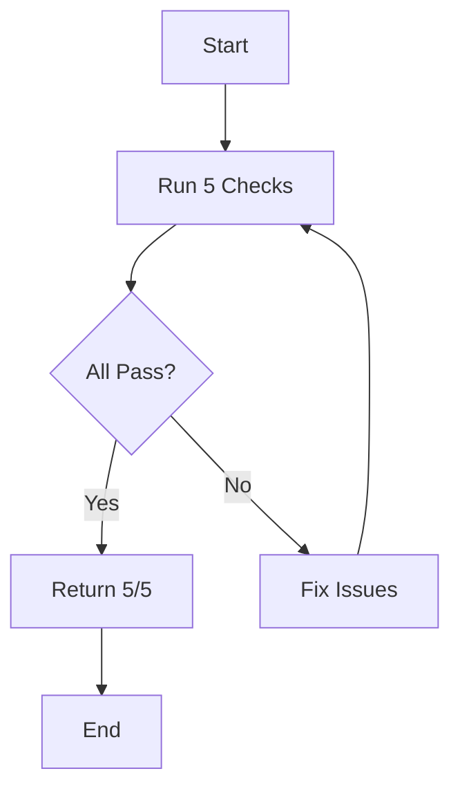
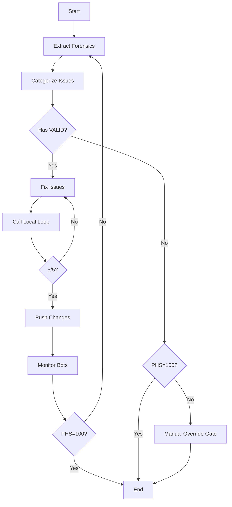
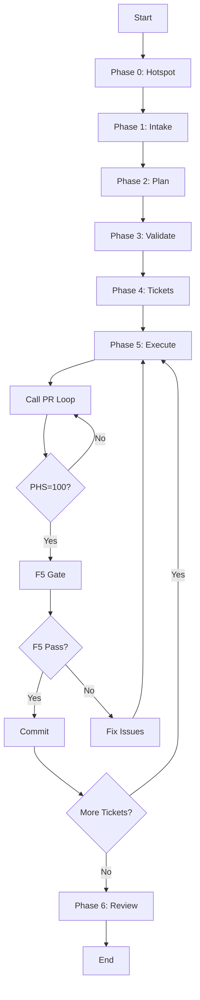
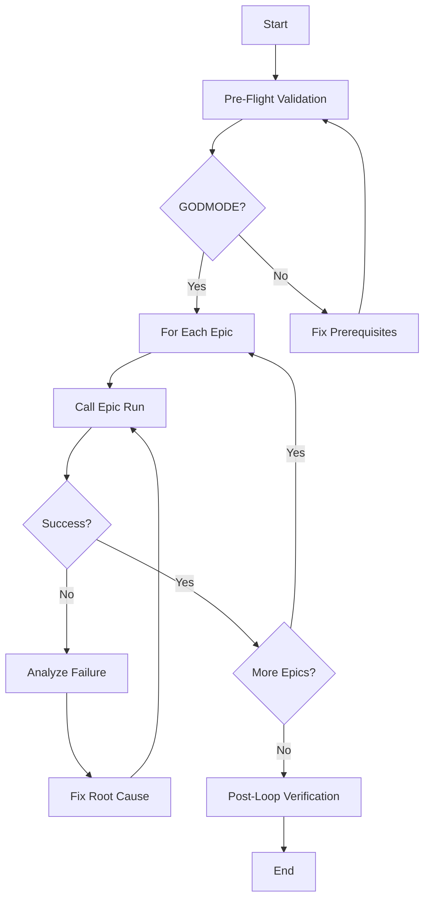

# Autonomous Refactoring - Architecture

## System Overview

The Autonomous Refactoring Building Block implements a **nested loop architecture** where each loop is a composable unit with measurable goals. This design enables fully autonomous operation with minimal human intervention while maintaining high reliability through continuous verification.

## Architectural Principles

### 1. Composable Loops

Each loop is a **building block** that:
- Has a single, measurable goal
- Produces verifiable outcomes
- Can nest within other loops
- Maintains state independently
- Supports parallel execution

### 2. Measurable Goals

Every loop has quantifiable success criteria:

```
/local-loop  → Goal: 5/5 checks passing
/pr-loop     → Goal: 100/100 PHS
/epic-run    → Goal: CYC ≤8
/epic-loop   → Goal: All methods ≤8
```

### 3. Self-Correction

Loops automatically retry on failure:
- Extract failure forensics
- Categorize issues (VALID/HALLUCINATION/NOISE)
- Apply fixes
- Re-verify
- Repeat until goal achieved

### 4. Human-in-the-Loop Gates

Critical verification points require human confirmation:
- **F5 Gate**: NinjaTrader runtime verification
- **Manual Override**: PHS <100 approval
- **Epic Approval**: Architecture plan review

## Component Architecture

```
┌─────────────────────────────────────────────────────────────┐
│                    Orchestrator Layer                        │
│  ┌────────────┐  ┌────────────┐  ┌────────────┐            │
│  │ epic-loop  │  │  pr-loop   │  │local-loop  │            │
│  │ (Outer)    │  │  (Inner)   │  │(Innermost) │            │
│  └────────────┘  └────────────┘  └────────────┘            │
└─────────────────────────────────────────────────────────────┘
                            │
┌─────────────────────────────────────────────────────────────┐
│                    Execution Layer                           │
│  ┌────────────┐  ┌────────────┐  ┌────────────┐            │
│  │ Bob CLI    │  │  Codex     │  │ Arena AI   │            │
│  │(Engineer)  │  │(Hardening) │  │  (Audit)   │            │
│  └────────────┘  └────────────┘  └────────────┘            │
└─────────────────────────────────────────────────────────────┘
                            │
┌─────────────────────────────────────────────────────────────┐
│                    Knowledge Layer                           │
│  ┌────────────┐  ┌────────────┐  ┌────────────┐            │
│  │Jane Street │  │ jCodemunch │  │  Graphify  │            │
│  │    KB      │  │    MCP     │  │    MCP     │            │
│  └────────────┘  └────────────┘  └────────────┘            │
└─────────────────────────────────────────────────────────────┘
                            │
┌─────────────────────────────────────────────────────────────┐
│                    Verification Layer                        │
│  ┌────────────┐  ┌────────────┐  ┌────────────┐            │
│  │Pre-Push    │  │  Codacy    │  │CodeRabbit  │            │
│  │Validation  │  │   API      │  │    AI      │            │
│  └────────────┘  └────────────┘  └────────────┘            │
└─────────────────────────────────────────────────────────────┘
```

## Loop Composition

### Local Loop (Innermost)

**Purpose**: Verify single file changes  
**Duration**: 2-5 minutes  
**Nesting**: Called by PR Loop



**Checks**:
1. ASCII-only (no Unicode)
2. Build (zero errors)
3. Tests (100% pass)
4. Lint (zero violations)
5. Format (CSharpier)

### PR Loop (Inner)

**Purpose**: Achieve 100/100 PHS  
**Duration**: 15-45 minutes  
**Nesting**: Called by Epic Run, calls Local Loop



**Phases**:
1. Bot Forensics (extract findings)
2. Issue Categorization (VALID/HALLUCINATION/NOISE)
3. Local Repair (fix VALID issues)
4. Global Push (deploy + monitor)
5. Manual Override (if <100 after 3 iterations)

### Epic Run (Middle)

**Purpose**: Reduce method CYC to ≤8  
**Duration**: 15-25 minutes  
**Nesting**: Called by Epic Loop, calls PR Loop



**Phases**:
0. Hotspot Analysis (CodeScene)
1. Intake (scope definition)
2. Plan (extraction strategy)
3. Validate (triple-agent audit)
4. Tickets (task breakdown)
5. Execute (surgical refactoring)
6. Review (final verification)

### Epic Loop (Outer)

**Purpose**: Process all 165 epics  
**Duration**: 6-12 weeks  
**Nesting**: Top-level, calls Epic Run



**Execution Modes**:
- **Sequential**: One epic at a time (safe, slow)
- **Parallel**: 3 clusters (fast, requires coordination)

## Parallel Execution Architecture

### Three-Cluster Model

```
┌─────────────────────────────────────────────────────────────┐
│                    Main Repository                           │
│                  gitbutler/workspace                         │
└─────────────────────────────────────────────────────────────┘
                            │
        ┌───────────────────┼───────────────────┐
        │                   │                   │
┌───────▼────────┐  ┌───────▼────────┐  ┌───────▼────────┐
│  Cluster 1     │  │  Cluster 2     │  │  Cluster 3     │
│  (SIMA)        │  │  (Orders)      │  │  (Lifecycle)   │
│                │  │                │  │                │
│ epic-cluster-1 │  │ epic-cluster-2 │  │ epic-cluster-3 │
│ branch         │  │ branch         │  │ branch         │
└────────────────┘  └────────────────┘  └────────────────┘
        │                   │                   │
        └───────────────────┼───────────────────┘
                            │
                    ┌───────▼────────┐
                    │ Batch F5 Gate  │
                    │ (15 minutes)   │
                    └────────────────┘
```

**Isolation Strategy**:
- Each cluster works on different files
- No merge conflicts (file-level isolation)
- Batch verification (test all 3 together)
- Sequential merge (one at a time)

**Time Savings**:
- Sequential: 415 hours
- Parallel: 148 hours
- Savings: 267 hours (64%)

## State Management

### Manifest-Based Architecture

Each epic maintains state in `manifest.json`:

```json
{
  "epic_id": "EPIC-CCN-17",
  "status": "in_progress",
  "phases": {
    "0": {"status": "completed", "output": "00-hotspots.md"},
    "1": {"status": "completed", "output": "00-scope.md"},
    "2": {"status": "in_progress", "output": "02-architecture-plan.md"}
  },
  "tickets": [
    {"id": 1, "status": "completed", "cyc_delta": "37→17"},
    {"id": 2, "status": "in_progress", "cyc_delta": "17→10"}
  ]
}
```

**Benefits**:
- No context window exhaustion (each phase is fresh session)
- Resume from any phase (automatic checkpointing)
- Parallel execution (independent state)
- Audit trail (complete history)

## Knowledge Integration

### Jane Street KB

**Purpose**: Provide correctness patterns for architectural decisions

**Integration Points**:
1. Pre-epic planning (Phase 2)
2. Pre-ticket execution (Phase 5)
3. Post-fix validation (PR loop)

**Query Examples**:
```bash
python scripts/query_kb.py "lock-free queue"
python scripts/query_kb.py "error handling"
python scripts/query_kb.py "state machine"
```

**Distilled Rules**:
- Correctness by Construction
- Lock-Free Concurrency
- Cognitive Simplicity (CYC ≤8)
- Immutable Data
- Explicit Error Handling

### jCodemunch MCP

**Purpose**: Code intelligence and navigation

**Capabilities**:
- Symbol search (71x fewer tokens than grep)
- Dependency graph (import relationships)
- Blast radius (impact analysis)
- Dead code detection
- Complexity metrics

**Usage**:
```javascript
// Find all methods with CYC >15
search_symbols({
  repo: "universal-or-strategy",
  query: "function",
  complexity: {op: ">", value: 15}
})
```

### Graphify MCP

**Purpose**: Repository knowledge graph

**Capabilities**:
- God node detection (high-coupling files)
- Community structure (logical modules)
- Relationship mapping (file dependencies)
- Architecture visualization

**Usage**:
```bash
graphify update .
graphify query "god nodes"
```

## Quality Gates

### Pre-Push Validation (13 Checks)

| # | Check | Tool | Threshold | Blocking? |
|---|-------|------|-----------|-----------|
| 1 | ASCII-Only | PowerShell | Zero non-ASCII | ✅ YES |
| 2 | Build | dotnet build | Zero errors | ✅ YES |
| 3 | Unit Tests | dotnet test | 100% pass | ✅ YES |
| 4 | Lint | Roslyn | Zero violations | ✅ YES |
| 5 | Formatting | CSharpier | Zero issues | ✅ YES |
| 6 | Security | Gitleaks + Snyk | Zero secrets | ⚠️ WARNING |
| 7 | Markdown Links | verify_links.ps1 | Zero broken | ⚠️ WARNING |
| 8 | PR Hygiene | verify_pr_hygiene.ps1 | Diff <10k | ✅ YES |
| 9 | Complexity | complexity_audit.py | CYC ≤ 15 | ✅ YES |
| 10 | Dead Code | dead_code_scan.py | Zero dead methods | ⚠️ WARNING |
| 11 | Codacy Preview | query_codacy_issues.ps1 | Zero errors | ⚠️ WARNING |
| 12 | Semgrep | semgrep CLI | Zero findings | ⚠️ WARNING |
| 13 | CodeRabbit AI | coderabbit CLI | Zero critical/high | ⚠️ WARNING |

**Enforcement**:
- Blocking checks MUST pass before push
- Warning checks logged but don't block
- All checks run in parallel (<2 minutes total)

### F5 Gate (Runtime Verification)

**Purpose**: Verify changes work in production environment

**Protocol**:
1. Agent completes all automated checks
2. Agent runs `deploy-sync.ps1` (sync hard links)
3. Agent prompts: "Press F5 in NinjaTrader"
4. Human presses F5, observes BUILD_TAG banner
5. Human types: "F5 done [BUILD_TAG]"
6. Agent commits with BUILD_TAG in message

**Why Manual?**:
- NinjaTrader is proprietary (no API)
- Runtime behavior can't be unit tested
- Visual confirmation required (UI rendering)

## Failure Recovery

### Checkpoint System

**Automatic Checkpointing**:
- After each epic phase (6 checkpoints per epic)
- After each ticket (1-4 checkpoints per epic)
- After each PR loop iteration (N checkpoints per ticket)

**Restore Protocol**:
```bash
# Check last checkpoint
cat .bob/notes/pending-notes.txt

# Verify last completed phase
cat docs/brain/EPIC-CCN-X/manifest.json

# Resume from next phase
/epic-run EPIC-CCN-X --resume
```

### Error Categorization

**VALID Issues**: Must fix
- P0: Critical (blocks merge)
- P1: High (fix before merge)
- P2: Medium (fix or defer)

**HALLUCINATION**: Bot error
- Log in `docs/brain/bot_hallucinations.md`
- Ignore (don't fix)

**INFRA-NOISE**: Infrastructure issue
- Not code-related
- Ignore (don't fix)

### Escalation Protocol

**Local Loop Failure** (>3 iterations):
- Escalate to PR Loop
- Add to fix queue

**PR Loop Failure** (>5 iterations):
- Manual Override Gate
- Director approval required

**Epic Run Failure**:
- STOP immediately
- Analyze failure
- Fix root cause
- Resume from failed ticket

**Epic Loop Failure**:
- STOP immediately
- No cascade (isolation via worktrees)
- Fix failed epic
- Resume from next epic

## Performance Characteristics

### Latency

| Loop | Duration | Variance | Bottleneck |
|------|----------|----------|------------|
| Local | 2-5 min | Low | Build time |
| PR | 15-45 min | High | Bot response |
| Epic | 15-25 min | Medium | Planning |
| Epic Loop | 6-12 weeks | High | Complexity |

### Throughput

**Sequential**:
- 1 epic/day (2.5h per epic)
- 165 epics = 165 days

**Parallel (3 clusters)**:
- 2 epics/day (6 tickets/day)
- 165 epics = 83 days

**Optimization Strategies**:
- Batch F5 verification (3 tickets together)
- Parallel bot monitoring (async)
- Cached Jane Street KB queries
- Incremental complexity audits

## Security Considerations

### Secrets Management

**Scanning**:
- Gitleaks (pre-commit hook)
- Snyk (pre-push validation)
- GitHub Secret Scanning (PR check)

**Prevention**:
- `.env.example` (no real secrets)
- `.gitignore` (exclude sensitive files)
- Environment variables (runtime injection)

### Access Control

**Bob CLI**:
- Auto-approval enabled (YOLO mode)
- Restricted to `src/` directory
- No network access (air-gapped)

**MCP Servers**:
- jCodemunch: Read-only (no writes)
- Graphify: Read-only (no writes)
- Jane Street KB: Read-only (Firestore)

### Audit Trail

**Git History**:
- Every change committed with BUILD_TAG
- Commit messages include CYC delta
- Branch names include epic ID

**Manifest Logs**:
- Phase completion timestamps
- Ticket execution duration
- Quality gate results

## Scalability

### Horizontal Scaling

**Current**: 3 clusters (SIMA/Orders/Lifecycle)  
**Future**: N clusters (file-based partitioning)

**Constraints**:
- F5 gate (human bottleneck)
- Merge conflicts (coordination overhead)
- NinjaTrader license (1 instance)

**Solutions**:
- Batch F5 verification (test N clusters together)
- File-level isolation (prevent conflicts)
- Automated merge strategy (sequential)

### Vertical Scaling

**Current**: 1 epic per cluster  
**Future**: M epics per cluster (queue-based)

**Constraints**:
- Context window (manifest size)
- Memory (Git worktree overhead)
- Disk space (3x repository size)

**Solutions**:
- Manifest compression (archive old phases)
- Worktree cleanup (delete after merge)
- Incremental clones (shallow history)

## Monitoring & Observability

### Metrics

**Epic Loop**:
- Epics completed / total
- Average CYC reduction
- Time per epic (trend)
- Failure rate (by category)

**PR Loop**:
- PHS score (trend)
- Iterations to 100/100
- VALID vs HALLUCINATION ratio
- Bot response time

**Local Loop**:
- Check pass rate (per check)
- Build time (trend)
- Test execution time
- Lint violation count

### Dashboards

**Real-Time**:
- Current epic status
- Active clusters
- F5 gate queue
- Bot monitoring

**Historical**:
- Complexity trend (CYC over time)
- Quality trend (PHS over time)
- Velocity (epics per week)
- Time savings (vs sequential)

## Future Enhancements

### Planned Features

1. **Local Loop Implementation** (5/5 goal)
2. **Watsonx Orchestrate Integration** (skill-based)
3. **CodeScene Hotspot Prioritization** (data-driven)
4. **Automated Merge Strategy** (conflict resolution)
5. **Test Generation** (TDD automation)

### Research Areas

1. **LLM-Based Conflict Resolution** (merge automation)
2. **Predictive Complexity Analysis** (hotspot forecasting)
3. **Multi-Agent Coordination** (Bob + Codex + Arena)
4. **Knowledge Graph Evolution** (Jane Street KB updates)
5. **Self-Improving Loops** (meta-learning)

## References

- **Workflow Guide**: `docs/workflow/PARALLEL_EPIC_EXECUTION.md`
- **Skill Reference**: `plugins/parallel-epic-execution/SKILL.md`
- **Complexity Protocol**: `docs/protocol/COMPLEXITY_REDUCTION_PROTOCOL.md`
- **Jane Street KB**: `docs/intel/jane-street/`
- **Epic Roadmap**: `epic_roadmap.json`