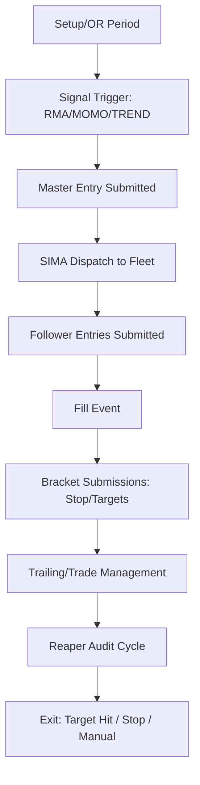

# System Architecture: Universal OR Strategy V12

The **Universal OR Strategy V12** is a sophisticated multi-account competitive execution engine designed for NinjaTrader 8. It leverages a leader-follower model to manage trades across a "Fleet" of accounts simultaneously.

## 🏗️ Core Components

### 1. The Strategy Engine (`UniversalORStrategyV12_002_Dev.cs`)
The central nervous system. It handles the NinjaTrader lifecycle, parameter synchronization, and state management.

### 2. SIMA Execution Engine (`SIMA.cs`)
The **Single-Instance Multi-Account** engine. It is responsible for:
- **Fleet Discovery**: Identifying all accounts matching the user-defined prefix.
- **Smart Dispatch**: Routing trade signals from the "Leader" (Master) account to the "Follower" accounts.
- **Symmetry Guard**: Ensuring that follower entries and exits mirror the master with high-precision timing.

### 3. Reaper Audit System (`REAPER.cs`)
The "Safety Marshall" of the strategy. It continuously scans all fleet accounts in a background thread to:
- Detect position desyncs (e.g., if a follower misses a fill).
- Auto-flatten desynced accounts if enabled.
- Ensure compliance with consistency rules.

### 4. Logic Audit Layer (`LogicAudit.cs`)
A forensic layer that records every decision point, order trigger, and parameter change. This is the primary data source for post-session analysis.

## 🔄 Trade Lifecycle

## 🛡️ Reliability Features
- **TCP IPC**: Low-latency communication for external panel control.
- **Tick-Aware Scaling**: ATR-based auto-sizing that respects broker limits and compliance caps.
- **Zero-Trust Hardening**: Guarded math (division-by-zero prevention) and high-resolution timestamping.
