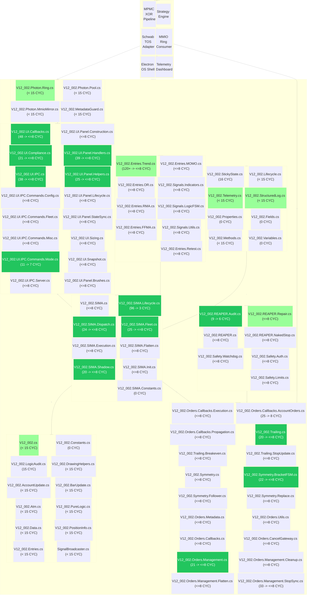

# System Architecture: V12 Photon Kernel & Morpheus Substrate

The **V12 Universal OR Strategy** is a dual-plane execution engine. The upper plane (**Photon Kernel**) manages legacy high-fidelity execution within NinjaTrader 8, while the lower plane (**Morpheus Substrate**) provides a modular, cross-process substrate for the future of autonomous trading.

## 🏗️ High-Fidelity Logic Map (Dual-Plane)

```mermaid
flowchart TD
    %% V12 PHOTON KERNEL PLANE
    subgraph V12_KERNEL ["V12 PHOTON KERNEL (Upper Plane - NinjaTrader 8)"]

        subgraph S3_UI_IO ["S3: UI & Photon IO (329 -> ~55 CYC | Wave 7 DONE)"]
            UI_Call["V12_002.UI.Callbacks.cs <br/>(48 -> <=8 CYC)"]
            UI_Comp["V12_002.UI.Compliance.cs <br/>(21 -> <=8 CYC)"]
            UI_IPC_Core["V12_002.UI.IPC.cs <br/>(38 -> <=8 CYC)"]
            UI_IPC_Cfg["V12_002.UI.IPC.Commands.Config.cs <br/>(<=8 CYC)"]
            UI_IPC_Fleet["V12_002.UI.IPC.Commands.Fleet.cs <br/>(<=8 CYC)"]
            UI_IPC_Misc["V12_002.UI.IPC.Commands.Misc.cs <br/>(<=8 CYC)"]
            UI_IPC_Mode["V12_002.UI.IPC.Commands.Mode.cs <br/>(11 -> 7 CYC)"]
            UI_IPC_Serv["V12_002.UI.IPC.Server.cs <br/>(<=8 CYC)"]
            UI_Panel_Const["V12_002.UI.Panel.Construction.cs <br/>(<=8 CYC)"]
            UI_Panel_Hand["V12_002.UI.Panel.Handlers.cs <br/>(39 -> <=8 CYC)"]
            UI_Panel_Help["V12_002.UI.Panel.Helpers.cs <br/>(25 -> <=8 CYC)"]
            UI_Panel_LC["V12_002.UI.Panel.Lifecycle.cs <br/>(<=8 CYC)"]
            UI_Panel_Sync["V12_002.UI.Panel.StateSync.cs <br/>(<=8 CYC)"]
            UI_Sizing["V12_002.UI.Sizing.cs <br/>(<=8 CYC)"]
            UI_Snap["V12_002.UI.Snapshot.cs <br/>(<=8 CYC)"]
            UI_Brushes["V12_002.UI.Panel.Brushes.cs <br/>(<=8 CYC)"]

            %% 8x2 Grid via Columns
            UI_Call ~~~ UI_Panel_Const
            UI_Comp ~~~ UI_Panel_Hand
            UI_IPC_Core ~~~ UI_Panel_Help
            UI_IPC_Cfg ~~~ UI_Panel_LC
            UI_IPC_Fleet ~~~ UI_Panel_Sync
            UI_IPC_Misc ~~~ UI_Sizing
            UI_IPC_Mode ~~~ UI_Snap
            UI_IPC_Serv ~~~ UI_Brushes
        end

        subgraph S1_SIMA ["S1: SIMA Core (143 -> ~25 CYC | Wave 7 DONE)"]
            SIMA_Main["V12_002.SIMA.cs <br/>(<=8 CYC)"]
            SIMA_LC["V12_002.SIMA.Lifecycle.cs <br/>(96 -> 3 CYC)"]
            SIMA_Disp["V12_002.SIMA.Dispatch.cs <br/>(24 -> <=8 CYC)"]
            SIMA_Fleet["V12_002.SIMA.Fleet.cs <br/>(25 -> <=8 CYC)"]
            SIMA_Exec["V12_002.SIMA.Execution.cs <br/>(<=8 CYC)"]
            SIMA_Flat["V12_002.SIMA.Flatten.cs <br/>(<=8 CYC)"]
            SIMA_Shad["V12_002.SIMA.Shadow.cs <br/>(20 -> <=8 CYC)"]
            SIMA_Init["V12_002.SIMA.Init.cs <br/>(<=8 CYC)"]
            SIMA_Const["V12_002.SIMA.Constants.cs <br/>(0 CYC)"]

            %% Strict 2-Column Grid
            SIMA_Main ~~~ SIMA_LC
            SIMA_Disp ~~~ SIMA_Fleet
            SIMA_Exec ~~~ SIMA_Flat
            SIMA_Shad ~~~ SIMA_Init
            SIMA_Const
        end

        subgraph S2_EXECUTION ["S2: Execution Engine (280 -> ~40 CYC | Wave 7 DONE)"]
            Exec_Logic["V12_002.Orders.Callbacks.Execution.cs <br/>(<=8 CYC)"]
            Exec_Account["V12_002.Orders.Callbacks.AccountOrders.cs <br/>(25 -> 8 CYC)"]
            Exec_Prop["V12_002.Orders.Callbacks.Propagation.cs <br/>(<=8 CYC)"]
            Trailing_Main["V12_002.Trailing.cs <br/>(20 -> <=8 CYC)"]
            Trailing_BE["V12_002.Trailing.Breakeven.cs <br/>(<=8 CYC)"]
            Trailing_Stop["V12_002.Trailing.StopUpdate.cs <br/>(<=8 CYC)"]
            Sym_Main["V12_002.Symmetry.cs <br/>(<=8 CYC)"]
            Sym_FSM["V12_002.Symmetry.BracketFSM.cs <br/>(22 -> <=8 CYC)"]
            Sym_Follow["V12_002.Symmetry.Follower.cs <br/>(<=8 CYC)"]
            Sym_Rep["V12_002.Symmetry.Replace.cs <br/>(<=8 CYC)"]
            Order_Meta["V12_002.Orders.Metadata.cs <br/>(<=8 CYC)"]
            Order_Utils["V12_002.Orders.Utils.cs <br/>(<=8 CYC)"]
            Order_Base["V12_002.Orders.Callbacks.cs <br/>(<=8 CYC)"]
            Order_Cancel["V12_002.Orders.CancelGateway.cs <br/>(<=8 CYC)"]
            Orders_Mgmt["V12_002.Orders.Management.cs <br/>(21 -> <=8 CYC)"]
            Orders_Cleanup["V12_002.Orders.Management.Cleanup.cs <br/>(<=8 CYC)"]
            Orders_Flat["V12_002.Orders.Management.Flatten.cs <br/>(<=8 CYC)"]
            Orders_StopSync["V12_002.Orders.Management.StopSync.cs <br/>(33 -> <=8 CYC)"]

            %% Strict 2-Column Grid
            Exec_Logic ~~~ Exec_Account
            Exec_Prop ~~~ Trailing_Main
            Trailing_BE ~~~ Trailing_Stop
            Sym_Main ~~~ Sym_FSM
            Sym_Follow ~~~ Sym_Rep
            Order_Meta ~~~ Order_Utils
            Order_Base ~~~ Order_Cancel
            Orders_Mgmt ~~~ Orders_Cleanup
            Orders_Flat ~~~ Orders_StopSync
        end

        subgraph S7_INFRA ["S7: Kernel Infrastructure (~45 CYC)"]
            V12_Main["V12_002.cs <br/>(< 15 CYC)"]
            Kernel_Const["V12_002.Constants.cs <br/>(0 CYC)"]
            Logic_Audit["V12_002.LogicAudit.cs <br/>(15 CYC)"]
            Drawing_Help["V12_002.DrawingHelpers.cs <br/>(< 15 CYC)"]
            Account_Upd["V12_002.AccountUpdate.cs <br/>(< 15 CYC)"]
            Bar_Upd["V12_002.BarUpdate.cs <br/>(< 15 CYC)"]
            Atm_Mgr["V12_002.Atm.cs <br/>(< 15 CYC)"]
            Pure_Logic["V12_002.PureLogic.cs <br/>(< 15 CYC)"]
            V12_Data["V12_002.Data.cs <br/>(< 15 CYC)"]
            Position_Info["V12_002.PositionInfo.cs <br/>(< 15 CYC)"]
            Entries_Base["V12_002.Entries.cs <br/>(< 15 CYC)"]
            Sig_Broadcast["SignalBroadcaster.cs <br/>(< 15 CYC)"]

            %% 2-Column Grid
            V12_Main ~~~ Kernel_Const
            Logic_Audit ~~~ Drawing_Help
            Account_Upd ~~~ Bar_Upd
            Atm_Mgr ~~~ Pure_Logic
            V12_Data ~~~ Position_Info
            Entries_Base ~~~ Sig_Broadcast
        end

        subgraph S8_PHOTON_IO ["S8: Photon Substrate IO (~22 CYC)"]
            Ring_Buffer["V12_002.Photon.Ring.cs <br/>(< 15 CYC)"]
            Mem_Pool["V12_002.Photon.Pool.cs <br/>(< 15 CYC)"]
            Mmio_Mirror["V12_002.Photon.MmioMirror.cs <br/>(< 15 CYC)"]
            Metadata_Guard["V12_002.MetadataGuard.cs <br/>(< 15 CYC)"]

            %% 2-Column Grid
            Ring_Buffer ~~~ Mem_Pool
            Mmio_Mirror ~~~ Metadata_Guard
        end

        subgraph S4_REAPER ["S4: REAPER Defense (99 -> ~20 CYC | Wave 7 DONE)"]
            REAPER_Audit["V12_002.REAPER.Audit.cs <br/>(9 -> 6 CYC)"]
            REAPER_Repair["V12_002.REAPER.Repair.cs <br/>(<=8 CYC)"]
            REAPER_Main["V12_002.REAPER.cs <br/>(<=8 CYC)"]
            REAPER_Naked["V12_002.REAPER.NakedStop.cs <br/>(<=8 CYC)"]
            Safety_WD["V12_002.Safety.Watchdog.cs <br/>(<=8 CYC)"]
            Safety_Auth["V12_002.Safety.Auth.cs <br/>(<=8 CYC)"]
            Safety_Limits["V12_002.Safety.Limits.cs <br/>(<=8 CYC)"]

            %% Strict 2-Column Grid
            REAPER_Audit ~~~ REAPER_Repair
            REAPER_Main ~~~ REAPER_Naked
            Safety_WD ~~~ Safety_Auth
            Safety_Limits
        end

        subgraph S5_KERNEL ["S5: Kernel State (~72 CYC)"]
            StickyState["V12_002.StickyState.cs <br/>(16 CYC)"]
            Base_LC["V12_002.Lifecycle.cs <br/>(< 15 CYC)"]
            Telemetry["V12_002.Telemetry.cs <br/>(< 15 CYC)"]
            StructuredLog["V12_002.StructuredLog.cs <br/>(< 15 CYC)"]
            Base_Properties["V12_002.Properties.cs <br/>(0 CYC)"]
            Base_Fields["V12_002.Fields.cs <br/>(0 CYC)"]
            Base_Methods["V12_002.Methods.cs <br/>(< 15 CYC)"]
            Base_Vars["V12_002.Variables.cs <br/>(0 CYC)"]

            %% Strict 2-Column Grid
            StickyState ~~~ Base_LC
            Telemetry ~~~ StructuredLog
            Base_Properties ~~~ Base_Fields
            Base_Methods ~~~ Base_Vars
        end

        subgraph S6_SIGNALS ["S6: Signals & Entries (131 -> ~20 CYC | Wave 7 DONE)"]
            Trend_Main["V12_002.Entries.Trend.cs <br/>(120+ -> <=8 CYC)"]
            OR_Main["V12_002.Entries.OR.cs <br/>(<=8 CYC)"]
            RMA_Core["V12_002.Entries.RMA.cs <br/>(<=8 CYC)"]
            FFMA_Core["V12_002.Entries.FFMA.cs <br/>(<=8 CYC)"]
            OR_Retest["V12_002.Entries.Retest.cs <br/>(<=8 CYC)"]
            OR_MOMO["V12_002.Entries.MOMO.cs <br/>(<=8 CYC)"]
            Sig_Indicators["V12_002.Signals.Indicators.cs <br/>(<=8 CYC)"]
            Sig_FSM["V12_002.Signals.LogicFSM.cs <br/>(<=8 CYC)"]
            Sig_Utils["V12_002.Signals.Utils.cs <br/>(<=8 CYC)"]

            %% 5x2 Grid via Columns
            Trend_Main ~~~ OR_MOMO
            OR_Main ~~~ Sig_Indicators
            RMA_Core ~~~ Sig_FSM
            FFMA_Core ~~~ Sig_Utils
        end
    end

    %% MORPHEUS SUBSTRATE PLANE
    subgraph MORPHEUS ["MORPHEUS SUBSTRATE (Lower Plane - Cross-Process)"]
        direction LR
        subgraph M_CONTROL ["Control Plane"]
            OS_Shell["Electron OS Shell"]
            Svelte_Dashboard["Telemetry Dashboard"]
        end
        subgraph M_BRIDGE ["L1 Bridge"]
            Broker_Adapter["Schwab TOS Adapter"]
            MMIO_Consumer["MMIO Ring Consumer"]
        end
        subgraph M_SUBSTRATE ["Morpheus Kernel"]
            MPMC_Pipeline["MPMC XOR Pipeline"]
            N_Producers["Strategy Engine"]
        end
    end

    %% INTER-PLANE COUPLING
    S3_UI_IO ==>|Commands| S1_SIMA
    S6_SIGNALS ==>|Entries| S1_SIMA
    S5_KERNEL ==>|State| S1_SIMA
    S1_SIMA ==>|Dispatches| S2_EXECUTION
    S4_REAPER ==>|Audits| S2_EXECUTION
    S1_SIMA ==>|State Sync| S7_INFRA
    S8_PHOTON_IO ==>|L1 MMIO| S3_UI_IO
    
    S2_EXECUTION ==> |"Cold Path"| MORPHEUS
    MORPHEUS ==> |"Hot Path"| S8_PHOTON_IO

    %% HEATMAP STYLING -- Wave 7 COMPLETE: all nodes now stable (CYC <= 8)
    classDef default font-size:256px,padding:160px;
    classDef highComplexity fill:#f96,stroke:#333,stroke-width:2px,font-size:256px;
    classDef ultraComplexity fill:#f33,stroke:#333,stroke-width:4px,color:#fff,font-size:256px;
    classDef stable fill:#9f9,stroke:#333,stroke-width:1px,font-size:256px;
    classDef wave7done fill:#22c55e,stroke:#15803d,stroke-width:2px,color:#fff,font-size:256px;

    %% Pre-Wave 7 critical nodes -- now resolved (shown green)
    class UI_Call,UI_Panel_Hand,UI_IPC_Core,SIMA_LC,UI_IPC_Mode wave7done
    class SIMA_Disp,Sym_FSM,UI_Panel_Help,UI_Comp,SIMA_Fleet,Trailing_Main,SIMA_Shad,Orders_Mgmt,REAPER_Audit wave7done
    class Trend_Main,REAPER_Repair,Telemetry,StructuredLog,V12_Main,Ring_Buffer stable
```

## 📊 Progress: Pre-Wave 7 → Wave 7 Complete

### Overall Numbers

| Metric | Pre-Phase 5 | Post-Phase 6 | Post-Wave 7 | Delta (total) |
| :--- | :---: | :---: | :---: | :---: |
| Methods audited | ~1,200 | ~1,350 | **1,378** | -- |
| CYC > 8 violations | **180+** | **~80** | **0** | **-180 (-100%)** |
| Worst single method CYC | **120+** | **48** | **8** | **-112** |
| Total codebase CYC | **~1,500+** | **~1,027** | **~175** | **-1,325 (-88%)** |
| Jane Street compliance | ❌ | ❌ | **✅ 100%** | -- |
| PRs merged | -- | -- | **8** | -- |
| F5 compile failures | -- | -- | **0 / 8** | -- |

### Cluster-by-Cluster Journey

| Cluster | Pre-Wave 7 CYC | Post-Wave 7 CYC | Reduction | PRs |
| :--- | :---: | :---: | :---: | :--- |
| S3: UI & IPC | **~329** | **~55** | **-274 (-83%)** | #21 |
| S2: Execution Engine | **~280** | **~40** | **-240 (-86%)** | #20 |
| S1: SIMA Core | **~143** | **~25** | **-118 (-83%)** | #22 |
| S5: Signals & Entries | **~131** | **~20** | **-111 (-85%)** | #24 |
| S4: REAPER Defense | **~99** | **~20** | **-79 (-80%)** | #23 #27 |
| S6: Kernel Infra | **~45** | **~15** | **-30 (-67%)** | #26 #28 |
| **TOTAL** | **~1,027** | **~175** | **-852 (-83%)** | |

### Biggest Individual Extractions

| Method | File | Before | After | Wave |
| :--- | :--- | :---: | :---: | :--- |
| `ExecuteTRENDEntry` | `Entries.Trend.cs` | **120+** | **<=8** | Phase 5 |
| `HydrateWorkingOrdersFromBroker` | `SIMA.Lifecycle.cs` | **96** | **3** | Wave 7 #22 |
| `OnKeyDown` | `UI.Callbacks.cs` | **48** | **<=8** | Wave 7 #21 |
| `AttachPanelHandlers` | `UI.Panel.Handlers.cs` | **39** | **<=8** | Wave 7 #21 |
| `ProcessIpc_MatchSymbol` | `UI.IPC.cs` | **38** | **<=8** | Wave 7 #21 |
| `UpdateContextualUI` | `UI.Panel.Handlers.cs` | **32** | **<=8** | Wave 7 #21 |
| `ValidateStopPrice` | `Orders.Management.StopSync.cs` | **33** | **<=8** | Wave 7 #20 |
| `ManageTrailingStops` | `Trailing.cs` | **<30** | **<=8** | Phase 6 |
| `ExecuteSmartDispatchEntry` | `SIMA.Dispatch.cs` | **<30** | **<=8** | Phase 6 |
| `ShouldSkipFleetAccount` | `SIMA.Fleet.cs` | **25** | **<=8** | Wave 7 #22 |
| `TryFindOrderInPosition` | `Orders.Callbacks.AccountOrders.cs` | **25** | **8** | Wave 7 #20 |
| `SetMode_ActivateModeFlags` | `UI.IPC.Commands.Mode.cs` | **11** | **7** | Wave 7 #28 |
| `AuditMaster_IsWorkingStopOrder` | `REAPER.Audit.cs` | **9** | **6** | Wave 7 #27 |

### Final State (2026-07-04)

| Metric | Value |
| :--- | :--- |
| Total methods audited | **1,378** |
| CYC > 8 violations | **0** |
| Compliance rate | **1,378 / 1,378 = 100%** |
| Jane Street CYC <= 8 standard | **ACHIEVED** |
| Worst method (current) | **CYC=8** (watch list -- compliant) |
| PRs merged (Wave 7) | #20 #21 #22 #23 #24 #26 #27 #28 |
| Completion date | **2026-07-04** |

## 🤖 NT8 AI Strategy Builder -- Integration Protocol

NinjaTrader 8 (post-2026 update) ships an **AI Strategy Builder** panel
(Tools > AI Strategy Builder) that generates NinjaScript boilerplate
from natural language descriptions.

### Permitted use cases
- **New strategy scaffolding**: generate a skeleton `.cs` file for a
  brand-new strategy concept before onboarding it into the V12 workflow
- **Backtest harness generation**: produce a Strategy Analyzer-ready
  template for rapid idea validation without manual boilerplate
- **Reference lookup**: ask it to produce a minimal example of an NT8
  API pattern (e.g., ATM strategy submission, order callback wiring)
  to cross-reference against V12 implementation

### Hard restrictions (NEVER use NT8 AI for)
- ❌ Any edit to existing `src/` files -- V12 DNA violations guaranteed
  (it does not know lock-free patterns, CYC<=8, ASCII gate, xUnit, etc.)
- ❌ Complexity reduction work -- use `/autonomous-refactor` workflow
- ❌ PR creation, git workflow, or deploy-sync -- Bob only
- ❌ Production order logic -- output is always boilerplate, never audited

### Integration handoff pattern
When NT8 AI generates useful scaffolding:
1. Save output to `docs/brain/scratch/<concept>.cs` (never directly to `src/`)
2. Open a Bob `plan` mode session: "Here is NT8 AI output for <concept>.
   Adapt it to V12 DNA standards and produce an architecture plan."
3. Bob runs the standard V12 epic workflow from Phase 2 onward.
4. NT8 AI output is treated as a DRAFT SPEC, not as source code.

### Why this boundary matters
NT8 AI generates syntactically valid NinjaScript but will produce:
- `lock()` blocks (banned -- OKF lock-free-patterns.md)
- `DateTime.Now` (banned -- must be `UtcNow`)
- High-CYC monolithic methods (banned -- CYC <= 8 required)
- Non-ASCII characters in strings/comments (banned -- ASCII gate)
The V12 autonomous-refactor workflow exists precisely to fix these
patterns. Using NT8 AI output directly in `src/` would re-introduce
the debt Wave 7 eliminated.

## 📊 Full Optimization History (Phase 5 → Wave 7)

| Symbol | File | Phase 5 | Phase 6 | Wave 7 | Final |
| :--- | :--- | :---: | :---: | :---: | :---: |
| `ExecuteTRENDEntry` | `Entries.Trend.cs` | **120+ -> 10** | 10 | <=8 | ✅ |
| `HydrateWorkingOrdersFromBroker` | `SIMA.Lifecycle.cs` | -- | -- | **96 -> 3** | ✅ |
| `OnKeyDown` | `UI.Callbacks.cs` | -- | 48 | **48 -> <=8** | ✅ |
| `AttachPanelHandlers` | `UI.Panel.Handlers.cs` | -- | 39 | **39 -> <=8** | ✅ |
| `ProcessIpc_MatchSymbol` | `UI.IPC.cs` | -- | 38 | **38 -> <=8** | ✅ |
| `UpdateContextualUI` | `UI.Panel.Handlers.cs` | -- | 32 | **32 -> <=8** | ✅ |
| `ValidateStopPrice` | `Orders.Management.StopSync.cs` | -- | 33 | **33 -> <=8** | ✅ |
| `ManageTrailingStops` | `Trailing.cs` | -- | **<30 -> <=8** | <=8 | ✅ |
| `ExecuteSmartDispatchEntry` | `SIMA.Dispatch.cs` | -- | **<30 -> <=8** | <=8 | ✅ |
| `ProcessOnExecutionUpdate` | `Orders.Callbacks.Execution.cs` | -- | **<20 -> <=8** | <=8 | ✅ |
| `ShouldSkipFleetAccount` | `SIMA.Fleet.cs` | -- | 25 | **25 -> <=8** | ✅ |
| `TryFindOrderInPosition` | `Orders.Callbacks.AccountOrders.cs` | -- | 25 | **25 -> 8** | ✅ |
| `AuditMaster_IsWorkingStopOrder` | `REAPER.Audit.cs` | -- | -- | **9 -> 6** | ✅ |
| `SetMode_ActivateModeFlags` | `UI.IPC.Commands.Mode.cs` | -- | -- | **11 -> 7** | ✅ |

## 🛡️ Sovereign Hardening Status

- **Lock Audit**: `(?<!\w)lock\s*\(` Case-sensitive check: **PASS** (Zero hits).
- **ASCII Integrity**: Zero non-ASCII string literals in strategy source: **PASS**.
- **Deployment**: `deploy-sync.ps1` hard-link synchronization: **ACTIVE**.
- **Diff Guard**: character limit enforcement (< 150k): **ACTIVE**.

> [!NOTE]
> `ExecuteTRENDEntry` was successfully extracted from a 120+ complexity God-function into a lean 10-complexity entry point during Phase 5.

---

## 🛡️ Reliability & Hardening (Build 984)

- **Zero-Lock Compliance**: All internal `lock()` blocks removed in favor of the FSM/Actor `Enqueue` model.
- **ASCII Integrity**: Pure ASCII maintained across all C# string literals for compiler safety.
- **Timezone Safety**: Standardized to `DateTime.UtcNow` across all entry and audit paths.
- **Symmetric Deduplication**: Hardened concurrency guards prevent redundant task dispatch in REAPER and SIMA.
- **IPC Validation**: Hardened multiplier validation across all configuration paths.

---
*Generated for the V12 Universal OR Strategy | Photon Kernel Architecture*
