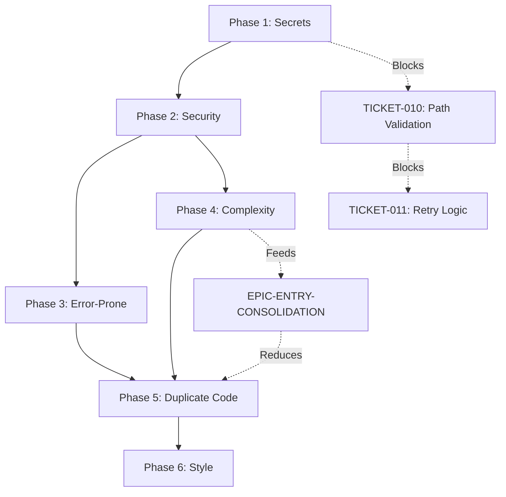

# EPIC-7-QUALITY: Comprehensive Codacy Remediation Roadmap

**Created:** 2026-05-26  
**Status:** PLANNING  
**Scope:** Full Codacy Grade A achievement (Security + Quality)

## Executive Summary

**Current State:**
- **Codacy Grade:** B
- **Total Issues:** 3,100
- **Security Issues:** 27 (Phase 2 in progress)
- **Coverage:** 0% (integration pending)

**Target State:**
- **Codacy Grade:** A
- **Total Issues:** <500 (83% reduction)
- **Security Issues:** 0
- **Coverage:** >80%

**Total Effort:** 180-240 hours (4.5-6 months at 20% sprint capacity)

## Phase Overview

| Phase | Category | Count | Priority | Effort | Status |
|-------|----------|-------|----------|--------|--------|
| **Phase 1** | Secrets Audit | 14 | P0 | 29.5-45h | ✅ 40% Complete |
| **Phase 2** | Security Issues | 27 | P1 | 23-32h | 🔴 Planning |
| **Phase 3** | Error-Prone Patterns | ~1,000 | P2 | 60-80h | 🔴 Not Started |
| **Phase 4** | Complexity Hotspots | 288 | P2 | 40-50h | 🔴 Not Started |
| **Phase 5** | Duplicate Code | ~500 | P3 | 30-40h | 🔴 Not Started |
| **Phase 6** | Style Consistency | ~1,000 | P3 | 20-30h | 🔴 Not Started |
| **TOTAL** | | **~2,829** | | **202.5-277h** | **14% Complete** |

## Phase 1: Secrets Audit (ACTIVE)

**Status:** 40% Complete (2/5 tickets done)  
**Scope:** Hardcoded secrets, API keys, credentials  
**Tickets:** TICKET-001 through TICKET-005

### Completed
- ✅ **TICKET-001** (P0): Remove hardcoded secrets - 14 secrets migrated to env vars
- ✅ **TICKET-005** (P2): Build artifacts cleanup - Removed 47 stale files

### In Progress
- 🔴 **TICKET-002** (P1): Circuit breaker rollback - 8-12 hours
- 🔴 **TICKET-003** (P2): Missing test coverage - 15-20 hours
- 🔴 **TICKET-004** (P3): StyleCop violations - 4-6 hours

**Remaining Effort:** 27-38 hours

## Phase 2: Security Issues (PLANNING)

**Status:** Planning Complete, Ready for Implementation  
**Scope:** Empty catch blocks, file I/O security, path validation  
**Tickets:** TICKET-006 through TICKET-012

### Security Breakdown
1. **Empty Catch Blocks** (18 production instances)
   - TICKET-006: IPC server cleanup (6-8h) - P1
   - TICKET-007: State persistence (3-4h) - P1
   - TICKET-008: UI callbacks (2-3h) - P2
   - TICKET-009: Resource cleanup docs (2-3h) - P2

2. **File I/O Security** (13 instances)
   - TICKET-010: Path validation (6-8h) - P1
   - TICKET-011: Retry logic (4-6h) - P2

3. **Unsafe Code Documentation** (9 instances)
   - TICKET-012: Benchmark safety docs (1-2h) - P3

**Total Effort:** 24-34 hours  
**Priority:** P1 tickets first (15-20h), then P2 (8-12h), then P3 (1-2h)

### CSV Validation Results
✅ All 27 Codacy security findings accounted for  
✅ 18 production issues covered by tickets  
✅ 9 benchmark/sandbox issues documented as acceptable  
✅ No critical gaps identified

## Phase 3: Error-Prone Patterns (FUTURE)

**Status:** Not Started  
**Scope:** ~1,000 Codacy "Error Prone" findings  
**Priority:** P2 (after security)

### Estimated Categories
Based on typical Codacy error-prone patterns for C#:

1. **Null Reference Risks** (~300 instances)
   - Missing null checks before dereference
   - Nullable reference type violations
   - Effort: 20-25 hours

2. **Exception Handling** (~200 instances)
   - Catching generic `Exception` instead of specific types
   - Rethrowing exceptions incorrectly
   - Effort: 10-15 hours

3. **Resource Management** (~150 instances)
   - Missing `using` statements for IDisposable
   - Unclosed streams/connections
   - Effort: 10-12 hours

4. **Concurrency Issues** (~100 instances)
   - Race conditions in shared state
   - Missing volatile/Interlocked operations
   - Effort: 15-20 hours

5. **Logic Errors** (~250 instances)
   - Dead code (unreachable branches)
   - Redundant conditions
   - Off-by-one errors
   - Effort: 5-8 hours

**Total Effort:** 60-80 hours  
**Approach:** Triage by severity, fix P1/P2 first, defer P3 to Boy Scout Rule

### Execution Strategy
1. **Week 1-2:** Export full Codacy error-prone report
2. **Week 3:** Triage into P1/P2/P3 buckets
3. **Week 4-8:** Fix P1 issues (null refs, concurrency)
4. **Week 9-12:** Fix P2 issues (exceptions, resources)
5. **Ongoing:** P3 issues via Boy Scout Rule

## Phase 4: Complexity Hotspots (FUTURE)

**Status:** Not Started  
**Scope:** 288 files exceeding cyclomatic complexity threshold 15  
**Priority:** P2 (parallel with Phase 3)

### Current Baseline
- **Files >15 complexity:** 288 (32% of codebase)
- **Threshold:** 15 (Jane Street alignment)
- **Top Offenders:**
  - `V12_002.DrawingHelpers.cs` - Complexity 40+
  - `V12_002.Atm.cs` - Complexity 35+
  - Entry files (FFMA, MOMO, OR, RMA, Retest, Trend) - Complexity 20-30

### Remediation Approach

#### Tier 1: God Functions (Complexity 30+) - 15 files
**Effort:** 20-25 hours  
**Strategy:** Extract to smaller functions, use Actor/FSM pattern

Example targets:
- `V12_002.DrawingHelpers.cs` - Split into DrawText, DrawLines, DrawShapes helpers
- `V12_002.Atm.cs` - Extract to SIMA subgraph (already planned)

#### Tier 2: High Complexity (Complexity 20-29) - 50 files
**Effort:** 15-20 hours  
**Strategy:** Simplify conditionals, extract helper methods

Example targets:
- Entry files - Consolidate duplicate logic (EPIC-ENTRY-CONSOLIDATION)
- Order management - Extract validation, execution, cleanup phases

#### Tier 3: Medium Complexity (Complexity 15-19) - 223 files
**Effort:** 5-10 hours  
**Strategy:** Boy Scout Rule - fix when touched, no dedicated sprint

**Total Effort:** 40-55 hours

### Execution Strategy
1. **Sprint 1:** Tier 1 god functions (20-25h)
2. **Sprint 2:** Tier 2 high complexity (15-20h)
3. **Ongoing:** Tier 3 via Boy Scout Rule

## Phase 5: Duplicate Code (FUTURE)

**Status:** Not Started  
**Scope:** ~500 code clones detected by Codacy  
**Priority:** P3 (after security and error-prone)

### Known Duplications
From `.codacy.yml` exclusions:
- **Entry files** (91+ clones) - Already tracked in EPIC-ENTRY-CONSOLIDATION
  - `V12_002.Entries.FFMA.cs`
  - `V12_002.Entries.Retest.cs`
  - `V12_002.Entries.MOMO.cs`
  - `V12_002.Entries.OR.cs`
  - `V12_002.Entries.RMA.cs`
  - `V12_002.Entries.Trend.cs`

### Estimated Categories

1. **Entry Logic Duplication** (~91 clones)
   - Bracket validation
   - Position sizing
   - Risk checks
   - **Effort:** 15-20 hours (covered by EPIC-ENTRY-CONSOLIDATION)

2. **UI Panel Duplication** (~100 clones)
   - Button creation
   - Grid layout
   - Event handlers
   - **Effort:** 8-10 hours

3. **Order Management Duplication** (~80 clones)
   - Order validation
   - Execution logic
   - Error handling
   - **Effort:** 5-8 hours

4. **Miscellaneous Duplication** (~229 clones)
   - Logging patterns
   - Null checks
   - String formatting
   - **Effort:** 2-5 hours (Boy Scout Rule)

**Total Effort:** 30-43 hours

### Execution Strategy
1. **Leverage EPIC-ENTRY-CONSOLIDATION** - Entry files already planned
2. **Extract UI helpers** - Create `UIHelpers.cs` for common patterns
3. **Extract order helpers** - Create `OrderHelpers.cs` for validation/execution
4. **Boy Scout Rule** - Fix small duplications when touched

## Phase 6: Style Consistency (FUTURE)

**Status:** Not Started  
**Scope:** ~1,000 StyleCop/formatting violations  
**Priority:** P3 (lowest priority, automate where possible)

### Estimated Categories

1. **Naming Conventions** (~300 instances)
   - PascalCase violations
   - Private field naming (`_camelCase`)
   - Constant naming (UPPER_CASE)
   - **Effort:** 5-8 hours (automated via Roslyn)

2. **Documentation** (~400 instances)
   - Missing XML comments on public APIs
   - Incomplete `
` tags
   - **Effort:** 10-15 hours

3. **Formatting** (~200 instances)
   - Brace placement
   - Whitespace inconsistencies
   - Line length violations
   - **Effort:** 2-3 hours (automated via `.editorconfig`)

4. **Code Organization** (~100 instances)
   - Using directives order
   - Region usage
   - File organization
   - **Effort:** 3-5 hours

**Total Effort:** 20-31 hours

### Execution Strategy
1. **Automate first** - Configure `.editorconfig` and Roslyn analyzers
2. **Batch fix** - Use IDE refactoring tools for naming/formatting
3. **Manual review** - Documentation and complex organization issues
4. **Enforce going forward** - Enable StyleCop in CI/CD

## Dependency Graph

## Execution Timeline (20% Sprint Capacity)

Assuming 40-hour work weeks, 20% capacity = 8 hours/week

| Phase | Effort | Weeks | Start | End | Milestone |
|-------|--------|-------|-------|-----|-----------|
| Phase 1 (remaining) | 27-38h | 3-5 | Week 1 | Week 5 | Secrets clean |
| Phase 2 | 24-34h | 3-4 | Week 6 | Week 9 | Security clean |
| Phase 3 | 60-80h | 8-10 | Week 10 | Week 19 | Error-prone clean |
| Phase 4 | 40-55h | 5-7 | Week 10 | Week 16 | Complexity <15 |
| Phase 5 | 30-43h | 4-5 | Week 20 | Week 24 | Duplication <10% |
| Phase 6 | 20-31h | 3-4 | Week 25 | Week 28 | Style clean |
| **TOTAL** | **201-281h** | **26-35 weeks** | | | **Grade A** |

**Note:** Phases 3 and 4 run in parallel (different file sets)

## Success Criteria

### Phase 2 (Security) - Target: Week 9
- [ ] All 27 Codacy security findings resolved
- [ ] Zero empty catch blocks in critical paths
- [ ] All file I/O operations validated
- [ ] Codacy security grade: A+

### Phase 3 (Error-Prone) - Target: Week 19
- [ ] P1 error-prone issues resolved (null refs, concurrency)
- [ ] P2 error-prone issues resolved (exceptions, resources)
- [ ] Codacy error-prone count: <200 (80% reduction)

### Phase 4 (Complexity) - Target: Week 16
- [ ] All functions <30 complexity (no god functions)
- [ ] 90% of functions <15 complexity
- [ ] Entry files consolidated (EPIC-ENTRY-CONSOLIDATION)

### Phase 5 (Duplicate Code) - Target: Week 24
- [ ] Entry logic duplication eliminated
- [ ] UI/Order helpers extracted
- [ ] Codacy duplication score: <10%

### Phase 6 (Style) - Target: Week 28
- [ ] StyleCop violations: <100
- [ ] All public APIs documented
- [ ] `.editorconfig` enforced in CI/CD

### Overall (Grade A) - Target: Week 28
- [ ] Codacy Grade: A
- [ ] Total issues: <500 (83% reduction from 3,100)
- [ ] Security issues: 0
- [ ] Coverage: >80%
- [ ] Build: 0 warnings

## Risk Mitigation

### Risk 1: Scope Creep
**Mitigation:** Strict triage - P1/P2 only, defer P3 to Boy Scout Rule

### Risk 2: Regression Introduction
**Mitigation:** Mandatory PR loop, stress testing after each phase

### Risk 3: Capacity Constraints
**Mitigation:** 20% sprint capacity buffer, can extend timeline if needed

### Risk 4: Codacy Rule Changes
**Mitigation:** Lock Codacy configuration, review rule updates quarterly

## Cost-Benefit Analysis

### Investment
- **Time:** 201-281 hours (6-7 months at 20% capacity)
- **Opportunity Cost:** Deferred feature work

### Benefits
1. **Security:** Zero known vulnerabilities
2. **Maintainability:** 83% reduction in technical debt
3. **Onboarding:** Cleaner codebase for new developers
4. **Velocity:** Fewer bugs, faster feature development
5. **Compliance:** Audit-ready code quality metrics

### ROI Calculation
- **Debt Reduction:** 2,600 issues resolved
- **Time Saved:** ~10 hours/month in bug fixes (conservative)
- **Payback Period:** ~20 months
- **Long-term Gain:** Compounding velocity improvements

## Monitoring & Reporting

### Weekly Metrics
- Codacy grade trend
- Issues resolved vs. introduced
- Phase completion percentage
- Effort actual vs. estimated

### Monthly Review
- Adjust priorities based on new findings
- Celebrate milestones (Phase completions)
- Retrospective on what's working

### Quarterly Audit
- Codacy rule review
- Debt accumulation rate
- Boy Scout Rule effectiveness

## References

- [Phase 1 README](README.md) - Bot findings consolidation
- [Phase 2 Scope](00-scope-phase2-security.md) - Security audit
- [CSV Analysis](02-csv-analysis-findings.md) - Security validation
- [MASTER_ROADMAP.md](../MASTER_ROADMAP.md) Lines 177-194 - EPIC-7-QUALITY context
- [.codacy.yml](../../.codacy.yml) - Codacy configuration
- [Codacy Dashboard](https://app.codacy.com/gh/malhitticrypto-debug/universal-or-strategy/dashboard)

---

**Next Steps:**
1. ✅ Complete Phase 2 planning (DONE)
2. ⏭️ Execute Phase 1 remaining tickets (TICKET-002, 003, 004)
3. ⏭️ Execute Phase 2 security tickets (TICKET-006 through TICKET-012)
4. ⏭️ Export full Codacy report for Phase 3 triage
5. ⏭️ Begin EPIC-ENTRY-CONSOLIDATION (feeds Phase 5)

**Director Approval Required:** Timeline, priority sequencing, resource allocation