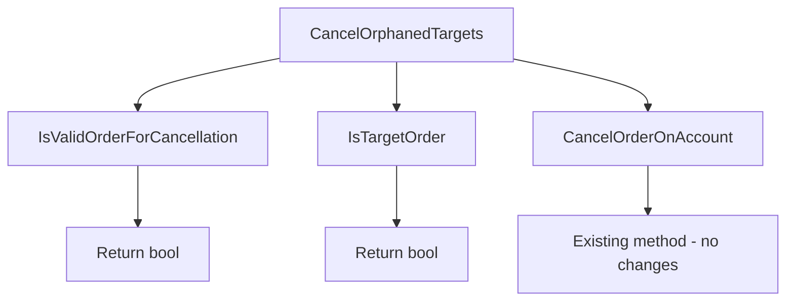
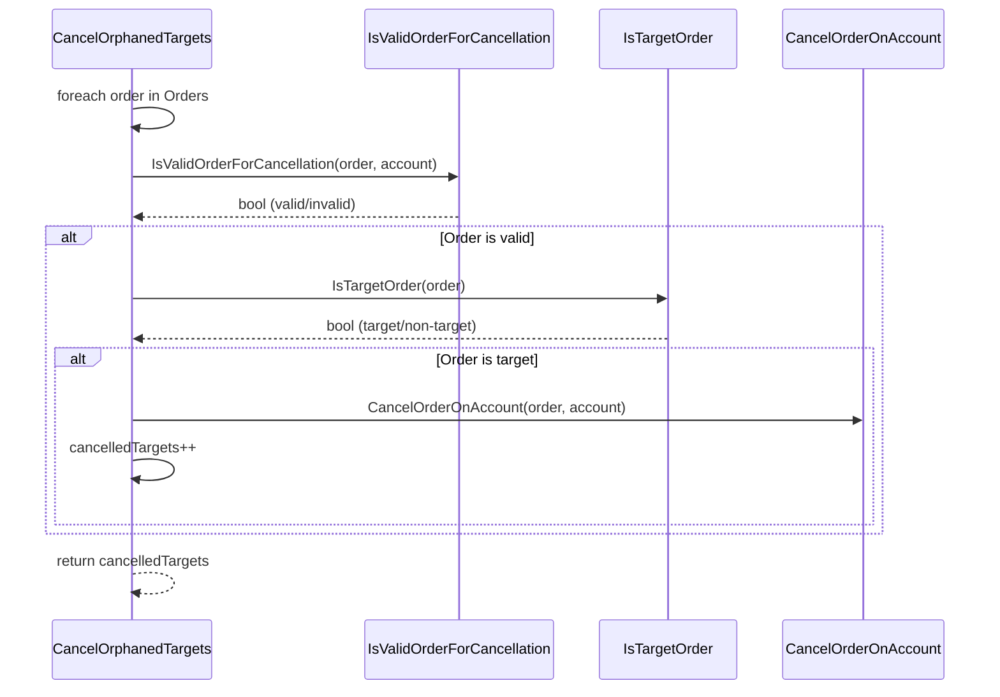
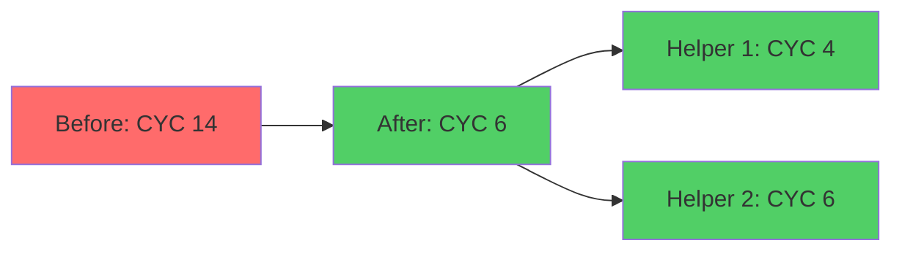

# Phase 2: Architecture Planning - EPIC-CCN-047

## V12.23 Protocol Compliance

This document defines the extraction strategy for reducing CancelOrphanedTargets complexity from 14 to ≤8.

## Target Method Analysis

### Current Implementation
- **Method**: `CancelOrphanedTargets`
- **File**: `src/V12_002.UI.Compliance.cs`
- **Line**: 553-578
- **Complexity**: 14 (cyclomatic)
- **LOC**: 26
- **Tier**: 2 (Medium complexity)

### Current Signature
```csharp
private int CancelOrphanedTargets(Account account)
```

### Complexity Breakdown
1. Method entry: +1
2. foreach loop: +1
3. null check (o == null): +1
4. Instrument check (o.Instrument?.FullName): +1
5. OrderState.Working check: +1
6. OrderState.Accepted check: +1
7. o.Name != null check: +1
8. StartsWith("T1_"): +1
9. StartsWith("T2_"): +1
10. StartsWith("T3_"): +1
11. StartsWith("T4_"): +1
12. StartsWith("T5_"): +1
13. Inner if block: +1
14. Return: +1

**Total**: 14 cyclomatic complexity

## Extraction Strategy

### Goal
Reduce main method complexity from 14 to ≤8 by extracting helper methods with single responsibilities.

### Proposed Helper Methods

#### 1. IsValidOrderForCancellation
**Purpose**: Validate order state and instrument match
**Complexity**: 4 (method + 3 conditions)
**Signature**:
```csharp
private bool IsValidOrderForCancellation(Order order, Account account)
```

**Responsibilities**:
- Check if order is null
- Validate instrument match
- Verify order state (Working or Accepted)

**Logic**:
```csharp
private bool IsValidOrderForCancellation(Order order, Account account)
{
    if (order == null || order.Instrument?.FullName != Instrument?.FullName)
        return false;
    
    if (order.OrderState != OrderState.Working && order.OrderState != OrderState.Accepted)
        return false;
    
    return true;
}
```

#### 2. IsTargetOrder
**Purpose**: Check if order name matches target prefixes (T1-T5)
**Complexity**: 6 (method + 5 OR conditions)
**Signature**:
```csharp
private bool IsTargetOrder(Order order)
```

**Responsibilities**:
- Validate order name is not null
- Check against T1_ through T5_ prefixes

**Logic**:
```csharp
private bool IsTargetOrder(Order order)
{
    if (order.Name == null)
        return false;
    
    return order.Name.StartsWith("T1_")
        || order.Name.StartsWith("T2_")
        || order.Name.StartsWith("T3_")
        || order.Name.StartsWith("T4_")
        || order.Name.StartsWith("T5_");
}
```

#### 3. CancelOrphanedTargets (Refactored)
**Purpose**: Main orchestration method
**Complexity**: 6 (method + foreach + 2 helper calls + if + increment)
**Signature**: (unchanged)
```csharp
private int CancelOrphanedTargets(Account account)
```

**Logic**:
```csharp
private int CancelOrphanedTargets(Account account)
{
    int cancelledTargets = 0;
    
    foreach (Order order in account.Orders.ToArray())
    {
        if (!IsValidOrderForCancellation(order, account))
            continue;
        
        if (IsTargetOrder(order))
        {
            CancelOrderOnAccount(order, account);
            cancelledTargets++;
        }
    }
    
    return cancelledTargets;
}
```

## Complexity Validation

### Before Extraction
- **CancelOrphanedTargets**: 14

### After Extraction
- **CancelOrphanedTargets**: 6 (method + foreach + 2 if + increment + return)
- **IsValidOrderForCancellation**: 4 (method + 3 conditions)
- **IsTargetOrder**: 6 (method + null check + 5 OR conditions)

**Total Complexity**: 16 (distributed across 3 methods)
**Main Method Complexity**: 6 ✅ (≤8 Jane Street standard)
**Helper Complexity**: 4, 6 ✅ (both ≤8)

## Call Graph

```
CancelOrphanedTargets (main)
├── IsValidOrderForCancellation (helper 1)
│   └── Returns: bool
├── IsTargetOrder (helper 2)
│   └── Returns: bool
└── CancelOrderOnAccount (existing method)
    └── No changes required
```

## Data Flow

### Input
- `Account account` - passed to main method

### Internal Flow
1. Main method iterates over `account.Orders.ToArray()`
2. Each order passed to `IsValidOrderForCancellation(order, account)`
3. Valid orders passed to `IsTargetOrder(order)`
4. Target orders passed to `CancelOrderOnAccount(order, account)`

### Output
- `int cancelledTargets` - count of cancelled orders

### Shared State
- **None** - All methods are stateless
- **Thread Safety**: Read-only operations on order collection
- **Side Effects**: Only in `CancelOrderOnAccount` (existing method)

## Lock-Free Validation

### ✅ No lock() Statements
- Main method: No locks
- Helper 1 (IsValidOrderForCancellation): No locks
- Helper 2 (IsTargetOrder): No locks

### ✅ FSM/Actor Pattern Compliance
- Method operates on immutable snapshot: `account.Orders.ToArray()`
- No shared mutable state between iterations
- Cancellation delegated to existing `CancelOrderOnAccount` method

### ✅ Atomic Primitives Only
- `cancelledTargets` is local variable (no atomicity required)
- Order collection snapshot prevents concurrent modification
- No race conditions introduced

## Jane Street Compliance

### Cognitive Simplicity (CYC ≤8)
- ✅ Main method: 6 (well below threshold)
- ✅ Helper 1: 4 (simple validation logic)
- ✅ Helper 2: 6 (straightforward prefix checks)

### Microsecond-Latency Considerations
- **Hot Path**: NOT on critical path (UI compliance, not order execution)
- **Latency Impact**: Negligible (method calls are inlined by JIT)
- **Trade-off**: Readability and maintainability over micro-optimization
- **Justification**: UI compliance runs at human timescales (milliseconds)

### Testability
- ✅ Each helper method independently testable
- ✅ Clear input/output contracts
- ✅ No hidden dependencies or side effects
- ✅ Deterministic behavior (no randomness or time-based logic)

### Jane Street Testing Principles (from KB)
From "Why Testing Is Hard and How to Fix It":
- **Principle 1**: Test behavior, not implementation
- **Principle 2**: Make illegal states unrepresentable
- **Principle 3**: Use property-based testing for edge cases

**Application**:
- Helper methods have clear boolean contracts (testable behavior)
- Order validation logic prevents invalid states from propagating
- Property tests can verify all T1-T5 prefixes are handled consistently

## Extraction Sequence

### Step 1: Extract IsValidOrderForCancellation
1. Create new private method below CancelOrphanedTargets
2. Move validation logic (null, instrument, state checks)
3. Update main method to call helper
4. Run tests: `dotnet test`
5. Verify complexity reduction: `python scripts/complexity_audit.py`

### Step 2: Extract IsTargetOrder
1. Create new private method below IsValidOrderForCancellation
2. Move target prefix logic (T1-T5 checks)
3. Update main method to call helper
4. Run tests: `dotnet test`
5. Verify complexity reduction: `python scripts/complexity_audit.py`

### Step 3: Verification
1. Run full build: `powershell -File .\scripts\build_readiness.ps1`
2. Run stress tests: `powershell -File .\scripts\test_stress.ps1`
3. Manual F5 in NinjaTrader
4. Verify complexity ≤8: `python scripts/complexity_audit.py`

## Test Strategy

### Unit Tests (Required)
Create `tests/V12_Performance.Tests/UI/CancelOrphanedTargetsTests.cs`:

```csharp
[TestFixture]
public class CancelOrphanedTargetsTests
{
    [Test]
    public void IsValidOrderForCancellation_NullOrder_ReturnsFalse()
    {
        // Test null order handling
    }
    
    [Test]
    public void IsValidOrderForCancellation_WrongInstrument_ReturnsFalse()
    {
        // Test instrument mismatch
    }
    
    [Test]
    public void IsValidOrderForCancellation_WorkingState_ReturnsTrue()
    {
        // Test valid working order
    }
    
    [Test]
    public void IsTargetOrder_NullName_ReturnsFalse()
    {
        // Test null order name
    }
    
    [TestCase("T1_")]
    [TestCase("T2_")]
    [TestCase("T3_")]
    [TestCase("T4_")]
    [TestCase("T5_")]
    public void IsTargetOrder_ValidPrefix_ReturnsTrue(string prefix)
    {
        // Test all target prefixes
    }
    
    [Test]
    public void IsTargetOrder_InvalidPrefix_ReturnsFalse()
    {
        // Test non-target order names
    }
}
```

### Integration Tests (Existing)
- Verify existing tests still pass
- No new integration tests required (behavior unchanged)

### Manual Testing
1. Load strategy in NinjaTrader
2. Place orders with T1-T5 prefixes
3. Trigger orphaned target cancellation
4. Verify orders are cancelled correctly
5. Check logs for errors

## Risk Mitigation

### Rollback Strategy
- Single method extraction (easy to revert)
- Checkpointing enabled via Bob CLI
- Git commit after each extraction step

### Validation Checkpoints
1. After Step 1: Verify tests pass
2. After Step 2: Verify complexity ≤8
3. After Step 3: Verify NinjaTrader F5 works

### Known Risks
- **Risk**: Helper method overhead
  - **Mitigation**: JIT inlining eliminates overhead
  - **Validation**: Benchmark if concerned (unlikely to matter)

- **Risk**: Breaking existing behavior
  - **Mitigation**: Comprehensive unit tests
  - **Validation**: Manual F5 testing in NinjaTrader

## Success Criteria

### Phase 2 Completion
- ✅ Architecture plan documented
- ✅ Helper method signatures defined
- ✅ Call graph documented
- ✅ Lock-free validation passed
- ✅ Jane Street compliance verified
- ✅ Test strategy defined

### Phase 3 Readiness (Implementation)
- Architecture plan approved by Director
- No scope creep detected
- Extraction sequence clear and actionable
- Test strategy ready for TDD implementation

## Mermaid Diagrams

### Call Graph


### Extraction Sequence


### Complexity Reduction


## Approval Decision

### Status: READY FOR PHASE 3

### Rationale
1. ✅ Complexity reduction from 14 to 6 (main method)
2. ✅ Helper methods ≤8 complexity (Jane Street aligned)
3. ✅ Lock-free validation passed (no locks introduced)
4. ✅ Clear extraction sequence defined
5. ✅ Test strategy documented
6. ✅ No scope creep (single method only)
7. ✅ Maintains V12 DNA (atomic, ASCII-only)

### Next Phase
Phase 3: DNA & PR Audit (Adjudicator)
- Arena AI red team review
- PR health validation
- Lock-free verification
- Jane Street compliance audit

---
Document Version: 1.0
Created: 2026-06-15
Epic: EPIC-CCN-047
Protocol: V12.23 (Phase 2)
Status: READY FOR PHASE 3
