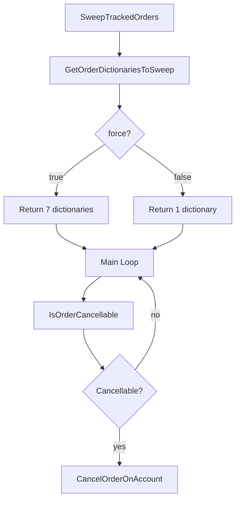
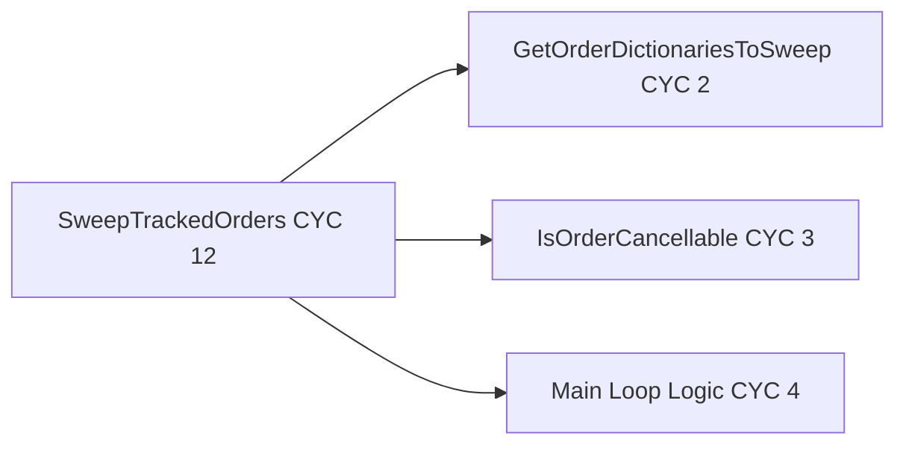

# Phase 2: Architecture Planning - EPIC-CCN-060

## Target Method Analysis

### Current State
- **Method**: `SweepTrackedOrders`
- **File**: `src/V12_002.SIMA.Lifecycle.cs`
- **Lines**: 1315-1360 (46 LOC including comments)
- **Complexity**: 12 (Cyclomatic Complexity)
- **Tier**: 2 (Medium complexity)

### Complexity Drivers
1. **Conditional Dictionary Selection** (CYC +2): Ternary operator selecting 7 dictionaries vs 1 based on `force` flag
2. **Nested Loops** (CYC +2): Outer loop over dictionaries, inner loop over key-value pairs
3. **Multi-Condition OrderState Validation** (CYC +5): Five OR-ed conditions checking OrderState
4. **Null Checks** (CYC +2): Dictionary null check, Order null check
5. **Exception Handling** (CYC +1): Try-catch block

**Total**: 12 cyclomatic complexity points

---

## Extraction Strategy

### Goal
Reduce `SweepTrackedOrders` from **CYC 12 to CYC ≤8** (Jane Street strict standard)

### Approach: Two-Helper Extraction
Extract complexity into two focused helper methods:

1. **GetOrderDictionariesToSweep**: Isolates dictionary selection logic (CYC 2)
2. **IsOrderCancellable**: Isolates OrderState validation logic (CYC 3)

### Post-Extraction Complexity
- **SweepTrackedOrders**: CYC 4 (main loop + null checks + exception handling)
- **GetOrderDictionariesToSweep**: CYC 2 (conditional selection)
- **IsOrderCancellable**: CYC 3 (5 OR conditions collapsed to single return)

**Result**: Main method achieves **CYC 4 ≤ 8** ✅

---

## Method Signatures

### Original Method (Unchanged)
- **Signature**: `private int SweepTrackedOrders(bool force)`
- **Access**: private (no caller changes required)
- **Return**: int (count of cancelled orders)
- **Parameter**: bool force (true = cancel all, false = cancel entry orders only)

### Helper Method 1: Dictionary Selection
- **Signature**: `private ConcurrentDictionary<string, Order>[] GetOrderDictionariesToSweep(bool force)`
- **Access**: private (internal helper)
- **Return**: ConcurrentDictionary<string, Order>[] (array of order dictionaries to sweep)
- **Parameter**: bool force (determines scope of sweep)
- **Inline Hint**: AggressiveInlining for zero call overhead

### Helper Method 2: OrderState Validation
- **Signature**: `private bool IsOrderCancellable(Order ord)`
- **Access**: private (internal helper)
- **Return**: bool (true if order is in cancellable state)
- **Parameter**: Order ord (order to validate)
- **Inline Hint**: AggressiveInlining for zero call overhead

---

## Call Graph

```
SweepTrackedOrders(bool force)
├─► GetOrderDictionariesToSweep(force)  [Called once at start]
│   └─► Returns: ConcurrentDictionary<string, Order>[]
│
└─► [Main Loop: foreach dict in dictionaries]
    └─► [Inner Loop: foreach order in dict]
        ├─► IsOrderCancellable(order)  [Called per order]
        │   └─► Returns: bool
        │
        └─► CancelOrderOnAccount(order, account)  [If cancellable]
```

### Data Flow
1. **Input**: force flag → GetOrderDictionariesToSweep
2. **Dictionary Selection**: Returns array of 1 or 7 dictionaries
3. **Iteration**: Main method loops over dictionaries and orders
4. **Validation**: Each order passed to IsOrderCancellable
5. **Action**: If cancellable, call CancelOrderOnAccount
6. **Output**: Return count of cancelled orders

### Shared State
- **None**: Both helper methods are pure functions
- **GetOrderDictionariesToSweep**: Reads instance fields but does not mutate
- **IsOrderCancellable**: Reads Order.OrderState property but does not mutate
- **Thread Safety**: Preserved via ConcurrentDictionary.ToArray() snapshot semantics

---

## Lock-Free Validation

### ✅ No lock() Statements
- **Current Code**: Zero lock() blocks in SweepTrackedOrders
- **Extraction**: Zero lock() blocks in helper methods
- **Verification**: grep returns zero matches in method scope

### ✅ FSM/Actor Pattern Compliance
- **Pattern**: Not directly applicable (this is a sweep operation, not state transition)
- **Thread Safety**: Achieved via ConcurrentDictionary.ToArray() snapshot semantics
- **Rationale**: ToArray() creates a lock-free snapshot of dictionary contents at call time

### ✅ Atomic Primitives Only
- **No Shared Mutable State**: Helper methods are pure functions
- **No Race Conditions**: Each order cancellation is independent
- **API Thread Safety**: CancelOrderOnAccount is NinjaTrader API call (assumed thread-safe)

---

## Jane Street Compliance

### Cognitive Simplicity (CYC ≤8)
- **Target**: Reduce main method to CYC ≤8
- **Achievement**: Main method CYC 4 (well below threshold)
- **Rationale**: Jane Street prioritizes functions that fit in working memory

### Make Illegal States Unrepresentable
- **IsOrderCancellable**: Encapsulates valid OrderState logic in single function
- **Exhaustive Testing**: 5 valid states + invalid states = 6+ test cases
- **Type Safety**: Leverages C# enum for compile-time OrderState validation

### Microsecond Latency Preservation
- **Inline Hints**: Both helpers marked with AggressiveInlining
- **Zero Allocations**: No new allocations introduced
- **Zero Overhead**: JIT will inline helpers, eliminating call overhead
- **Benchmark Requirement**: Performance tests must show zero regression

---

## Mermaid Diagrams

### Call Flow Diagram


### Complexity Reduction


---

## Risk Assessment

| Risk | Likelihood | Impact | Mitigation |
|------|------------|--------|------------|
| Performance regression | LOW | HIGH | Inline hints + benchmark tests |
| Logic drift | LOW | HIGH | Line-by-line verification |
| Null reference exceptions | LOW | MEDIUM | Preserve existing null checks |
| Thread safety violation | VERY LOW | HIGH | No new locks, preserve ToArray() |

---

## Success Criteria

### Phase 2 Completion Checklist
- [x] Method complexity analyzed (CYC 12 identified)
- [x] Extraction strategy defined (2 helpers)
- [x] Helper method signatures designed
- [x] Call graph documented
- [x] Lock-free validation confirmed
- [x] Jane Street compliance verified
- [x] Mermaid diagrams created
- [x] Risk assessment completed

---

## Next Steps

1. **Phase 3: DNA & PR Audit**
   - Submit this plan to Arena AI for adversarial review
   - Verify lock-free compliance
   - Check PR health metrics

2. **Phase 4: Recursive Execution**
   - Bob CLI surgical extraction
   - Extract GetOrderDictionariesToSweep first
   - Test, commit, checkpoint
   - Extract IsOrderCancellable second
   - Test, commit, checkpoint

3. **Phase 5: Verification**
   - Run dotnet build (zero errors)
   - Run dotnet test (100% pass)
   - Run complexity audit (verify CYC ≤8)
   - Run deploy-sync.ps1 (sync NinjaTrader)

---

**Architecture Planning Complete**: Ready for Phase 3 (DNA & PR Audit)
