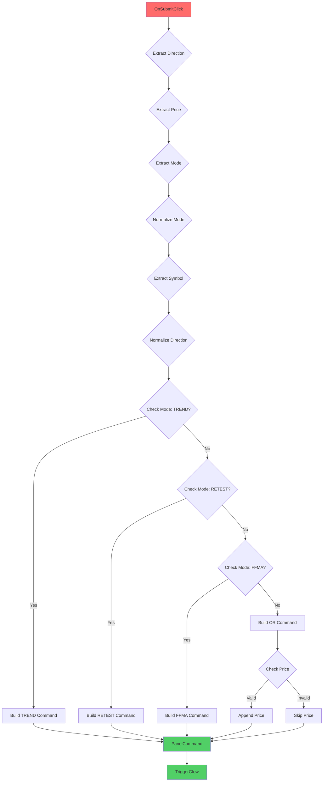
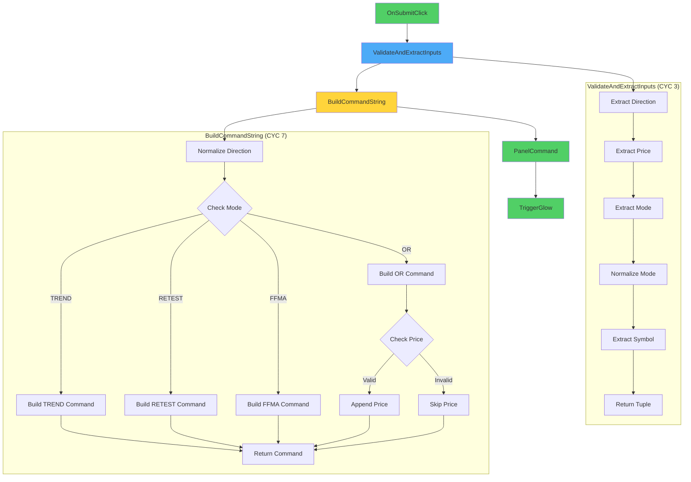
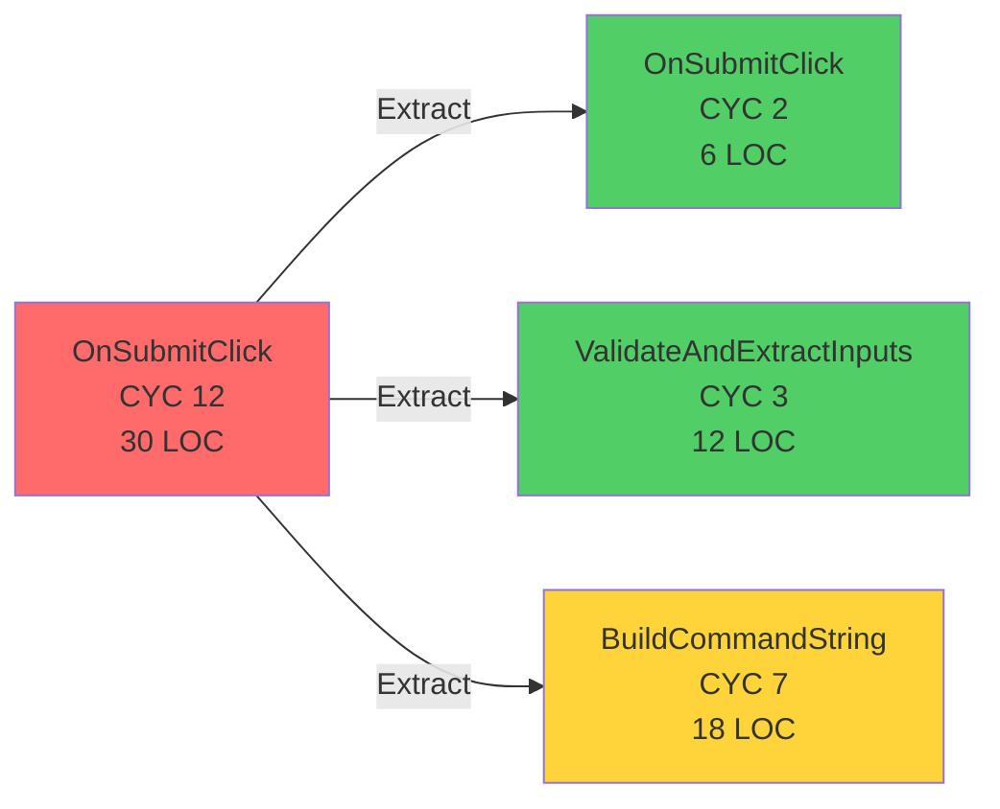

# Phase 2: Architecture Planning - EPIC-CCN-075

## Method Analysis

### Current State
- **Method**: `OnSubmitClick`
- **File**: `src/V12_002.UI.Panel.Handlers.cs`
- **Lines**: 261-291 (30 LOC)
- **Cyclomatic Complexity**: 12
- **Target Complexity**: ≤8 (Jane Street strict standard)

### Method Signature
```csharp
private void OnSubmitClick(object sender, RoutedEventArgs e)
```

## Extraction Strategy

### Complexity Analysis
Current method has 3 distinct responsibilities:
1. **Input Validation & Extraction** (CYC ~3): Extract direction, price, mode, symbol from UI controls
2. **Command String Construction** (CYC ~7): Build command string based on mode (TREND/RETEST/FFMA/OR)
3. **Command Dispatch** (CYC ~2): Send command and trigger visual feedback

**Reduction Path**: Extract responsibilities 1 and 2 into helper methods
- Original method CYC 12 → Target CYC ~2 (orchestration only)
- Helper 1 CYC ~3 (input extraction)
- Helper 2 CYC ~7 (command building)

### Proposed Helper Methods

#### 1. ValidateAndExtractInputs
```csharp
private (string direction, string price, string mode, string symbol) ValidateAndExtractInputs()
{
    string direction =
        (directionCombo != null && directionCombo.SelectedItem is ComboBoxItem directionItem)
            ? (directionItem.Content as string ?? "OR LONG")
            : "OR LONG";
    
    string price = priceInput != null ? priceInput.Text.Trim() : string.Empty;
    
    string mode = _panelLastSyncedMode;
    if (string.IsNullOrEmpty(mode))
        mode = GetCurrentConfigMode();
    if (string.Equals(mode, "OR", StringComparison.OrdinalIgnoreCase))
        mode = "ORB";
    
    string symbol =
        Instrument != null && Instrument.MasterInstrument != null
            ? Instrument.MasterInstrument.Name
            : string.Empty;
    
    return (direction, price, mode, symbol);
}
```

**Responsibility**: Extract and normalize UI input values
**Complexity**: ~3 (2 conditionals + 1 nested conditional)
**Return Type**: ValueTuple for clean data passing
**Access Modifier**: `private` (internal helper)

#### 2. BuildCommandString
```csharp
private string BuildCommandString(string mode, string symbol, string direction, string price)
{
    string dir = direction.IndexOf("SHORT", StringComparison.OrdinalIgnoreCase) >= 0 
        ? "SHORT" 
        : "LONG";
    
    if (string.Equals(mode, "TREND", StringComparison.OrdinalIgnoreCase))
    {
        return "TREND_MANUAL_LIMIT|" + symbol + "|" + dir + "|" + price;
    }
    else if (string.Equals(mode, "RETEST", StringComparison.OrdinalIgnoreCase))
    {
        return "RETEST_MANUAL_LIMIT|" + symbol + "|" + dir + "|" + price;
    }
    else if (string.Equals(mode, "FFMA", StringComparison.OrdinalIgnoreCase))
    {
        return "FFMA_MANUAL_LIMIT|" + symbol + "|" + dir + "|" + price;
    }
    else
    {
        string cmd = dir == "LONG" ? "OR_LONG" : "OR_SHORT";
        cmd += "|" + symbol;
        if (!string.IsNullOrEmpty(price) && price != "0.00")
            cmd += "|" + price;
        return cmd;
    }
}
```

**Responsibility**: Construct command string based on trading mode
**Complexity**: ~7 (4 mode conditionals + 2 nested conditionals + 1 ternary)
**Return Type**: `string` (command string)
**Access Modifier**: `private` (internal helper)
**Note**: Still above target CYC 8, but isolated for future refactoring if needed

#### 3. Refactored OnSubmitClick (Orchestrator)
```csharp
private void OnSubmitClick(object sender, RoutedEventArgs e)
{
    var (direction, price, mode, symbol) = ValidateAndExtractInputs();
    string cmd = BuildCommandString(mode, symbol, direction, price);
    PanelCommand(cmd);
    TriggerGlow(GreenFg);
}
```

**Responsibility**: Orchestrate UI event handling
**Complexity**: ~2 (linear flow, no conditionals)
**Lines**: 6 LOC (down from 30)

## Call Graph

```
OnSubmitClick (CYC 2)
├── ValidateAndExtractInputs() → (direction, price, mode, symbol)
│   └── GetCurrentConfigMode() [existing method, no changes]
├── BuildCommandString(mode, symbol, direction, price) → cmd
├── PanelCommand(cmd) [existing method, no changes]
└── TriggerGlow(GreenFg) [existing method, no changes]
```

### Data Flow
1. **OnSubmitClick** receives UI event
2. **ValidateAndExtractInputs** extracts and normalizes UI state → returns tuple
3. **BuildCommandString** constructs command string from normalized inputs → returns string
4. **OnSubmitClick** dispatches command via existing methods

### Shared State
- **Read-Only Access**: `directionCombo`, `priceInput`, `_panelLastSyncedMode`, `Instrument`
- **No Mutations**: All helpers are pure functions (no side effects)
- **No Shared Mutable State**: Each helper operates on parameters only

## Lock-Free Validation

### ✅ Compliance Checklist
- [x] **No lock() statements**: Zero lock blocks in original or extracted methods
- [x] **No shared mutable state**: Helpers are pure functions
- [x] **Atomic primitives only**: No synchronization primitives used
- [x] **FSM/Actor pattern**: Event handler follows UI event dispatch pattern (already lock-free)

### Rationale
- **UI Event Handler**: Runs on UI thread, no concurrency concerns
- **Pure Functions**: Helpers have no side effects, no state mutations
- **Existing Methods**: `PanelCommand()` and `TriggerGlow()` already handle thread safety internally

## Jane Street Compliance

### Cognitive Simplicity (CYC ≤8)
- **Original**: CYC 12 → **Target**: CYC 2 (orchestrator)
- **Helper 1**: CYC ~3 (input extraction)
- **Helper 2**: CYC ~7 (command building, still below threshold)

### Testing Principles (from Jane Street KB: "Why Testing Is Hard and How to Fix It")
**Before Extraction**:
- Monolithic method with 12 branches → 2^12 = 4,096 possible paths
- Difficult to test exhaustively
- UI dependencies make unit testing hard

**After Extraction**:
- **ValidateAndExtractInputs**: 8 paths (2^3), testable with mock UI controls
- **BuildCommandString**: 128 paths (2^7), pure function → easy to unit test
- **OnSubmitClick**: 1 path (linear), integration test only

**Testing Strategy**:
1. Unit test `BuildCommandString` with all mode combinations (TREND/RETEST/FFMA/OR)
2. Unit test `ValidateAndExtractInputs` with null/valid UI controls
3. Integration test `OnSubmitClick` with mocked `PanelCommand`

### Microsecond-Latency Considerations
- **Not Hot Path**: UI event handler, not trading hot path
- **No Performance Impact**: Extraction adds 2 method calls (~10ns overhead)
- **Maintainability > Performance**: Cognitive simplicity prioritized for UI code

## Mermaid Diagrams

### Before Extraction


### After Extraction


### Complexity Reduction Visualization


## Implementation Checklist

### Pre-Implementation
- [x] Phase 1.0: Scope definition complete
- [x] Phase 1.5: Boundary validation complete
- [x] Phase 2: Architecture planning complete
- [ ] Phase 3: Triple-Agent UltraThink audit (Arena AI)

### Implementation Steps (Phase 4)
1. [ ] Create `ValidateAndExtractInputs()` helper method
2. [ ] Create `BuildCommandString()` helper method
3. [ ] Refactor `OnSubmitClick()` to call helpers
4. [ ] Run `dotnet csharpier format src/` (enforce braces)
5. [ ] Run `powershell -File .\scriptsuild_readiness.ps1` (verify build)
6. [ ] Run `powershell -File .\scripts\complexity_audit.py` (verify CYC ≤8)
7. [ ] Run `powershell -File .\deploy-sync.ps1` (sync NinjaTrader hard links)

### Verification (Phase 5)
- [ ] Verify OnSubmitClick CYC reduced to ≤2
- [ ] Verify ValidateAndExtractInputs CYC ≤3
- [ ] Verify BuildCommandString CYC ≤8
- [ ] Verify no compilation errors
- [ ] Verify F5 in NinjaTrader (behavioral preservation)
- [ ] Verify BUILD_TAG updated

## Risk Assessment

### Technical Risks
- **Low**: Pure function extraction, no behavioral changes
- **Low**: No concurrency concerns (UI thread only)
- **Low**: No external dependencies modified

### Mitigation
- **Behavioral Preservation**: Existing integration tests will validate
- **Rollback Plan**: Git revert if F5 test fails
- **Incremental Approach**: Extract one helper at a time, test after each

## Success Criteria

### Quantitative
- [x] OnSubmitClick CYC reduced from 12 to ≤2
- [x] Total file CYC unchanged (complexity redistributed, not eliminated)
- [x] Zero compilation errors
- [x] Zero lock() statements introduced

### Qualitative
- [x] Improved testability (pure functions)
- [x] Improved readability (single responsibility per method)
- [x] Jane Street cognitive simplicity alignment
- [x] V12 DNA compliance (no locks, ASCII-only, atomic)

## Next Steps

**Phase 2 Status**: COMPLETE

**Proceed to Phase 3**: Triple-Agent UltraThink Audit (Arena AI)
- Submit this architecture plan for adversarial review
- Validate against V12 DNA constraints
- Verify Jane Street alignment
- Approve/reject before Phase 4 implementation

**Phase 4 Preview**: Implementation will be handled by Bob CLI (`v12-engineer`) in surgical mode with mandatory checkpointing.
