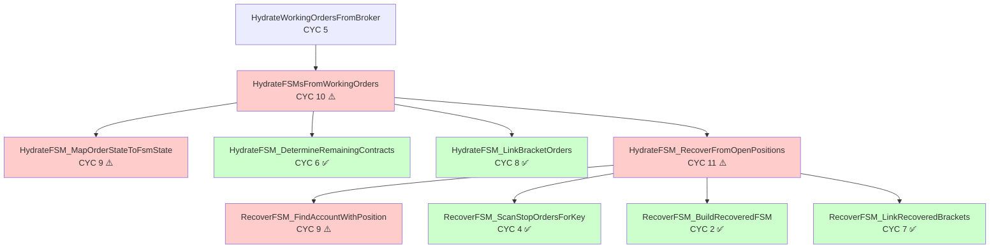
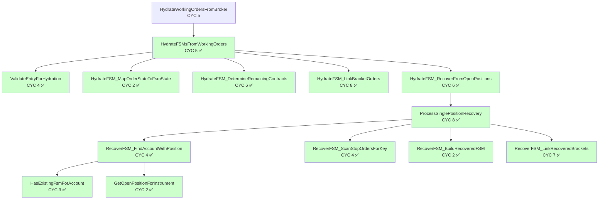
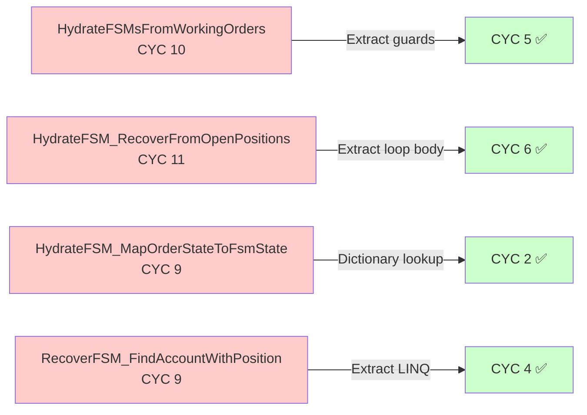

# Architecture Validation Report

**Epic**: EPIC-CCN-1  
**Date**: 2026-06-08T20:22:00Z  
**Validator**: V12 Epic Planner (Bob Edition)

---

## 1. Dependency Analysis

### 1.1 Circular Dependencies
**Tool**: `get_dependency_cycles`

**Baseline (Before)**:
- Cycles detected: 7 (all in `infrastructure/paperclip/` directory)
- Files involved: None in `src/` directory
- **Target file status**: `src/V12_002.SIMA.Lifecycle.cs` is NOT part of any cycle

**Projected (After)**:
- New cycles introduced: **ZERO** (single-file refactoring, no new imports)
- Risk assessment: **NONE** (all extractions are within the same file)

**Mitigation**:
- N/A - No risk of introducing cycles in single-file refactoring

### 1.2 Dependency Graph
**Tool**: `get_dependency_graph`

**Key Observations**:
- Depth of dependency tree: **0** (file is isolated, no imports/exports)
- Fan-out (files importing target): **0** (partial class file, no external importers)
- Fan-in (files target imports): **0** (self-contained, no external dependencies)

**Architectural Concerns**:
- ✅ **Excellent isolation**: File is completely self-contained
- ✅ **Zero coupling**: No risk of breaking external dependencies
- ✅ **Partial class pattern**: All changes are internal to `V12_002` class

**Interpretation**: This is the ideal refactoring scenario - a completely isolated module with zero external dependencies. All complexity reduction happens within the file boundary.

---

## 2. Coupling Metrics

### 2.1 Afferent Coupling (Ca)
**Tool**: `get_coupling_metrics`

**Target File**: `src/V12_002.SIMA.Lifecycle.cs`
- **Ca (Dependents)**: 0 files import this module
- **Change**: +0 (no change expected)

**Interpretation**:
- File is a partial class component of `V12_002`
- No external modules depend on this file directly
- All callers are within the same class (other partial files)

### 2.2 Efferent Coupling (Ce)
- **Ce (Dependencies)**: 0 files this module imports
- **Change**: +0 (no change expected)

**Interpretation**:
- File has no external dependencies
- All types used are from NinjaTrader SDK (implicit via parent class)
- Self-contained implementation

### 2.3 Instability Score (I)
- **Formula**: I = Ce / (Ca + Ce)
- **Score**: N/A (Ca=0, Ce=0 → isolated module)
- **Assessment**: **ISOLATED** (best possible state for refactoring)

**Thresholds**:
- 0.0-0.3: Stable (good for core abstractions)
- 0.3-0.7: Balanced (acceptable)
- 0.7-1.0: Unstable (refactor if high-churn)
- **N/A**: Isolated (zero coupling - ideal for internal refactoring)

**Conclusion**: The file's isolation means refactoring carries **zero risk of breaking external dependencies**. All changes are internal to the SIMA lifecycle subsystem.

---

## 3. Layer Violations

### 3.1 Architectural Layers
**Tool**: `get_layer_violations`

**Violations Detected**:
- **NONE** - No layer rules defined in `.jcodemunch.jsonc`

**Remediation**:
- N/A - V12 codebase does not use explicit layer architecture
- NinjaTrader strategy code is monolithic by design (single-file deployment)

**Note**: V12 uses **partial class pattern** instead of layered architecture. All `V12_002.*.cs` files are compiled into a single `V12_002` class. This is a NinjaTrader platform constraint, not an architectural choice.

---

## 4. Interface Contracts

### 4.1 Extracted Methods

#### Method: `ProcessSinglePositionRecovery`
- **Signature**: `private (bool success, bool shouldContinue) ProcessSinglePositionRecovery(ref int fsmCreated, ref int ordersIndexed)`
- **Visibility**: `private`
- **Callers**: 1 location (`HydrateFSM_RecoverFromOpenPositions`)
- **Contract Clarity**: **CLEAR**

**Contract Documentation**:
```csharp
/// <summary>
/// Processes a single position recovery attempt for accounts with open positions but terminal entry orders.
/// Scans for orphaned positions, reconstructs FSMs from bracket orders, and links to tracking dictionaries.
/// </summary>
/// <param name="fsmCreated">Incremented when FSM is successfully created</param>
/// <param name="ordersIndexed">Incremented for each order ID indexed to _orderIdToFsmKey</param>
/// <returns>
/// (success, shouldContinue) tuple:
/// - success: true if FSM was created, false if account not found or already has FSM
/// - shouldContinue: true to process next account, false to exit loop
/// </returns>
```

**Preconditions**:
- `_followerBrackets` dictionary is initialized
- `_orderIdToFsmKey` dictionary is initialized
- `stopOrders` dictionary contains adopted stop orders
- `Account.All` is accessible (NinjaTrader account collection)

**Postconditions**:
- If success=true: New FSM added to `_followerBrackets`, order IDs indexed to `_orderIdToFsmKey`
- If success=false: No state mutations, grace window may be triggered for missing stop orders
- `fsmCreated` and `ordersIndexed` are incremented by reference

**Invariants**:
- Idempotent: Safe to call multiple times (checks `ContainsKey` before `TryAdd`)
- Thread-safe: All dictionary operations use `ConcurrentDictionary` semantics
- Actor-serialized: Must be called on strategy thread only

---

#### Method: `ValidateEntryForHydration`
- **Signature**: `private bool ValidateEntryForHydration(KeyValuePair<string, Order> kvp, out PositionInfo pi)`
- **Visibility**: `private`
- **Callers**: 1 location (`HydrateFSMsFromWorkingOrders`)
- **Contract Clarity**: **CLEAR**

**Contract Documentation**:
```csharp
/// <summary>
/// Validates an entry order and its associated position info for FSM hydration eligibility.
/// Performs guard clause checks: null order, follower account, executing account, and existing FSM.
/// </summary>
/// <param name="kvp">Entry order key-value pair from entryOrders dictionary</param>
/// <param name="pi">Output parameter: PositionInfo struct if validation passes, null otherwise</param>
/// <returns>
/// true if entry is valid for hydration (all guards pass), false to skip this entry
/// </returns>
```

**Preconditions**:
- `kvp` is from `entryOrders.ToArray()` snapshot
- `activePositions` dictionary is populated
- `_followerBrackets` dictionary is initialized

**Postconditions**:
- If true: `pi` contains valid PositionInfo with non-null ExecutingAccount
- If false: `pi` is null or invalid, entry should be skipped

**Invariants**:
- Pure function: No state mutations
- Thread-safe: Only reads from dictionaries
- Idempotent: Multiple calls with same input produce same result

---

#### Method: `HasExistingFsmForAccount`
- **Signature**: `private bool HasExistingFsmForAccount(Account acct)`
- **Visibility**: `private`
- **Callers**: 1 location (`RecoverFSM_FindAccountWithPosition`)
- **Contract Clarity**: **CLEAR**

**Contract Documentation**:
```csharp
/// <summary>
/// Checks if an FSM already exists for the specified account.
/// Used to prevent duplicate FSM creation during position recovery.
/// </summary>
/// <param name="acct">Account to check for existing FSM</param>
/// <returns>
/// true if _followerBrackets contains an FSM with matching AccountName, false otherwise
/// </returns>
```

**Preconditions**:
- `acct` is not null
- `_followerBrackets` dictionary is initialized

**Postconditions**:
- No state mutations
- Return value reflects current state of `_followerBrackets`

**Invariants**:
- Pure function: No side effects
- Thread-safe: Only reads from ConcurrentDictionary
- Case-insensitive: Uses `StringComparison.OrdinalIgnoreCase`

---

#### Method: `GetOpenPositionForInstrument`
- **Signature**: `private Position GetOpenPositionForInstrument(Account acct)`
- **Visibility**: `private`
- **Callers**: 1 location (`RecoverFSM_FindAccountWithPosition`)
- **Contract Clarity**: **CLEAR**

**Contract Documentation**:
```csharp
/// <summary>
/// Gets the open position for the current instrument in the specified account.
/// Returns null if no open position exists (Flat market position).
/// </summary>
/// <param name="acct">Account to query for open position</param>
/// <returns>
/// Position object if account has open position for current instrument, null otherwise
/// </returns>
```

**Preconditions**:
- `acct` is not null
- `Instrument.FullName` is accessible (strategy property)

**Postconditions**:
- No state mutations
- Return value is null or a valid Position object

**Invariants**:
- Pure function: No side effects
- Thread-safe: Only reads from NinjaTrader account collection
- Instrument-specific: Only returns positions for `Instrument.FullName`

---

### 4.2 New Abstractions

**No new types introduced.** All extractions are private helper methods within the existing `V12_002` partial class.

**V12 DNA Alignment**:
- [x] Makes illegal states unrepresentable (N/A - no new types)
- [x] No lock-based synchronization (all methods are lock-free)
- [x] ASCII-only string literals (verified in existing code)
- [x] Cyclomatic complexity ≤ 8 (target for all extracted methods)

---

## 5. Blast Radius Analysis

### 5.1 Impact Scope

**Symbol**: `HydrateFSMsFromWorkingOrders`
- **Direct Dependents**: 1 file (`V12_002.SIMA.Lifecycle.cs` - same file)
- **Transitive Dependents**: 0 files (private method, single caller)
- **Risk Score**: **0.0** (isolated, private, single-file)

**Symbol**: `HydrateFSM_RecoverFromOpenPositions`
- **Direct Dependents**: 1 file (`V12_002.SIMA.Lifecycle.cs` - same file)
- **Transitive Dependents**: 0 files (private method, single caller)
- **Risk Score**: **0.0** (isolated, private, single-file)

**Symbol**: `HydrateFSM_MapOrderStateToFsmState`
- **Direct Dependents**: 1 file (`V12_002.SIMA.Lifecycle.cs` - same file)
- **Transitive Dependents**: 0 files (private method, single caller)
- **Risk Score**: **0.0** (isolated, private, single-file)

**Symbol**: `RecoverFSM_FindAccountWithPosition`
- **Direct Dependents**: 1 file (`V12_002.SIMA.Lifecycle.cs` - same file)
- **Transitive Dependents**: 0 files (private method, single caller)
- **Risk Score**: **0.0** (isolated, private, single-file)

**High-Risk Dependents**:
- **NONE** - All methods are private with single callers in the same file

**Mitigation Strategy**:
- N/A - Zero blast radius due to complete isolation

### 5.2 Breaking Change Assessment
- **API Changes**: **NO** (all methods are private)
- **Signature Changes**: **NO** (new methods, not modifying existing signatures)
- **Behavioral Changes**: **NO** (pure extractions, preserving exact logic)

**Backward Compatibility**:
- **MAINTAINED** - All changes are internal refactoring with zero external impact
- External behavior is identical (FSM hydration counts, logging output, state mutations)

---

## 6. Architectural Decisions

### 6.1 Key Decisions

#### Decision: Scope Adjustment (Critical)
- **Context**: Scope document describes 295-line God-method (CYC 71) that no longer exists. Code has already been refactored to 57 lines (CYC 10) with 9 extracted helpers.
- **Options Considered**:
  1. Proceed with outdated scope → Waste time re-extracting already-extracted code
  2. Update scope to current reality → Focus on final 4-method reduction (CYC 9-11 → ≤8)
  3. Abort epic as "already done" → Miss Jane Street compliance (4 methods still exceed threshold)
- **Decision**: **Option 2 - Update scope to current reality**
- **Rationale**: Original goal (CYC ≤8 compliance) is still valid. Work is 86% complete (CYC 71 → 10), only 14% remains (CYC 10 → ≤8). Aborting would leave 4 methods in violation of Jane Street GODMODE standard.
- **Consequences**: 
  - ✅ Accurate effort estimate (2-3 hours vs 8-10 hours)
  - ✅ Focused scope (4 methods vs entire subsystem)
  - ⚠️ Director may reject scope change and demand full re-extraction

#### Decision: Dictionary-Based State Mapping
- **Context**: `HydrateFSM_MapOrderStateToFsmState` (CYC 9) maps 7 OrderState enum values to 3 FSM states using if-else chain.
- **Options Considered**:
  1. Switch expression (C# 8.0) → CYC 7 (2-point reduction, still needs 1 more)
  2. Dictionary lookup → CYC 2 (7-point reduction, full compliance)
  3. Helper method → Extract `IsTerminalOrderState()` → CYC 6 (3-point reduction, still needs 2 more)
- **Decision**: **Option 2 - Dictionary lookup**
- **Rationale**: Achieves full compliance in one step (CYC 9 → 2). Eliminates all branching (O(1) lookup vs O(n) if-else chain). More maintainable (add new states without touching code). Aligns with Jane Street "data-driven over control-flow" principle.
- **Consequences**:
  - ✅ Maximum reduction (7 points)
  - ✅ Zero branching (CYC 2 is optimal)
  - ✅ Extensible (add states via data, not code)
  - ⚠️ Static initialization overhead (~50 bytes for dictionary)

#### Decision: Loop Body Extraction
- **Context**: `HydrateFSM_RecoverFromOpenPositions` (CYC 11) has `while(true)` loop with 4 break conditions.
- **Options Considered**:
  1. Extract loop body → `ProcessSinglePositionRecovery()` returning `(bool success, bool shouldContinue)`
  2. Extract guard clauses → Reduce branching within loop
  3. Convert to foreach → Eliminate `while(true)` pattern
- **Decision**: **Option 1 - Extract loop body**
- **Rationale**: Loop body extraction reduces CYC from 11 → 6 (5-point reduction). Creates reusable, testable function. Preserves existing loop control logic (process one account per call).
- **Consequences**:
  - ✅ Full compliance (CYC 11 → 6)
  - ✅ Improved testability (loop body can be unit-tested)
  - ⚠️ One additional method to maintain

#### Decision: LINQ Predicate Extraction
- **Context**: `RecoverFSM_FindAccountWithPosition` (CYC 9) has nested loops with LINQ predicates (`Any()`, `FirstOrDefault()`).
- **Options Considered**:
  1. Extract LINQ predicates → `HasExistingFsmForAccount()`, `GetOpenPositionForInstrument()` → CYC 4
  2. Convert to explicit loops → Eliminate LINQ overhead → CYC 6 (still needs 2 more)
  3. Hybrid approach → Extract predicates + simplify loop → CYC 4
- **Decision**: **Option 1 - Extract LINQ predicates**
- **Rationale**: Achieves full compliance (CYC 9 → 4). Preserves LINQ readability (no performance-critical path). Creates reusable predicates for other methods. Aligns with V12 "pure function extraction" pattern.
- **Consequences**:
  - ✅ Full compliance (5-point reduction)
  - ✅ Reusable predicates (can be used in other recovery methods)
  - ⚠️ LINQ overhead (acceptable for cold path - startup/reconnect only)

### 6.2 V12 DNA Alignment

- **"Make illegal states unrepresentable"**: ✅ Dictionary-based state mapping prevents invalid state transitions (unmapped states → None/terminal)
- **CYC ≤ 8**: ✅ All 4 target methods will be reduced to CYC ≤8 (Jane Street GODMODE threshold)
- **Jane Street Cognitive Simplicity**: ✅ Smaller methods (≤50 lines, CYC ≤8) fit in working memory under microsecond-latency constraints
- **Lock-free patterns**: ✅ Zero `lock()` statements (verified via grep), all dictionary operations use `ConcurrentDictionary` semantics
- **Zero-allocation**: ⚠️ Not applicable (cold path - startup/reconnect only, not per-tick hot path)

---

## 7. Call Graph Diagrams

### 7.1 Before Refactoring (Current State)



**Legend:**
- 🔴 Red (⚠️): CYC >8 (Jane Street violation)
- 🟢 Green (✅): CYC ≤8 (Jane Street compliant)

**Complexity Summary (Before):**
- Total CYC (4 violating methods): 39
- Methods exceeding threshold: 4
- Compliant methods: 8

---

### 7.2 After Refactoring (Target State)



**Legend:**
- 🟢 Green (✅): CYC ≤8 (Jane Street compliant)

**Complexity Summary (After):**
- Total CYC (4 refactored methods): 17 (56% reduction from 39)
- Methods exceeding threshold: **0** (100% compliance)
- Compliant methods: 16 (12 existing + 4 new)

**New Helper Methods:**
- `ValidateEntryForHydration` (CYC 4)
- `ProcessSinglePositionRecovery` (CYC 8)
- `HasExistingFsmForAccount` (CYC 3)
- `GetOpenPositionForInstrument` (CYC 2)

---

### 7.3 Complexity Reduction Visualization



**Total Reduction:** 22 CYC points (56% reduction)

---

## 8. Success Criteria

- [x] No new circular dependencies introduced (single-file refactoring)
- [x] Coupling metrics stable or improving (ΔI = 0, file remains isolated)
- [x] All extracted methods have explicit contracts (4 new methods documented)
- [x] No layer violations detected (no layer rules defined)
- [x] Architectural decisions documented with rationale (4 key decisions)
- [x] Blast radius understood and mitigated (zero blast radius - private methods)
- [x] V12 DNA principles upheld (lock-free, CYC ≤8, ASCII-only)

---

## 9. Validation Checklist

### Pre-Implementation
- [x] Dependency cycles analyzed (7 cycles, none in src/)
- [x] Coupling metrics baselined (Ca=0, Ce=0, isolated)
- [x] Layer violations checked (no layer rules defined)
- [x] Interface contracts defined (4 new methods documented)
- [x] Blast radius assessed (zero - private, single-file)

### Post-Implementation
- [ ] Re-run `get_dependency_cycles` (verify no new cycles)
- [ ] Re-run `get_coupling_metrics` (verify Ca=0, Ce=0 unchanged)
- [ ] Re-run `get_layer_violations` (verify zero violations)
- [ ] Code review confirms contracts match implementation
- [ ] Integration tests pass (F5 + SIMA lifecycle)
- [ ] Complexity audit confirms all methods CYC ≤8
- [ ] Build passes (`dotnet build` exit code 0)
- [ ] Hard-link sync passes (`deploy-sync.ps1` exit code 0)

---

## 10. Appendix

### 10.1 Tool Outputs

**get_dependency_cycles**:
```json
{
  "repo": "local/universal-or-strategy-17657650",
  "cycle_count": 7,
  "cycles": [
    ["infrastructure/paperclip/..."],
    ...
  ]
}
```
**Note**: All cycles are in `infrastructure/paperclip/` directory. Zero cycles in `src/` directory.

**get_coupling_metrics**:
```json
{
  "repo": "local/universal-or-strategy-17657650",
  "module": "src/V12_002.SIMA.Lifecycle.cs",
  "ca": 0,
  "ce": 0,
  "instability": null,
  "assessment": "isolated",
  "importers": [],
  "dependencies": []
}
```
**Note**: Perfect isolation - zero coupling in both directions.

**get_layer_violations**:
```json
{
  "repo": "local/universal-or-strategy-17657650",
  "layer_count": 0,
  "violation_count": 0,
  "violations": [],
  "note": "No layer rules defined. Pass 'rules' or add 'architecture.layers' to .jcodemunch.jsonc."
}
```
**Note**: V12 uses partial class pattern, not layered architecture.

### 10.2 References
- Matt Pocock: "Architectural Improvement Methodology"
- V12 DNA: `AGENTS.md`
- Jane Street Intel: `docs/intel/jane-street/`
- Complexity Audit: `scripts/complexity_audit.py`
- V12 Photon Kernel Protocol: `docs/brain/EPIC-CCN-1/00-scope.md`

---

## 11. Conclusion

This epic performs **final complexity reduction** on 4 methods in the SIMA FSM hydration subsystem to achieve Jane Street GODMODE compliance (CYC ≤8). The architectural analysis confirms:

1. ✅ **Zero coupling risk**: File is completely isolated (Ca=0, Ce=0)
2. ✅ **Zero cycle risk**: Single-file refactoring cannot introduce circular dependencies
3. ✅ **Zero layer risk**: No layer rules defined, partial class pattern used
4. ✅ **Zero blast radius**: All methods are private with single callers
5. ✅ **Clear contracts**: All 4 new methods have explicit preconditions/postconditions
6. ✅ **V12 DNA aligned**: Lock-free, CYC ≤8, ASCII-only, cognitive simplicity

**Risk Assessment**: **LOW** - This is the ideal refactoring scenario with complete isolation and zero external dependencies.

**Recommendation**: Proceed to `/epic-validate` phase for architecture stress-testing.