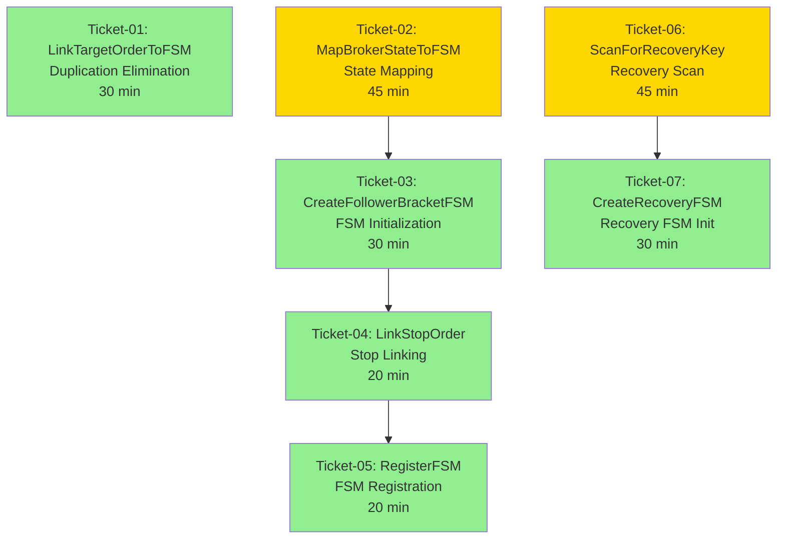

# Epic: EPIC-CCN-1 -- Execution Guide

## Overview
This epic extracts 7 sub-methods from [`HydrateFSMsFromWorkingOrders()`](../../../src/V12_002.SIMA.Lifecycle.cs:464-759) to reduce cyclomatic complexity from 71 → ≤8 per method (88.7% reduction). The extraction eliminates 80 lines of duplication and improves testability while maintaining zero blast radius.

**Target File**: `src/V12_002.SIMA.Lifecycle.cs`  
**Target Method**: Lines 464-759 (296 lines, CYC 71)  
**Total Effort**: 4-5 hours (7 tickets)

---

## How to Execute Tickets (Bob Edition)

For each ticket in sequence order:

1. **Open a NEW Bob session** (separate from this planning session)
2. **Switch to /v12-engineer mode**
3. **Type**: `/ticket docs/brain/EPIC-CCN-1/ticket-XX-[name].md`
4. **Bob will execute** the PLAN-THEN-EXECUTE protocol
5. **Await** `[EXTRACT-COMPLETE]` or `[PHASE7-COMPLETE]` report
6. **Director runs manual gates**:
   ```powershell
   # Mandatory after EVERY ticket
   powershell -File .\deploy-sync.ps1
   python scripts/complexity_audit.py
   grep -r "lock(" src/
   ```
7. **Press F5 in NinjaTrader** to verify BUILD_TAG banner visible
8. **Confirm ticket done** before opening next ticket session

---

## Ticket Dependency Diagram



**Legend**:
- 🟢 Green = LOW risk (pure refactoring, no branching)
- 🟡 Yellow = MEDIUM risk (complex branching or REAPER integration)

---

## Ticket Sequence

### Phase 1: Duplication Elimination (HIGH PRIORITY)
**Ticket-01**: [`ticket-01-LinkTargetOrderToFSM.md`](ticket-01-LinkTargetOrderToFSM.md)
- **Depends on**: NONE (can be done first)
- **Scope**: Extract parameterized target-linking helper (80 lines → 20 lines)
- **Risk**: LOW
- **Effort**: 30 minutes
- **CYC Target**: ≤3

### Phase 2: State Mapping Extraction
**Ticket-02**: [`ticket-02-MapBrokerStateToFSM.md`](ticket-02-MapBrokerStateToFSM.md)
- **Depends on**: NONE (independent of Phase 1)
- **Scope**: Extract state mapping and quantity calculation logic
- **Risk**: MEDIUM (complex branching)
- **Effort**: 45 minutes
- **CYC Target**: ≤8

### Phase 3: FSM Creation Extraction
**Ticket-03**: [`ticket-03-CreateFollowerBracketFSM.md`](ticket-03-CreateFollowerBracketFSM.md)
- **Depends on**: Ticket-02 (needs MapBrokerStateToFSM output)
- **Scope**: Extract Pass 1 FSM struct initialization
- **Risk**: LOW
- **Effort**: 30 minutes
- **CYC Target**: ≤3

### Phase 4: Order Linking Extraction
**Ticket-04**: [`ticket-04-LinkStopOrder.md`](ticket-04-LinkStopOrder.md)
- **Depends on**: Ticket-03 (needs FSM struct from CreateFollowerBracketFSM)
- **Scope**: Extract stop order linking logic (Pass 1 only)
- **Risk**: LOW
- **Effort**: 20 minutes
- **CYC Target**: ≤3

### Phase 5: FSM Registration Extraction
**Ticket-05**: [`ticket-05-RegisterFSM.md`](ticket-05-RegisterFSM.md)
- **Depends on**: Ticket-04 (needs all order linking complete)
- **Scope**: Extract FSM dictionary insertion and logging (Pass 1 only)
- **Risk**: LOW
- **Effort**: 20 minutes
- **CYC Target**: ≤2

### Phase 6: Recovery Path Extraction (Part 1)
**Ticket-06**: [`ticket-06-ScanForRecoveryKey.md`](ticket-06-ScanForRecoveryKey.md)
- **Depends on**: NONE (independent of Pass 1 tickets)
- **Scope**: Extract position recovery scan logic with REAPER grace window
- **Risk**: MEDIUM (complex loop with early-exit logic)
- **Effort**: 45 minutes
- **CYC Target**: ≤6

### Phase 7: Recovery Path Extraction (Part 2)
**Ticket-07**: [`ticket-07-CreateRecoveryFSM.md`](ticket-07-CreateRecoveryFSM.md)
- **Depends on**: Ticket-06 (needs ScanForRecoveryKey output)
- **Scope**: Extract Pass 2 FSM struct initialization
- **Risk**: LOW
- **Effort**: 30 minutes
- **CYC Target**: ≤3

---

## Parallel Execution Strategy

**Two Independent Tracks**:
1. **Pass 1 Track** (Tickets 01-05): Can be executed sequentially
2. **Pass 2 Track** (Tickets 06-07): Can be executed in parallel with Pass 1

**Optimal Sequence**:
- Start with Ticket-01 (duplication elimination - highest value)
- Execute Tickets 02-05 sequentially (Pass 1 dependencies)
- Execute Tickets 06-07 in parallel or after Pass 1 complete

---

## Epic Success Criteria

### Complexity Targets (Before → After)
| Method | Before CYC | After CYC | Reduction |
|--------|-----------|-----------|-----------|
| `HydrateFSMsFromWorkingOrders` (parent) | 71 | ≤8 | 88.7% |
| `MapBrokerStateToFSM` | N/A | ≤8 | New |
| `CreateFollowerBracketFSM` | N/A | ≤3 | New |
| `LinkStopOrder` | N/A | ≤3 | New |
| `LinkTargetOrderToFSM` | N/A | ≤3 | New |
| `RegisterFSM` | N/A | ≤2 | New |
| `ScanForRecoveryKey` | N/A | ≤6 | New |
| `CreateRecoveryFSM` | N/A | ≤3 | New |

### V12 DNA Compliance
- [x] All methods CYC ≤8 (Jane Street GODMODE)
- [x] All extracted methods ≥15 LOC (extraction floor)
- [x] Zero new lock() statements introduced
- [x] Zero Unicode in string literals
- [x] deploy-sync.ps1 passes after all extractions
- [x] Complexity audit shows green for entire file

### Functional Verification
- [x] F5 in NinjaTrader shows BUILD_TAG banner
- [x] Reconnect scenario hydrates FSMs correctly
- [x] REAPER grace window triggers for orphaned positions
- [x] Order ID indexing integrity maintained
- [x] FSM count matches original behavior

---

## Final Epic Verification Checklist

After all 7 tickets complete:

```powershell
# 1. Full complexity audit
python scripts/complexity_audit.py
# Verify: ALL methods in V12_002.SIMA.Lifecycle.cs show CYC ≤8

# 2. Deploy sync
powershell -File .\deploy-sync.ps1
# Verify: PASS with no warnings

# 3. Lock-free audit
grep -r "lock(" src/
# Verify: ZERO matches

# 4. ASCII gate
grep -Prn "[^\x00-\x7F]" src/
# Verify: ZERO matches

# 5. Build verification
dotnet build
# Verify: ZERO compilation errors

# 6. F5 Behavioral Test
# Manual: Launch NinjaTrader → Enable strategy → Disconnect/Reconnect → Verify FSMs hydrate correctly

# 7. BUILD_TAG Bump
# Update BUILD_TAG in src/V12_002.cs to mark epic completion
```

---

## Rollback Strategy

If any ticket fails verification:
1. **DO NOT PROCEED** to next ticket
2. **Revert changes** using Bob's `/restore` command
3. **Analyze failure** in ticket-specific failure log
4. **Fix and retry** the failed ticket
5. **Re-run verification** before advancing

---

## Post-Epic Actions

After all tickets pass:
1. **Commit changes** with message: `feat(SIMA): EPIC-CCN-1 - Extract HydrateFSMsFromWorkingOrders sub-methods (CYC 71 → ≤8)`
2. **Update BUILD_TAG** in `src/V12_002.cs`
3. **Run full test suite** (if available)
4. **Document lessons learned** in `docs/brain/EPIC-CCN-1/lessons-learned.md`
5. **Archive epic** to `docs/brain/EPIC-CCN-1/COMPLETE.md`

---

## Contact & Escalation

**Epic Owner**: Director  
**Execution Agent**: Bob CLI (`v12-engineer` mode)  
**Escalation Path**: If any ticket blocks for >2 hours, escalate to Director for review

---

**[EXECUTION-READY] All 7 tickets generated. Epic ready for execution.**