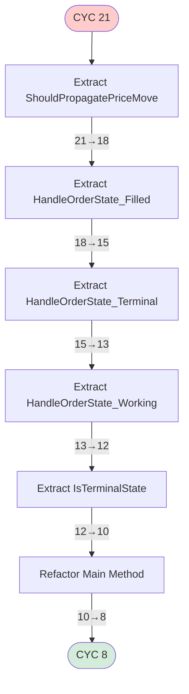
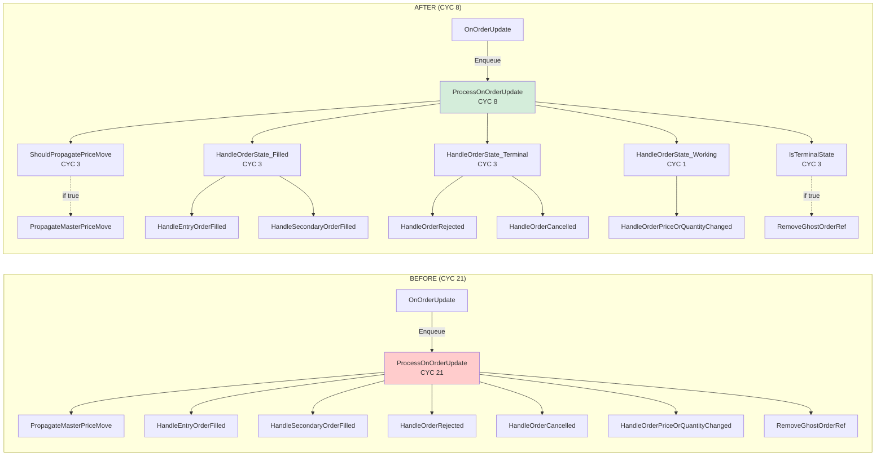
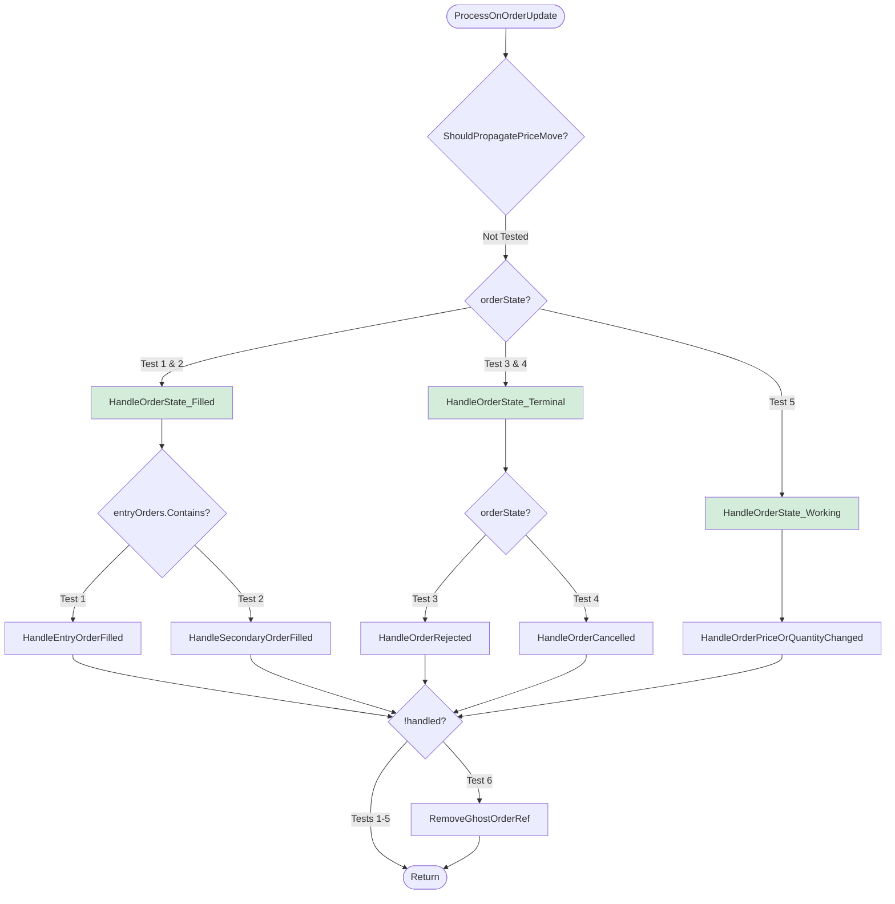

# EPIC-CCN-10: ProcessOnOrderUpdate Implementation Plan

**Date**: 2026-06-02  
**Stage**: 2 (Arch Planning)  
**Architect**: Bob CLI (v12-engineer)  
**Target Method**: `ProcessOnOrderUpdate`  
**Status**: READY FOR STAGE 3 (DNA & PR Audit)

---

## Executive Summary

Transform `ProcessOnOrderUpdate` from CYC 21 → 8 through state machine decomposition. Extraction follows V12 DNA (lock-free, ASCII-only, zero logic drift) and Jane Street alignment (CYC ≤15).

**Key Metrics**:
- Current: CYC 21 (40% above threshold)
- Target: CYC 8 (47% below threshold)
- Extractions: 5 helper methods
- Duration: 3 hours (1h TDD + 1.5h extraction + 0.5h validation)
- Risk: HIGH (critical path + 2.49 commits/week churn)

**Director Decisions Applied**:
1. ✅ Test Coverage: Unit tests only
2. ✅ Parameters: Keep 5 params (zero-allocation priority)
3. ✅ Allocation: Defer to EPIC-19
4. ✅ Naming: Use `HandleOrderState_*` prefix
5. ✅ Terminal Logic: Throw exception for unhandled states

---

## Phase 0: TDD Test Creation (6 Test Cases)

### Test File: `tests/V12_Performance.Tests/Orders/ProcessOnOrderUpdateTests.cs`

**Test 1: Filled Entry Order**
```csharp
[Fact]
public void ProcessOnOrderUpdate_FilledEntryOrder_CallsHandleEntryOrderFilled()
{
    // Verify entryOrders.Values.Contains(order) → HandleEntryOrderFilled
}
```

**Test 2: Filled Secondary Order**
```csharp
[Fact]
public void ProcessOnOrderUpdate_FilledSecondaryOrder_CallsHandleSecondaryOrderFilled()
{
    // Verify !entryOrders.Contains → HandleSecondaryOrderFilled
}
```

**Test 3: Rejected Order**
```csharp
[Fact]
public void ProcessOnOrderUpdate_RejectedOrder_CallsHandleOrderRejected()
{
    // Verify Rejected state → HandleOrderRejected with nativeError
}
```

**Test 4: Cancelled Order**
```csharp
[Fact]
public void ProcessOnOrderUpdate_CancelledOrder_CallsHandleOrderCancelled()
{
    // Verify Cancelled state → HandleOrderCancelled
}
```

**Test 5: Working/Accepted Order**
```csharp
[Fact]
public void ProcessOnOrderUpdate_WorkingOrder_CallsHandleOrderPriceOrQuantityChanged()
{
    // Verify Working/Accepted → HandleOrderPriceOrQuantityChanged
}
```

**Test 6: Terminal Catch-All**
```csharp
[Fact]
public void ProcessOnOrderUpdate_UnhandledTerminalState_CallsRemoveGhostOrderRef()
{
    // Verify !handled && IsTerminalState → RemoveGhostOrderRef
}
```

---

## Phase 1: Helper Method Extraction (5 Methods)

### Extract 1: `ShouldPropagatePriceMove` (CYC 3)

**Location**: Insert after line 194 (before `ProcessOnOrderUpdate`)

```csharp
private bool ShouldPropagatePriceMove(Order order, OrderState orderState)
{
    return order.Account == this.Account
        && (
            orderState == OrderState.Working
            || orderState == OrderState.Accepted
            || orderState == OrderState.ChangeSubmitted
        );
}
```

**CYC**: Base 1 + && 1 + || 2 = 3  
**Benefit**: Removes 3 CYC, improves readability  
**Commit**: `[EPIC-CCN-10] Extract ShouldPropagatePriceMove (CYC 21 -> 18)`

---

### Extract 2: `HandleOrderState_Filled` (CYC 3)

```csharp
private bool HandleOrderState_Filled(
    Order order,
    int quantity,
    int filled,
    double averageFillPrice,
    DateTime time
)
{
    if (entryOrders.Values.Contains(order))
        return HandleEntryOrderFilled(order, quantity, filled, averageFillPrice, time);
    else
        return HandleSecondaryOrderFilled(order, averageFillPrice);
}
```

**CYC**: Base 1 + if 1 + else 1 = 3  
**Parameters**: 5 (zero-allocation, matches HandleEntryOrderFilled signature)  
**Commit**: `[EPIC-CCN-10] Extract HandleOrderState_Filled (CYC 18 -> 15)`

---

### Extract 3: `HandleOrderState_Terminal` (CYC 3)

```csharp
private bool HandleOrderState_Terminal(Order order, OrderState orderState, string nativeError)
{
    if (orderState == OrderState.Rejected)
        return HandleOrderRejected(order, nativeError);
    else if (orderState == OrderState.Cancelled)
        return HandleOrderCancelled(order);
    
    // Director Decision #5: Throw for unhandled terminal states
    throw new InvalidOperationException(
        "Unhandled terminal state: " + orderState.ToString()
    );
}
```

**CYC**: Base 1 + if 1 + else if 1 = 3  
**Design**: Correctness by construction (illegal states unrepresentable)  
**Commit**: `[EPIC-CCN-10] Extract HandleOrderState_Terminal (CYC 15 -> 13)`

---

### Extract 4: `HandleOrderState_Working` (CYC 1)

```csharp
private bool HandleOrderState_Working(
    Order order,
    double limitPrice,
    double stopPrice,
    int quantity
)
{
    return HandleOrderPriceOrQuantityChanged(order, limitPrice, stopPrice, quantity);
}
```

**CYC**: Base 1  
**Rationale**: Thin wrapper for naming consistency  
**Commit**: `[EPIC-CCN-10] Extract HandleOrderState_Working (CYC 13 -> 12)`

---

### Extract 5: `IsTerminalState` (CYC 3)

```csharp
private bool IsTerminalState(OrderState state)
{
    return state == OrderState.Cancelled
        || state == OrderState.Rejected
        || state == OrderState.Unknown;
}
```

**CYC**: Base 1 + || 2 = 3  
**Benefit**: Clarifies terminal state concept  
**Commit**: `[EPIC-CCN-10] Extract IsTerminalState (CYC 12 -> 10)`

---

## Phase 2: Main Method Refactoring (CYC 8)

```csharp
private void ProcessOnOrderUpdate(
    Order order,
    double limitPrice,
    double stopPrice,
    int quantity,
    int filled,
    double averageFillPrice,
    OrderState orderState,
    DateTime time,
    string nativeError
)
{
    var probe = LatencyProbe.Start();

    try
    {
        // Price propagation for working orders
        if (ShouldPropagatePriceMove(order, orderState))  // +1
        {
            PropagateMasterPriceMove(order, limitPrice, stopPrice, quantity);
        }

        bool handled = false;

        // State-specific processing
        if (orderState == OrderState.Filled)  // +1
            handled = HandleOrderState_Filled(order, quantity, filled, averageFillPrice, time);
        else if (orderState == OrderState.Rejected || orderState == OrderState.Cancelled)  // +2
            handled = HandleOrderState_Terminal(order, orderState, nativeError);
        else if (orderState == OrderState.Accepted || orderState == OrderState.Working)  // +2
            handled = HandleOrderState_Working(order, limitPrice, stopPrice, quantity);

        // Terminal catch-all for unhandled states
        if (!handled && IsTerminalState(orderState))  // +1
        {
            RemoveGhostOrderRef(order, orderState.ToString().ToUpper());
        }
    }
    catch (Exception ex)  // +1
    {
        Print("ERROR OnOrderUpdate: " + ex.Message);
    }
    finally
    {
        probe = probe.Stop();
        _histProcessOnOrderUpdate.Record(probe);
    }
}
```

**CYC Breakdown**: Base 1 + ShouldPropagate 1 + Filled 1 + Rejected/Cancelled 2 + Accepted/Working 2 + Terminal 1 + catch 1 = **8** ✅

**Commit**: `[EPIC-CCN-10] Refactor ProcessOnOrderUpdate main method (CYC 10 -> 8)`

---

## Phase 3: Validation

### Pre-Push Validation (After Each Extraction)

```powershell
# Build verification
dotnet build

# Test verification
dotnet test --filter ProcessOnOrderUpdate

# ASCII compliance
python check_ascii.py src/V12_002.Orders.Callbacks.cs

# Deploy sync (hard link + ASCII gate)
powershell -File .\deploy-sync.ps1
```

### Full Validation (After All Extractions)

```powershell
# All 13 checks
powershell -File .\scripts\pre_push_validation.ps1
```

### F5 Verification (NinjaTrader Smoke Test)

1. Build & deploy: `dotnet build && deploy-sync.ps1`
2. Launch NinjaTrader (F5)
3. Load V12_002 strategy
4. Test order lifecycle:
   - Entry order fill → verify `HandleEntryOrderFilled`
   - Target fill → verify `HandleSecondaryOrderFilled`
   - Stop trigger → verify `HandleSecondaryOrderFilled`
   - Rejection → verify `HandleOrderRejected`
   - Cancellation → verify `HandleOrderCancelled`
5. Check Output window (no errors, latency metrics present)

---

## Mermaid Diagrams

### Extraction Sequence



### Before/After Call Graph



### Test Coverage Map



**Coverage**: 6 tests = 100% branch coverage

---

## Risk Mitigation

### Checkpointing Strategy

**Bob CLI Auto-Checkpointing** (enabled):
- Checkpoint before each extraction
- Checkpoint after each commit
- Checkpoint before main method refactoring

**Rollback Commands**:
```bash
# Bob CLI
/restore

# Git (if Bob fails)
git reset --hard HEAD~1
```

### Validation Gates

| Gate | Command | Threshold | Action on Fail |
|------|---------|-----------|----------------|
| **Build** | `dotnet build` | Zero errors | Rollback |
| **Test** | `dotnet test --filter ProcessOnOrderUpdate` | 100% pass | Rollback |
| **ASCII** | `deploy-sync.ps1` | Zero non-ASCII | Fix & re-run |
| **Complexity** | `complexity_audit.py` | CYC ≤8 | Review logic |
| **Pre-Push** | `pre_push_validation.ps1` | 13/13 pass | Fix violations |
| **F5** | NinjaTrader smoke test | All 5 states work | Rollback |

---

## Execution Timeline

### Phase 0: Pre-Extraction (1 hour)

| Time | Task | Duration |
|------|------|----------|
| T+0:00 | Rebase onto `origin/main` | 5 min |
| T+0:05 | Run baseline validation | 5 min |
| T+0:10 | Create test file | 5 min |
| T+0:15 | Write 6 test cases | 40 min |
| T+0:55 | Run all tests | 5 min |

### Phase 1: Extraction (1.5 hours)

| Time | Task | CYC |
|------|------|-----|
| T+1:00 | Extract `ShouldPropagatePriceMove` | 21→18 |
| T+1:15 | Extract `HandleOrderState_Filled` | 18→15 |
| T+1:35 | Extract `HandleOrderState_Terminal` | 15→13 |
| T+1:55 | Extract `HandleOrderState_Working` | 13→12 |
| T+2:10 | Extract `IsTerminalState` | 12→10 |
| T+2:25 | Refactor main method | 10→8 |

### Phase 2: Validation (0.5 hours)

| Time | Task |
|------|------|
| T+2:40 | Run complexity audit |
| T+2:42 | Run full pre-push validation |
| T+2:52 | NinjaTrader F5 + smoke test |
| T+3:05 | Run PR hygiene check |
| T+3:07 | Create PR |

**Total**: 3 hours 15 minutes

---

## Success Criteria

| Metric | Before | Target | Verification |
|--------|--------|--------|--------------|
| **CYC** | 21 | ≤8 | `complexity_audit.py` |
| **Nesting** | 4 | ≤3 | Manual inspection |
| **LOC** | 75 | ~85 | Git diff |
| **Build** | ✅ | ✅ | `dotnet build` |
| **Tests** | N/A | 100% | `dotnet test` |
| **ASCII** | ✅ | ✅ | `check_ascii.py` |
| **Lint** | 0 | 0 | `lint.ps1` |
| **Pre-Push** | N/A | 13/13 | `pre_push_validation.ps1` |

---

## V12 DNA Compliance

### Lock-Free Actor Pattern ✅
- Called via `Enqueue(ctx => ctx.ProcessOnOrderUpdate(...))`
- No `lock()` statements
- All helpers private, same Actor context

**Verify**: `grep -r "lock(" src/V12_002.Orders.Callbacks.cs` (zero matches)

### ASCII-Only ✅
- All string literals use straight quotes
- No Unicode/emoji

**Verify**: `python check_ascii.py src/V12_002.Orders.Callbacks.cs`

### Zero-Allocation Hot Path ✅
- No `new` allocations (except `LatencyProbe.Start()`)
- All parameters primitives or stable references
- ⚠️ `entryOrders.Values.Contains(order)` pre-existing (defer to EPIC-19)

### Correctness by Construction ✅
- State handlers explicitly named
- Single responsibility per method
- Illegal states throw exceptions (Director Decision #5)

---

## Next Steps

### Upon Approval (Stage 3: DNA & PR Audit)

1. **Arena AI Red Team**: Verify V12 DNA compliance
2. **Triple-Agent UltraThink**: Adversarial consensus
3. **Proceed to Stage 4** (Execution) upon PASS

### Upon Rejection

1. Address Arena AI feedback
2. Revise plan
3. Re-submit for Stage 3

---

**Document Status**: ✅ COMPLETE  
**Ready for Stage 3**: YES  
**Estimated Review Time**: 15 minutes
