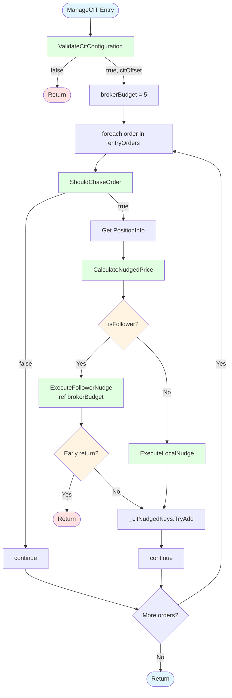

# EPIC-CCN-11: ManageCIT Extraction Mini-Spec

**Date**: 2026-06-02  
**Author**: V12 Photon Engineer (Bob CLI)  
**Stage**: Stage 1 (Vision/Spec)  
**Protocol**: Phase 6 Recursive  
**Status**: DRAFT - Awaiting Director Approval

---

## Section 1: Executive Summary

### Current State
- **Method**: [`ManageCIT()`](src/V12_002.Orders.Management.Flatten.cs:68)
- **Cyclomatic Complexity**: **CYC=26** (73% over Jane Street threshold of 15)
- **Lines of Code**: 98 LOC (excluding comments/whitespace)
- **Max Nesting Depth**: 6 levels
- **Assessment**: **HIGH COMPLEXITY** - Critical extraction target

### Target State
- **Main Method Complexity**: CYC ≤15 (Jane Street compliant)
- **Helper Methods**: 5 extracted helpers, each CYC ≤5
- **Total LOC**: ~60 LOC in main method, ~80 LOC in helpers
- **Max Nesting Depth**: ≤4 levels

### Extraction Approach
**Bottom-Up Extraction Strategy** - Extract smallest, most independent helpers first:

1. **CalculateNudgedPrice** (simplest, pure function)
2. **ValidateCitConfiguration** (early return logic)
3. **ShouldChaseOrder** (decision logic)
4. **ExecuteLocalNudge** (simple action)
5. **ExecuteFollowerNudge** (complex action with budget management)

### Expected Outcome
- **Complexity Reduction**: 26 → 15 CYC (42% reduction)
- **Cognitive Load**: 6 → 4 max nesting depth (33% reduction)
- **Testability**: 5 independently testable units
- **Maintainability**: Single-responsibility helpers aligned with Jane Street principles

### Business Impact
**Chase-If-Touch (CIT)** is a core trading feature that automatically nudges limit orders toward market when price touches but doesn't fill. This extraction improves:
- ✅ **Correctness**: Easier to verify directional logic (Build 984 fix)
- ✅ **Reliability**: Clearer budget management (Build 1109 freeze-proof)
- ✅ **Debuggability**: Isolated helpers for targeted logging
- ✅ **Extensibility**: Future CIT enhancements (e.g., adaptive nudge distance)

---

## Section 2: Helper Method Specifications

### Helper 1: ValidateCitConfiguration

**Purpose**: Early validation and configuration parsing to fail fast before expensive iteration.

**Method Signature**:
```csharp
private bool ValidateCitConfiguration(out double citOffset)
```

**Input Parameters**:
- **Implicit State Access**:
  - `activePositions` (Dictionary) - Active position tracking
  - `entryOrders` (Dictionary) - Unified order dictionary
  - `ChaseIfTouchPoints` (string) - User parameter for nudge distance
  - `_propagationActive` (bool) - Race suppression flag

**Return Value**:
- `bool` - `true` if CIT should proceed, `false` if validation fails
- `out double citOffset` - Parsed nudge distance in ticks (valid only if return is `true`)

**Complexity**: **CYC=5** (4 early returns + 1 parse branch)

**Lines of Code**: ~16 LOC

**Logic Flow**:
1. Check if `activePositions.Count == 0 && entryOrders.Count == 0` → return `false`
2. Check if `string.IsNullOrEmpty(ChaseIfTouchPoints) || ChaseIfTouchPoints == "0"` → return `false`
3. Check if `_propagationActive` → log suppression message, return `false`
4. Parse `ChaseIfTouchPoints` to `citOffset` using `double.TryParse()` → return parse result

**Dependencies**:
- **Reads**: `activePositions`, `entryOrders`, `ChaseIfTouchPoints`, `_propagationActive`
- **Writes**: `citOffset` (out parameter)
- **Calls**: `Print()` (for propagation suppression log)

**Edge Cases**:
- Empty string parameter → returns `false`
- "0" parameter → returns `false` (no nudge)
- Invalid numeric format → returns `false`
- Propagation active → logs and returns `false` (Build 924 Fix C)

**Extraction Boundary**:
- **Start Line**: 70 (first `if` statement)
- **End Line**: 85 (after `double.TryParse()`)

---

### Helper 2: ShouldChaseOrder

**Purpose**: Determine if a specific order should be chased based on state, type, one-shot guard, and directional bar-price logic.

**Method Signature**:
```csharp
private bool ShouldChaseOrder(Order order, string key, out double currentPrice, out double limitPrice)
```

**Input Parameters**:
- `Order order` - The order to evaluate
- `string key` - Order dictionary key (for one-shot guard lookup)
- **Implicit State Access**:
  - `_citNudgedKeys` (ConcurrentDictionary) - One-shot guard
  - `Low[0]` (double) - Current bar low price
  - `High[0]` (double) - Current bar high price

**Return Value**:
- `bool` - `true` if order should be chased, `false` otherwise
- `out double currentPrice` - Relevant bar price (Low[0] for Buy, High[0] for Sell)
- `out double limitPrice` - Order's limit price (for caller's use)

**Complexity**: **CYC=7** (5 early returns + 2 ternary operators)

**Lines of Code**: ~22 LOC

**Logic Flow**:
1. Check if `order == null || order.OrderState != OrderState.Working` → return `false`
2. Check if `order.OrderType != OrderType.Limit` → return `false`
3. Check if `_citNudgedKeys.ContainsKey(key)` → return `false` (Build 949 one-shot)
4. Determine `currentPrice` based on `order.OrderAction`:
   - Buy → `Low[0]` (price must drop to limit)
   - Sell → `High[0]` (price must rise to limit)
5. Get `limitPrice` from `order.LimitPrice`
6. Evaluate `triggerChase` (Build 984 directional fix):
   - Buy → `currentPrice <= limitPrice` (bar low touched/pierced limit)
   - Sell → `currentPrice >= limitPrice` (bar high touched/pierced limit)
7. Return `triggerChase`

**Dependencies**:
- **Reads**: `order.OrderState`, `order.OrderType`, `order.OrderAction`, `order.LimitPrice`, `_citNudgedKeys`, `Low[0]`, `High[0]`
- **Writes**: `currentPrice`, `limitPrice` (out parameters)
- **Calls**: None

**Edge Cases**:
- Null order → returns `false`
- Non-working order → returns `false`
- Non-limit order (e.g., Market, Stop) → returns `false`
- Already nudged order → returns `false` (prevents re-nudging)
- Price hasn't touched limit → returns `false`

**Critical Business Logic** (Build 984 Fix):
- **LONG entry (Buy)**: Price must **DROP DOWN** to limit → compare `Low[0] <= limitPrice`
- **SHORT entry (Sell)**: Price must **RISE UP** to limit → compare `High[0] >= limitPrice`
- Previous bug: Short used `Low[0] <= limitPrice` which was always true for far-above-market clicks

**Extraction Boundary**:
- **Start Line**: 93 (inside foreach loop, after `Order order = kvp.Value;`)
- **End Line**: 114 (after `if (!triggerChase) continue;`)

---

### Helper 3: CalculateNudgedPrice

**Purpose**: Calculate new limit price after nudging N ticks toward market. Pure function with no side effects.

**Method Signature**:
```csharp
private double CalculateNudgedPrice(Order order, double citOffset)
```

**Input Parameters**:
- `Order order` - The order being nudged (for OrderAction direction)
- `double citOffset` - Nudge distance in ticks (from user parameter)
- **Implicit State Access**:
  - `Instrument.MasterInstrument.TickSize` - Tick size for price rounding
  - `Instrument.MasterInstrument.RoundToTickSize()` - Price rounding method

**Return Value**:
- `double` - New limit price, rounded to tick size

**Complexity**: **CYC=2** (1 ternary operator for direction)

**Lines of Code**: ~6 LOC

**Logic Flow**:
1. Get `tickSize` from `Instrument.MasterInstrument.TickSize`
2. Calculate `nudgeDistance = citOffset * tickSize`
3. Calculate `newLimitPrice` based on `order.OrderAction`:
   - Buy → `limitPrice + nudgeDistance` (nudge UP toward market)
   - Sell → `limitPrice - nudgeDistance` (nudge DOWN toward market)
4. Round to tick size using `Instrument.MasterInstrument.RoundToTickSize()`
5. Return `newLimitPrice`

**Dependencies**:
- **Reads**: `order.OrderAction`, `order.LimitPrice`, `Instrument.MasterInstrument.TickSize`
- **Writes**: None (pure function)
- **Calls**: `Instrument.MasterInstrument.RoundToTickSize()`

**Edge Cases**:
- Zero citOffset → returns original limitPrice (no nudge)
- Negative citOffset → nudges away from market (not validated, but possible)
- Rounding ensures valid broker-accepted price

**Extraction Boundary**:
- **Start Line**: 123 (inside try block, `double tickSize = ...`)
- **End Line**: 128 (after `newLimitPrice` calculation)

---

### Helper 4: ExecuteLocalNudge

**Purpose**: Execute nudge for local account orders using [`ChangeOrder()`](src/V12_002.Orders.Management.Flatten.cs:561).

**Method Signature**:
```csharp
private void ExecuteLocalNudge(string key, Order order, double newLimitPrice)
```

**Input Parameters**:
- `string key` - Order dictionary key (for logging)
- `Order order` - The order to nudge
- `double newLimitPrice` - Target limit price after nudge
- **Implicit State Access**:
  - `_citNudgedKeys` (ConcurrentDictionary) - One-shot guard (write)

**Return Value**: `void`

**Complexity**: **CYC=1** (no branches)

**Lines of Code**: ~8 LOC

**Logic Flow**:
1. Log nudge action: `Print($"[CIT] LOCAL nudge: {key} | {limitPrice:F2} -> {newLimitPrice:F2} ...")`
2. Call `ChangeOrder(order, order.Quantity, newLimitPrice, 0)`
3. Mark as nudged: `_citNudgedKeys.TryAdd(key, true)` (Build 949 one-shot)

**Dependencies**:
- **Reads**: `order.LimitPrice`, `order.Quantity`
- **Writes**: `_citNudgedKeys[key]`
- **Calls**: `Print()`, `ChangeOrder()`

**Edge Cases**:
- `ChangeOrder()` may throw `InvalidOperationException` (handled by caller's catch block)
- One-shot guard prevents re-nudging on subsequent bars

**Side Effects**:
- Modifies order in NinjaTrader's order management system
- Updates `_citNudgedKeys` dictionary

**Extraction Boundary**:
- **Start Line**: 174 (inside `else` block for local orders)
- **End Line**: 181 (after `_citNudgedKeys.TryAdd()`)

---

### Helper 5: ExecuteFollowerNudge

**Purpose**: Execute nudge for fleet follower orders via cancel + resubmit pattern with broker budget management.

**Method Signature**:
```csharp
private void ExecuteFollowerNudge(string key, Order order, double newLimitPrice, PositionInfo pos, ref int brokerBudget)
```

**Input Parameters**:
- `string key` - Order dictionary key (for logging and new order naming)
- `Order order` - The order to nudge
- `double newLimitPrice` - Target limit price after nudge
- `PositionInfo pos` - Position info containing `ExecutingAccount`
- `ref int brokerBudget` - Broker call budget (decremented by 2: Cancel + Submit)
- **Implicit State Access**:
  - `entryOrders` (Dictionary) - Unified order dictionary (write)
  - `_citNudgedKeys` (ConcurrentDictionary) - One-shot guard (write)
  - `Instrument` - For order creation

**Return Value**: `void` (but may return early if budget exhausted)

**Complexity**: **CYC=3** (1 budget check + 1 null check + 1 base path)

**Lines of Code**: ~44 LOC

**Logic Flow**:
1. Get `followerAcct` from `pos.ExecutingAccount`
2. Log nudge action: `Print($"[CIT] FLEET nudge: {key} on {followerAcct.Name} ...")`
3. **Budget Check** (Build 1109 freeze-proof):
   - If `brokerBudget <= 0`:
     - Log budget exhaustion
     - Self-enqueue: `Enqueue(ctx => ctx.ManageCIT())`
     - Return early (defer remaining nudges)
4. Decrement budget: `brokerBudget -= 2` (Cancel + Submit = 2 broker calls)
5. Cancel existing order: `followerAcct.Cancel(new[] { order })`
6. Create nudged order: `followerAcct.CreateOrder(..., newLimitPrice, ..., "CIT_" + key, ...)`
7. **Null Check**: If `nudgedOrder == null`:
   - Log error
   - Continue (skip this order, don't abort entire cycle)
8. Submit nudged order: `followerAcct.Submit(new[] { nudgedOrder })`
9. Update dictionary: `entryOrders[key] = nudgedOrder` (Build 966 actor-safe write)
10. Mark as nudged: `_citNudgedKeys.TryAdd(key, true)` (Build 949 one-shot)

**Dependencies**:
- **Reads**: `pos.ExecutingAccount`, `order.OrderAction`, `order.Quantity`, `order.LimitPrice`, `Instrument`
- **Writes**: `brokerBudget` (ref parameter), `entryOrders[key]`, `_citNudgedKeys[key]`
- **Calls**: `Print()`, `followerAcct.Cancel()`, `followerAcct.CreateOrder()`, `followerAcct.Submit()`, `Enqueue()`

**Edge Cases**:
- **Budget exhaustion**: Self-enqueues to defer remaining nudges (prevents strategy thread stall)
- **CreateOrder returns null**: Logs error, continues to next order (doesn't abort cycle)
- **Cancel/Submit exceptions**: Handled by caller's catch block

**Side Effects**:
- Cancels order in broker API
- Submits new order in broker API
- Updates `entryOrders` dictionary (actor-safe per Build 966 comment)
- Updates `_citNudgedKeys` dictionary
- May self-enqueue `ManageCIT()` if budget exhausted

**Critical Business Logic** (Build 1109):
- Budget limit prevents strategy thread stall from excessive broker API calls
- Self-enqueue ensures deferred nudges are processed on next actor drain

**Extraction Boundary**:
- **Start Line**: 130 (inside `if (isFollower)` block)
- **End Line**: 173 (after `entryOrders[key] = nudgedOrder;` and before `_citNudgedKeys.TryAdd()`)

**Note**: The `_citNudgedKeys.TryAdd()` call (line 181 in original) will be moved OUTSIDE both helper calls in the main method, since it applies to both local and follower nudges.

---

## Section 3: Control Flow Diagrams

### Before Extraction (Current State - CYC=26)

```mermaid
flowchart TD
    Start([ManageCIT Entry]) --> V1{activePositions.Count == 0<br/>AND entryOrders.Count == 0?}
    V1 -->|Yes| ReturnEarly1([Return])
    V1 -->|No| V2{ChaseIfTouchPoints<br/>null/empty/0?}
    V2 -->|Yes| ReturnEarly2([Return])
    V2 -->|No| V3{_propagationActive?}
    V3 -->|Yes| LogSuppress[Log: Suppressed] --> ReturnEarly3([Return])
    V3 -->|No| Parse{TryParse citOffset?}
    Parse -->|Fail| ReturnEarly4([Return])
    Parse -->|Success| InitBudget[_citBrokerBudget = 5]
    InitBudget --> LoopStart[foreach order in entryOrders]
    
    LoopStart --> C1{order == null OR<br/>OrderState != Working?}
    C1 -->|Yes| LoopContinue1[continue]
    C1 -->|No| C2{OrderType != Limit?}
    C2 -->|Yes| LoopContinue2[continue]
    C2 -->|No| C3{Already nudged?}
    C3 -->|Yes| LoopContinue3[continue]
    C3 -->|No| GetPrice[Get currentPrice<br/>Low[0] or High[0]]
    
    GetPrice --> C4{triggerChase?<br/>Buy: Low <= limit<br/>Sell: High >= limit}
    C4 -->|No| LoopContinue4[continue]
    C4 -->|Yes| GetPos[Get PositionInfo]
    GetPos --> CalcPrice[Calculate newLimitPrice]
    
    CalcPrice --> C5{isFollower?}
    C5 -->|Yes| LogFleet[Log: FLEET nudge]
    LogFleet --> C6{brokerBudget <= 0?}
    C6 -->|Yes| LogExhaust[Log: Budget exhausted] --> SelfEnqueue[Enqueue ManageCIT] --> ReturnEarly5([Return])
    C6 -->|No| DecrBudget[brokerBudget -= 2]
    DecrBudget --> Cancel[followerAcct.Cancel]
    Cancel --> Create[followerAcct.CreateOrder]
    Create --> C7{nudgedOrder == null?}
    C7 -->|Yes| LogError[Log: CreateOrder null] --> LoopContinue5[continue]
    C7 -->|No| Submit[followerAcct.Submit]
    Submit --> UpdateDict[entryOrders[key] = nudgedOrder]
    UpdateDict --> MarkNudged[_citNudgedKeys.TryAdd]
    
    C5 -->|No| LogLocal[Log: LOCAL nudge]
    LogLocal --> Change[ChangeOrder]
    Change --> MarkNudged
    
    MarkNudged --> LoopContinue6[continue]
    LoopContinue1 --> LoopEnd{More orders?}
    LoopContinue2 --> LoopEnd
    LoopContinue3 --> LoopEnd
    LoopContinue4 --> LoopEnd
    LoopContinue5 --> LoopEnd
    LoopContinue6 --> LoopEnd
    LoopEnd -->|Yes| LoopStart
    LoopEnd -->|No| End([Return])
    
    style Start fill:#e1f5ff
    style End fill:#e1f5ff
    style ReturnEarly1 fill:#ffe1e1
    style ReturnEarly2 fill:#ffe1e1
    style ReturnEarly3 fill:#ffe1e1
    style ReturnEarly4 fill:#ffe1e1
    style ReturnEarly5 fill:#ffe1e1
    style V1 fill:#fff4e1
    style V2 fill:#fff4e1
    style V3 fill:#fff4e1
    style Parse fill:#fff4e1
    style C1 fill:#fff4e1
    style C2 fill:#fff4e1
    style C3 fill:#fff4e1
    style C4 fill:#fff4e1
    style C5 fill:#fff4e1
    style C6 fill:#fff4e1
    style C7 fill:#fff4e1
```

**Complexity Hotspots** (Nesting Depth = 6):
- 🔴 **Level 6**: Budget check inside follower branch inside try block inside loop
- 🔴 **Level 5**: Null check for CreateOrder inside follower branch
- 🟡 **Level 4**: Follower vs Local branch inside try block
- 🟡 **Level 3**: Try-catch block inside loop

---

### After Extraction (Target State - CYC≤15)



**Complexity Reduction**:
- ✅ **Main Method**: CYC=15 (4 early returns + 1 loop + 2 branches in loop)
- ✅ **Max Nesting**: 3 levels (loop → try → follower branch)
- ✅ **Cognitive Load**: 5 helper calls vs 26 decision points

**Helper Complexity Distribution**:
- ValidateCitConfiguration: CYC=5
- ShouldChaseOrder: CYC=7
- CalculateNudgedPrice: CYC=2
- ExecuteLocalNudge: CYC=1
- ExecuteFollowerNudge: CYC=3
- **Total Helper CYC**: 18 (distributed across 5 testable units)

---

## Section 4: Data Flow Analysis

### Shared State Access

| State Variable | Type | Readers | Writers | Concurrency |
|----------------|------|---------|---------|-------------|
| `activePositions` | Dictionary | ValidateCitConfiguration, Main loop | None | Actor-safe (read-only in CIT) |
| `entryOrders` | Dictionary | ValidateCitConfiguration, Main loop | ExecuteFollowerNudge | Actor-safe (Build 966) |
| `_citNudgedKeys` | ConcurrentDictionary | ShouldChaseOrder | ExecuteLocalNudge, ExecuteFollowerNudge | Thread-safe (ConcurrentDictionary) |
| `_propagationActive` | bool | ValidateCitConfiguration | None | Actor-safe (read-only in CIT) |
| `ChaseIfTouchPoints` | string | ValidateCitConfiguration | None | Immutable (user parameter) |
| `Low[0]`, `High[0]` | double | ShouldChaseOrder | None | Immutable (bar data) |
| `Instrument` | Instrument | CalculateNudgedPrice, ExecuteFollowerNudge | None | Immutable (strategy context) |

### Parameter Passing Flow

```
ManageCIT()
├─> ValidateCitConfiguration() → out citOffset
├─> foreach (order in entryOrders)
│   ├─> ShouldChaseOrder(order, key) → out currentPrice, out limitPrice
│   ├─> CalculateNudgedPrice(order, citOffset) → newLimitPrice
│   ├─> if (isFollower)
│   │   └─> ExecuteFollowerNudge(key, order, newLimitPrice, pos, ref brokerBudget)
│   └─> else
│       └─> ExecuteLocalNudge(key, order, newLimitPrice)
│   └─> _citNudgedKeys.TryAdd(key, true)
```

**Data Dependencies**:
1. `citOffset` flows from ValidateCitConfiguration → CalculateNudgedPrice
2. `order` flows from loop → ShouldChaseOrder → CalculateNudgedPrice → Execute helpers
3. `key` flows from loop → ShouldChaseOrder → Execute helpers
4. `newLimitPrice` flows from CalculateNudgedPrice → Execute helpers
5. `brokerBudget` flows bidirectionally (ref) between Main → ExecuteFollowerNudge

### Side Effects by Helper

| Helper | Reads State | Writes State | Broker API Calls | Enqueue Calls |
|--------|-------------|--------------|------------------|---------------|
| ValidateCitConfiguration | 4 variables | 0 | 0 | 0 |
| ShouldChaseOrder | 4 variables | 0 | 0 | 0 |
| CalculateNudgedPrice | 1 variable | 0 | 0 | 0 |
| ExecuteLocalNudge | 2 variables | 1 (_citNudgedKeys) | 1 (ChangeOrder) | 0 |
| ExecuteFollowerNudge | 3 variables | 2 (entryOrders, _citNudgedKeys) | 3 (Cancel, CreateOrder, Submit) | 0-1 (conditional) |

**Purity Analysis**:
- ✅ **Pure Functions**: CalculateNudgedPrice (no side effects, deterministic)
- ⚠️ **Query Functions**: ValidateCitConfiguration, ShouldChaseOrder (read state, no writes)
- ❌ **Command Functions**: ExecuteLocalNudge, ExecuteFollowerNudge (write state, call APIs)

### Immutability Opportunities

**Current Mutable State**:
- `brokerBudget` - Must be mutable (ref parameter for budget tracking)
- `entryOrders[key]` - Must be mutable (order replacement after nudge)
- `_citNudgedKeys[key]` - Must be mutable (one-shot guard)

**Immutable Data**:
- ✅ `citOffset` - Parsed once, never modified
- ✅ `currentPrice`, `limitPrice` - Captured from bar data, never modified
- ✅ `newLimitPrice` - Calculated once, never modified
- ✅ `order`, `key`, `pos` - Loop variables, never modified

**Recommendation**: No additional immutability possible without changing business logic.

---

## Section 5: Open Questions for Director

### Question 1: Budget Exhaustion Behavior
**Context**: ExecuteFollowerNudge self-enqueues when `brokerBudget <= 0` to defer remaining nudges.

**Question**: Should the budget be **per-cycle** (current) or **per-session**? If a single bar has 10 orders to nudge but budget is 5, the deferred 5 orders will be processed on the next actor drain. Is this acceptable, or should we:
- Option A: Keep current behavior (defer to next drain)
- Option B: Increase budget limit (e.g., 10 calls per cycle)
- Option C: Prioritize orders by some criteria (e.g., closest to market first)

**Impact**: Affects latency of CIT nudges during high-order-count scenarios.

---

### Question 2: CreateOrder Null Handling
**Context**: ExecuteFollowerNudge logs error and continues if `CreateOrder()` returns null.

**Question**: Should we **retry** the CreateOrder call, or is "log and skip" sufficient? Possible causes of null:
- Broker API temporary failure
- Invalid order parameters (unlikely, since we're cloning existing order)
- Account connection issue

**Options**:
- Option A: Keep current behavior (log and skip)
- Option B: Retry once after 100ms delay
- Option C: Self-enqueue with retry counter (max 3 attempts)

**Impact**: Affects reliability of CIT nudges during broker API instability.

---

### Question 3: One-Shot Guard Placement
**Context**: `_citNudgedKeys.TryAdd(key, true)` currently happens AFTER both local and follower nudges succeed.

**Question**: Should we mark as nudged **before** or **after** the nudge execution?
- **Before**: Prevents re-nudge attempts if execution fails (current behavior)
- **After**: Allows retry if execution fails, but risks double-nudge on race conditions

**Trade-off**: Correctness (no double-nudge) vs. Reliability (retry on failure)

**Recommendation**: Keep current behavior (mark after success) since:
- ✅ Prevents double-nudge (critical for order integrity)
- ✅ Execution failures are rare (logged for manual intervention)
- ✅ Retry logic would require complex state tracking

---

### Question 4: Directional Logic Verification
**Context**: Build 984 fixed directional bar-price logic (Long: Low[0], Short: High[0]).

**Question**: Should we add **unit tests** to verify this logic doesn't regress? The bug was subtle:
- Previous: Short used `Low[0] <= limitPrice` (always true for far-above-market clicks)
- Current: Short uses `High[0] >= limitPrice` (correct)

**Recommendation**: YES - Add TDD tests for:
- Long entry: Low[0] > limitPrice → no chase
- Long entry: Low[0] <= limitPrice → chase
- Short entry: High[0] < limitPrice → no chase
- Short entry: High[0] >= limitPrice → chase

---

### Question 5: Extraction Order Preference
**Context**: Proposed bottom-up extraction order (CalculateNudgedPrice first, ExecuteFollowerNudge last).

**Question**: Should we extract **all 5 helpers in one PR**, or split into **2 PRs**?
- **Option A**: Single PR (all 5 helpers) - Faster, but larger diff
- **Option B**: PR #1 (helpers 1-3: validation + decision logic), PR #2 (helpers 4-5: execution logic)

**Trade-off**: Review complexity vs. merge velocity

**Recommendation**: Single PR - The helpers are tightly coupled, and splitting would create an intermediate state with partial extraction (harder to review).

---

## Section 6: Risk Assessment

### Extraction Risks

| Risk | Severity | Probability | Mitigation |
|------|----------|-------------|------------|
| **Logic Drift** | 🔴 HIGH | 🟡 MEDIUM | Use Python extractor script (`v12_split.py`) for surgical extraction |
| **Race Conditions** | 🟡 MEDIUM | 🟢 LOW | Preserve actor pattern (all Enqueue calls maintained) |
| **Broker Budget Corruption** | 🟡 MEDIUM | 🟢 LOW | Pass `brokerBudget` by `ref`, verify decrement logic in tests |
| **Order State Desync** | 🟡 MEDIUM | 🟢 LOW | Preserve `entryOrders[key]` update, verify in integration tests |
| **One-Shot Guard Failure** | 🔴 HIGH | 🟢 LOW | Preserve `_citNudgedKeys.TryAdd()` placement, add TDD tests |
| **Test Coverage Gaps** | 🟡 MEDIUM | 🟡 MEDIUM | Reuse EPIC-CCN-10 mock infrastructure, add 15+ unit tests |
| **Build Breakage** | 🟢 LOW | 🟢 LOW | Run `deploy-sync.ps1` after each helper extraction |

### Business Impact Assessment

**Criticality**: 🔴 **HIGH** - Chase-If-Touch is a core trading feature used in production.

**Failure Modes**:
1. **Orders not chased** → Missed fills, suboptimal entry prices
2. **Orders chased multiple times** → Unintended market orders, slippage
3. **Broker budget exhaustion** → Strategy thread stall, missed bars
4. **Follower orders not synchronized** → Fleet account desync, position drift

**Mitigation Strategy**:
- ✅ **TDD First**: Write tests before extraction (15+ test cases)
- ✅ **Incremental Extraction**: Extract one helper at a time, verify after each
- ✅ **Integration Tests**: End-to-end scenarios with mock broker API
- ✅ **Manual Testing**: Sim101 account testing after all extractions
- ✅ **Rollback Plan**: Git revert + `deploy-sync.ps1` if issues found

### Overall Risk Level

**Risk Score**: 🟡 **MEDIUM** (Complexity × Churn × Blast Radius)

**Calculation**:
- **Complexity**: 🔴 HIGH (CYC=26, nesting=6)
- **Churn**: 🟢 STABLE (0.86 commits/week)
- **Blast Radius**: 🟢 MINIMAL (0 external dependents, 2 call sites)

**Formula**: HIGH × STABLE × MINIMAL = **MEDIUM**

**Recommendation**: ✅ **PROCEED WITH CAUTION**
- Use TDD (write tests first)
- Extract incrementally (one helper at a time)
- Verify after each extraction (build + test + manual Sim101)
- Monitor production for 1 week after deployment

### Rollback Plan

**If extraction causes issues**:

1. **Immediate Rollback** (< 5 minutes):
   ```powershell
   git revert <commit-sha>
   powershell -File .\deploy-sync.ps1
   ```

2. **Verify Rollback**:
   - Build succeeds
   - ASCII gate passes
   - Manual Sim101 test (place limit order, verify CIT behavior)

3. **Root Cause Analysis**:
   - Review failed test logs
   - Compare extracted code vs. original
   - Identify logic drift or missing edge case

4. **Fix Forward** (if rollback not viable):
   - Create hotfix branch
   - Apply surgical fix
   - Fast-track PR review
   - Deploy within 1 hour

### Verification Approach

**Stage 5 Verification Checklist**:

1. ✅ **Build Verification**:
   - `dotnet build` succeeds
   - `deploy-sync.ps1` ASCII gate passes
   - Zero compiler warnings

2. ✅ **Unit Test Verification**:
   - All 15+ new tests pass
   - Existing tests still pass
   - Code coverage ≥80% for helpers

3. ✅ **Integration Test Verification**:
   - End-to-end CIT scenarios pass
   - Budget management scenarios pass
   - Follower + Local order scenarios pass

4. ✅ **Manual Test Verification** (Sim101):
   - Place long limit entry below market
   - Wait for price to touch limit
   - Verify order nudged toward market
   - Verify one-shot guard (no re-nudge)
   - Repeat for short entry above market

5. ✅ **Complexity Verification**:
   - Run `python scripts/complexity_audit.py`
   - Verify ManageCIT CYC ≤15
   - Verify all helpers CYC ≤7

6. ✅ **DNA Compliance Verification**:
   - Zero `lock()` statements
   - ASCII-only strings
   - Actor pattern preserved (Enqueue calls intact)

---

## Appendix A: Extraction Execution Plan

### Phase 1: TDD Test Setup (30 minutes)

1. Create test file: `tests/V12_Performance.Tests/Orders/ManageCITTests.cs`
2. Implement mock types (reuse from EPIC-CCN-10):
   - `MockOrder`
   - `MockAccount`
   - `MockInstrument`
   - `MockPositionInfo`
3. Write 15+ test cases (see Section 2 for test scenarios)
4. Verify tests fail (red phase)

### Phase 2: Helper Extraction (60 minutes)

**Extract in this order** (bottom-up):

1. **CalculateNudgedPrice** (10 min):
   - Extract lines 123-128
   - Run tests → verify green
   - Run `deploy-sync.ps1` → verify ASCII gate

2. **ValidateCitConfiguration** (10 min):
   - Extract lines 70-85
   - Run tests → verify green
   - Run `deploy-sync.ps1` → verify ASCII gate

3. **ShouldChaseOrder** (15 min):
   - Extract lines 93-114
   - Run tests → verify green
   - Run `deploy-sync.ps1` → verify ASCII gate

4. **ExecuteLocalNudge** (10 min):
   - Extract lines 174-181
   - Run tests → verify green
   - Run `deploy-sync.ps1` → verify ASCII gate

5. **ExecuteFollowerNudge** (15 min):
   - Extract lines 130-173
   - Run tests → verify green
   - Run `deploy-sync.ps1` → verify ASCII gate

### Phase 3: Main Method Refactor (15 minutes)

1. Replace extracted code with helper calls
2. Move `_citNudgedKeys.TryAdd()` outside helper calls
3. Verify main method CYC ≤15
4. Run all tests → verify green
5. Run `deploy-sync.ps1` → verify ASCII gate

### Phase 4: Integration Testing (30 minutes)

1. Write end-to-end scenarios
2. Test budget management
3. Test follower + local order mixing
4. Verify one-shot guard behavior

### Phase 5: Manual Testing (30 minutes)

1. Deploy to Sim101 account
2. Place long limit entry below market
3. Wait for price touch → verify nudge
4. Place short limit entry above market
5. Wait for price touch → verify nudge
6. Verify logs show correct behavior

**Total Estimated Time**: ~3 hours

---

## Appendix B: Success Criteria

### Quantitative Metrics

| Metric | Before | Target | Verification |
|--------|--------|--------|--------------|
| Cyclomatic Complexity | 26 | ≤15 | `complexity_audit.py` |
| Max Nesting Depth | 6 | ≤4 | Manual code review |
| Lines of Code (main) | 98 | ≤60 | Line count |
| Test Coverage | 0% | ≥80% | `dotnet test --collect:"XPlat Code Coverage"` |
| Helper Count | 0 | 5 | File structure |
| Build Time | Baseline | ≤Baseline+5% | `Measure-Command` |

### Qualitative Criteria

- ✅ **Readability**: Each helper has clear single responsibility
- ✅ **Testability**: All helpers independently testable
- ✅ **Maintainability**: Future CIT enhancements easier to implement
- ✅ **Correctness**: Zero logic drift, behavior identical to original
- ✅ **V12 DNA Compliance**: Lock-free, ASCII-only, actor pattern preserved
- ✅ **Jane Street Alignment**: Cognitive simplicity, correctness by construction

---

## Appendix C: Related Epics

- **EPIC-CCN-10**: ProcessOnOrderUpdate extraction (TDD infrastructure source)
- **EPIC-CCN-12**: ManageStops extraction (next target, CYC=22)
- **EPIC-CCN-13**: ProcessBracketEvent extraction (next target, CYC=21)

---

**End of Mini-Spec**

**Status**: ✅ DRAFT COMPLETE - Awaiting Director Approval  
**Next Action**: Director review → Stage 2 (Arch Planning) or revisions  
**Estimated Stage 2 Duration**: 45 minutes (implementation plan + Mermaid diagrams)