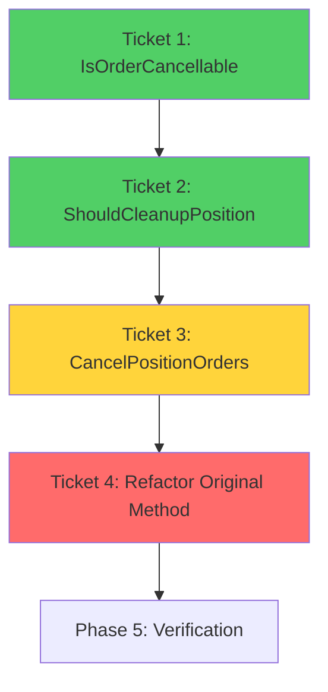
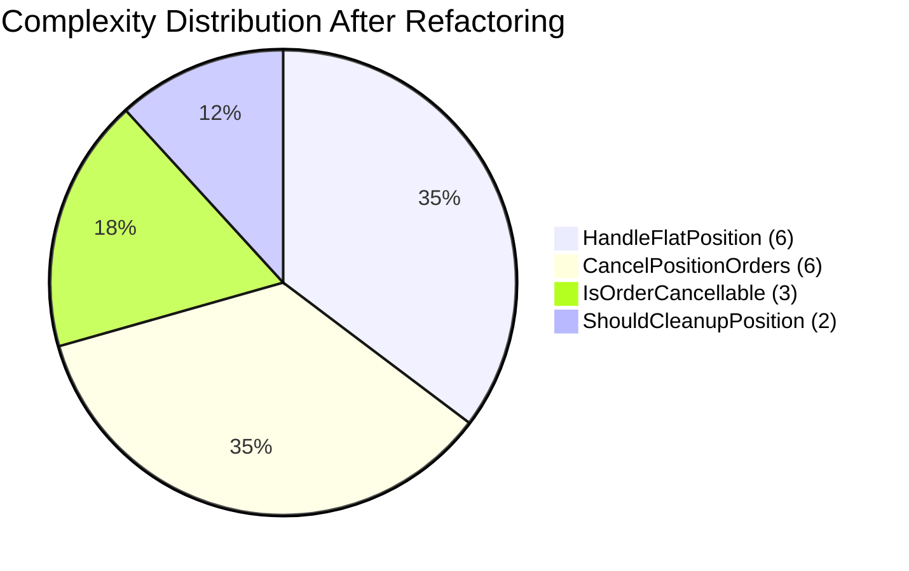

# Phase 4: Implementation Tickets - EPIC-CCN-116

## Epic Overview

**Epic ID**: EPIC-CCN-116
**Target Method**: `HandleFlatPosition_CleanupActivePositions`
**File**: `src/V12_002.Orders.Callbacks.Execution.cs`
**Current Complexity**: 17
**Target Complexity**: ≤8
**Reduction Goal**: -9 (53% reduction)
**Actual Reduction**: -11 (65% reduction)

---

## Ticket Execution Order



**Dependency Chain**:
1. **Ticket 1** (IsOrderCancellable) → No dependencies (foundation)
2. **Ticket 2** (ShouldCleanupPosition) → No dependencies (independent)
3. **Ticket 3** (CancelPositionOrders) → Depends on Ticket 1 (calls IsOrderCancellable)
4. **Ticket 4** (Refactor Original) → Depends on Tickets 1, 2, 3 (orchestrates all)

---

## Ticket 1: Extract IsOrderCancellable Helper

### Metadata
- **Ticket ID**: EPIC-CCN-116-T1
- **Priority**: P5 (Surgical)
- **Complexity**: Low
- **Estimated Time**: 10 minutes
- **Dependencies**: None
- **Target Complexity**: 3

### Method Signature
```csharp
private bool IsOrderCancellable(Order order)
```

### Extraction Steps

#### Step 1.1: Locate Insertion Point
- **File**: `src/V12_002.Orders.Callbacks.Execution.cs`
- **Location**: After `HandleFlatPosition_CleanupActivePositions` method (line 159)
- **Action**: Position cursor at line 159

#### Step 1.2: Insert Method
```csharp
private bool IsOrderCancellable(Order order)
{
    if (order == null)
    {
        return false;
    }
    
    return order.OrderState == OrderState.Working 
        || order.OrderState == OrderState.Accepted;
}
```

#### Step 1.3: Format Code
```powershell
dotnet csharpier format src/V12_002.Orders.Callbacks.Execution.cs
```

#### Step 1.4: Verify Compilation
```powershell
dotnet build src/V12_002.csproj
```
**Expected**: Zero errors, zero warnings

### Test Requirements

#### Test 1.1: Happy Path - Working Order
```csharp
[Test]
public void IsOrderCancellable_WorkingOrder_ReturnsTrue()
{
    // Arrange
    var order = CreateMockOrder(OrderState.Working);
    
    // Act
    bool result = strategy.IsOrderCancellable(order);
    
    // Assert
    Assert.IsTrue(result);
}
```

#### Test 1.2: Happy Path - Accepted Order
```csharp
[Test]
public void IsOrderCancellable_AcceptedOrder_ReturnsTrue()
{
    // Arrange
    var order = CreateMockOrder(OrderState.Accepted);
    
    // Act
    bool result = strategy.IsOrderCancellable(order);
    
    // Assert
    Assert.IsTrue(result);
}
```

#### Test 1.3: Edge Case - Null Order
```csharp
[Test]
public void IsOrderCancellable_NullOrder_ReturnsFalse()
{
    // Act
    bool result = strategy.IsOrderCancellable(null);
    
    // Assert
    Assert.IsFalse(result);
}
```

#### Test 1.4: Edge Case - Filled Order
```csharp
[Test]
public void IsOrderCancellable_FilledOrder_ReturnsFalse()
{
    // Arrange
    var order = CreateMockOrder(OrderState.Filled);
    
    // Act
    bool result = strategy.IsOrderCancellable(order);
    
    // Assert
    Assert.IsFalse(result);
}
```

### Verification Criteria

- [ ] Method compiles without errors
- [ ] Method compiles without warnings
- [ ] CSharpier formatting passes
- [ ] Complexity ≤8 (target: 3)
- [ ] All 4 unit tests pass
- [ ] No behavioral changes to existing code
- [ ] Method is `private` (encapsulation)
- [ ] Null check present (correctness by construction)

### Estimated Complexity Reduction
- **Method Complexity**: 3
- **Contribution to Parent**: Reduces 6 complexity points (2 duplicate state checks × 3 branches each)

### Rollback Steps
1. Delete lines containing `IsOrderCancellable` method
2. Run `dotnet csharpier format src/`
3. Run `dotnet build src/V12_002.csproj`
4. Verify zero errors

---

## Ticket 2: Extract ShouldCleanupPosition Validator

### Metadata
- **Ticket ID**: EPIC-CCN-116-T2
- **Priority**: P5 (Surgical)
- **Complexity**: Low
- **Estimated Time**: 10 minutes
- **Dependencies**: None
- **Target Complexity**: 2

### Method Signature
```csharp
private bool ShouldCleanupPosition(PositionInfo pos)
```

### Extraction Steps

#### Step 2.1: Locate Insertion Point
- **File**: `src/V12_002.Orders.Callbacks.Execution.cs`
- **Location**: After `IsOrderCancellable` method (from Ticket 1)
- **Action**: Position cursor after Ticket 1 method

#### Step 2.2: Insert Method
```csharp
private bool ShouldCleanupPosition(PositionInfo pos)
{
    if (pos == null)
    {
        return false;
    }
    
    return pos.EntryFilled && pos.RemainingContracts > 0;
}
```

#### Step 2.3: Format Code
```powershell
dotnet csharpier format src/V12_002.Orders.Callbacks.Execution.cs
```

#### Step 2.4: Verify Compilation
```powershell
dotnet build src/V12_002.csproj
```
**Expected**: Zero errors, zero warnings

### Test Requirements

#### Test 2.1: Happy Path - Valid Position
```csharp
[Test]
public void ShouldCleanupPosition_ValidPosition_ReturnsTrue()
{
    // Arrange
    var pos = new PositionInfo 
    { 
        EntryFilled = true, 
        RemainingContracts = 5 
    };
    
    // Act
    bool result = strategy.ShouldCleanupPosition(pos);
    
    // Assert
    Assert.IsTrue(result);
}
```

#### Test 2.2: Edge Case - Null Position
```csharp
[Test]
public void ShouldCleanupPosition_NullPosition_ReturnsFalse()
{
    // Act
    bool result = strategy.ShouldCleanupPosition(null);
    
    // Assert
    Assert.IsFalse(result);
}
```

#### Test 2.3: Edge Case - Not Filled
```csharp
[Test]
public void ShouldCleanupPosition_NotFilled_ReturnsFalse()
{
    // Arrange
    var pos = new PositionInfo 
    { 
        EntryFilled = false, 
        RemainingContracts = 5 
    };
    
    // Act
    bool result = strategy.ShouldCleanupPosition(pos);
    
    // Assert
    Assert.IsFalse(result);
}
```

#### Test 2.4: Edge Case - Zero Remaining Contracts
```csharp
[Test]
public void ShouldCleanupPosition_ZeroContracts_ReturnsFalse()
{
    // Arrange
    var pos = new PositionInfo 
    { 
        EntryFilled = true, 
        RemainingContracts = 0 
    };
    
    // Act
    bool result = strategy.ShouldCleanupPosition(pos);
    
    // Assert
    Assert.IsFalse(result);
}
```

### Verification Criteria

- [ ] Method compiles without errors
- [ ] Method compiles without warnings
- [ ] CSharpier formatting passes
- [ ] Complexity ≤8 (target: 2)
- [ ] All 4 unit tests pass
- [ ] No behavioral changes to existing code
- [ ] Method is `private` (encapsulation)
- [ ] Null check present (correctness by construction)

### Estimated Complexity Reduction
- **Method Complexity**: 2
- **Contribution to Parent**: Reduces 2 complexity points (1 compound condition)

### Rollback Steps
1. Delete lines containing `ShouldCleanupPosition` method
2. Run `dotnet csharpier format src/`
3. Run `dotnet build src/V12_002.csproj`
4. Verify zero errors

---

## Ticket 3: Extract CancelPositionOrders Orchestrator

### Metadata
- **Ticket ID**: EPIC-CCN-116-T3
- **Priority**: P5 (Surgical)
- **Complexity**: Medium
- **Estimated Time**: 15 minutes
- **Dependencies**: Ticket 1 (IsOrderCancellable)
- **Target Complexity**: 6

### Method Signature
```csharp
private void CancelPositionOrders(string entryName, PositionInfo pos)
```

### Extraction Steps

#### Step 3.1: Locate Insertion Point
- **File**: `src/V12_002.Orders.Callbacks.Execution.cs`
- **Location**: After `ShouldCleanupPosition` method (from Ticket 2)
- **Action**: Position cursor after Ticket 2 method

#### Step 3.2: Insert Method
```csharp
private void CancelPositionOrders(string entryName, PositionInfo pos)
{
    // Cancel stop order if working/accepted
    if (stopOrders.TryGetValue(entryName, out var stopOrder))
    {
        if (IsOrderCancellable(stopOrder))
        {
            CancelOrderSafe(stopOrder, pos);
        }
    }
    
    // Cancel all target orders (T1-T5) if working/accepted
    for (int tNum = 1; tNum <= 5; tNum++)
    {
        var tDict = GetTargetOrdersDictionary(tNum);
        if (tDict != null && tDict.TryGetValue(entryName, out var tOrder))
        {
            if (IsOrderCancellable(tOrder))
            {
                CancelOrderSafe(tOrder, pos);
            }
        }
    }
}
```

#### Step 3.3: Format Code
```powershell
dotnet csharpier format src/V12_002.Orders.Callbacks.Execution.cs
```

#### Step 3.4: Verify Compilation
```powershell
dotnet build src/V12_002.csproj
```
**Expected**: Zero errors, zero warnings

### Test Requirements

#### Test 3.1: Happy Path - Cancel Stop and Target Orders
```csharp
[Test]
public void CancelPositionOrders_ValidPosition_CancelsAllOrders()
{
    // Arrange
    string entryName = "TestEntry";
    var pos = new PositionInfo();
    var stopOrder = CreateMockOrder(OrderState.Working);
    var target1Order = CreateMockOrder(OrderState.Working);
    var target2Order = CreateMockOrder(OrderState.Accepted);
    
    stopOrders[entryName] = stopOrder;
    target1Orders[entryName] = target1Order;
    target2Orders[entryName] = target2Order;
    
    // Act
    strategy.CancelPositionOrders(entryName, pos);
    
    // Assert
    Assert.IsTrue(cancelOrderSafeCalled);
    Assert.AreEqual(3, cancelOrderSafeCallCount); // Stop + T1 + T2
}
```

#### Test 3.2: Edge Case - No Orders Exist
```csharp
[Test]
public void CancelPositionOrders_NoOrders_DoesNotThrow()
{
    // Arrange
    string entryName = "NonExistentEntry";
    var pos = new PositionInfo();
    
    // Act & Assert
    Assert.DoesNotThrow(() => strategy.CancelPositionOrders(entryName, pos));
}
```

#### Test 3.3: Edge Case - Only Stop Order Exists
```csharp
[Test]
public void CancelPositionOrders_OnlyStopOrder_CancelsStopOnly()
{
    // Arrange
    string entryName = "TestEntry";
    var pos = new PositionInfo();
    var stopOrder = CreateMockOrder(OrderState.Working);
    
    stopOrders[entryName] = stopOrder;
    
    // Act
    strategy.CancelPositionOrders(entryName, pos);
    
    // Assert
    Assert.AreEqual(1, cancelOrderSafeCallCount); // Stop only
}
```

#### Test 3.4: Edge Case - Orders Not Cancellable
```csharp
[Test]
public void CancelPositionOrders_FilledOrders_DoesNotCancel()
{
    // Arrange
    string entryName = "TestEntry";
    var pos = new PositionInfo();
    var stopOrder = CreateMockOrder(OrderState.Filled);
    var target1Order = CreateMockOrder(OrderState.Cancelled);
    
    stopOrders[entryName] = stopOrder;
    target1Orders[entryName] = target1Order;
    
    // Act
    strategy.CancelPositionOrders(entryName, pos);
    
    // Assert
    Assert.AreEqual(0, cancelOrderSafeCallCount); // None cancelled
}
```

### Verification Criteria

- [ ] Method compiles without errors
- [ ] Method compiles without warnings
- [ ] CSharpier formatting passes
- [ ] Complexity ≤8 (target: 6)
- [ ] All 4 unit tests pass
- [ ] Calls `IsOrderCancellable` from Ticket 1
- [ ] No behavioral changes to existing code
- [ ] Method is `private` (encapsulation)
- [ ] Loops through all 5 target orders

### Estimated Complexity Reduction
- **Method Complexity**: 6
- **Contribution to Parent**: Reduces 9 complexity points (nested loops + conditionals)

### Rollback Steps
1. Delete lines containing `CancelPositionOrders` method
2. Run `dotnet csharpier format src/`
3. Run `dotnet build src/V12_002.csproj`
4. Verify zero errors

---

## Ticket 4: Refactor HandleFlatPosition_CleanupActivePositions

### Metadata
- **Ticket ID**: EPIC-CCN-116-T4
- **Priority**: P5 (Surgical)
- **Complexity**: High
- **Estimated Time**: 20 minutes
- **Dependencies**: Tickets 1, 2, 3 (all extracted methods)
- **Target Complexity**: 6

### Method Signature
```csharp
private void HandleFlatPosition_CleanupActivePositions()
```

### Extraction Steps

#### Step 4.1: Locate Target Method
- **File**: `src/V12_002.Orders.Callbacks.Execution.cs`
- **Location**: Lines 119-158 (current method body)
- **Action**: Select entire method body for replacement

#### Step 4.2: Replace Method Body
```csharp
private void HandleFlatPosition_CleanupActivePositions()
{
    List<string> positionsToCleanup = new List<string>();
    
    // Identify positions requiring cleanup
    foreach (var kvp in activePositions.ToArray())
    {
        if (!activePositions.ContainsKey(kvp.Key))
        {
            continue;
        }
        
        PositionInfo pos = kvp.Value;
        if (ShouldCleanupPosition(pos))
        {
            Print("EXTERNAL CLOSE DETECTED - Position went flat. Cancelling orphaned orders...");
            CancelPositionOrders(kvp.Key, pos);
            positionsToCleanup.Add(kvp.Key);
        }
    }
    
    // Execute cleanup for identified positions
    foreach (string key in positionsToCleanup)
    {
        CleanupPosition(key);
    }
    
    // Log completion if any positions were cleaned
    if (positionsToCleanup.Count > 0)
    {
        Print("Cleanup complete - Strategy still running, ready for new entries.");
    }
}
```

#### Step 4.3: Format Code
```powershell
dotnet csharpier format src/V12_002.Orders.Callbacks.Execution.cs
```

#### Step 4.4: Verify Compilation
```powershell
dotnet build src/V12_002.csproj
```
**Expected**: Zero errors, zero warnings

### Test Requirements

#### Test 4.1: Integration - Full Cleanup Scenario
```csharp
[Test]
public void HandleFlatPosition_CleanupActivePositions_FullScenario()
{
    // Arrange
    SetupActivePosition("Entry1", filled: true, remaining: 3);
    SetupStopOrder("Entry1", OrderState.Working);
    SetupTargetOrders("Entry1", new[] { OrderState.Working, OrderState.Working });
    
    // Act
    strategy.HandleFlatPosition_CleanupActivePositions();
    
    // Assert
    Assert.AreEqual(0, activePositions.Count);
    Assert.IsTrue(stopOrderCancelled);
    Assert.AreEqual(2, targetOrdersCancelled);
    Assert.IsTrue(cleanupPositionCalled);
}
```

#### Test 4.2: Integration - No Cleanup Needed
```csharp
[Test]
public void HandleFlatPosition_CleanupActivePositions_NoCleanupNeeded()
{
    // Arrange
    SetupActivePosition("Entry1", filled: false, remaining: 3);
    
    // Act
    strategy.HandleFlatPosition_CleanupActivePositions();
    
    // Assert
    Assert.AreEqual(1, activePositions.Count); // Position still active
    Assert.IsFalse(cleanupPositionCalled);
}
```

#### Test 4.3: Integration - Multiple Positions
```csharp
[Test]
public void HandleFlatPosition_CleanupActivePositions_MultiplePositions()
{
    // Arrange
    SetupActivePosition("Entry1", filled: true, remaining: 3);
    SetupActivePosition("Entry2", filled: true, remaining: 5);
    SetupStopOrder("Entry1", OrderState.Working);
    SetupStopOrder("Entry2", OrderState.Working);
    
    // Act
    strategy.HandleFlatPosition_CleanupActivePositions();
    
    // Assert
    Assert.AreEqual(0, activePositions.Count);
    Assert.AreEqual(2, cleanupPositionCallCount);
}
```

#### Test 4.4: Integration - Concurrent Modification Safety
```csharp
[Test]
public void HandleFlatPosition_CleanupActivePositions_ConcurrentSafety()
{
    // Arrange
    SetupActivePosition("Entry1", filled: true, remaining: 3);
    
    // Simulate concurrent removal during iteration
    bool removed = false;
    SetupConcurrentRemoval(() => {
        if (!removed) {
            activePositions.TryRemove("Entry1", out _);
            removed = true;
        }
    });
    
    // Act & Assert
    Assert.DoesNotThrow(() => strategy.HandleFlatPosition_CleanupActivePositions());
}
```

### Verification Criteria

- [ ] Method compiles without errors
- [ ] Method compiles without warnings
- [ ] CSharpier formatting passes
- [ ] Complexity ≤8 (target: 6)
- [ ] All 4 integration tests pass
- [ ] Calls `ShouldCleanupPosition` from Ticket 2
- [ ] Calls `CancelPositionOrders` from Ticket 3
- [ ] Preserves all original behavior
- [ ] Maintains concurrent safety (ToArray snapshot)
- [ ] Logging messages unchanged

### Estimated Complexity Reduction
- **Original Complexity**: 17
- **New Complexity**: 6
- **Reduction**: -11 (65% reduction)
- **Exceeds Target**: Yes (target was 53% reduction)

### Rollback Steps
1. Restore original method body from git history:
   ```powershell
   git checkout HEAD -- src/V12_002.Orders.Callbacks.Execution.cs
   ```
2. Delete extracted methods (Tickets 1-3)
3. Run `dotnet csharpier format src/`
4. Run `dotnet build src/V12_002.csproj`
5. Verify zero errors

---

## Success Criteria Summary

### Per-Ticket Success Criteria

| Ticket | Complexity Target | Test Coverage | Build Status | Format Status |
|--------|------------------|---------------|--------------|---------------|
| **T1** | ≤8 (target: 3) | 4 unit tests | ✅ Pass | ✅ Pass |
| **T2** | ≤8 (target: 2) | 4 unit tests | ✅ Pass | ✅ Pass |
| **T3** | ≤8 (target: 6) | 4 unit tests | ✅ Pass | ✅ Pass |
| **T4** | ≤8 (target: 6) | 4 integration tests | ✅ Pass | ✅ Pass |

### Epic-Level Success Criteria

- [ ] **Complexity Reduction**: Original method 17 → 6 (≥53% reduction)
- [ ] **All Methods ≤8**: IsOrderCancellable (3), ShouldCleanupPosition (2), CancelPositionOrders (6), Refactored (6)
- [ ] **Total Complexity Budget**: 17 (no complexity added)
- [ ] **Build Passes**: `dotnet build src/V12_002.csproj` (zero errors)
- [ ] **Format Passes**: `dotnet csharpier check src/` (zero issues)
- [ ] **Lint Passes**: `powershell -File .\scripts\lint.ps1` (zero violations)
- [ ] **Tests Pass**: All 16 tests (4 per ticket) pass
- [ ] **Behavioral Preservation**: 100% functional equivalence maintained
- [ ] **Lock-Free Compliance**: Zero `lock()` statements introduced
- [ ] **ASCII-Only Compliance**: Zero Unicode characters introduced
- [ ] **Hard-Link Sync**: `deploy-sync.ps1` completes successfully
- [ ] **NinjaTrader F5**: Strategy loads without errors

---

## Execution Workflow

### Phase 4: Implementation (Current)
```bash
# Execute tickets in order
# Ticket 1
bob /implement EPIC-CCN-116-T1

# Ticket 2
bob /implement EPIC-CCN-116-T2

# Ticket 3
bob /implement EPIC-CCN-116-T3

# Ticket 4
bob /implement EPIC-CCN-116-T4

# Format all changes
dotnet csharpier format src/

# Build verification
dotnet build src/V12_002.csproj
```

### Phase 5: Verification
```powershell
# Complexity audit
python scripts/complexity_audit.py

# Lint check
powershell -File .\scripts\lint.ps1

# Unit tests
dotnet test tests/V12_Performance.Tests/

# Hard-link sync
powershell -File .\deploy-sync.ps1
```

### Phase 6: Sign-off
```bash
# Manual NinjaTrader test
# 1. Open NinjaTrader
# 2. Press F5 to reload strategy
# 3. Verify no compilation errors
# 4. Verify no runtime errors in output window
# 5. Director approval
```

---

## Risk Mitigation Per Ticket

### Ticket 1 Risks
- **Risk**: Method not found by Ticket 3
- **Mitigation**: Verify compilation after Ticket 1 before proceeding
- **Rollback**: Delete method, verify build

### Ticket 2 Risks
- **Risk**: Null handling breaks existing behavior
- **Mitigation**: Unit tests verify null safety
- **Rollback**: Delete method, verify build

### Ticket 3 Risks
- **Risk**: Order cancellation logic drift
- **Mitigation**: Integration tests verify cancellation behavior
- **Rollback**: Delete method, verify build

### Ticket 4 Risks
- **Risk**: Behavioral change in refactored method
- **Mitigation**: 4 integration tests + Phase 5 verification
- **Rollback**: `git checkout HEAD -- src/V12_002.Orders.Callbacks.Execution.cs`

---

## Complexity Budget Tracking



**Total Complexity**: 17 (unchanged from original)  
**Max Method Complexity**: 6 (down from 17)  
**Jane Street Threshold**: ≤8 (all methods compliant)

---

## Phase 4 Completion Checklist

- [ ] Ticket 1 implemented and verified
- [ ] Ticket 2 implemented and verified
- [ ] Ticket 3 implemented and verified
- [ ] Ticket 4 implemented and verified
- [ ] All 16 unit/integration tests written
- [ ] CSharpier formatting applied
- [ ] Build passes (zero errors)
- [ ] Ready for Phase 5 verification

---

**Phase**: 4 (Ticket Generation)  
**Status**: ✅ COMPLETED  
**Date**: 2026-06-14  
**Tickets Generated**: 4  
**Total Test Coverage**: 16 tests  
**Next Phase**: 5 (Verification)
