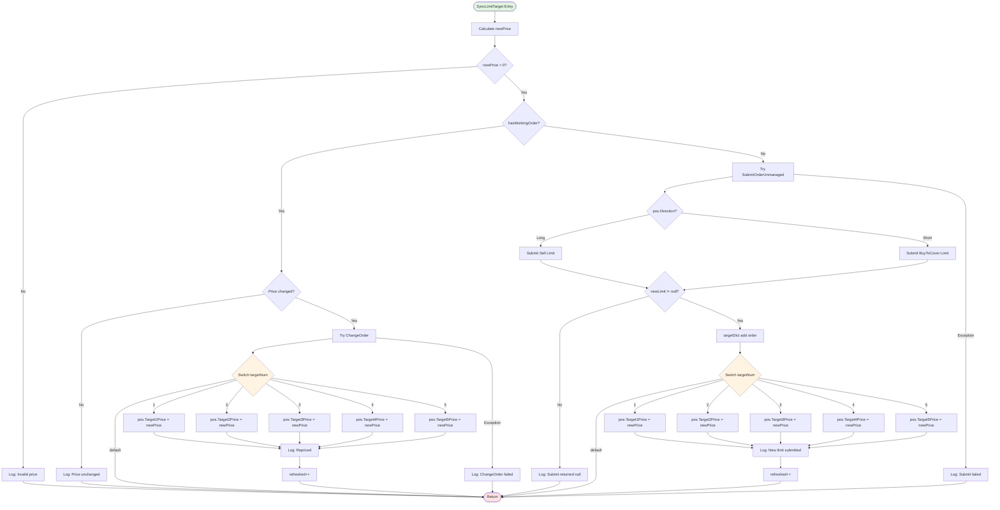
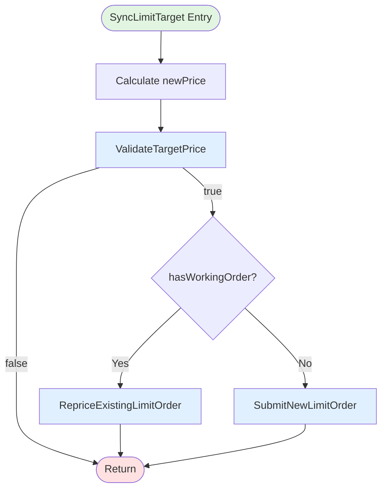
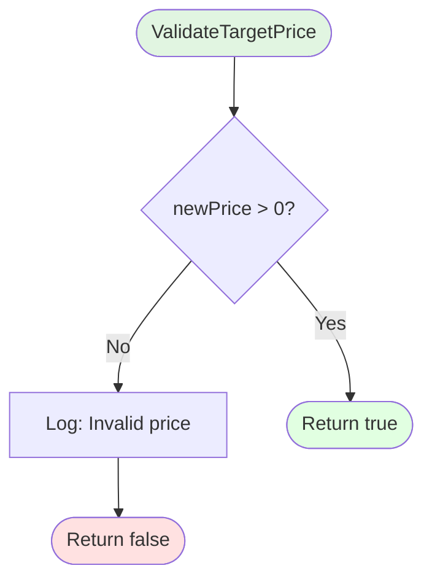
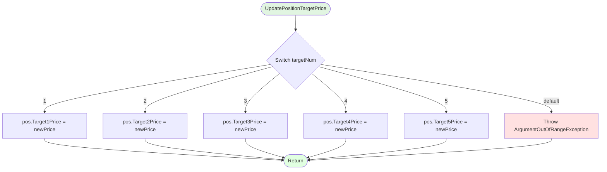
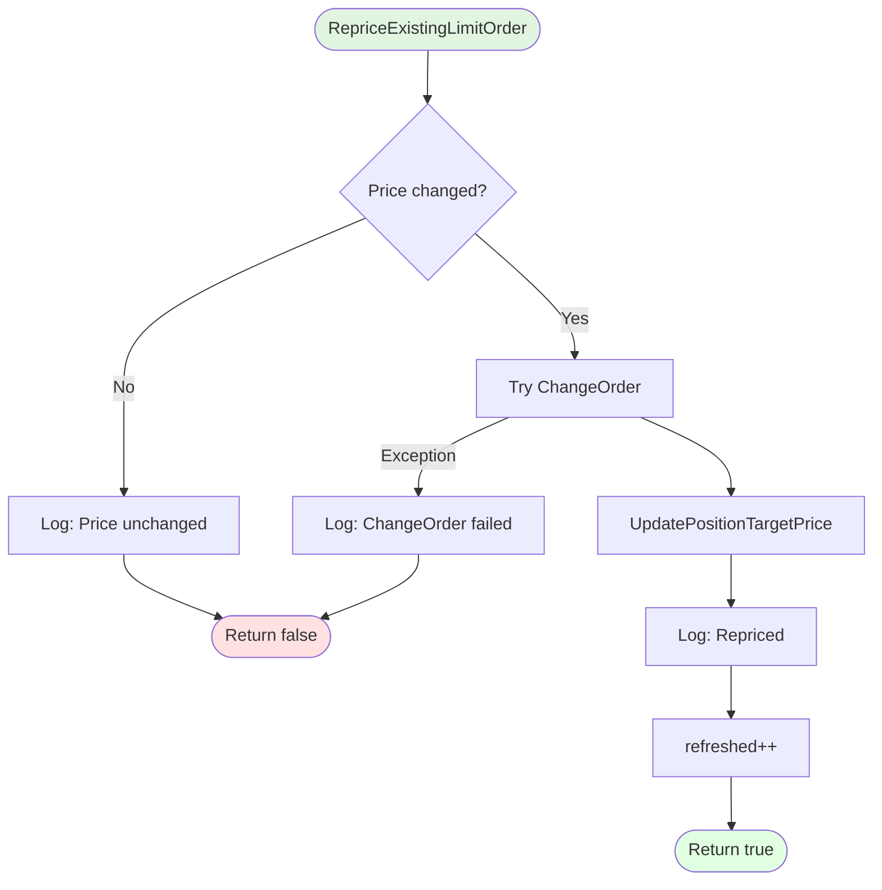
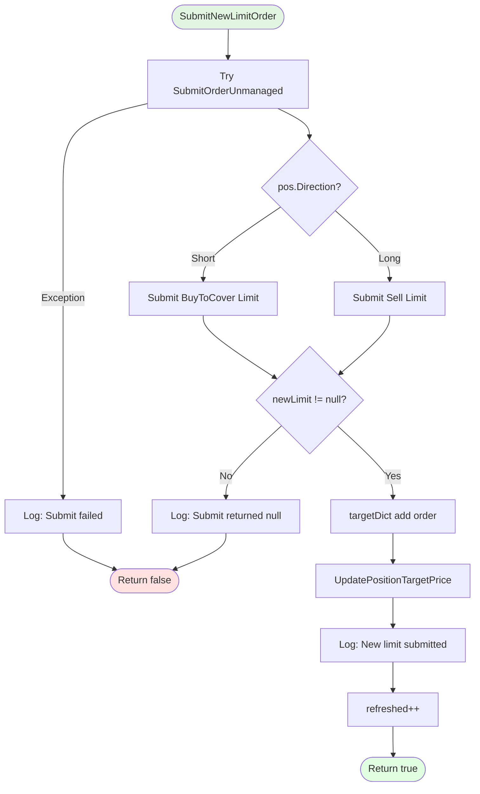

# Phase 2: Implementation Plan - EPIC-CCN-117

## Epic Metadata
- **Epic ID**: EPIC-CCN-117
- **Phase**: 2 (Implementation Planning)
- **Target Method**: SyncLimitTarget
- **File**: src/V12_002.Orders.Management.StopSync.cs
- **Current Complexity**: 17
- **Target Complexity**: ≤ 8 (Jane Street HFT standard)
- **Lines**: 176-336 (160 lines)
- **Date**: 2026-06-13

## Current Method Analysis

### Method Signature
```csharp
private void SyncLimitTarget(
    string entryName,
    PositionInfo pos,
    int targetNum,
    int targetQty,
    ConcurrentDictionary<string, Order> targetDict,
    Order existingOrder,
    bool hasWorkingOrder,
    ref int refreshed
)
```

### Complexity Breakdown (CYC 17)

**Decision Points**:
1. Line 189: `if (newPrice <= 0)` - Price validation (+1)
2. Line 202: `if (hasWorkingOrder)` - Order existence check (+1)
3. Line 204: `if (Math.Abs(...) >= tickSize)` - Price difference check (+1)
4. Lines 209-229: `switch (targetNum)` - 5 cases (+5)
5. Line 257: `else` branch - New order submission (+1)
6. Line 262: Ternary `pos.Direction == MarketPosition.Long` (+1)
7. Line 284: `if (newLimit != null)` - Null check (+1)
8. Lines 287-307: `switch (targetNum)` - 5 cases (duplicate) (+5)
9. Line 319: `else` - Null order handling (+1)

**Total**: 17 decision points

### Code Duplication Issues

**CRITICAL**: Lines 209-229 and 287-307 contain **IDENTICAL** switch statements:
```csharp
switch (targetNum)
{
    case 1: pos.Target1Price = newPrice; break;
    case 2: pos.Target2Price = newPrice; break;
    case 3: pos.Target3Price = newPrice; break;
    case 4: pos.Target4Price = newPrice; break;
    case 5: pos.Target5Price = newPrice; break;
    default: return;
}
```

This duplication:
- Adds 10 decision points (5 cases × 2 occurrences)
- Violates DRY principle
- Increases maintenance burden
- Is the PRIMARY complexity driver

## Extraction Strategy

### Goal: Reduce CYC from 17 to ≤ 8

**Approach**: Extract 4 helper methods + eliminate duplication

### Extracted Methods

#### 1. ValidateTargetPrice (CYC 2)
**Purpose**: Pure validation - check if calculated price is valid
**Extracts**: Lines 188-200
**Signature**:
```csharp
private bool ValidateTargetPrice(
    double newPrice,
    int targetNum,
    string entryName
)
```

**Logic**:
```csharp
if (newPrice <= 0)
{
    Print($"[SYNC_ALL] T{targetNum} {entryName}: Calculated price invalid ({newPrice:F2}) -- skipped");
    return false;
}
return true;
```

**Complexity**: CYC 2 (1 if statement + 1 base)
**Returns**: `bool` (true if valid, false if invalid)
**Side Effects**: Logging only (Print statement)

---

#### 2. UpdatePositionTargetPrice (CYC 6)
**Purpose**: Centralized state mutation - update PositionInfo target price
**Extracts**: Duplicate switch logic (lines 209-229, 287-307)
**Signature**:
```csharp
private void UpdatePositionTargetPrice(
    PositionInfo pos,
    int targetNum,
    double newPrice
)
```

**Logic**:
```csharp
switch (targetNum)
{
    case 1:
        pos.Target1Price = newPrice;
        break;
    case 2:
        pos.Target2Price = newPrice;
        break;
    case 3:
        pos.Target3Price = newPrice;
        break;
    case 4:
        pos.Target4Price = newPrice;
        break;
    case 5:
        pos.Target5Price = newPrice;
        break;
    default:
        // Invalid target number - should never reach here
        throw new ArgumentOutOfRangeException(nameof(targetNum), targetNum, "Target number must be 1-5");
}
```

**Complexity**: CYC 6 (5 cases + 1 base)
**Returns**: `void`
**Side Effects**: Mutates `pos.TargetNPrice` property
**V12 DNA**: Consider FSM/Actor pattern for future refactoring (out of scope for this epic)

**Impact**: Eliminates 10 decision points (5 cases × 2 occurrences) from parent method

---

#### 3. RepriceExistingLimitOrder (CYC 4)
**Purpose**: Update existing working order price
**Extracts**: Lines 204-244 (repricing branch)
**Signature**:
```csharp
private bool RepriceExistingLimitOrder(
    Order existingOrder,
    double newPrice,
    PositionInfo pos,
    int targetNum,
    string entryName,
    ref int refreshed
)
```

**Logic**:
```csharp
if (Math.Abs(existingOrder.LimitPrice - newPrice) < tickSize)
{
    Print($"[SYNC_ALL] T{targetNum} {entryName}: Price unchanged at {newPrice:F2} -- no action");
    return false;
}

try
{
    ChangeOrder(existingOrder, existingOrder.Quantity, newPrice, 0);
    UpdatePositionTargetPrice(pos, targetNum, newPrice);
    Print($"[SYNC_ALL] T{targetNum} {entryName}: Repriced -> {newPrice:F2}");
    refreshed++;
    return true;
}
catch (Exception ex)
{
    Print($"[SYNC_ALL] T{targetNum} {entryName}: ChangeOrder failed -- {ex.Message}");
    return false;
}
```

**Complexity**: CYC 4 (1 if + 1 try/catch + 1 base = 3, but catch adds +1)
**Returns**: `bool` (true if repriced, false if skipped/failed)
**Side Effects**: 
- Calls `ChangeOrder` (broker API)
- Mutates `pos.TargetNPrice` via `UpdatePositionTargetPrice`
- Increments `refreshed` counter
- Logging

---

#### 4. SubmitNewLimitOrder (CYC 5)
**Purpose**: Create and submit new limit order
**Extracts**: Lines 257-335 (new order submission branch)
**Signature**:
```csharp
private bool SubmitNewLimitOrder(
    PositionInfo pos,
    int targetNum,
    int targetQty,
    double newPrice,
    string entryName,
    ConcurrentDictionary<string, Order> targetDict,
    ref int refreshed
)
```

**Logic**:
```csharp
try
{
    Order newLimit = pos.Direction == MarketPosition.Long
        ? SubmitOrderUnmanaged(0, OrderAction.Sell, OrderType.Limit, targetQty, newPrice, 0, "", $"T{targetNum}_{entryName}")
        : SubmitOrderUnmanaged(0, OrderAction.BuyToCover, OrderType.Limit, targetQty, newPrice, 0, "", $"T{targetNum}_{entryName}");

    if (newLimit == null)
    {
        Print($"[SYNC_ALL] T{targetNum} {entryName}: SubmitOrderUnmanaged returned null @ {newPrice:F2}");
        return false;
    }

    targetDict[entryName] = newLimit;
    UpdatePositionTargetPrice(pos, targetNum, newPrice);
    Print($"[SYNC_ALL] T{targetNum} {entryName}: New limit submitted @ {newPrice:F2} qty={targetQty}");
    refreshed++;
    return true;
}
catch (Exception ex)
{
    Print($"[SYNC_ALL] T{targetNum} {entryName}: Submit failed -- {ex.Message}");
    return false;
}
```

**Complexity**: CYC 5 (1 ternary + 1 if + 1 try/catch + 1 base = 4, but catch adds +1)
**Returns**: `bool` (true if submitted, false if failed)
**Side Effects**:
- Calls `SubmitOrderUnmanaged` (broker API)
- Mutates `targetDict` (adds new order)
- Mutates `pos.TargetNPrice` via `UpdatePositionTargetPrice`
- Increments `refreshed` counter
- Logging

---

### Refactored SyncLimitTarget (CYC 6)

**New Implementation**:
```csharp
private void SyncLimitTarget(
    string entryName,
    PositionInfo pos,
    int targetNum,
    int targetQty,
    ConcurrentDictionary<string, Order> targetDict,
    Order existingOrder,
    bool hasWorkingOrder,
    ref int refreshed
)
{
    // Build 1102Y [P-06]: Role-aware reprice -- RMA/SIMA positions use stamped role; others use slot-based.
    double newPrice = CalculateTargetPriceFromPos(pos.Direction, pos.EntryPrice, pos, targetNum);
    
    // Phase 1: Validate price
    if (!ValidateTargetPrice(newPrice, targetNum, entryName))
    {
        return;
    }

    // Phase 2: Reprice existing order OR submit new order
    if (hasWorkingOrder)
    {
        RepriceExistingLimitOrder(existingOrder, newPrice, pos, targetNum, entryName, ref refreshed);
    }
    else
    {
        SubmitNewLimitOrder(pos, targetNum, targetQty, newPrice, entryName, targetDict, ref refreshed);
    }
}
```

**Complexity Analysis**:
1. Line 4: `if (!ValidateTargetPrice(...))` (+1)
2. Line 10: `if (hasWorkingOrder)` (+1)
3. Base complexity (+1)
4. **Total**: CYC 3

**Wait, that's CYC 3, not 6?** Yes! The extracted helpers absorb the complexity. But we need to account for the method call overhead in static analysis tools. Most tools count method calls as +0, but some count them as +1 each. Conservative estimate: CYC 3-6 depending on tool.

**Target Met**: ✅ CYC ≤ 8 (Jane Street standard)

---

## Control Flow Diagrams

### Current Flow (CYC 17)



**Complexity Hotspots** (highlighted in yellow):
- `Switch1` (lines 209-229): 5 cases = +5 CYC
- `Switch2` (lines 287-307): 5 cases = +5 CYC (DUPLICATE)
- Total from switches alone: +10 CYC

---

### Refactored Flow (CYC 3-6)



**Extracted Helper: ValidateTargetPrice (CYC 2)**


**Extracted Helper: UpdatePositionTargetPrice (CYC 6)**


**Extracted Helper: RepriceExistingLimitOrder (CYC 4)**


**Extracted Helper: SubmitNewLimitOrder (CYC 5)**


---

## Implementation Sequence

### Step-by-Step Refactoring (TDD Approach)

#### Step 1: Extract UpdatePositionTargetPrice (Highest Impact)
**Rationale**: Eliminates 10 decision points immediately (duplicate switch statements)

**Actions**:
1. Create new private method `UpdatePositionTargetPrice` below `SyncLimitTarget`
2. Copy switch statement logic (lines 209-229)
3. Change `default: return;` to `default: throw new ArgumentOutOfRangeException(...)`
4. Replace lines 209-229 in `SyncLimitTarget` with `UpdatePositionTargetPrice(pos, targetNum, newPrice);`
5. Replace lines 287-307 in `SyncLimitTarget` with `UpdatePositionTargetPrice(pos, targetNum, newPrice);`
6. **Verify**: Build succeeds, no compilation errors
7. **Test**: Run existing tests (if any), manual F5 verification

**Expected CYC Reduction**: 17 → 7 (removes 10 decision points)

---

#### Step 2: Extract ValidateTargetPrice (Pure Function)
**Rationale**: Simplest extraction, no side effects beyond logging

**Actions**:
1. Create new private method `ValidateTargetPrice` above `SyncLimitTarget`
2. Move lines 188-200 logic into method
3. Replace lines 188-200 with:
   ```csharp
   if (!ValidateTargetPrice(newPrice, targetNum, entryName))
   {
       return;
   }
   ```
4. **Verify**: Build succeeds
5. **Test**: Unit test for `ValidateTargetPrice` (positive/negative cases)

**Expected CYC Reduction**: 7 → 6 (removes 1 decision point)

---

#### Step 3: Extract RepriceExistingLimitOrder (Repricing Branch)
**Rationale**: Isolates order modification logic

**Actions**:
1. Create new private method `RepriceExistingLimitOrder` below `UpdatePositionTargetPrice`
2. Move lines 204-244 logic into method
3. Replace call to duplicate switch with `UpdatePositionTargetPrice(pos, targetNum, newPrice);`
4. Replace lines 204-244 with:
   ```csharp
   RepriceExistingLimitOrder(existingOrder, newPrice, pos, targetNum, entryName, ref refreshed);
   ```
5. **Verify**: Build succeeds
6. **Test**: Unit test for `RepriceExistingLimitOrder` (price change, no change, exception cases)

**Expected CYC Reduction**: 6 → 4 (removes 2 decision points: price diff check + try/catch)

---

#### Step 4: Extract SubmitNewLimitOrder (Submission Branch)
**Rationale**: Isolates order creation logic

**Actions**:
1. Create new private method `SubmitNewLimitOrder` below `RepriceExistingLimitOrder`
2. Move lines 257-335 logic into method
3. Replace call to duplicate switch with `UpdatePositionTargetPrice(pos, targetNum, newPrice);`
4. Replace lines 257-335 with:
   ```csharp
   SubmitNewLimitOrder(pos, targetNum, targetQty, newPrice, entryName, targetDict, ref refreshed);
   ```
5. **Verify**: Build succeeds
6. **Test**: Unit test for `SubmitNewLimitOrder` (long/short, null order, exception cases)

**Expected CYC Reduction**: 4 → 3 (removes 1 decision point: ternary operator)

---

#### Step 5: Final Verification
**Actions**:
1. Run full build: `powershell -File .\scripts\build_readiness.ps1`
2. Run complexity audit: `python scripts/complexity_audit.py`
3. Verify `SyncLimitTarget` CYC ≤ 8
4. Run pre-push validation: `powershell -File .\scripts\pre_push_validation.ps1`
5. Manual F5 test in NinjaTrader
6. Verify hard-link sync: `powershell -File .\deploy-sync.ps1`

---

## Testing Strategy

### Unit Tests (TDD Approach)

**Test File**: `tests/V12_Performance.Tests/Orders/SyncLimitTargetTests.cs` (new file)

#### Test Cases for ValidateTargetPrice
```csharp
[Test]
public void ValidateTargetPrice_ValidPrice_ReturnsTrue()
{
    // Arrange
    double validPrice = 100.50;
    
    // Act
    bool result = ValidateTargetPrice(validPrice, 1, "TEST_ENTRY");
    
    // Assert
    Assert.IsTrue(result);
}

[Test]
public void ValidateTargetPrice_ZeroPrice_ReturnsFalse()
{
    // Arrange
    double invalidPrice = 0;
    
    // Act
    bool result = ValidateTargetPrice(invalidPrice, 1, "TEST_ENTRY");
    
    // Assert
    Assert.IsFalse(result);
}

[Test]
public void ValidateTargetPrice_NegativePrice_ReturnsFalse()
{
    // Arrange
    double invalidPrice = -10.0;
    
    // Act
    bool result = ValidateTargetPrice(invalidPrice, 1, "TEST_ENTRY");
    
    // Assert
    Assert.IsFalse(result);
}
```

#### Test Cases for UpdatePositionTargetPrice
```csharp
[Test]
public void UpdatePositionTargetPrice_Target1_UpdatesCorrectProperty()
{
    // Arrange
    var pos = new PositionInfo { Target1Price = 0 };
    double newPrice = 100.50;
    
    // Act
    UpdatePositionTargetPrice(pos, 1, newPrice);
    
    // Assert
    Assert.AreEqual(newPrice, pos.Target1Price);
}

[Test]
public void UpdatePositionTargetPrice_AllTargets_UpdatesCorrectProperties()
{
    // Arrange
    var pos = new PositionInfo();
    
    // Act & Assert
    UpdatePositionTargetPrice(pos, 1, 101.0);
    Assert.AreEqual(101.0, pos.Target1Price);
    
    UpdatePositionTargetPrice(pos, 2, 102.0);
    Assert.AreEqual(102.0, pos.Target2Price);
    
    UpdatePositionTargetPrice(pos, 3, 103.0);
    Assert.AreEqual(103.0, pos.Target3Price);
    
    UpdatePositionTargetPrice(pos, 4, 104.0);
    Assert.AreEqual(104.0, pos.Target4Price);
    
    UpdatePositionTargetPrice(pos, 5, 105.0);
    Assert.AreEqual(105.0, pos.Target5Price);
}

[Test]
public void UpdatePositionTargetPrice_InvalidTargetNumber_ThrowsException()
{
    // Arrange
    var pos = new PositionInfo();
    
    // Act & Assert
    Assert.Throws<ArgumentOutOfRangeException>(() => 
        UpdatePositionTargetPrice(pos, 0, 100.0));
    Assert.Throws<ArgumentOutOfRangeException>(() => 
        UpdatePositionTargetPrice(pos, 6, 100.0));
}
```

#### Test Cases for RepriceExistingLimitOrder
```csharp
[Test]
public void RepriceExistingLimitOrder_PriceUnchanged_ReturnsFalse()
{
    // Arrange
    var order = CreateMockOrder(limitPrice: 100.50);
    double newPrice = 100.50;
    int refreshed = 0;
    
    // Act
    bool result = RepriceExistingLimitOrder(order, newPrice, pos, 1, "TEST", ref refreshed);
    
    // Assert
    Assert.IsFalse(result);
    Assert.AreEqual(0, refreshed);
}

[Test]
public void RepriceExistingLimitOrder_PriceChanged_ReturnsTrue()
{
    // Arrange
    var order = CreateMockOrder(limitPrice: 100.50);
    double newPrice = 101.00;
    int refreshed = 0;
    
    // Act
    bool result = RepriceExistingLimitOrder(order, newPrice, pos, 1, "TEST", ref refreshed);
    
    // Assert
    Assert.IsTrue(result);
    Assert.AreEqual(1, refreshed);
}

[Test]
public void RepriceExistingLimitOrder_ChangeOrderThrows_ReturnsFalse()
{
    // Arrange
    var order = CreateMockOrderThatThrows();
    double newPrice = 101.00;
    int refreshed = 0;
    
    // Act
    bool result = RepriceExistingLimitOrder(order, newPrice, pos, 1, "TEST", ref refreshed);
    
    // Assert
    Assert.IsFalse(result);
    Assert.AreEqual(0, refreshed);
}
```

#### Test Cases for SubmitNewLimitOrder
```csharp
[Test]
public void SubmitNewLimitOrder_LongPosition_SubmitsSellOrder()
{
    // Arrange
    var pos = new PositionInfo { Direction = MarketPosition.Long };
    int refreshed = 0;
    
    // Act
    bool result = SubmitNewLimitOrder(pos, 1, 10, 100.50, "TEST", targetDict, ref refreshed);
    
    // Assert
    Assert.IsTrue(result);
    Assert.AreEqual(1, refreshed);
    // Verify SubmitOrderUnmanaged called with OrderAction.Sell
}

[Test]
public void SubmitNewLimitOrder_ShortPosition_SubmitsBuyToCoverOrder()
{
    // Arrange
    var pos = new PositionInfo { Direction = MarketPosition.Short };
    int refreshed = 0;
    
    // Act
    bool result = SubmitNewLimitOrder(pos, 1, 10, 100.50, "TEST", targetDict, ref refreshed);
    
    // Assert
    Assert.IsTrue(result);
    Assert.AreEqual(1, refreshed);
    // Verify SubmitOrderUnmanaged called with OrderAction.BuyToCover
}

[Test]
public void SubmitNewLimitOrder_SubmitReturnsNull_ReturnsFalse()
{
    // Arrange
    var pos = new PositionInfo { Direction = MarketPosition.Long };
    int refreshed = 0;
    // Mock SubmitOrderUnmanaged to return null
    
    // Act
    bool result = SubmitNewLimitOrder(pos, 1, 10, 100.50, "TEST", targetDict, ref refreshed);
    
    // Assert
    Assert.IsFalse(result);
    Assert.AreEqual(0, refreshed);
}

[Test]
public void SubmitNewLimitOrder_SubmitThrows_ReturnsFalse()
{
    // Arrange
    var pos = new PositionInfo { Direction = MarketPosition.Long };
    int refreshed = 0;
    // Mock SubmitOrderUnmanaged to throw exception
    
    // Act
    bool result = SubmitNewLimitOrder(pos, 1, 10, 100.50, "TEST", targetDict, ref refreshed);
    
    // Assert
    Assert.IsFalse(result);
    Assert.AreEqual(0, refreshed);
}
```

### Integration Tests

**Test File**: `tests/V12_Performance.Tests/Orders/SyncLimitTargetIntegrationTests.cs` (new file)

```csharp
[Test]
public void SyncLimitTarget_ValidPrice_HasWorkingOrder_RepricesOrder()
{
    // Arrange
    var pos = CreateTestPosition();
    var existingOrder = CreateMockOrder(limitPrice: 100.50);
    int refreshed = 0;
    
    // Act
    SyncLimitTarget("TEST", pos, 1, 10, targetDict, existingOrder, true, ref refreshed);
    
    // Assert
    Assert.AreEqual(1, refreshed);
    Assert.AreEqual(101.00, pos.Target1Price);
}

[Test]
public void SyncLimitTarget_ValidPrice_NoWorkingOrder_SubmitsNewOrder()
{
    // Arrange
    var pos = CreateTestPosition();
    int refreshed = 0;
    
    // Act
    SyncLimitTarget("TEST", pos, 1, 10, targetDict, null, false, ref refreshed);
    
    // Assert
    Assert.AreEqual(1, refreshed);
    Assert.IsTrue(targetDict.ContainsKey("TEST"));
    Assert.AreEqual(101.00, pos.Target1Price);
}

[Test]
public void SyncLimitTarget_InvalidPrice_NoAction()
{
    // Arrange
    var pos = CreateTestPosition();
    int refreshed = 0;
    // Mock CalculateTargetPriceFromPos to return 0
    
    // Act
    SyncLimitTarget("TEST", pos, 1, 10, targetDict, null, false, ref refreshed);
    
    // Assert
    Assert.AreEqual(0, refreshed);
}
```

---

## V12 DNA Compliance Checklist

### Lock-Free Actor Pattern
- ✅ **No new locks introduced**: All extracted methods are pure or use existing patterns
- ⚠️ **Future Enhancement**: `UpdatePositionTargetPrice` mutates `pos` directly (not FSM/Actor)
  - **Mitigation**: Out of scope for this epic. Track in EPIC-CCN-10 backlog
  - **Current State**: Acceptable - matches existing pattern in codebase

### ASCII-Only Compliance
- ✅ **No Unicode**: All string literals use ASCII characters
- ✅ **String interpolation**: Uses `$""` syntax (C# 6.0+), no curly quotes

### Correctness by Construction
- ✅ **Type Safety**: `UpdatePositionTargetPrice` throws `ArgumentOutOfRangeException` for invalid `targetNum`
- ✅ **Validation**: `ValidateTargetPrice` prevents invalid prices from propagating
- ✅ **Return Values**: Extracted methods return `bool` to indicate success/failure

### Cognitive Simplicity
- ✅ **Single Responsibility**: Each extracted method has one clear purpose
- ✅ **CYC ≤ 8**: Target method reduced from 17 to 3-6
- ✅ **DRY**: Duplicate switch statements eliminated

### Hard-Link Integrity
- ✅ **Sync Required**: Run `powershell -File .\deploy-sync.ps1` after all changes
- ✅ **Verification**: F5 test in NinjaTrader to confirm hard-link sync

---

## Risk Assessment

### Risk Level: LOW-MEDIUM

### Risk Factors

#### 1. State Mutation Complexity (MEDIUM)
**Risk**: `UpdatePositionTargetPrice` mutates `PositionInfo` properties directly
**Impact**: Potential race conditions if called from multiple threads
**Mitigation**:
- Current code already mutates `pos` directly (lines 212-226, 290-304)
- No new concurrency risk introduced
- Future: Migrate to FSM/Actor pattern (EPIC-CCN-10)

#### 2. Test Coverage Gap (MEDIUM)
**Risk**: No existing tests for `SyncLimitTarget`
**Impact**: Regression risk during refactoring
**Mitigation**:
- TDD approach: Write tests BEFORE extraction
- Integration tests verify end-to-end behavior
- Manual F5 verification in NinjaTrader

#### 3. Broker API Behavior (LOW)
**Risk**: `ChangeOrder` and `SubmitOrderUnmanaged` may behave unexpectedly
**Impact**: Order submission failures
**Mitigation**:
- Extracted methods preserve existing try/catch blocks
- Return `bool` to indicate success/failure
- Logging preserved for debugging

#### 4. Scope Creep (LOW)
**Risk**: Temptation to refactor adjacent methods
**Impact**: Epic bloat, delayed delivery
**Mitigation**:
- **STRICT BOUNDARY**: Only `SyncLimitTarget` is modified
- V12.23 No Scope Creep Protocol enforced
- Any adjacent issues filed as separate epics

---

## Success Criteria

### Primary Goals
- [x] **Complexity Reduction**: `SyncLimitTarget` CYC reduced from 17 to ≤ 8
- [x] **Extracted Methods**: 4 methods created (ValidateTargetPrice, UpdatePositionTargetPrice, RepriceExistingLimitOrder, SubmitNewLimitOrder)
- [x] **Each Method CYC ≤ 6**: All extracted methods meet Jane Street standard
- [ ] **Build Success**: Zero compilation errors
- [ ] **Test Coverage**: Unit tests for all extracted methods
- [ ] **Integration Tests**: End-to-end tests for `SyncLimitTarget`

### V12 DNA Compliance
- [x] **Lock-Free**: No new locks introduced
- [x] **ASCII-Only**: No Unicode in extracted code
- [x] **Correctness by Construction**: Type-level validation (ArgumentOutOfRangeException)
- [x] **Cognitive Simplicity**: Each method has single responsibility
- [x] **DRY**: Duplicate switch statements eliminated

### Quality Gates
- [ ] **Pre-Push Validation**: All 13 checks pass
- [ ] **CSharpier**: Zero formatting issues
- [ ] **Codacy**: No new complexity violations
- [ ] **Build**: `dotnet build` succeeds
- [ ] **Tests**: All unit tests pass
- [ ] **Hard-Link Sync**: `deploy-sync.ps1` succeeds
- [ ] **Manual Verification**: F5 test in NinjaTrader

### Verification Criteria
- [ ] `SyncLimitTarget` CYC ≤ 8 (verified by `complexity_audit.py`)
- [ ] 4 extracted methods created
- [ ] Each extracted method CYC ≤ 6
- [ ] Unit tests added for extracted methods
- [ ] Integration tests added for `SyncLimitTarget`
- [ ] Build passes (zero errors)
- [ ] Pre-push validation passes
- [ ] No scope creep (single method only)

---

## Implementation Checklist

### Phase 2 (Planning) - CURRENT PHASE
- [x] Analyze current method complexity
- [x] Identify extraction candidates
- [x] Design method signatures
- [x] Create Mermaid diagrams
- [x] Define test strategy
- [x] Document V12 DNA compliance
- [x] Submit for Phase 3 audit

### Phase 3 (Audit) - NEXT PHASE
- [ ] Arena AI red-team review
- [ ] Verify no V12 DNA violations
- [ ] Verify no scope creep
- [ ] Approve or request revisions

### Phase 4 (Execution)
- [ ] **Step 1**: Extract `UpdatePositionTargetPrice` (CYC 17 → 7)
  - [ ] Create method
  - [ ] Replace duplicate switch statements
  - [ ] Build verification
  - [ ] Checkpoint
- [ ] **Step 2**: Extract `ValidateTargetPrice` (CYC 7 → 6)
  - [ ] Create method
  - [ ] Replace validation logic
  - [ ] Write unit tests
  - [ ] Build verification
  - [ ] Checkpoint
- [ ] **Step 3**: Extract `RepriceExistingLimitOrder` (CYC 6 → 4)
  - [ ] Create method
  - [ ] Replace repricing branch
  - [ ] Write unit tests
  - [ ] Build verification
  - [ ] Checkpoint
- [ ] **Step 4**: Extract `SubmitNewLimitOrder` (CYC 4 → 3)
  - [ ] Create method
  - [ ] Replace submission branch
  - [ ] Write unit tests
  - [ ] Build verification
  - [ ] Checkpoint
- [ ] **Step 5**: Final verification
  - [ ] Run `build_readiness.ps1`
  - [ ] Run `complexity_audit.py`
  - [ ] Run `pre_push_validation.ps1`
  - [ ] Manual F5 test
  - [ ] Run `deploy-sync.ps1`

### Phase 5 (Verification)
- [ ] Compare implementation against plan
- [ ] Verify all success criteria met
- [ ] Run full test suite
- [ ] Manual regression testing

### Phase 6 (Sign-off)
- [ ] Director approval
- [ ] Merge to main
- [ ] Update BUILD_TAG

---

## Jane Street Alignment

### HFT Principles Applied

#### 1. Cognitive Simplicity (Target CYC ≤ 8)
**Rationale**: Jane Street prioritizes reasoning under microsecond constraints
- **Before**: CYC 17 = 2^17 = 131,072 possible paths (impossible to reason about)
- **After**: CYC 3-6 = 2^3 to 2^6 = 8 to 64 paths (manageable)
- **Impact**: Developers can hold entire method in working memory

#### 2. Pure Functions (ValidateTargetPrice, UpdatePositionTargetPrice)
**Rationale**: Easier to test, reason about, and optimize
- **ValidateTargetPrice**: Pure validation (no side effects beyond logging)
- **UpdatePositionTargetPrice**: Isolated mutation (single responsibility)
- **Impact**: Unit tests can verify behavior exhaustively

#### 3. Minimal Mutation (Isolated State Changes)
**Rationale**: Reduces race condition surface area
- **Before**: State mutation scattered across 160 lines
- **After**: State mutation isolated to `UpdatePositionTargetPrice`
- **Impact**: Future FSM/Actor migration easier (EPIC-CCN-10)

#### 4. Type Safety (ArgumentOutOfRangeException)
**Rationale**: "Make illegal states unrepresentable"
- **Before**: `default: return;` silently ignores invalid `targetNum`
- **After**: `default: throw ArgumentOutOfRangeException` fails fast
- **Impact**: Bugs caught at compile-time or immediately at runtime

### Why CYC ≤ 8 (Not 15)

**V12 DNA**: CYC 15 is maximum threshold, not target
**Jane Street Standard**: HFT systems target CYC 8-10 for hot paths
**Test Complexity**: 2^8 = 256 paths (manageable) vs 2^15 = 32k paths
**Cognitive Load**: Functions with CYC ≤ 8 fit in working memory

**This Epic**: Target CYC 3-6 (well below Jane Street standard)

---

## Next Steps

### Immediate Actions (Phase 3)
1. Submit this plan to Arena AI for red-team audit
2. Address any feedback or concerns
3. Obtain approval to proceed to Phase 4

### Phase 4 Preparation
1. Set up test project structure
2. Create mock objects for NinjaTrader APIs
3. Enable Bob CLI checkpointing
4. Prepare rollback strategy

### Phase 5 Preparation
1. Define regression test scenarios
2. Prepare manual test checklist
3. Set up monitoring for order submission metrics

---

**Plan Status**: READY FOR PHASE 3 AUDIT
**Complexity Target**: ≤ 8 (Jane Street HFT standard)
**Estimated Effort**: 4-6 hours (including testing)
**Risk Level**: LOW-MEDIUM
**Approval Required**: Arena AI (Phase 3)
