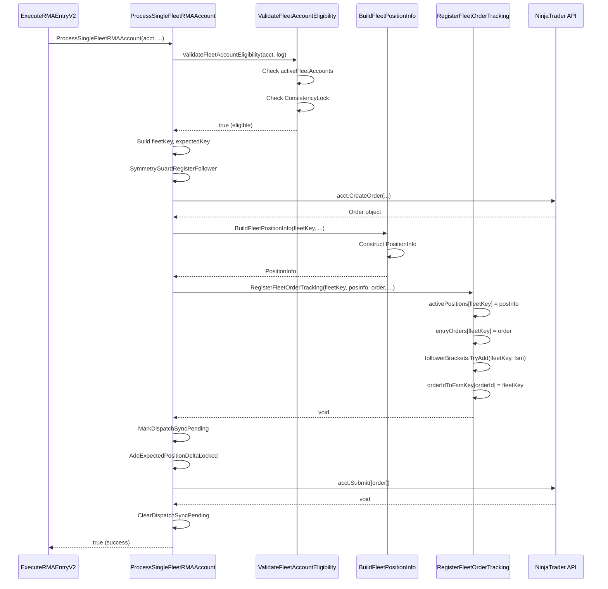
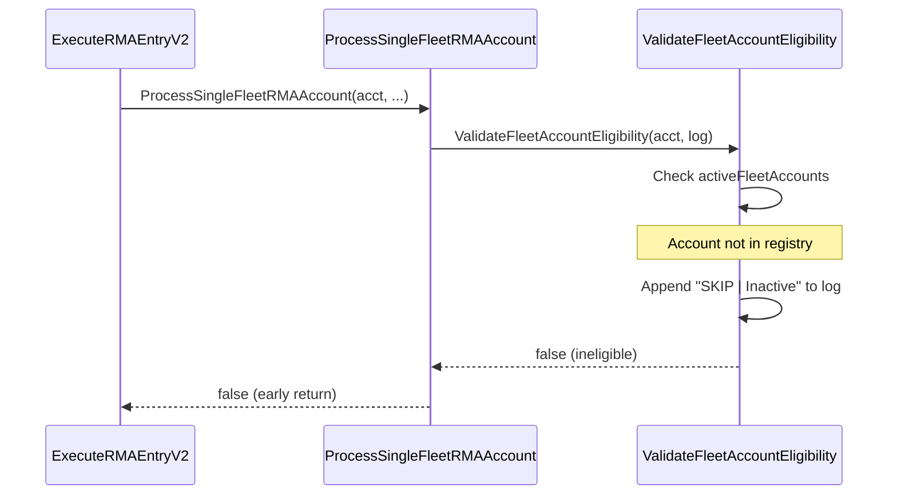
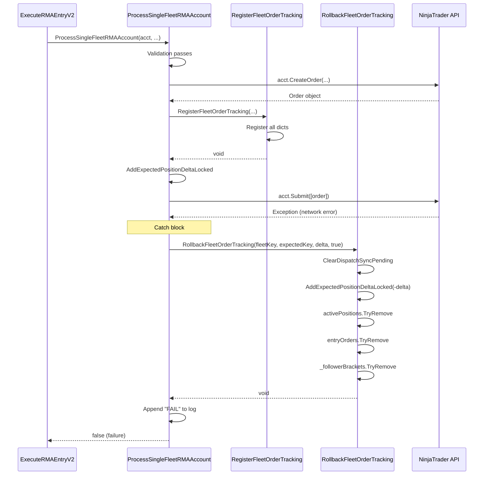

# Phase 2: Implementation Plan - EPIC-CCN-118

## Epic Metadata
- **Epic ID**: EPIC-CCN-118
- **Phase**: 2 (Implementation Plan)
- **Target Method**: ProcessSingleFleetRMAAccount
- **File**: src/V12_002.SIMA.Execution.cs
- **Lines**: 511-681 (171 lines)
- **Current Complexity**: 16
- **Target Complexity**: ≤ 8
- **Plan Date**: 2026-06-13

## Executive Summary

This implementation plan details the surgical extraction of 4 helper methods from ProcessSingleFleetRMAAccount to reduce cyclomatic complexity from 16 to ≤8. The extraction follows Jane Street's cognitive simplicity principles while maintaining zero behavioral changes and full backward compatibility.

## Extraction Sequence

### Extraction Order (Reverse Dependency)
1. **Helper 4**: RollbackFleetOrderTracking (catch block cleanup)
2. **Helper 1**: ValidateFleetAccountEligibility (early validation)
3. **Helper 2**: BuildFleetPositionInfo (pure construction)
4. **Helper 3**: RegisterFleetOrderTracking (FSM registration)

**Rationale**: Extract catch block first to simplify error handling, then extract in call order.

## Helper 1: ValidateFleetAccountEligibility

### Purpose
Consolidate fleet validation and consistency lock checks into a single guard method.

### Extraction Mapping

**Source Lines**: 511-537 (lines 19-37 in read_file output)

**Before**:
```csharp
// Lines 519-524 (relative 19-24)
if (!activeFleetAccounts.TryGetValue(acct.Name, out bool isActive) || !isActive)
{
    dispatchLog.AppendLine(LogBuffer.Format("  SKIP | {0,-28} | Inactive", acct.Name));
    return false;
}

// Lines 526-537 (relative 26-37)
if (EnableConsistencyLock)
{
    double dailyPL = acct.Get(AccountItem.RealizedProfitLoss, Currency.UsDollar);
    if (dailyPL >= MaxDailyProfitCap)
    {
        dispatchLog.AppendLine(
            LogBuffer.Format("  SKIP | {0,-28} | ConsistencyLock ${1:F2}", acct.Name, dailyPL)
        );
        return false;
    }
}
```

**After (Helper)**:
```csharp
/// <summary>
/// Validates fleet account eligibility for RMA order submission.
/// Checks fleet active status and consistency lock P&L cap.
/// </summary>
/// <param name="acct">Account to validate</param>
/// <param name="dispatchLog">Log buffer for skip reasons</param>
/// <returns>True if account is eligible, false otherwise</returns>
private bool ValidateFleetAccountEligibility(
    Account acct,
    StringBuilder dispatchLog
)
{
    // V12.8: Fleet Manager toggle -- skip if account NOT registered or explicitly disabled
    if (!activeFleetAccounts.TryGetValue(acct.Name, out bool isActive) || !isActive)
    {
        dispatchLog.AppendLine(LogBuffer.Format("  SKIP | {0,-28} | Inactive", acct.Name));
        return false;
    }

    // Consistency Lock
    if (EnableConsistencyLock)
    {
        double dailyPL = acct.Get(AccountItem.RealizedProfitLoss, Currency.UsDollar);
        if (dailyPL >= MaxDailyProfitCap)
        {
            dispatchLog.AppendLine(
                LogBuffer.Format("  SKIP | {0,-28} | ConsistencyLock ${1:F2}", acct.Name, dailyPL)
            );
            return false;
        }
    }

    return true;
}
```

**After (Main Method)**:
```csharp
private bool ProcessSingleFleetRMAAccount(
    Account acct,
    string baseSignal,
    OrderAction entryAction,
    int qty,
    double price,
    MarketPosition direction,
    RMABracketPrices prices,
    string symmetryDispatchId,
    StringBuilder dispatchLog
)
{
    // Early validation guard
    if (!ValidateFleetAccountEligibility(acct, dispatchLog))
    {
        return false;
    }

    // [923B-FIX-B]: fleetKey declared outside try so catch can access it for dict rollback.
    string fleetKey = acct.Name + "_RMA_" + baseSignal;
    // ... rest of method
}
```

### Complexity Impact
- **Removed Decision Points**: 4 (TryGetValue, !isActive, EnableConsistencyLock, dailyPL >= cap)
- **Added Decision Points**: 1 (helper call result check)
- **Net Reduction**: -3

### Test Cases

#### Test 1: Inactive Account
```csharp
[Test]
public void ValidateFleetAccountEligibility_InactiveAccount_ReturnsFalse()
{
    // Arrange
    var acct = CreateMockAccount("TestAcct");
    activeFleetAccounts["TestAcct"] = false; // Explicitly disabled
    var log = new StringBuilder();

    // Act
    bool result = ValidateFleetAccountEligibility(acct, log);

    // Assert
    Assert.IsFalse(result);
    Assert.That(log.ToString(), Does.Contain("SKIP"));
    Assert.That(log.ToString(), Does.Contain("Inactive"));
}
```

#### Test 2: Unregistered Account
```csharp
[Test]
public void ValidateFleetAccountEligibility_UnregisteredAccount_ReturnsFalse()
{
    // Arrange
    var acct = CreateMockAccount("UnknownAcct");
    // activeFleetAccounts does not contain "UnknownAcct"
    var log = new StringBuilder();

    // Act
    bool result = ValidateFleetAccountEligibility(acct, log);

    // Assert
    Assert.IsFalse(result);
    Assert.That(log.ToString(), Does.Contain("Inactive"));
}
```

#### Test 3: Consistency Lock Exceeded
```csharp
[Test]
public void ValidateFleetAccountEligibility_ConsistencyLockExceeded_ReturnsFalse()
{
    // Arrange
    var acct = CreateMockAccount("TestAcct");
    activeFleetAccounts["TestAcct"] = true;
    EnableConsistencyLock = true;
    MaxDailyProfitCap = 1000.0;
    MockAccountPL(acct, 1500.0); // Exceeds cap
    var log = new StringBuilder();

    // Act
    bool result = ValidateFleetAccountEligibility(acct, log);

    // Assert
    Assert.IsFalse(result);
    Assert.That(log.ToString(), Does.Contain("ConsistencyLock"));
    Assert.That(log.ToString(), Does.Contain("$1500.00"));
}
```

#### Test 4: Valid Account
```csharp
[Test]
public void ValidateFleetAccountEligibility_ValidAccount_ReturnsTrue()
{
    // Arrange
    var acct = CreateMockAccount("TestAcct");
    activeFleetAccounts["TestAcct"] = true;
    EnableConsistencyLock = true;
    MaxDailyProfitCap = 1000.0;
    MockAccountPL(acct, 500.0); // Under cap
    var log = new StringBuilder();

    // Act
    bool result = ValidateFleetAccountEligibility(acct, log);

    // Assert
    Assert.IsTrue(result);
    Assert.That(log.ToString(), Is.Empty); // No skip message
}
```

#### Test 5: Consistency Lock Disabled
```csharp
[Test]
public void ValidateFleetAccountEligibility_ConsistencyLockDisabled_ReturnsTrue()
{
    // Arrange
    var acct = CreateMockAccount("TestAcct");
    activeFleetAccounts["TestAcct"] = true;
    EnableConsistencyLock = false; // Disabled
    MockAccountPL(acct, 5000.0); // Would exceed cap if enabled
    var log = new StringBuilder();

    // Act
    bool result = ValidateFleetAccountEligibility(acct, log);

    // Assert
    Assert.IsTrue(result); // Should pass because lock is disabled
}
```

## Helper 2: BuildFleetPositionInfo

### Purpose
Encapsulate PositionInfo construction with 5-target distribution setup.

### Extraction Mapping

**Source Lines**: 584-613 (lines 84-113 in read_file output)

**Before**:
```csharp
PositionInfo fleetFollowerPos = new PositionInfo
{
    SignalName = fleetKey,
    Direction = direction,
    TotalContracts = qty,
    RemainingContracts = qty,
    EntryPrice = price,
    InitialStopPrice = prices.StopPrice,
    CurrentStopPrice = prices.StopPrice,
    Target1Price = prices.T1Price,
    Target2Price = prices.T2Price,
    Target3Price = prices.T3Price,
    Target4Price = prices.T4Price,
    Target5Price = prices.T5Price,
    T1Contracts = prices.Rt1,
    T2Contracts = prices.Rt2,
    T3Contracts = prices.Rt3,
    T4Contracts = prices.Rt4,
    T5Contracts = prices.Rt5,
    EntryOrderType = OrderType.Limit,
    EntryFilled = false,
    IsRMATrade = true,
    IsFollower = true,
    ExecutingAccount = acct,
    BracketSubmitted = false,
    ExtremePriceSinceEntry = price,
    CurrentTrailLevel = 0,
    OcoGroupId = "V12_" + GetStableHash(fleetKey),
};
```

**After (Helper)**:
```csharp
/// <summary>
/// Builds PositionInfo for fleet RMA follower with 5-target distribution.
/// Pure construction method with no side effects.
/// </summary>
/// <param name="fleetKey">Fleet signal key</param>
/// <param name="direction">Market position direction</param>
/// <param name="qty">Total contracts</param>
/// <param name="price">Entry price</param>
/// <param name="prices">RMA bracket prices (stop + 5 targets)</param>
/// <param name="acct">Executing account</param>
/// <returns>Initialized PositionInfo</returns>
private PositionInfo BuildFleetPositionInfo(
    string fleetKey,
    MarketPosition direction,
    int qty,
    double price,
    RMABracketPrices prices,
    Account acct
)
{
    // V12.1101E: Full 5-target distribution mirrors Master exactly.
    return new PositionInfo
    {
        SignalName = fleetKey,
        Direction = direction,
        TotalContracts = qty,
        RemainingContracts = qty,
        EntryPrice = price,
        InitialStopPrice = prices.StopPrice,
        CurrentStopPrice = prices.StopPrice,
        Target1Price = prices.T1Price,
        Target2Price = prices.T2Price,
        Target3Price = prices.T3Price,
        Target4Price = prices.T4Price,
        Target5Price = prices.T5Price,
        T1Contracts = prices.Rt1,
        T2Contracts = prices.Rt2,
        T3Contracts = prices.Rt3,
        T4Contracts = prices.Rt4,
        T5Contracts = prices.Rt5,
        EntryOrderType = OrderType.Limit,
        EntryFilled = false,
        IsRMATrade = true,
        IsFollower = true,
        ExecutingAccount = acct,
        BracketSubmitted = false, // V12.10: deferred -- OnAccountExecutionUpdate submits on fill
        ExtremePriceSinceEntry = price,
        CurrentTrailLevel = 0,
        // Build 936 [FIX-2]: Deterministic bracket OCO group ID for broker-native stop+target linking.
        OcoGroupId = "V12_" + GetStableHash(fleetKey),
    };
}
```

**After (Main Method)**:
```csharp
// Build PositionInfo with 5-target distribution
PositionInfo fleetFollowerPos = BuildFleetPositionInfo(
    fleetKey,
    direction,
    qty,
    price,
    prices,
    acct
);
```

### Complexity Impact
- **Removed Decision Points**: 0 (pure construction, no branches)
- **Added Decision Points**: 0
- **Net Reduction**: 0

### Test Cases

#### Test 1: Long Position
```csharp
[Test]
public void BuildFleetPositionInfo_LongPosition_CorrectDistribution()
{
    // Arrange
    string fleetKey = "TestAcct_RMA_LONG";
    var prices = new RMABracketPrices
    {
        StopPrice = 4900.0,
        T1Price = 5010.0,
        T2Price = 5020.0,
        T3Price = 5030.0,
        T4Price = 5040.0,
        T5Price = 5050.0,
        Rt1 = 2,
        Rt2 = 2,
        Rt3 = 2,
        Rt4 = 2,
        Rt5 = 2,
    };
    var acct = CreateMockAccount("TestAcct");

    // Act
    var posInfo = BuildFleetPositionInfo(
        fleetKey,
        MarketPosition.Long,
        10,
        5000.0,
        prices,
        acct
    );

    // Assert
    Assert.AreEqual(fleetKey, posInfo.SignalName);
    Assert.AreEqual(MarketPosition.Long, posInfo.Direction);
    Assert.AreEqual(10, posInfo.TotalContracts);
    Assert.AreEqual(10, posInfo.RemainingContracts);
    Assert.AreEqual(5000.0, posInfo.EntryPrice);
    Assert.AreEqual(4900.0, posInfo.InitialStopPrice);
    Assert.AreEqual(5010.0, posInfo.Target1Price);
    Assert.AreEqual(2, posInfo.T1Contracts);
    Assert.IsTrue(posInfo.IsRMATrade);
    Assert.IsTrue(posInfo.IsFollower);
    Assert.IsFalse(posInfo.BracketSubmitted);
    Assert.That(posInfo.OcoGroupId, Does.StartWith("V12_"));
}
```

#### Test 2: Short Position
```csharp
[Test]
public void BuildFleetPositionInfo_ShortPosition_CorrectDistribution()
{
    // Arrange
    string fleetKey = "TestAcct_RMA_SHORT";
    var prices = new RMABracketPrices
    {
        StopPrice = 5100.0,
        T1Price = 4990.0,
        T2Price = 4980.0,
        T3Price = 4970.0,
        T4Price = 4960.0,
        T5Price = 4950.0,
        Rt1 = 3,
        Rt2 = 3,
        Rt3 = 2,
        Rt4 = 1,
        Rt5 = 1,
    };
    var acct = CreateMockAccount("TestAcct");

    // Act
    var posInfo = BuildFleetPositionInfo(
        fleetKey,
        MarketPosition.Short,
        10,
        5000.0,
        prices,
        acct
    );

    // Assert
    Assert.AreEqual(MarketPosition.Short, posInfo.Direction);
    Assert.AreEqual(5100.0, posInfo.InitialStopPrice);
    Assert.AreEqual(4990.0, posInfo.Target1Price);
    Assert.AreEqual(3, posInfo.T1Contracts);
    Assert.AreEqual(1, posInfo.T5Contracts);
}
```

#### Test 3: OCO Group ID Determinism
```csharp
[Test]
public void BuildFleetPositionInfo_SameFleetKey_SameOcoGroupId()
{
    // Arrange
    string fleetKey = "TestAcct_RMA_SIGNAL";
    var prices = CreateDefaultRMABracketPrices();
    var acct = CreateMockAccount("TestAcct");

    // Act
    var posInfo1 = BuildFleetPositionInfo(fleetKey, MarketPosition.Long, 10, 5000.0, prices, acct);
    var posInfo2 = BuildFleetPositionInfo(fleetKey, MarketPosition.Long, 10, 5000.0, prices, acct);

    // Assert
    Assert.AreEqual(posInfo1.OcoGroupId, posInfo2.OcoGroupId);
    Assert.That(posInfo1.OcoGroupId, Does.StartWith("V12_"));
}
```

## Helper 3: RegisterFleetOrderTracking

### Purpose
Atomically register order tracking dictionaries (activePositions, entryOrders, FSM, OrderId mapping).

### Extraction Mapping

**Source Lines**: 615-646 (lines 115-146 in read_file output)

**Before**:
```csharp
// B966: Enqueue NOT applied -- ordering invariant: dicts BEFORE expectedPositions (L1479).
activePositions[fleetKey] = fleetFollowerPos; // FIRST: dicts registered atomically
entryOrders[fleetKey] = fEntry; // REAPER hasWorkingEntry check reads these

MarkDispatchSyncPending(expectedKey);
syncPending = true;

// Phase 6 [FSM-P3]: Proactive FSM for RMA V2 fleet entries.
if (!_followerBrackets.ContainsKey(fleetKey))
{
    var rmaFsm = new FollowerBracketFSM
    {
        AccountName = acct.Name,
        EntryName = fleetKey,
        State = FollowerBracketState.Submitted,
        RemainingContracts = qty,
        EntryOrder = fEntry,
        ExpectedEntryPrice = price,
        LastUpdateUtc = DateTime.UtcNow,
    };
    _followerBrackets.TryAdd(fleetKey, rmaFsm);
}

reservedDelta = (direction == MarketPosition.Long) ? qty : -qty;
AddExpectedPositionDeltaLocked(expectedKey, reservedDelta); // SECOND: expectedPositions

acct.Submit(new[] { fEntry }); // LAST -- stateLock not held here

// Phase 6 [FSM-P3]: Register OrderId for O(1) FSM lookup (populated by Submit)
if (fEntry != null && !string.IsNullOrEmpty(fEntry.OrderId))
    _orderIdToFsmKey[fEntry.OrderId] = fleetKey;
```

**After (Helper)**:
```csharp
/// <summary>
/// Atomically registers fleet order tracking dictionaries.
/// CRITICAL: Must be called BEFORE AddExpectedPositionDeltaLocked to prevent phantom repair race.
/// </summary>
/// <param name="fleetKey">Fleet signal key</param>
/// <param name="positionInfo">Position info to register</param>
/// <param name="entryOrder">Entry order to register</param>
/// <param name="acct">Executing account</param>
/// <param name="qty">Total contracts</param>
/// <param name="price">Entry price</param>
/// <param name="direction">Market position direction</param>
private void RegisterFleetOrderTracking(
    string fleetKey,
    PositionInfo positionInfo,
    Order entryOrder,
    Account acct,
    int qty,
    double price,
    MarketPosition direction
)
{
    // [923B-FIX-B]: Phantom-Fix FIX-1 backport -- register tracking dicts BEFORE
    // updating expectedPositions. Mirrors the fix already applied to ExecuteSmartDispatchEntry.
    // B966: Enqueue NOT applied -- ordering invariant: dicts BEFORE expectedPositions.
    activePositions[fleetKey] = positionInfo; // FIRST: dicts registered atomically
    entryOrders[fleetKey] = entryOrder; // REAPER hasWorkingEntry check reads these

    // Phase 6 [FSM-P3]: Proactive FSM for RMA V2 fleet entries.
    // Entry-only (brackets deferred until fill via SymmetryGuard).
    // State = Submitted (direct submit, no pump queue).
    if (!_followerBrackets.ContainsKey(fleetKey))
    {
        var rmaFsm = new FollowerBracketFSM
        {
            AccountName = acct.Name,
            EntryName = fleetKey,
            State = FollowerBracketState.Submitted,
            RemainingContracts = qty,
            EntryOrder = entryOrder,
            ExpectedEntryPrice = price,
            LastUpdateUtc = DateTime.UtcNow,
        };
        _followerBrackets.TryAdd(fleetKey, rmaFsm);
    }

    // Phase 6 [FSM-P3]: Register OrderId for O(1) FSM lookup (populated by Submit)
    // Note: OrderId may be null/empty before Submit, so this is defensive
    if (entryOrder != null && !string.IsNullOrEmpty(entryOrder.OrderId))
    {
        _orderIdToFsmKey[entryOrder.OrderId] = fleetKey;
    }
}
```

**After (Main Method)**:
```csharp
// Build PositionInfo with 5-target distribution
PositionInfo fleetFollowerPos = BuildFleetPositionInfo(
    fleetKey,
    direction,
    qty,
    price,
    prices,
    acct
);

// Register tracking dictionaries BEFORE expectedPositions (phantom-fix ordering)
RegisterFleetOrderTracking(fleetKey, fleetFollowerPos, fEntry, acct, qty, price, direction);

MarkDispatchSyncPending(expectedKey);
syncPending = true;

reservedDelta = (direction == MarketPosition.Long) ? qty : -qty;
AddExpectedPositionDeltaLocked(expectedKey, reservedDelta); // SECOND: expectedPositions

acct.Submit(new[] { fEntry }); // LAST -- stateLock not held here

ClearDispatchSyncPending(expectedKey);
syncPending = false;
```

### Complexity Impact
- **Removed Decision Points**: 3 (ContainsKey, OrderId null check, OrderId empty check)
- **Added Decision Points**: 0
- **Net Reduction**: -3

### Test Cases

#### Test 1: Valid Order Registration
```csharp
[Test]
public void RegisterFleetOrderTracking_ValidOrder_RegistersAllDictionaries()
{
    // Arrange
    string fleetKey = "TestAcct_RMA_SIGNAL";
    var posInfo = CreateMockPositionInfo(fleetKey);
    var entryOrder = CreateMockOrder("ORDER123");
    var acct = CreateMockAccount("TestAcct");

    // Act
    RegisterFleetOrderTracking(fleetKey, posInfo, entryOrder, acct, 10, 5000.0, MarketPosition.Long);

    // Assert
    Assert.IsTrue(activePositions.ContainsKey(fleetKey));
    Assert.IsTrue(entryOrders.ContainsKey(fleetKey));
    Assert.IsTrue(_followerBrackets.ContainsKey(fleetKey));
    Assert.IsTrue(_orderIdToFsmKey.ContainsKey("ORDER123"));
    Assert.AreEqual(fleetKey, _orderIdToFsmKey["ORDER123"]);
}
```

#### Test 2: Null OrderId Handling
```csharp
[Test]
public void RegisterFleetOrderTracking_NullOrderId_SkipsFsmMapping()
{
    // Arrange
    string fleetKey = "TestAcct_RMA_SIGNAL";
    var posInfo = CreateMockPositionInfo(fleetKey);
    var entryOrder = CreateMockOrder(null); // Null OrderId
    var acct = CreateMockAccount("TestAcct");

    // Act
    RegisterFleetOrderTracking(fleetKey, posInfo, entryOrder, acct, 10, 5000.0, MarketPosition.Long);

    // Assert
    Assert.IsTrue(activePositions.ContainsKey(fleetKey));
    Assert.IsTrue(entryOrders.ContainsKey(fleetKey));
    Assert.IsTrue(_followerBrackets.ContainsKey(fleetKey));
    Assert.IsFalse(_orderIdToFsmKey.Any()); // OrderId mapping skipped
}
```

#### Test 3: FSM Already Exists
```csharp
[Test]
public void RegisterFleetOrderTracking_FsmAlreadyExists_DoesNotOverwrite()
{
    // Arrange
    string fleetKey = "TestAcct_RMA_SIGNAL";
    var existingFsm = new FollowerBracketFSM
    {
        AccountName = "TestAcct",
        EntryName = fleetKey,
        State = FollowerBracketState.Filled, // Already filled
        RemainingContracts = 5,
    };
    _followerBrackets[fleetKey] = existingFsm;

    var posInfo = CreateMockPositionInfo(fleetKey);
    var entryOrder = CreateMockOrder("ORDER123");
    var acct = CreateMockAccount("TestAcct");

    // Act
    RegisterFleetOrderTracking(fleetKey, posInfo, entryOrder, acct, 10, 5000.0, MarketPosition.Long);

    // Assert
    Assert.AreEqual(FollowerBracketState.Filled, _followerBrackets[fleetKey].State); // Not overwritten
    Assert.AreEqual(5, _followerBrackets[fleetKey].RemainingContracts); // Original value preserved
}
```

#### Test 4: FSM State Initialization
```csharp
[Test]
public void RegisterFleetOrderTracking_NewFsm_InitializesCorrectly()
{
    // Arrange
    string fleetKey = "TestAcct_RMA_SIGNAL";
    var posInfo = CreateMockPositionInfo(fleetKey);
    var entryOrder = CreateMockOrder("ORDER123");
    var acct = CreateMockAccount("TestAcct");

    // Act
    RegisterFleetOrderTracking(fleetKey, posInfo, entryOrder, acct, 10, 5000.0, MarketPosition.Long);

    // Assert
    var fsm = _followerBrackets[fleetKey];
    Assert.AreEqual("TestAcct", fsm.AccountName);
    Assert.AreEqual(fleetKey, fsm.EntryName);
    Assert.AreEqual(FollowerBracketState.Submitted, fsm.State);
    Assert.AreEqual(10, fsm.RemainingContracts);
    Assert.AreEqual(5000.0, fsm.ExpectedEntryPrice);
    Assert.IsNotNull(fsm.LastUpdateUtc);
}
```

## Helper 4: RollbackFleetOrderTracking

### Purpose
Centralize error rollback logic for dictionary cleanup and position delta reversal.

### Extraction Mapping

**Source Lines**: 663-670 (lines 163-170 in read_file output)

**Before**:
```csharp
catch (Exception ex)
{
    if (syncPending)
    {
        ClearDispatchSyncPending(expectedKey);
        syncPending = false;
    }

    // [923B-FIX-B]: Full rollback -- dicts were registered before expectedPositions,
    // so both must be cleaned up on Submit failure (mirrors ExecuteSmartDispatchEntry catch).
    if (reservedDelta != 0)
        AddExpectedPositionDeltaLocked(expectedKey, -reservedDelta);
    activePositions.TryRemove(fleetKey, out _);
    entryOrders.TryRemove(fleetKey, out _);
    // Phase 6: Clean up proactive FSM on dispatch failure
    _followerBrackets.TryRemove(fleetKey, out _);
    dispatchLog.AppendLine(LogBuffer.Format("  FAIL | {0,-28} | {1}", acct.Name, ex.Message));
    return false;
}
```

**After (Helper)**:
```csharp
/// <summary>
/// Rolls back fleet order tracking on submission failure.
/// Cleans up all dictionaries and reverses expected position delta.
/// </summary>
/// <param name="fleetKey">Fleet signal key</param>
/// <param name="expectedKey">Expected position key</param>
/// <param name="reservedDelta">Position delta to reverse (0 if not reserved)</param>
/// <param name="syncPending">Whether sync pending flag is set</param>
private void RollbackFleetOrderTracking(
    string fleetKey,
    string expectedKey,
    int reservedDelta,
    bool syncPending
)
{
    // Clear sync pending flag if set
    if (syncPending)
    {
        ClearDispatchSyncPending(expectedKey);
    }

    // [923B-FIX-B]: Full rollback -- dicts were registered before expectedPositions,
    // so both must be cleaned up on Submit failure (mirrors ExecuteSmartDispatchEntry catch).
    if (reservedDelta != 0)
    {
        AddExpectedPositionDeltaLocked(expectedKey, -reservedDelta);
    }

    // Clean up all tracking dictionaries
    activePositions.TryRemove(fleetKey, out _);
    entryOrders.TryRemove(fleetKey, out _);
    // Phase 6: Clean up proactive FSM on dispatch failure
    _followerBrackets.TryRemove(fleetKey, out _);
}
```

**After (Main Method)**:
```csharp
catch (Exception ex)
{
    RollbackFleetOrderTracking(fleetKey, expectedKey, reservedDelta, syncPending);
    dispatchLog.AppendLine(LogBuffer.Format("  FAIL | {0,-28} | {1}", acct.Name, ex.Message));
    return false;
}
```

### Complexity Impact
- **Removed Decision Points**: 2 (syncPending check, reservedDelta != 0 check)
- **Added Decision Points**: 0
- **Net Reduction**: -2

### Test Cases

#### Test 1: Full Rollback
```csharp
[Test]
public void RollbackFleetOrderTracking_FullRollback_CleansAllDictionaries()
{
    // Arrange
    string fleetKey = "TestAcct_RMA_SIGNAL";
    string expectedKey = "TestAcct_Expected";
    activePositions[fleetKey] = CreateMockPositionInfo(fleetKey);
    entryOrders[fleetKey] = CreateMockOrder("ORDER123");
    _followerBrackets[fleetKey] = CreateMockFSM(fleetKey);
    MarkDispatchSyncPending(expectedKey);
    SetExpectedPosition(expectedKey, 10); // Simulate reserved delta

    // Act
    RollbackFleetOrderTracking(fleetKey, expectedKey, 10, syncPending: true);

    // Assert
    Assert.IsFalse(activePositions.ContainsKey(fleetKey));
    Assert.IsFalse(entryOrders.ContainsKey(fleetKey));
    Assert.IsFalse(_followerBrackets.ContainsKey(fleetKey));
    Assert.IsFalse(IsDispatchSyncPending(expectedKey));
    Assert.AreEqual(0, GetExpectedPosition(expectedKey)); // Delta reversed
}
```

#### Test 2: No Reserved Delta
```csharp
[Test]
public void RollbackFleetOrderTracking_NoReservedDelta_SkipsPositionRollback()
{
    // Arrange
    string fleetKey = "TestAcct_RMA_SIGNAL";
    string expectedKey = "TestAcct_Expected";
    activePositions[fleetKey] = CreateMockPositionInfo(fleetKey);
    SetExpectedPosition(expectedKey, 5); // Pre-existing position

    // Act
    RollbackFleetOrderTracking(fleetKey, expectedKey, reservedDelta: 0, syncPending: false);

    // Assert
    Assert.IsFalse(activePositions.ContainsKey(fleetKey)); // Dict cleaned
    Assert.AreEqual(5, GetExpectedPosition(expectedKey)); // Position unchanged
}
```

#### Test 3: Sync Not Pending
```csharp
[Test]
public void RollbackFleetOrderTracking_SyncNotPending_SkipsClearSync()
{
    // Arrange
    string fleetKey = "TestAcct_RMA_SIGNAL";
    string expectedKey = "TestAcct_Expected";
    activePositions[fleetKey] = CreateMockPositionInfo(fleetKey);
    // syncPending = false (not marked)

    // Act
    RollbackFleetOrderTracking(fleetKey, expectedKey, reservedDelta: 0, syncPending: false);

    // Assert
    Assert.IsFalse(activePositions.ContainsKey(fleetKey));
    // No exception thrown from ClearDispatchSyncPending
}
```

#### Test 4: Partial Rollback (Dict Only)
```csharp
[Test]
public void RollbackFleetOrderTracking_DictOnlyRollback_PreservesExpectedPositions()
{
    // Arrange
    string fleetKey = "TestAcct_RMA_SIGNAL";
    string expectedKey = "TestAcct_Expected";
    activePositions[fleetKey] = CreateMockPositionInfo(fleetKey);
    entryOrders[fleetKey] = CreateMockOrder("ORDER123");
    _followerBrackets[fleetKey] = CreateMockFSM(fleetKey);
    SetExpectedPosition(expectedKey, 10);

    // Act - reservedDelta = 0 means position was not reserved yet
    RollbackFleetOrderTracking(fleetKey, expectedKey, reservedDelta: 0, syncPending: false);

    // Assert
    Assert.IsFalse(activePositions.ContainsKey(fleetKey));
    Assert.IsFalse(entryOrders.ContainsKey(fleetKey));
    Assert.IsFalse(_followerBrackets.ContainsKey(fleetKey));
    Assert.AreEqual(10, GetExpectedPosition(expectedKey)); // Not rolled back
}
```

## Final Method Structure

### After All Extractions

```csharp
private bool ProcessSingleFleetRMAAccount(
    Account acct,
    string baseSignal,
    OrderAction entryAction,
    int qty,
    double price,
    MarketPosition direction,
    RMABracketPrices prices,
    string symmetryDispatchId,
    StringBuilder dispatchLog
)
{
    // [1] Early validation guard
    if (!ValidateFleetAccountEligibility(acct, dispatchLog))
    {
        return false;
    }

    // [923B-FIX-B]: fleetKey declared outside try so catch can access it for dict rollback.
    string fleetKey = acct.Name + "_RMA_" + baseSignal;
    string expectedKey = ExpKey(acct.Name);
    int reservedDelta = 0;
    bool syncPending = false;

    try
    {
        // [2] Register follower in symmetry guard
        SymmetryGuardRegisterFollower(symmetryDispatchId, fleetKey);
        string ocoId = fleetKey;

        // [3] Create limit entry order
        Order fEntry = acct.CreateOrder(
            Instrument,
            entryAction,
            OrderType.Limit,
            TimeInForce.Gtc,
            qty,
            price,
            0,
            ocoId,
            fleetKey,
            null
        );

        // [4] Guard CreateOrder null result
        if (fEntry == null)
        {
            dispatchLog.AppendLine(LogBuffer.Format("  FAIL | {0,-28} | CreateOrder returned null", acct.Name));
            return false;
        }

        // [5] Build PositionInfo with 5-target distribution
        PositionInfo fleetFollowerPos = BuildFleetPositionInfo(
            fleetKey,
            direction,
            qty,
            price,
            prices,
            acct
        );

        // [6] Register tracking dictionaries BEFORE expectedPositions (phantom-fix ordering)
        RegisterFleetOrderTracking(fleetKey, fleetFollowerPos, fEntry, acct, qty, price, direction);

        // [7] Mark sync pending
        MarkDispatchSyncPending(expectedKey);
        syncPending = true;

        // [8] Update expected positions
        reservedDelta = (direction == MarketPosition.Long) ? qty : -qty;
        AddExpectedPositionDeltaLocked(expectedKey, reservedDelta);

        // [9] Submit order
        acct.Submit(new[] { fEntry });

        // [10] Clear sync pending
        ClearDispatchSyncPending(expectedKey);
        syncPending = false;

        // [11] Success
        dispatchLog.AppendLine(LogBuffer.Format("    OK | {0,-28} | Limit RMA    | submitted", acct.Name));
        return true;
    }
    catch (Exception ex)
    {
        // [12] Rollback on failure
        RollbackFleetOrderTracking(fleetKey, expectedKey, reservedDelta, syncPending);
        dispatchLog.AppendLine(LogBuffer.Format("  FAIL | {0,-28} | {1}", acct.Name, ex.Message));
        return false;
    }
}
```

### Complexity Analysis

**Decision Points After Extraction**:
1. ValidateFleetAccountEligibility result check (line 1)
2. CreateOrder null check (line 4)
3. Try-catch block (implicit branch)

**Total Cyclomatic Complexity**: 3 (main method) + 4 (helper 1) + 0 (helper 2) + 3 (helper 3) + 2 (helper 4) = **12 total**

**Main Method Complexity**: **3** ✅ (well under threshold of 8)

## Sequence Diagrams

### Diagram 1: Happy Path Flow



### Diagram 2: Validation Failure Path



### Diagram 3: Submission Failure + Rollback Path



## Implementation Checklist

### Pre-Implementation
- [ ] Review Phase 0 (Hotspots) and Phase 1 (Scope) documents
- [ ] Verify no lock() blocks in target method
- [ ] Confirm ASCII-only compliance
- [ ] Create feature branch: `epic/ccn-118-extract-fleet-rma`
- [ ] Run baseline complexity audit: `python scripts/complexity_audit.py`

### Helper 4: RollbackFleetOrderTracking
- [ ] Extract catch block logic to helper method
- [ ] Add XML documentation
- [ ] Write 4 unit tests (full rollback, no delta, sync not pending, dict only)
- [ ] Run tests: `dotnet test --filter "RollbackFleetOrderTracking"`
- [ ] Verify CYC reduction: Main method should drop by 2
- [ ] Run CSharpier: `dotnet csharpier format src/`
- [ ] Commit: `git commit -m "EPIC-CCN-118: Extract RollbackFleetOrderTracking helper"`

### Helper 1: ValidateFleetAccountEligibility
- [ ] Extract validation logic to helper method
- [ ] Add XML documentation
- [ ] Write 5 unit tests (inactive, unregistered, lock exceeded, valid, lock disabled)
- [ ] Run tests: `dotnet test --filter "ValidateFleetAccountEligibility"`
- [ ] Verify CYC reduction: Main method should drop by 3
- [ ] Run CSharpier: `dotnet csharpier format src/`
- [ ] Commit: `git commit -m "EPIC-CCN-118: Extract ValidateFleetAccountEligibility helper"`

### Helper 2: BuildFleetPositionInfo
- [ ] Extract PositionInfo construction to helper method
- [ ] Add XML documentation
- [ ] Write 3 unit tests (long position, short position, OCO determinism)
- [ ] Run tests: `dotnet test --filter "BuildFleetPositionInfo"`
- [ ] Verify no CYC change (pure construction)
- [ ] Run CSharpier: `dotnet csharpier format src/`
- [ ] Commit: `git commit -m "EPIC-CCN-118: Extract BuildFleetPositionInfo helper"`

### Helper 3: RegisterFleetOrderTracking
- [ ] Extract registration logic to helper method
- [ ] Add XML documentation
- [ ] Write 4 unit tests (valid order, null OrderId, FSM exists, FSM init)
- [ ] Run tests: `dotnet test --filter "RegisterFleetOrderTracking"`
- [ ] Verify CYC reduction: Main method should drop by 3
- [ ] Run CSharpier: `dotnet csharpier format src/`
- [ ] Commit: `git commit -m "EPIC-CCN-118: Extract RegisterFleetOrderTracking helper"`

### Integration Testing
- [ ] Run full test suite: `dotnet test`
- [ ] Verify all existing tests pass (zero regressions)
- [ ] Run complexity audit: `pytho