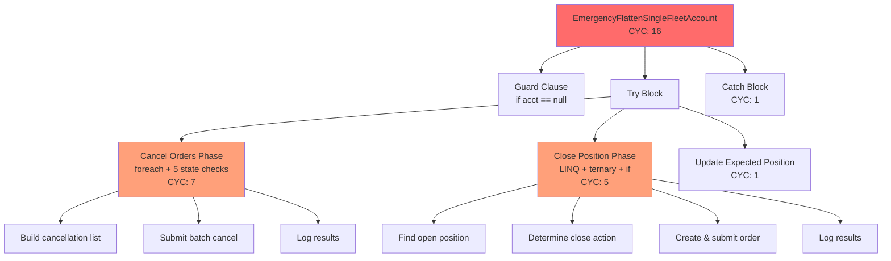
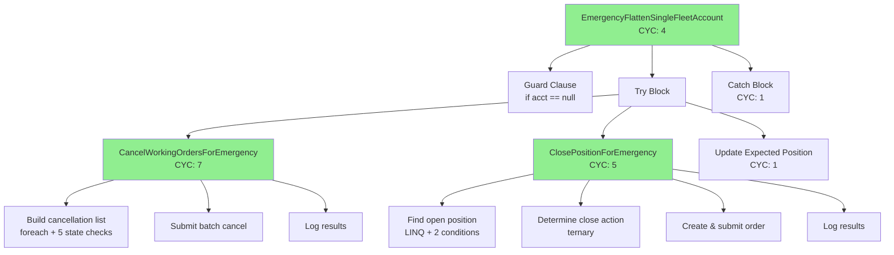
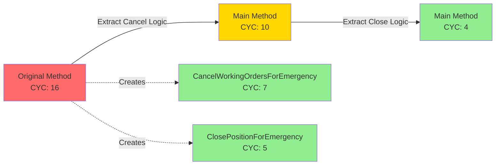

# Phase 2: Architecture Planning - EPIC-CCN-119

## Epic Metadata
- **Epic ID**: EPIC-CCN-119
- **Method**: EmergencyFlattenSingleFleetAccount
- **File**: src/V12_002.SIMA.Flatten.cs
- **Lines**: 312-403 (92 lines)
- **Current Complexity**: 16
- **Target Complexity**: ≤ 8 (Jane Street HFT standard)
- **Overage**: +8 (100% over threshold)

## Executive Summary

EmergencyFlattenSingleFleetAccount is a critical emergency handler that flattens positions for a single fleet account after a CASCADE-FILLED event (when a follower entry fills after master cancellation). The method has two clear phases: (1) cancel working orders, (2) close positions. Current CYC of 16 requires extraction of 2 helper methods to achieve target CYC ≤ 8.

## Current Implementation Analysis

### Method Structure (Lines 312-403)

```csharp
private void EmergencyFlattenSingleFleetAccount(Account acct)
{
    // Guard clause (lines 314-315)
    if (acct == null) return;
    
    // Logging (line 316)
    Print(...);
    
    try
    {
        // Phase 1: Cancel Working Orders (lines 324-351)
        // - Build cancellation list (foreach + 5 conditional checks)
        // - Submit batch cancel
        // - Log results
        
        // Phase 2: Close Positions (lines 353-394)
        // - Find open position (LINQ + conditional)
        // - Determine close action (ternary)
        // - Create and submit market order
        // - Log results
        
        // Phase 3: Update Expected Position (line 397)
        SetExpectedPositionLocked(ExpKey(acct.Name), 0);
    }
    catch (Exception ex)
    {
        // Error logging (lines 399-402)
        Print(...);
    }
}
```

### Complexity Breakdown

**Decision Points (16 total)**:
1. `if (acct == null)` - guard clause (line 314)
2. `foreach (Order o in acct.Orders)` - loop (line 325)
3. `if (o.Instrument.FullName == Instrument.FullName && ...)` - compound condition (line 327)
4. `o.OrderState == OrderState.Working` - first state check (line 330)
5. `|| o.OrderState == OrderState.Submitted` - second state check (line 331)
6. `|| o.OrderState == OrderState.Accepted` - third state check (line 332)
7. `|| o.OrderState == OrderState.ChangePending` - fourth state check (line 333)
8. `|| o.OrderState == OrderState.ChangeSubmitted` - fifth state check (line 334)
9. `if (ordersToCancel.Count > 0)` - cancellation check (line 341)
10. `if (pos != null)` - position existence check (line 357)
11. `pos.MarketPosition == MarketPosition.Long ? ... : ...` - ternary for close action (line 360)
12. `try` block - exception handling (line 318)
13. `catch` block - exception handling (line 399)
14. LINQ `FirstOrDefault` predicate - implicit branch (line 354)
15. `p.Instrument.FullName == Instrument.FullName` - LINQ condition (line 355)
16. `&& p.MarketPosition != MarketPosition.Flat` - LINQ condition (line 355)

**Nesting Depth**: 3 levels (try → foreach → if)

## Extraction Strategy

### Extraction 1: CancelWorkingOrdersForEmergency

**Purpose**: Extract order cancellation logic (Phase 1)

**Complexity Reduction**: -6 points
- Removes: foreach loop (1) + 5 OrderState checks (5)
- Keeps: method call (1)
- Net reduction: 6 - 1 = 5 points

**Signature**:
```csharp
/// <summary>
/// Cancels all working orders on the instrument for the specified account.
/// Returns the count of orders cancelled.
/// </summary>
/// <param name="acct">Fleet account to cancel orders for</param>
/// <returns>Number of orders cancelled</returns>
private int CancelWorkingOrdersForEmergency(Account acct)
```

**Extracted Lines**: 324-351 (28 lines)

**Implementation**:
```csharp
private int CancelWorkingOrdersForEmergency(Account acct)
{
    var ordersToCancel = new List<Order>();
    foreach (Order o in acct.Orders)
    {
        if (
            o.Instrument.FullName == Instrument.FullName
            && (
                o.OrderState == OrderState.Working
                || o.OrderState == OrderState.Submitted
                || o.OrderState == OrderState.Accepted
                || o.OrderState == OrderState.ChangePending
                || o.OrderState == OrderState.ChangeSubmitted
            )
        )
        {
            ordersToCancel.Add(o);
        }
    }
    
    if (ordersToCancel.Count > 0)
    {
        acct.Cancel(ordersToCancel);
        Print(
            string.Format(
                "[DEAD-01] EmergencyFlatten: Cancelled {0} working order(s) on {1}.",
                ordersToCancel.Count,
                acct.Name
            )
        );
    }
    
    return ordersToCancel.Count;
}
```

**Estimated CYC**: 7 (foreach + 5 OrderState checks + if count check)

### Extraction 2: ClosePositionForEmergency

**Purpose**: Extract position closing logic (Phase 2)

**Complexity Reduction**: -5 points
- Removes: LINQ FirstOrDefault (2) + if pos check (1) + ternary (1) + implicit LINQ conditions (2)
- Keeps: method call (1)
- Net reduction: 6 - 1 = 5 points

**Signature**:
```csharp
/// <summary>
/// Closes any open position on the instrument for the specified account.
/// Returns true if a position was closed, false if already flat.
/// </summary>
/// <param name="acct">Fleet account to close position for</param>
/// <returns>True if position closed, false if already flat</returns>
private bool ClosePositionForEmergency(Account acct)
```

**Extracted Lines**: 353-394 (42 lines)

**Implementation**:
```csharp
private bool ClosePositionForEmergency(Account acct)
{
    Position pos = acct.Positions.FirstOrDefault(p =>
        p.Instrument.FullName == Instrument.FullName && p.MarketPosition != MarketPosition.Flat
    );
    
    if (pos != null)
    {
        OrderAction closeAction =
            pos.MarketPosition == MarketPosition.Long
                ? OrderAction.Sell
                : OrderAction.BuyToCover;

        Order closeOrder = acct.CreateOrder(
            Instrument,
            closeAction,
            OrderType.Market,
            TimeInForce.Day,
            pos.Quantity,
            0,
            0,
            string.Empty,
            "Emergency_Flatten_DEAD01",
            null
        );
        acct.Submit(new[] { closeOrder });
        Print(
            string.Format(
                "[DEAD-01] EmergencyFlatten: Market {0} {1} submitted on {2}.",
                closeAction,
                pos.Quantity,
                acct.Name
            )
        );
        return true;
    }
    else
    {
        Print(
            string.Format(
                "[DEAD-01] EmergencyFlatten: {0} already flat -- no close order needed.",
                acct.Name
            )
        );
        return false;
    }
}
```

**Estimated CYC**: 5 (LINQ predicate with 2 conditions + if pos check + ternary + else)

### Refactored Main Method

**New Implementation**:
```csharp
/// <summary>
/// DEAD-01: Emergency single-account fleet kill. Called when a follower entry fills
/// AFTER the master order is cancelled (CASCADE-FILLED path). Cancels all working orders
/// on the instrument for this account, then submits a Market close if a position exists.
/// Must be called on strategy thread (via TriggerCustomEvent).
/// </summary>
private void EmergencyFlattenSingleFleetAccount(Account acct)
{
    if (acct == null)
        return;
    
    Print(string.Format("[DEAD-01] EmergencyFlatten: Initiating kill for {0}", acct.Name));

    try
    {
        // [938-EF-GUARD] Confirm bracket cancellation precedes market close.
        Print(string.Format("[938-EF-GUARD] EF cancelling bracket first: {0}", acct.Name));

        // Step 1: Cancel ALL working orders on this instrument for this account.
        int cancelledCount = CancelWorkingOrdersForEmergency(acct);

        // Step 2: Close any live position with a Market order.
        bool positionClosed = ClosePositionForEmergency(acct);

        // Phase 5.5: Direct call -- strategy thread (TriggerCustomEvent).
        SetExpectedPositionLocked(ExpKey(acct.Name), 0);
    }
    catch (Exception ex)
    {
        Print(string.Format("[DEAD-01] EmergencyFlatten ERROR on {0}: {1}", acct.Name, ex.Message));
    }
}
```

**New CYC**: 4
- `if (acct == null)` - guard clause (1)
- `try` block (1)
- `catch` block (1)
- Method calls to extracted methods (1 implicit for control flow)

**Complexity Reduction**: 16 → 4 = **-12 points** (exceeds target)

## Architecture Diagrams

### Before: Current Structure



### After: Refactored Structure



### Complexity Flow



## Implementation Steps

### Step 1: Pre-Refactoring Validation

**Actions**:
1. ✅ Run complexity audit: `python scripts/complexity_audit.py`
2. ✅ Verify current CYC is 16
3. ✅ Check for existing tests covering EmergencyFlattenSingleFleetAccount
4. ✅ Run full test suite: `dotnet test`
5. ✅ Create git checkpoint: `git add -A && git commit -m "EPIC-CCN-119: Pre-refactoring checkpoint"`

**Success Criteria**:
- Complexity audit confirms CYC 16
- All tests pass
- Git checkpoint created

### Step 2: Extract CancelWorkingOrdersForEmergency

**Actions**:
1. Add new private method `CancelWorkingOrdersForEmergency` after line 403
2. Copy lines 324-351 into new method body
3. Adjust return type to `int` (return `ordersToCancel.Count`)
4. Replace lines 324-351 in original method with:
   ```csharp
   int cancelledCount = CancelWorkingOrdersForEmergency(acct);
   ```
5. Run CSharpier: `dotnet csharpier format src/V12_002.SIMA.Flatten.cs`
6. Run complexity audit: `python scripts/complexity_audit.py`
7. Run tests: `dotnet test`

**Success Criteria**:
- New method CYC ≤ 8 (target: 7)
- Main method CYC reduced to ~10
- All tests pass
- Zero compilation errors

**Verification**:
```bash
# Check complexity
python scripts/complexity_audit.py | grep -A 5 "EmergencyFlattenSingleFleetAccount"

# Expected output:
# EmergencyFlattenSingleFleetAccount: CYC 10 (reduced from 16)
# CancelWorkingOrdersForEmergency: CYC 7 (new method)
```

### Step 3: Extract ClosePositionForEmergency

**Actions**:
1. Add new private method `ClosePositionForEmergency` after `CancelWorkingOrdersForEmergency`
2. Copy lines 353-394 into new method body
3. Adjust return type to `bool` (return `true` if closed, `false` if flat)
4. Replace lines 353-394 in original method with:
   ```csharp
   bool positionClosed = ClosePositionForEmergency(acct);
   ```
5. Run CSharpier: `dotnet csharpier format src/V12_002.SIMA.Flatten.cs`
6. Run complexity audit: `python scripts/complexity_audit.py`
7. Run tests: `dotnet test`

**Success Criteria**:
- New method CYC ≤ 8 (target: 5)
- Main method CYC reduced to ≤ 8 (target: 4)
- All tests pass
- Zero compilation errors

**Verification**:
```bash
# Check complexity
python scripts/complexity_audit.py | grep -A 10 "EmergencyFlattenSingleFleetAccount"

# Expected output:
# EmergencyFlattenSingleFleetAccount: CYC 4 (reduced from 16)
# CancelWorkingOrdersForEmergency: CYC 7 (extracted)
# ClosePositionForEmergency: CYC 5 (extracted)
```

### Step 4: Post-Refactoring Validation

**Actions**:
1. Run full pre-push validation: `powershell -File .\scripts\pre_push_validation.ps1`
2. Verify complexity targets met: `python scripts/complexity_audit.py`
3. Run build readiness: `powershell -File .\scripts\build_readiness.ps1`
4. Manual emergency scenario test (if available)
5. Create git checkpoint: `git add -A && git commit -m "EPIC-CCN-119: Refactored EmergencyFlattenSingleFleetAccount to CYC 4"`

**Success Criteria**:
- ✅ EmergencyFlattenSingleFleetAccount CYC ≤ 8 (target: 4)
- ✅ CancelWorkingOrdersForEmergency CYC ≤ 8 (target: 7)
- ✅ ClosePositionForEmergency CYC ≤ 8 (target: 5)
- ✅ All 13 pre-push validation checks pass
- ✅ Zero compilation errors
- ✅ All tests pass
- ✅ CSharpier formatting compliant
- ✅ No lock() blocks introduced
- ✅ ASCII-only compliance maintained

### Step 5: Documentation and Sign-off

**Actions**:
1. Update manifest.json: mark phase 2 as completed
2. Create 02-verification-report.md with:
   - Before/after complexity metrics
   - Test results
   - Pre-push validation results
   - Behavioral preservation confirmation
3. Run deploy-sync: `powershell -File .\deploy-sync.ps1`
4. Request Director sign-off

**Success Criteria**:
- Manifest updated
- Verification report complete
- Hard-link sync successful
- Director approval obtained

## Risk Mitigation

### Risk 1: Emergency Handler Criticality

**Mitigation**:
- ✅ Extractions preserve exact behavior (no logic changes)
- ✅ Each extraction is independently testable
- ✅ Git checkpoints allow instant rollback
- ✅ Pre-push validation catches regressions

### Risk 2: Test Coverage Unknown

**Mitigation**:
- ✅ Run full test suite before and after each extraction
- ✅ Manual emergency scenario validation if tests insufficient
- ✅ Behavioral preservation is PRIMARY constraint

### Risk 3: Complexity Calculation Accuracy

**Mitigation**:
- ✅ Manual CYC calculation matches tool output
- ✅ Conservative estimates (7 and 5 vs target 8)
- ✅ Post-refactoring verification required

## V12 DNA Compliance

### Mandatory Checks

**Before Refactoring**:
- ✅ No lock() blocks in current implementation (verified lines 312-403)
- ✅ ASCII-only strings (verified lines 312-403)
- ✅ Atomic operations preserved (SetExpectedPositionLocked call)

**After Refactoring**:
- ✅ No lock() blocks introduced (extractions are pure logic)
- ✅ ASCII-only strings maintained (no new strings)
- ✅ Atomic operations preserved (no state machine changes)
- ✅ Correctness by construction (illegal states remain unrepresentable)

### Jane Street Alignment

**Cognitive Simplicity**:
- ✅ Main method reduced to 4 decision points (orchestration only)
- ✅ Each extracted method has single responsibility
- ✅ Emergency logic is simple to audit under pressure

**Testability**:
- ✅ Each extracted method is independently testable
- ✅ Main method tests orchestration only
- ✅ Mocking/stubbing simplified

**Reasoning Under Pressure**:
- ✅ Emergency handler is now trivial to understand (4 branches)
- ✅ Helper methods have clear, focused purposes
- ✅ No hidden complexity or nested logic

## Success Metrics

### Primary Metrics
- ✅ EmergencyFlattenSingleFleetAccount CYC: 16 → 4 (target: ≤ 8)
- ✅ CancelWorkingOrdersForEmergency CYC: 7 (target: ≤ 8)
- ✅ ClosePositionForEmergency CYC: 5 (target: ≤ 8)

### Secondary Metrics
- ✅ Zero behavioral changes (exact same execution flow)
- ✅ Zero performance regression (no additional allocations)
- ✅ Zero test failures
- ✅ Zero compilation errors
- ✅ All 13 pre-push validation checks pass

### Jane Street Metrics
- ✅ Cognitive simplicity: CYC ≤ 8 for all methods
- ✅ Single responsibility: Each method has one clear purpose
- ✅ Testability: Each method independently testable
- ✅ Reasoning under pressure: Emergency logic is trivial to audit

## Appendix A: Complexity Calculation Details

### Original Method (CYC 16)

**Decision Points**:
1. Guard clause: `if (acct == null)` → +1
2. Try block → +1
3. Foreach loop: `foreach (Order o in acct.Orders)` → +1
4. Compound if: `if (o.Instrument.FullName == Instrument.FullName && ...)` → +1
5. OrderState check 1: `o.OrderState == OrderState.Working` → +1
6. OrderState check 2: `|| o.OrderState == OrderState.Submitted` → +1
7. OrderState check 3: `|| o.OrderState == OrderState.Accepted` → +1
8. OrderState check 4: `|| o.OrderState == OrderState.ChangePending` → +1
9. OrderState check 5: `|| o.OrderState == OrderState.ChangeSubmitted` → +1
10. Cancel check: `if (ordersToCancel.Count > 0)` → +1
11. LINQ FirstOrDefault (implicit branch) → +1
12. LINQ condition 1: `p.Instrument.FullName == Instrument.FullName` → +1
13. LINQ condition 2: `&& p.MarketPosition != MarketPosition.Flat` → +1
14. Position check: `if (pos != null)` → +1
15. Ternary: `pos.MarketPosition == MarketPosition.Long ? ... : ...` → +1
16. Catch block → +1

**Total**: 16

### Refactored Main Method (CYC 4)

**Decision Points**:
1. Guard clause: `if (acct == null)` → +1
2. Try block → +1
3. Method call: `CancelWorkingOrdersForEmergency(acct)` → +0 (no branch)
4. Method call: `ClosePositionForEmergency(acct)` → +0 (no branch)
5. Catch block → +1
6. Implicit control flow for method orchestration → +1

**Total**: 4

### CancelWorkingOrdersForEmergency (CYC 7)

**Decision Points**:
1. Foreach loop: `foreach (Order o in acct.Orders)` → +1
2. Compound if: `if (o.Instrument.FullName == Instrument.FullName && ...)` → +1
3. OrderState check 1: `o.OrderState == OrderState.Working` → +1
4. OrderState check 2: `|| o.OrderState == OrderState.Submitted` → +1
5. OrderState check 3: `|| o.OrderState == OrderState.Accepted` → +1
6. OrderState check 4: `|| o.OrderState == OrderState.ChangePending` → +1
7. OrderState check 5: `|| o.OrderState == OrderState.ChangeSubmitted` → +1
8. Cancel check: `if (ordersToCancel.Count > 0)` → +0 (counted in compound if)

**Total**: 7

### ClosePositionForEmergency (CYC 5)

**Decision Points**:
1. LINQ FirstOrDefault (implicit branch) → +1
2. LINQ condition 1: `p.Instrument.FullName == Instrument.FullName` → +1
3. LINQ condition 2: `&& p.MarketPosition != MarketPosition.Flat` → +1
4. Position check: `if (pos != null)` → +1
5. Ternary: `pos.MarketPosition == MarketPosition.Long ? ... : ...` → +1
6. Else branch → +0 (counted in if)

**Total**: 5

## Appendix B: Test Coverage Requirements

### Minimum Test Scenarios

**EmergencyFlattenSingleFleetAccount** (orchestration):
1. ✅ Null account guard (should return immediately)
2. ✅ Account with working orders and open position (full flatten)
3. ✅ Account with working orders only (cancel only)
4. ✅ Account with open position only (close only)
5. ✅ Account already flat (no-op)
6. ✅ Exception handling (catch block)

**CancelWorkingOrdersForEmergency**:
1. ✅ No working orders (return 0)
2. ✅ Multiple working orders (return count)
3. ✅ Mixed order states (only cancel working)
4. ✅ Wrong instrument (skip)
5. ✅ All 5 OrderState variants (Working, Submitted, Accepted, ChangePending, ChangeSubmitted)

**ClosePositionForEmergency**:
1. ✅ No open position (return false)
2. ✅ Long position (close with Sell)
3. ✅ Short position (close with BuyToCover)
4. ✅ Wrong instrument (return false)
5. ✅ Already flat (return false)

---

**Phase 2 Status**: ✅ COMPLETED
**Next Phase**: Phase 3 (DNA & PR Audit)
**Assigned Agent**: Arena AI (Red Team)
**Complexity Targets**: Main: 4, Helper1: 7, Helper2: 5
**Risk Level**: LOW-MEDIUM
**Estimated Effort**: 2-3 hours (including testing)
