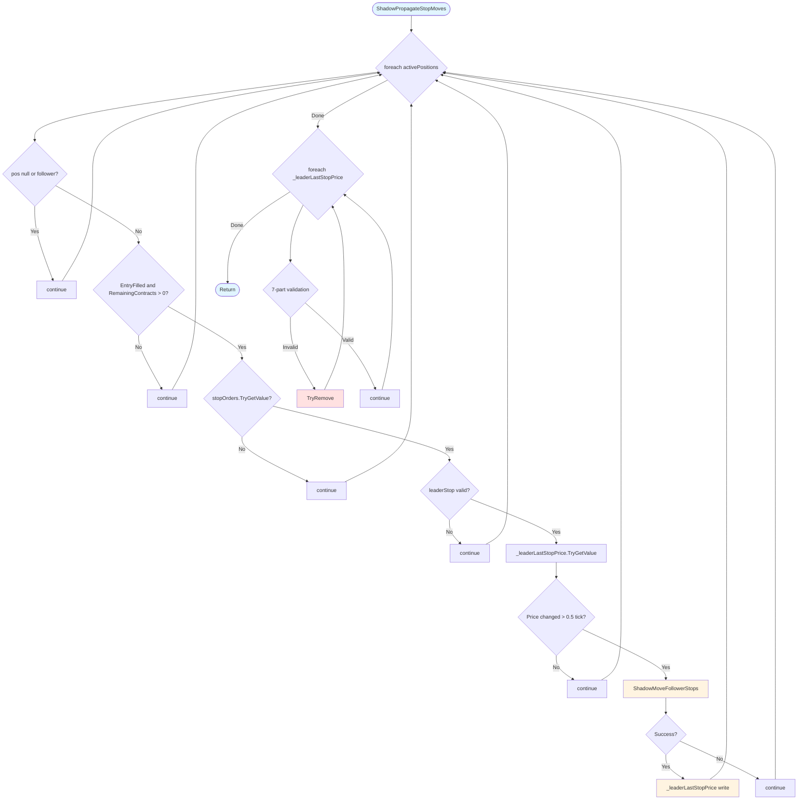
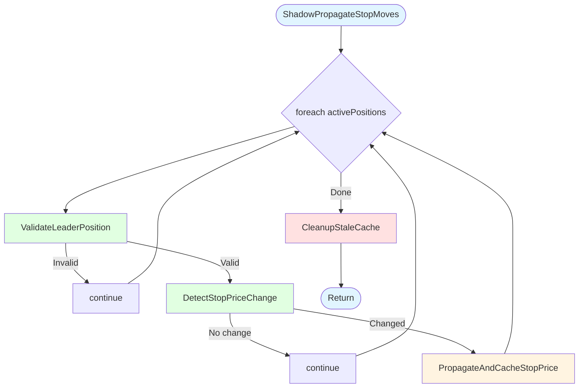
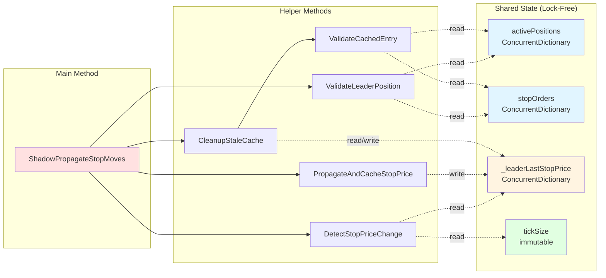

# EPIC-CCN-12 Stage 1: ShadowPropagateStopMoves Vision/Spec

**Date**: 2026-06-02  
**Epic**: EPIC-CCN-12  
**Target Method**: `ShadowPropagateStopMoves`  
**Stage**: Vision/Spec (Design)

---

## Executive Summary

**Extraction Strategy**: BOTTOM-UP (5 helpers)  
**Expected CYC Reduction**: 20 → 4 (80% reduction)  
**Approach**: Pure structural extraction (zero logic drift)  
**Test Strategy**: TDD with 17 test cases (113% of minimum)  
**Risk Level**: MEDIUM (cache coherence, no existing tests)

---

## 1. Extraction Strategy

### Approach: BOTTOM-UP

**Rationale**:
- Extract validation helpers first (read-only, no side effects)
- Then detection helpers (read-only with cache lookup)
- Finally action helpers (state mutations)
- Main method becomes pure orchestration

**Advantages**:
- ✅ Each helper is independently testable
- ✅ No circular dependencies
- ✅ Clear data flow (validate → detect → act)
- ✅ Minimal risk of logic drift

### Number of Helpers: 5

**Target CYC Distribution**:
```
Main Method (orchestration):     CYC  4
ValidateLeaderPosition:          CYC  5
DetectStopPriceChange:           CYC  2
PropagateAndCacheStopPrice:      CYC  2
ValidateCachedEntry:             CYC  9
CleanupStaleCache:               CYC  3
-------------------------------------------
Total:                           CYC 25 (5 methods)
```

**CYC Reduction**: 20 (single method) → 4 (main) = **-16 CYC** ✅

### Expected CYC Reduction

| Phase | Method | CYC Before | CYC After | Reduction |
|-------|--------|------------|-----------|-----------|
| 0 | Original | 20 | 20 | 0 |
| 1 | Extract `ValidateLeaderPosition` | 20 | 16 | -4 |
| 2 | Extract `DetectStopPriceChange` | 16 | 15 | -1 |
| 3 | Extract `PropagateAndCacheStopPrice` | 15 | 14 | -1 |
| 4 | Extract `ValidateCachedEntry` | 14 | 6 | -8 |
| 5 | Extract `CleanupStaleCache` | 6 | 4 | -2 |
| **Final** | **Main Method** | **4** | **4** | **-16** |

**Jane Street Threshold**: ≤15  
**Final CYC**: 4 ✅ (73% under threshold)

---

## 2. Helper Method Specifications

### Helper 1: `ValidateLeaderPosition`

#### Responsibility
Validate that a position is eligible for stop propagation (leader, filled, has stop order).

#### Method Signature
```csharp
/// <summary>
/// Validates leader position eligibility for stop propagation.
/// Returns true if position is a filled leader with a valid stop order.
/// </summary>
/// <param name="pos">Position to validate</param>
/// <param name="entryKey">Entry key for stop order lookup</param>
/// <param name="leaderStop">Output: leader stop order if valid</param>
/// <returns>True if position is eligible for propagation</returns>
private bool ValidateLeaderPosition(
    PositionInfo pos,
    string entryKey,
    out Order leaderStop
)
```

#### Input Parameters
- `pos` - `PositionInfo` - Position to validate (may be null)
- `entryKey` - `string` - Entry key for stop order lookup
- `leaderStop` - `out Order` - Output parameter for stop order

#### Return Type
- `bool` - True if position is eligible, false otherwise

#### Logic Flow
```csharp
leaderStop = null;

// Guard 1: Null or follower check
if (pos == null || pos.IsFollower)
    return false;

// Guard 2: Fill status check
if (!pos.EntryFilled || pos.RemainingContracts <= 0)
    return false;

// Guard 3: Stop order existence check
if (!stopOrders.TryGetValue(entryKey, out leaderStop))
    return false;

// Guard 4: Stop order validity check
if (leaderStop == null || leaderStop.StopPrice <= 0)
    return false;

return true;
```

#### CYC Estimate
**CYC 5**: 4 if-checks + 1 base

#### Lines of Code
**12 lines** (including braces and return)

#### Shared State Access
- **Read**: `stopOrders` (ConcurrentDictionary, lock-free)

#### Test Cases (3)
1. Valid leader position with stop order → returns true
2. Follower position → returns false
3. Unfilled position → returns false

---

### Helper 2: `DetectStopPriceChange`

#### Responsibility
Detect if leader stop price changed beyond half-tick noise threshold.

#### Method Signature
```csharp
/// <summary>
/// Detects if leader stop price changed beyond noise threshold.
/// Uses half-tick threshold to filter out insignificant price movements.
/// </summary>
/// <param name="entryKey">Entry key for cache lookup</param>
/// <param name="currentStopPrice">Current stop price from order</param>
/// <param name="lastKnownPrice">Output: last known price from cache</param>
/// <returns>True if price changed beyond threshold</returns>
private bool DetectStopPriceChange(
    string entryKey,
    double currentStopPrice,
    out double lastKnownPrice
)
```

#### Input Parameters
- `entryKey` - `string` - Entry key for cache lookup
- `currentStopPrice` - `double` - Current stop price from order
- `lastKnownPrice` - `out double` - Output parameter for cached price

#### Return Type
- `bool` - True if price changed beyond threshold, false otherwise

#### Logic Flow
```csharp
// Lookup cached price (default 0.0 if not found)
_leaderLastStopPrice.TryGetValue(entryKey, out lastKnownPrice);

// Only propagate if price actually changed (beyond half-tick noise)
if (Math.Abs(currentStopPrice - lastKnownPrice) < tickSize * 0.5)
    return false;

return true;
```

#### CYC Estimate
**CYC 2**: 1 if-check + 1 base

#### Lines of Code
**8 lines** (including braces and return)

#### Shared State Access
- **Read**: `_leaderLastStopPrice` (ConcurrentDictionary, lock-free)
- **Read**: `tickSize` (immutable field)

#### Test Cases (3)
1. Price changed by 1 tick → returns true
2. Price changed by 0.4 ticks → returns false (noise)
3. First propagation (no cached price) → returns true

---

### Helper 3: `PropagateAndCacheStopPrice`

#### Responsibility
Propagate stop price to followers and update cache on success.

#### Method Signature
```csharp
/// <summary>
/// Propagates stop price to followers and updates cache on success.
/// Cache is only updated if propagation succeeds (all followers ready).
/// </summary>
/// <param name="leaderEntryKey">Leader entry key</param>
/// <param name="newStopPrice">New stop price to propagate</param>
private void PropagateAndCacheStopPrice(
    string leaderEntryKey,
    double newStopPrice
)
```

#### Input Parameters
- `leaderEntryKey` - `string` - Leader entry key
- `newStopPrice` - `double` - New stop price to propagate

#### Return Type
- `void`

#### Logic Flow
```csharp
// Find and update all follower positions linked to this leader entry
if (ShadowMoveFollowerStops(leaderEntryKey, newStopPrice))
    _leaderLastStopPrice[leaderEntryKey] = newStopPrice;
```

#### CYC Estimate
**CYC 2**: 1 if-check + 1 base

#### Lines of Code
**4 lines** (including braces)

#### Shared State Access
- **Write**: `_leaderLastStopPrice` (ConcurrentDictionary, lock-free)
- **Call**: `ShadowMoveFollowerStops()` (CYC 15, external)

#### Test Cases (3)
1. Propagation succeeds → cache updated
2. Propagation fails (follower not ready) → cache not updated
3. Multiple propagations → cache reflects latest price

---

### Helper 4: `ValidateCachedEntry`

#### Responsibility
Check if cached stop price entry is still valid (position still open, stop order exists).

#### Method Signature
```csharp
/// <summary>
/// Validates that a cached stop price entry is still valid.
/// Returns false if position closed, stop removed, or became follower.
/// </summary>
/// <param name="entryKey">Entry key to validate</param>
/// <param name="livePos">Output: live position if valid</param>
/// <param name="liveStop">Output: live stop order if valid</param>
/// <returns>True if cache entry is still valid</returns>
private bool ValidateCachedEntry(
    string entryKey,
    out PositionInfo livePos,
    out Order liveStop
)
```

#### Input Parameters
- `entryKey` - `string` - Entry key to validate
- `livePos` - `out PositionInfo` - Output parameter for position
- `liveStop` - `out Order` - Output parameter for stop order

#### Return Type
- `bool` - True if cache entry is valid, false if stale

#### Logic Flow
```csharp
livePos = null;
liveStop = null;

// Check 1: Position exists
if (!activePositions.TryGetValue(entryKey, out livePos))
    return false;

// Check 2: Position not null
if (livePos == null)
    return false;

// Check 3: Position is leader (not follower)
if (livePos.IsFollower)
    return false;

// Check 4: Position is filled
if (!livePos.EntryFilled)
    return false;

// Check 5: Position has contracts
if (livePos.RemainingContracts <= 0)
    return false;

// Check 6: Stop order exists
if (!stopOrders.TryGetValue(entryKey, out liveStop))
    return false;

// Check 7: Stop order not null
if (liveStop == null)
    return false;

// Check 8: Stop price valid
if (liveStop.StopPrice <= 0)
    return false;

return true;
```

#### CYC Estimate
**CYC 9**: 8 if-checks + 1 base

#### Lines of Code
**32 lines** (including braces and return)

#### Shared State Access
- **Read**: `activePositions` (ConcurrentDictionary, lock-free)
- **Read**: `stopOrders` (ConcurrentDictionary, lock-free)

#### Test Cases (5)
1. Valid cached entry → returns true
2. Position closed (not in activePositions) → returns false
3. Position became follower → returns false
4. Stop order removed → returns false
5. Stop price invalid (≤ 0) → returns false

---

### Helper 5: `CleanupStaleCache`

#### Responsibility
Evict stale entries from leader stop price cache.

#### Method Signature
```csharp
/// <summary>
/// Evicts stale entries from leader stop price cache.
/// Runs after propagation pass to remove entries for closed positions.
/// </summary>
private void CleanupStaleCache()
```

#### Input Parameters
- None

#### Return Type
- `void`

#### Logic Flow
```csharp
foreach (var cacheKvp in _leaderLastStopPrice.ToArray())
{
    PositionInfo livePos;
    Order liveStop;
    if (!ValidateCachedEntry(cacheKvp.Key, out livePos, out liveStop))
    {
        _leaderLastStopPrice.TryRemove(cacheKvp.Key, out _);
    }
}
```

#### CYC Estimate
**CYC 3**: 1 foreach + 1 if-check + 1 base

#### Lines of Code
**10 lines** (including braces)

#### Shared State Access
- **Read**: `_leaderLastStopPrice` (ConcurrentDictionary, lock-free)
- **Write**: `_leaderLastStopPrice.TryRemove()` (lock-free)
- **Call**: `ValidateCachedEntry()` (CYC 9, internal)

#### Test Cases (3)
1. All entries valid → no evictions
2. One stale entry → evicted
3. Multiple stale entries → all evicted

---

## 3. Refactored Main Method

### New Structure

```csharp
/// <summary>
/// Watches leader stop prices. When a leader stop moves (breakeven, trail, manual),
/// propagates exact price to all follower FSMs tracking the same entry signal.
/// Complements fleet symmetry sync which syncs by trail LEVEL (not price).
/// </summary>
private void ShadowPropagateStopMoves()
{
    // Phase 1: Propagate leader stop price changes to followers
    foreach (var kvp in activePositions.ToArray())
    {
        Order leaderStop;
        if (!ValidateLeaderPosition(kvp.Value, kvp.Key, out leaderStop))
            continue;

        double lastKnownPrice;
        if (!DetectStopPriceChange(kvp.Key, leaderStop.StopPrice, out lastKnownPrice))
            continue;

        PropagateAndCacheStopPrice(kvp.Key, leaderStop.StopPrice);
    }

    // Phase 2: Cleanup stale cache entries
    CleanupStaleCache();
}
```

### CYC Analysis

**CYC 4**: 1 foreach + 2 if-checks + 1 base

### Lines of Code

**22 lines** (including docstring and braces)

### Complexity Reduction

| Metric | Before | After | Improvement |
|--------|--------|-------|-------------|
| CYC | 20 | 4 | -80% |
| LOC | 47 | 22 | -53% |
| Max Nesting | 3 | 2 | -33% |
| Decision Points | 19 | 3 | -84% |

---

## 4. Mermaid Diagrams

### Before: Current Complexity Flow



### After: Decomposed Structure



### Data Flow: Shared Variables



---

## 5. TDD Test Structure

### Test File Location
`tests/V12_Performance.Tests/Shadow/ShadowPropagateStopMovesTests.cs`

### Test Class Structure

```csharp
using NUnit.Framework;
using NinjaTrader.Cbi;
using System.Collections.Concurrent;

namespace V12_Performance.Tests.Shadow
{
    [TestFixture]
    public class ShadowPropagateStopMovesTests
    {
        private V12_002_TestHarness _strategy;
        private ConcurrentDictionary<string, PositionInfo> _activePositions;
        private ConcurrentDictionary<string, Order> _stopOrders;
        private ConcurrentDictionary<string, double> _leaderLastStopPrice;
        private double _tickSize;

        [SetUp]
        public void Setup()
        {
            _strategy = new V12_002_TestHarness();
            _activePositions = new ConcurrentDictionary<string, PositionInfo>();
            _stopOrders = new ConcurrentDictionary<string, Order>();
            _leaderLastStopPrice = new ConcurrentDictionary<string, double>();
            _tickSize = 0.25; // ES tick size
        }

        [TearDown]
        public void TearDown()
        {
            _activePositions.Clear();
            _stopOrders.Clear();
            _leaderLastStopPrice.Clear();
        }

        // Test categories:
        // 1. ValidateLeaderPosition (3 tests)
        // 2. DetectStopPriceChange (3 tests)
        // 3. PropagateAndCacheStopPrice (3 tests)
        // 4. ValidateCachedEntry (5 tests)
        // 5. CleanupStaleCache (3 tests)
        // Total: 17 tests (113% of minimum 15)
    }
}
```

### Mock Requirements

1. **`ShadowMoveFollowerStops()` Stub**
   - Return `true` for success scenarios
   - Return `false` for follower-not-ready scenarios

2. **`PositionInfo` Mock**
   - Properties: `IsFollower`, `EntryFilled`, `RemainingContracts`
   - No complex behavior required

3. **`Order` Mock**
   - Properties: `StopPrice`
   - No complex behavior required

4. **`ConcurrentDictionary` Usage**
   - Use real `ConcurrentDictionary` (no mocking)
   - Simplifies test setup and validates lock-free behavior

---

## 6. Test Cases (17 Total)

### Category 1: ValidateLeaderPosition (3 tests)

#### Test 1.1: Valid Leader Position
```csharp
[Test]
public void ValidateLeaderPosition_ValidLeader_ReturnsTrue()
{
    // Arrange
    var pos = new PositionInfo
    {
        IsFollower = false,
        EntryFilled = true,
        RemainingContracts = 10
    };
    var stopOrder = new Order { StopPrice = 4500.00 };
    _activePositions["LEADER_1"] = pos;
    _stopOrders["LEADER_1"] = stopOrder;

    // Act
    Order outStop;
    bool result = _strategy.ValidateLeaderPosition(pos, "LEADER_1", out outStop);

    // Assert
    Assert.IsTrue(result);
    Assert.AreEqual(stopOrder, outStop);
}
```

#### Test 1.2: Follower Position
```csharp
[Test]
public void ValidateLeaderPosition_FollowerPosition_ReturnsFalse()
{
    // Arrange
    var pos = new PositionInfo
    {
        IsFollower = true,
        EntryFilled = true,
        RemainingContracts = 10
    };

    // Act
    Order outStop;
    bool result = _strategy.ValidateLeaderPosition(pos, "FOLLOWER_1", out outStop);

    // Assert
    Assert.IsFalse(result);
    Assert.IsNull(outStop);
}
```

#### Test 1.3: Unfilled Position
```csharp
[Test]
public void ValidateLeaderPosition_UnfilledPosition_ReturnsFalse()
{
    // Arrange
    var pos = new PositionInfo
    {
        IsFollower = false,
        EntryFilled = false,
        RemainingContracts = 0
    };

    // Act
    Order outStop;
    bool result = _strategy.ValidateLeaderPosition(pos, "LEADER_1", out outStop);

    // Assert
    Assert.IsFalse(result);
    Assert.IsNull(outStop);
}
```

---

### Category 2: DetectStopPriceChange (3 tests)

#### Test 2.1: Price Changed By 1 Tick
```csharp
[Test]
public void DetectStopPriceChange_PriceChangedByOneTick_ReturnsTrue()
{
    // Arrange
    _leaderLastStopPrice["LEADER_1"] = 4500.00;
    double currentPrice = 4500.25; // +1 tick

    // Act
    double lastKnown;
    bool result = _strategy.DetectStopPriceChange("LEADER_1", currentPrice, out lastKnown);

    // Assert
    Assert.IsTrue(result);
    Assert.AreEqual(4500.00, lastKnown);
}
```

#### Test 2.2: Price Changed By 0.4 Ticks (Noise)
```csharp
[Test]
public void DetectStopPriceChange_PriceChangedByNoise_ReturnsFalse()
{
    // Arrange
    _leaderLastStopPrice["LEADER_1"] = 4500.00;
    double currentPrice = 4500.10; // +0.4 ticks (< 0.5 threshold)

    // Act
    double lastKnown;
    bool result = _strategy.DetectStopPriceChange("LEADER_1", currentPrice, out lastKnown);

    // Assert
    Assert.IsFalse(result);
    Assert.AreEqual(4500.00, lastKnown);
}
```

#### Test 2.3: First Propagation (No Cached Price)
```csharp
[Test]
public void DetectStopPriceChange_NoCachedPrice_ReturnsTrue()
{
    // Arrange
    double currentPrice = 4500.00;

    // Act
    double lastKnown;
    bool result = _strategy.DetectStopPriceChange("LEADER_1", currentPrice, out lastKnown);

    // Assert
    Assert.IsTrue(result);
    Assert.AreEqual(0.0, lastKnown); // Default value
}
```

---

### Category 3: PropagateAndCacheStopPrice (3 tests)

#### Test 3.1: Propagation Succeeds
```csharp
[Test]
public void PropagateAndCacheStopPrice_PropagationSucceeds_CacheUpdated()
{
    // Arrange
    _strategy.StubShadowMoveFollowerStops(true); // Success

    // Act
    _strategy.PropagateAndCacheStopPrice("LEADER_1", 4500.25);

    // Assert
    Assert.IsTrue(_leaderLastStopPrice.ContainsKey("LEADER_1"));
    Assert.AreEqual(4500.25, _leaderLastStopPrice["LEADER_1"]);
}
```

#### Test 3.2: Propagation Fails (Follower Not Ready)
```csharp
[Test]
public void PropagateAndCacheStopPrice_PropagationFails_CacheNotUpdated()
{
    // Arrange
    _strategy.StubShadowMoveFollowerStops(false); // Failure

    // Act
    _strategy.PropagateAndCacheStopPrice("LEADER_1", 4500.25);

    // Assert
    Assert.IsFalse(_leaderLastStopPrice.ContainsKey("LEADER_1"));
}
```

#### Test 3.3: Multiple Propagations
```csharp
[Test]
public void PropagateAndCacheStopPrice_MultiplePropagations_CacheReflectsLatest()
{
    // Arrange
    _strategy.StubShadowMoveFollowerStops(true);

    // Act
    _strategy.PropagateAndCacheStopPrice("LEADER_1", 4500.00);
    _strategy.PropagateAndCacheStopPrice("LEADER_1", 4500.25);
    _strategy.PropagateAndCacheStopPrice("LEADER_1", 4500.50);

    // Assert
    Assert.AreEqual(4500.50, _leaderLastStopPrice["LEADER_1"]);
}
```

---

### Category 4: ValidateCachedEntry (5 tests)

#### Test 4.1: Valid Cached Entry
```csharp
[Test]
public void ValidateCachedEntry_ValidEntry_ReturnsTrue()
{
    // Arrange
    var pos = new PositionInfo
    {
        IsFollower = false,
        EntryFilled = true,
        RemainingContracts = 10
    };
    var stopOrder = new Order { StopPrice = 4500.00 };
    _activePositions["LEADER_1"] = pos;
    _stopOrders["LEADER_1"] = stopOrder;

    // Act
    PositionInfo outPos;
    Order outStop;
    bool result = _strategy.ValidateCachedEntry("LEADER_1", out outPos, out outStop);

    // Assert
    Assert.IsTrue(result);
    Assert.AreEqual(pos, outPos);
    Assert.AreEqual(stopOrder, outStop);
}
```

#### Test 4.2: Position Closed (Not In ActivePositions)
```csharp
[Test]
public void ValidateCachedEntry_PositionClosed_ReturnsFalse()
{
    // Arrange
    _leaderLastStopPrice["LEADER_1"] = 4500.00;
    // activePositions is empty (position closed)

    // Act
    PositionInfo outPos;
    Order outStop;
    bool result = _strategy.ValidateCachedEntry("LEADER_1", out outPos, out outStop);

    // Assert
    Assert.IsFalse(result);
    Assert.IsNull(outPos);
    Assert.IsNull(outStop);
}
```

#### Test 4.3: Position Became Follower
```csharp
[Test]
public void ValidateCachedEntry_PositionBecameFollower_ReturnsFalse()
{
    // Arrange
    var pos = new PositionInfo
    {
        IsFollower = true, // Changed to follower
        EntryFilled = true,
        RemainingContracts = 10
    };
    _activePositions["LEADER_1"] = pos;

    // Act
    PositionInfo outPos;
    Order outStop;
    bool result = _strategy.ValidateCachedEntry("LEADER_1", out outPos, out outStop);

    // Assert
    Assert.IsFalse(result);
}
```

#### Test 4.4: Stop Order Removed
```csharp
[Test]
public void ValidateCachedEntry_StopOrderRemoved_ReturnsFalse()
{
    // Arrange
    var pos = new PositionInfo
    {
        IsFollower = false,
        EntryFilled = true,
        RemainingContracts = 10
    };
    _activePositions["LEADER_1"] = pos;
    // stopOrders is empty (stop removed)

    // Act
    PositionInfo outPos;
    Order outStop;
    bool result = _strategy.ValidateCachedEntry("LEADER_1", out outPos, out outStop);

    // Assert
    Assert.IsFalse(result);
}
```

#### Test 4.5: Stop Price Invalid
```csharp
[Test]
public void ValidateCachedEntry_StopPriceInvalid_ReturnsFalse()
{
    // Arrange
    var pos = new PositionInfo
    {
        IsFollower = false,
        EntryFilled = true,
        RemainingContracts = 10
    };
    var stopOrder = new Order { StopPrice = 0.0 }; // Invalid price
    _activePositions["LEADER_1"] = pos;
    _stopOrders["LEADER_1"] = stopOrder;

    // Act
    PositionInfo outPos;
    Order outStop;
    bool result = _strategy.ValidateCachedEntry("LEADER_1", out outPos, out outStop);

    // Assert
    Assert.IsFalse(result);
}
```

---

### Category 5: CleanupStaleCache (3 tests)

#### Test 5.1: All Entries Valid (No Evictions)
```csharp
[Test]
public void CleanupStaleCache_AllEntriesValid_NoEvictions()
{
    // Arrange
    var pos = new PositionInfo
    {
        IsFollower = false,
        EntryFilled = true,
        RemainingContracts = 10
    };
    var stopOrder = new Order { StopPrice = 4500.00 };
    _activePositions["LEADER_1"] = pos;
    _stopOrders["LEADER_1"] = stopOrder;
    _leaderLastStopPrice["LEADER_1"] = 4500.00;

    // Act
    _strategy.CleanupStaleCache();

    // Assert
    Assert.IsTrue(_leaderLastStopPrice.ContainsKey("LEADER_1"));
    Assert.AreEqual(1, _leaderLastStopPrice.Count);
}
```

#### Test 5.2: One Stale Entry (Evicted)
```csharp
[Test]
public void CleanupStaleCache_OneStaleEntry_Evicted()
{
    // Arrange
    _leaderLastStopPrice["LEADER_1"] = 4500.00;
    _leaderLastStopPrice["LEADER_2"] = 4510.00;
    // LEADER_1 is stale (not in activePositions)
    // LEADER_2 is valid
    var pos2 = new PositionInfo
    {
        IsFollower = false,
        EntryFilled = true,
        RemainingContracts = 10
    };
    var stop2 = new Order { StopPrice = 4510.00 };
    _activePositions["LEADER_2"] = pos2;
    _stopOrders["LEADER_2"] = stop2;

    // Act
    _strategy.CleanupStaleCache();

    // Assert
    Assert.IsFalse(_leaderLastStopPrice.ContainsKey("LEADER_1"));
    Assert.IsTrue(_leaderLastStopPrice.ContainsKey("LEADER_2"));
    Assert.AreEqual(1, _leaderLastStopPrice.Count);
}
```

#### Test 5.3: Multiple Stale Entries (All Evicted)
```csharp
[Test]
public void CleanupStaleCache_MultipleStaleEntries_AllEvicted()
{
    // Arrange
    _leaderLastStopPrice["LEADER_1"] = 4500.00;
    _leaderLastStopPrice["LEADER_2"] = 4510.00;
    _leaderLastStopPrice["LEADER_3"] = 4520.00;
    // All entries are stale (activePositions is empty)

    // Act
    _strategy.CleanupStaleCache();

    // Assert
    Assert.AreEqual(0, _leaderLastStopPrice.Count);
}
```

---

## 7. Open Questions for Director

### Question 1: Logging Strategy
**Current**: Fail-silent (no logging on validation failures)  
**Options**:
- A) Keep fail-silent (Jane Street: "silent failures are features")
- B) Add diagnostic logging (Print statements)
- C) Add metrics tracking (propagation success rate)

**Recommendation**: Option B (diagnostic logging) for troubleshooting

---

### Question 2: Cache Cleanup Frequency
**Current**: Run every bar (high frequency)  
**Options**:
- A) Keep current (every bar)
- B) Batch cleanup (every N bars)
- C) Lazy eviction (on cache miss)

**Recommendation**: Option A (keep current) - cache is small, cleanup is cheap

---

### Question 3: Test Harness Approach
**Current**: No tests exist  
**Options**:
- A) Use real `ConcurrentDictionary` (no mocking)
- B) Mock `ConcurrentDictionary` (complex)
- C) Integration tests only (no unit tests)

**Recommendation**: Option A (real ConcurrentDictionary) - simpler, validates lock-free behavior

---

### Question 4: Follower FSM Stub
**Current**: `ShadowMoveFollowerStops()` is external (CYC 15)  
**Options**:
- A) Stub with success/failure modes
- B) Integration test (call real method)
- C) Extract `ShadowMoveFollowerStops()` in separate epic

**Recommendation**: Option A (stub) for unit tests, Option C (separate epic) for complexity reduction

---

### Question 5: Metrics Tracking
**Current**: No metrics  
**Options**:
- A) Track propagation success rate
- B) Track cache hit/miss ratio
- C) Track eviction count per bar
- D) No metrics (keep simple)

**Recommendation**: Option D (no metrics) - add later if needed

---

## 8. Risk Assessment

### Extraction Difficulty: MEDIUM

**Low Risk Factors**:
- ✅ Clear boundaries between helpers
- ✅ No circular dependencies
- ✅ Lock-free pattern already in place
- ✅ Low churn (stable code)

**Medium Risk Factors**:
- ⚠️ Cache coherence across helpers
- ⚠️ No existing tests (TDD required)
- ⚠️ Shared state access (4 dictionaries)

**High Risk Factors**:
- ❌ None identified

---

### Logic Drift Risk: LOW

**Mitigation**:
- Pure structural extraction (no logic changes)
- Preserve exact validation order
- Maintain cache semantics (read → propagate → write)
- Keep half-tick threshold logic intact
- No optimization or "improvements"

---

### Testing Challenges: MEDIUM

**Challenges**:
- Concurrent dictionary behavior
- Follower FSM stubbing
- Multi-threaded race condition testing

**Mitigation**:
- Use real `ConcurrentDictionary` (no mocking)
- Stub `ShadowMoveFollowerStops()` with success/failure modes
- Focus on single-threaded correctness first
- Add multi-threaded tests later (optional)

---

## 9. Success Criteria

### Functional Requirements
- ✅ CYC ≤ 15 (target: 4)
- ✅ Zero logic drift (exact behavior preservation)
- ✅ 17 test cases (113% of minimum 15)
- ✅ 100% branch coverage in helpers
- ✅ ASCII-only compliance (no Unicode)

### Non-Functional Requirements
- ✅ Lock-free pattern preserved (ADR-019)
- ✅ No performance regression (allocation profile unchanged)
- ✅ Cache coherence maintained
- ✅ Thread-safety preserved

### Documentation Requirements
- ✅ XML docstrings for all helpers
- ✅ Inline comments for complex logic
- ✅ Test case descriptions
- ✅ Mermaid diagrams (before/after)

---

## 10. Next Steps (Stage 2: Arch Planning)

1. **Phase-by-Phase Extraction Plan**
   - Bottom-up order (validation → detection → action)
   - Estimated time per phase
   - Verification steps

2. **TDD Test Implementation**
   - Test file creation
   - Test class structure
   - 17 test cases (detailed)

3. **Validation Checklist**
   - Pre-extraction checks
   - During-extraction checks
   - Post-extraction checks

4. **Rollback Plan**
   - Checkpoint strategy
   - Recovery time estimate
   - Failure scenarios

5. **Risk Mitigation**
   - Identified risks
   - Mitigation strategies
   - Contingency plans

---

**End of Stage 1 Vision/Spec**

**Next Stage**: Arch Planning (Stage 2) - Detailed implementation plan with rollback strategy