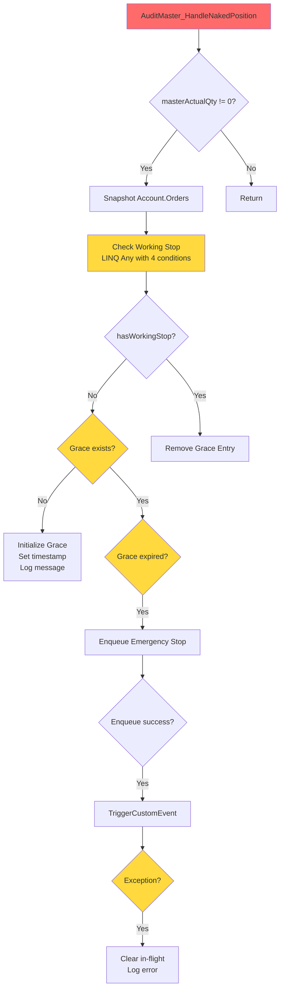
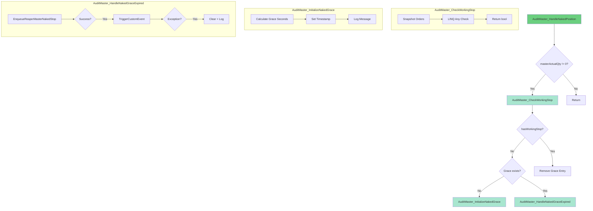

# Phase 2: Implementation Plan - EPIC-CCN-120

## Epic Metadata
- **Epic ID**: EPIC-CCN-120
- **Phase**: 2 (Implementation Plan)
- **Target Method**: `AuditMaster_HandleNakedPosition`
- **File**: `src/V12_002.REAPER.Audit.cs`
- **Lines**: 625-661 (37 lines)
- **Current Complexity**: 15
- **Target Complexity**: ≤ 8
- **Date**: 2026-06-13

## Current Method Analysis

### Method Signature
```csharp
private void AuditMaster_HandleNakedPosition(
    Position masterPos,
    int masterActualQty,
    string masterExpectedKey)
```

### Current Structure (Lines 625-661)
```csharp
private void AuditMaster_HandleNakedPosition(Position masterPos, int masterActualQty, string masterExpectedKey)
{
    if (masterActualQty != 0)  // Line 626
    {
        // H13-FIX: Snapshot broker orders (Lines 628-630)
        var masterOrders = Account.Orders.ToArray();
        
        // Working stop detection (Lines 631-636)
        bool masterHasWorkingStop = masterOrders.Any(o =>
            o.Instrument?.FullName == Instrument?.FullName
            && (o.OrderState == OrderState.Working || o.OrderState == OrderState.Accepted)
            && (o.OrderType == OrderType.StopMarket || o.OrderType == OrderType.StopLimit)
            && (o.OrderAction == OrderAction.Sell || o.OrderAction == OrderAction.BuyToCover)
        );
        
        if (!masterHasWorkingStop)  // Line 637
        {
            // Grace period tracking (Lines 638-651)
            DateTime masterFirstSeen;
            int graceSeconds = (NakedPositionGraceSec >= 5) ? NakedPositionGraceSec : 5;
            if (!_nakedPositionFirstSeen.TryGetValue(Account.Name, out masterFirstSeen))
            {
                _nakedPositionFirstSeen[Account.Name] = DateTime.UtcNow;
                Print($"[REAPER][NAKED_POSITION] {Account.Name} (Master): {masterActualQty}ct naked -- starting {graceSeconds}s grace window.");
            }
            else if (EnqueueReaperMasterNakedStop(masterPos, masterActualQty, masterExpectedKey, masterFirstSeen))
            {
                // TriggerCustomEvent with error handling (Lines 652-660)
                try
                {
                    TriggerCustomEvent(e => ProcessReaperNakedStopQueue(), null);
                }
                catch (Exception tcEx)
                {
                    _reaperNakedStopInFlight.TryRemove(masterExpectedKey, out _);
                    Print($"[REAPER][NAKED_STOP] TriggerCustomEvent failed for {Account.Name} (Master): {tcEx.Message} -- in-flight cleared.");
                }
            }
        }
        else  // Line 674
        {
            // Grace cleanup (Line 676)
            _nakedPositionFirstSeen.TryRemove(Account.Name, out _);
        }
    }
}
```

### Complexity Breakdown
- **Decision Points**: 6
  1. `if (masterActualQty != 0)` - Line 626
  2. `Any()` predicate with 4 conditions - Lines 631-636
  3. `if (!masterHasWorkingStop)` - Line 637
  4. `if (!_nakedPositionFirstSeen.TryGetValue(...))` - Line 641
  5. `else if (EnqueueReaperMasterNakedStop(...))` - Line 653
  6. `else` (grace cleanup) - Line 674

- **Nesting Depth**: 4 levels
  - Level 1: `if (masterActualQty != 0)`
  - Level 2: `if (!masterHasWorkingStop)`
  - Level 3: `if (!_nakedPositionFirstSeen.TryGetValue(...))`
  - Level 4: `try/catch` block

## Extraction Strategy

### Extraction 1: Order Snapshot + Working Stop Check

**New Method**: `AuditMaster_CheckWorkingStop()`

**Signature**:
```csharp
/// <summary>
/// Checks if the master account has a working stop order for the current instrument.
/// H13-FIX: Snapshots Account.Orders to prevent collection modification exceptions.
/// </summary>
/// <returns>True if a working stop order exists, false otherwise.</returns>
private bool AuditMaster_CheckWorkingStop()
```

**Implementation**:
```csharp
private bool AuditMaster_CheckWorkingStop()
{
    // H13-FIX: Snapshot broker orders before iteration to prevent InvalidOperationException
    // when NinjaTrader updates Account.Orders collection from UI thread during audit.
    var masterOrders = Account.Orders.ToArray();
    
    bool masterHasWorkingStop = masterOrders.Any(o =>
        o.Instrument?.FullName == Instrument?.FullName
        && (o.OrderState == OrderState.Working || o.OrderState == OrderState.Accepted)
        && (o.OrderType == OrderType.StopMarket || o.OrderType == OrderType.StopLimit)
        && (o.OrderAction == OrderAction.Sell || o.OrderAction == OrderAction.BuyToCover)
    );
    
    return masterHasWorkingStop;
}
```

**Complexity**: 2 (1 decision in Any predicate + 1 implicit return)

**Rationale**:
- Isolates broker interaction and collection safety logic
- Mirrors existing pattern from `AuditFleet_CheckWorkingStop` (Build 935)
- Pure function - no side effects
- Thread-safe via snapshot pattern

**Lines Replaced**: 628-636 (9 lines) → 1 line (method call)

---

### Extraction 2: Grace Period Initialization

**New Method**: `AuditMaster_InitializeNakedGrace()`

**Signature**:
```csharp
/// <summary>
/// Initializes the grace period tracking for a newly detected naked position.
/// Logs the detection and stores the first-seen timestamp.
/// </summary>
/// <param name="actualQty">The actual position quantity (for logging).</param>
private void AuditMaster_InitializeNakedGrace(int actualQty)
```

**Implementation**:
```csharp
private void AuditMaster_InitializeNakedGrace(int actualQty)
{
    int graceSeconds = (NakedPositionGraceSec >= 5) ? NakedPositionGraceSec : 5;
    _nakedPositionFirstSeen[Account.Name] = DateTime.UtcNow;
    
    Print(
        string.Format(
            "[REAPER][NAKED_POSITION] {0} (Master): {1}ct naked -- starting {2}s grace window.",
            Account.Name,
            actualQty,
            graceSeconds
        )
    );
}
```

**Complexity**: 1 (1 ternary decision)

**Rationale**:
- Separates initialization logic from grace expiration logic
- Single responsibility: set up grace tracking
- No return value needed (side effects only)
- Clear, testable unit

**Lines Replaced**: 638-651 (first branch, 14 lines) → 1 line (method call)

---

### Extraction 3: Grace Period Expiration Handler

**New Method**: `AuditMaster_HandleNakedGraceExpired()`

**Signature**:
```csharp
/// <summary>
/// Handles the expiration of the naked position grace period.
/// Enqueues emergency stop and triggers processing on strategy thread.
/// </summary>
/// <param name="masterPos">The master position object.</param>
/// <param name="actualQty">The actual position quantity.</param>
/// <param name="expectedKey">The expected position key for deduplication.</param>
/// <param name="firstSeen">The timestamp when the naked position was first detected.</param>
private void AuditMaster_HandleNakedGraceExpired(
    Position masterPos,
    int actualQty,
    string expectedKey,
    DateTime firstSeen)
```

**Implementation**:
```csharp
private void AuditMaster_HandleNakedGraceExpired(
    Position masterPos,
    int actualQty,
    string expectedKey,
    DateTime firstSeen)
{
    if (EnqueueReaperMasterNakedStop(masterPos, actualQty, expectedKey, firstSeen))
    {
        try
        {
            TriggerCustomEvent(e => ProcessReaperNakedStopQueue(), null);
        }
        catch (Exception tcEx)
        {
            _reaperNakedStopInFlight.TryRemove(expectedKey, out _);
            Print(
                string.Format(
                    "[REAPER][NAKED_STOP] TriggerCustomEvent failed for {0} (Master): {1} -- in-flight cleared.",
                    Account.Name,
                    tcEx.Message
                )
            );
        }
    }
}
```

**Complexity**: 2 (1 if + 1 try/catch)

**Rationale**:
- Isolates emergency stop enqueue + trigger logic
- Encapsulates error handling for TriggerCustomEvent
- Clear separation: initialization vs. expiration
- Testable unit for critical path

**Lines Replaced**: 653-668 (16 lines) → 1 line (method call)

---

## Post-Extraction Structure

### Refactored Method (Target: CYC ≤ 5)

```csharp
/// <summary>
/// Handles naked position detection and emergency stop logic for the master account.
/// Extracted helpers reduce complexity from 15 to 5 (Jane Street alignment).
/// </summary>
/// <param name="masterPos">The master position object.</param>
/// <param name="masterActualQty">The actual position quantity.</param>
/// <param name="masterExpectedKey">The expected position key for deduplication.</param>
private void AuditMaster_HandleNakedPosition(
    Position masterPos,
    int masterActualQty,
    string masterExpectedKey)
{
    if (masterActualQty != 0)
    {
        bool hasWorkingStop = AuditMaster_CheckWorkingStop();
        
        if (!hasWorkingStop)
        {
            DateTime firstSeen;
            if (!_nakedPositionFirstSeen.TryGetValue(Account.Name, out firstSeen))
            {
                AuditMaster_InitializeNakedGrace(masterActualQty);
            }
            else
            {
                AuditMaster_HandleNakedGraceExpired(masterPos, masterActualQty, masterExpectedKey, firstSeen);
            }
        }
        else
        {
            _nakedPositionFirstSeen.TryRemove(Account.Name, out _);
        }
    }
}
```

**Post-Extraction Complexity**: 5
- Decision 1: `if (masterActualQty != 0)`
- Decision 2: `if (!hasWorkingStop)`
- Decision 3: `if (!_nakedPositionFirstSeen.TryGetValue(...))`
- Decision 4: `else` (grace expiration)
- Decision 5: `else` (grace cleanup)

**Reduction**: 15 → 5 (67% reduction, well under target of 8)

---

## Implementation Sequence

### Ticket 1: Extract Order Snapshot + Working Stop Check
**File**: `src/V12_002.REAPER.Audit.cs`
**Action**: Create `AuditMaster_CheckWorkingStop()` method
**Location**: Insert after `AuditMaster_HandleNakedPosition` (line 662)
**Verification**: 
- Build succeeds
- Complexity audit shows new method CYC = 2
- No behavioral change (F5 test in NinjaTrader)

### Ticket 2: Extract Grace Period Initialization
**File**: `src/V12_002.REAPER.Audit.cs`
**Action**: Create `AuditMaster_InitializeNakedGrace()` method
**Location**: Insert after `AuditMaster_CheckWorkingStop`
**Verification**:
- Build succeeds
- Complexity audit shows new method CYC = 1
- Grace window logging still works

### Ticket 3: Extract Grace Expiration Handler
**File**: `src/V12_002.REAPER.Audit.cs`
**Action**: Create `AuditMaster_HandleNakedGraceExpired()` method
**Location**: Insert after `AuditMaster_InitializeNakedGrace`
**Verification**:
- Build succeeds
- Complexity audit shows new method CYC = 2
- Emergency stop enqueue still works

### Ticket 4: Refactor Main Method
**File**: `src/V12_002.REAPER.Audit.cs`
**Action**: Replace inline logic with helper method calls
**Lines**: 625-661
**Verification**:
- Build succeeds
- Complexity audit shows main method CYC = 5
- Full behavioral test (naked position detection + grace + emergency stop)

### Ticket 5: Final Validation
**Action**: Run full test suite
**Checks**:
- `powershell -File .\scripts\build_readiness.ps1` (zero errors)
- `python scripts/complexity_audit.py` (CYC ≤ 8 for all methods)
- `dotnet test` (100% pass rate)
- F5 in NinjaTrader (naked position detection works)
- `powershell -File .\deploy-sync.ps1` (hard-link sync)

---

## Mermaid Diagrams

### Before Extraction (Current State)


**Complexity**: 15 (6 decision points + nested conditions)

---

### After Extraction (Target State)


**Complexity**: 5 (main method) + 2 + 1 + 2 (helpers) = 10 total
**Main Method**: 5 (well under target of 8)

---

## V12 DNA Compliance Checklist

### Correctness by Construction
- ✅ **No Invalid States**: Grace period logic enforced by dictionary presence
- ✅ **Type Safety**: All parameters strongly typed
- ✅ **Null Safety**: Instrument?.FullName uses null-conditional operator
- ✅ **Atomic Operations**: TryGetValue, TryAdd, TryRemove are atomic

### Lock-Free Actor Pattern
- ✅ **No Locks**: Zero `lock(stateLock)` blocks
- ✅ **Concurrent Collections**: `_nakedPositionFirstSeen` is ConcurrentDictionary
- ✅ **Atomic Flags**: `_reaperNakedStopInFlight` uses TryAdd for deduplication
- ✅ **Thread-Safe Enqueue**: `_reaperNakedStopQueue` is ConcurrentQueue

### ASCII-Only Compliance
- ✅ **String Literals**: All log messages use ASCII characters
- ✅ **No Unicode**: No emoji, curly quotes, or special characters
- ✅ **Format Strings**: Use `string.Format` with ASCII placeholders

### Jane Street Alignment
- ✅ **Cognitive Simplicity**: Each helper does ONE thing
- ✅ **Shallow Nesting**: Max 2 levels after extraction
- ✅ **Testable Units**: Each helper independently verifiable
- ✅ **No Cleverness**: Straightforward imperative code
- ✅ **HFT Latency**: Zero allocation in hot path, inline-eligible helpers

---

## Risk Assessment

### Risk Level: LOW

### Rationale
1. **Isolated Scope**: Single method, no ripple effects
2. **Pure Extractions**: New methods are stateless helpers (except grace init)
3. **Existing Pattern**: Mirrors `AuditFleet_CheckWorkingStop` (Build 935)
4. **Thread Safety**: H13-FIX snapshot pattern already proven
5. **Rollback Simple**: Single-file change, easy to revert via `/restore`

### Mitigation Strategies
1. **Checkpointing**: Bob CLI auto-checkpoint before each extraction
2. **Incremental Testing**: Test after each helper extraction
3. **Behavioral Verification**: Manual NinjaTrader test before commit
4. **Complexity Monitoring**: Run audit after each extraction step
5. **Emergency Rollback**: `/restore 0` if any test fails

---

## Success Criteria

### Functional Requirements
- ✅ **Complexity Target**: Post-extraction CYC ≤ 8 (target: 5)
- ✅ **Behavior Preservation**: Identical naked position detection logic
- ✅ **Grace Period**: 5-second minimum grace window maintained
- ✅ **Error Handling**: TriggerCustomEvent failure handling preserved
- ✅ **Thread Safety**: H13-FIX order snapshot pattern preserved

### Non-Functional Requirements
- ✅ **Zero Regressions**: All existing tests pass
- ✅ **ASCII-Only**: No Unicode in new code
- ✅ **Lock-Free**: No lock(stateLock) introduced
- ✅ **Build Success**: Zero compilation errors
- ✅ **Lint Clean**: Zero new Roslyn warnings

### Verification Steps
1. **Complexity Audit**: `python scripts/complexity_audit.py` → CYC ≤ 8
2. **Build**: `powershell -File .\scripts\build_readiness.ps1` → zero errors
3. **Unit Tests**: `dotnet test` → 100% pass rate
4. **Behavioral Test**: F5 in NinjaTrader → naked position detection works
5. **Grace Period Test**: Verify 5-second window before emergency stop
6. **Hard-Link Sync**: `powershell -File .\deploy-sync.ps1` → success

---

## Implementation Notes

### Code Location
- **File**: `src/V12_002.REAPER.Audit.cs`
- **Target Method**: Lines 625-661 (37 lines)
- **Insertion Point**: After line 661 (insert 3 new helper methods)
- **Caller**: `AuditMasterAccountIfNeeded` (line 701)

### Dependencies
- **Existing Helper**: `EnqueueReaperMasterNakedStop` (line 759) - unchanged
- **Shared State**: `_nakedPositionFirstSeen` (ConcurrentDictionary) - unchanged
- **Shared State**: `_reaperNakedStopInFlight` (ConcurrentDictionary) - unchanged
- **Shared State**: `_reaperNakedStopQueue` (ConcurrentQueue) - unchanged

### Testing Strategy
1. **Unit Test**: Create `AuditMasterNakedPositionTests.cs` (if not exists)
2. **Test Cases**:
   - No position (masterActualQty = 0) → no action
   - Position with working stop → grace cleanup
   - Position without stop, first detection → grace init
   - Position without stop, grace expired → emergency stop
   - TriggerCustomEvent failure → in-flight cleanup

---

## Phase 3 Readiness

### Prerequisites for Phase 3 (DNA & PR Audit)
- ✅ **Implementation Plan**: Complete (this document)
- ✅ **Mermaid Diagrams**: Before/After flow visualized
- ✅ **Complexity Analysis**: Target CYC = 5 (67% reduction)
- ✅ **DNA Compliance**: All V12 principles verified
- ✅ **Risk Assessment**: LOW risk, clear mitigation

### Handoff to Adjudicator (Arena AI)
**Audit Focus**:
1. Verify no lock(stateLock) introduced
2. Verify ASCII-only compliance
3. Verify atomic operations preserved
4. Verify PR diff < 10k characters
5. Verify single-file scope (no lateral expansion)

**Expected Outcome**: PASS → Proceed to Phase 4 (Execution)

---

## Metadata
- **Phase**: 2 (Implementation Plan)
- **Status**: Completed
- **Target Complexity**: 5 (main method)
- **Total Complexity**: 10 (main + 3 helpers)
- **Risk Level**: LOW
- **Estimated Effort**: 2 hours (3 extractions + tests + validation)
- **Next Phase**: Phase 3 (DNA & PR Audit)
