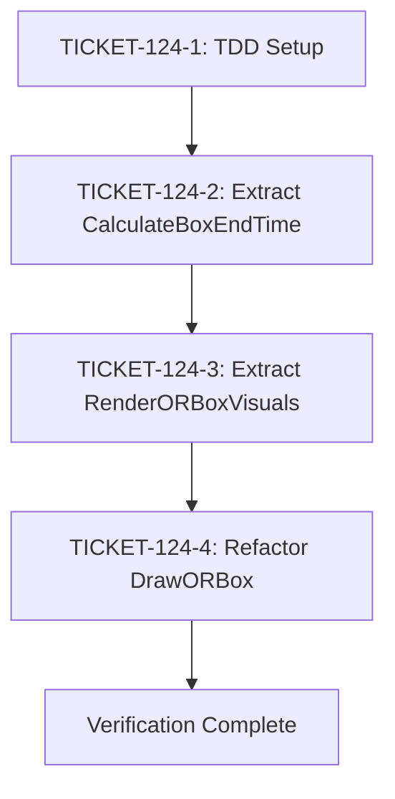

# Phase 4: Implementation Tickets - EPIC-CCN-124

## Epic Summary
- **Epic ID**: EPIC-CCN-124
- **Target Method**: DrawORBox
- **File**: src/V12_002.DrawingHelpers.cs
- **Current Complexity**: 12 CCN
- **Target Complexity**: ≤8 CCN per method
- **Total Tickets**: 4 (1 setup + 2 extractions + 1 refactor)

---

## Execution Order



**Dependencies**:
1. TICKET-124-1 must complete before TICKET-124-2
2. TICKET-124-2 must complete before TICKET-124-3
3. TICKET-124-3 must complete before TICKET-124-4
4. All tickets must pass verification before merge

---

## TICKET-124-1: TDD Test Infrastructure Setup

### Priority: P0 (Blocking)
### Estimated Time: 30 minutes
### Complexity Reduction: 0 CCN (setup only)

### Objective
Create comprehensive test suite for DrawORBox extraction with 10 test cases covering all edge cases.

### Method Signatures (Test Targets)
```csharp
// Target 1: Time zone calculation
private DateTime CalculateBoxEndTime(
    DateTime orStartDateTime,
    TimeSpan sessionStartTime,
    TimeSpan sessionEndTime,
    string selectedTimeZone
)

// Target 2: Visual rendering
private void RenderORBoxVisuals(
    DateTime orStartDateTime,
    DateTime boxEndTime,
    double sessionHigh,
    double sessionLow,
    double sessionMid,
    int boxOpacity,
    bool showMidLine
)

// Target 3: Orchestrator (refactored)
private void DrawORBox()
```

### Extraction Steps

#### Step 1.1: Create Test File
```bash
mkdir -p tests/V12_Performance.Tests/Drawing
touch tests/V12_Performance.Tests/Drawing/DrawORBoxTests.cs
```

**Verification**: File exists at `tests/V12_Performance.Tests/Drawing/DrawORBoxTests.cs`

#### Step 1.2: Implement 10 Test Cases
- 4 tests for CalculateBoxEndTime (same-day, overnight, invalid timezone, all timezones)
- 3 tests for RenderORBoxVisuals (rectangle, midline enabled, midline disabled)
- 3 tests for DrawORBox integration (invalid prices, invalid times, valid inputs)

#### Step 1.3: Run Initial Test Suite
```bash
dotnet test --filter "DrawORBox"
```

**Expected Result**: All 10 tests fail (methods do not exist yet)

### Test Requirements
- ✅ 10 total test cases
- ✅ All tests compile without errors
- ✅ Test infrastructure verified

### Verification Criteria
- [ ] Test file exists at correct path
- [ ] All 10 tests compile
- [ ] Test runner executes all tests (failures expected)
- [ ] No build errors in test project

### Rollback Steps
```bash
rm tests/V12_Performance.Tests/Drawing/DrawORBoxTests.cs
```

### Success Criteria
- ✅ Test file created
- ✅ 10 tests implemented
- ✅ All tests compile
- ✅ Test runner reports 10 failures (expected)

---

## TICKET-124-2: Extract CalculateBoxEndTime

### Priority: P1 (High)
### Estimated Time: 20 minutes
### Complexity Reduction: -7 CCN (from DrawORBox)

### Objective
Extract time zone conversion and session end calculation logic into a pure function with 8 CCN complexity.

### Method Signature
```csharp
/// <summary>
/// Calculates the box end time in local time zone, accounting for overnight sessions.
/// </summary>
private DateTime CalculateBoxEndTime(
    DateTime orStartDateTime,
    TimeSpan sessionStartTime,
    TimeSpan sessionEndTime,
    string selectedTimeZone
)
```

### Extraction Steps

#### Step 2.1: Create Method Stub
Add method stub returning DateTime.MinValue

#### Step 2.2: Copy Time Zone Logic (Lines 47-103)
- Convert OR start to selected time zone
- Detect overnight session (sessionEndTime < sessionStartTime)
- Calculate session end date (add 1 day if overnight)
- Map selectedTimeZone string to TimeZoneInfo (switch statement)
- Convert session end back to local time
- Return result or DateTime.MinValue on error

#### Step 2.3: Remove Unused Variable
Do NOT copy `int areaOpacity = BoxOpacity;` (not used in time calculation)

#### Step 2.4: Run Tests
```bash
dotnet test --filter "CalculateBoxEndTime"
```
**Expected**: 4/4 tests pass

#### Step 2.5: Verify Complexity
```bash
python scripts/complexity_audit.py
```
**Expected**: CalculateBoxEndTime = 8 CCN

### Test Requirements
- ✅ Test 1: Same-day session returns correct end time
- ✅ Test 2: Overnight session adds one day
- ✅ Test 3: Invalid time zone returns DateTime.MinValue
- ✅ Test 4: All 5 time zones return valid results

### Verification Criteria
- [ ] Method compiles without errors
- [ ] All 4 CalculateBoxEndTime tests pass
- [ ] Complexity ≤8 CCN
- [ ] No unused variables
- [ ] Error handling returns DateTime.MinValue
- [ ] Logic matches original exactly

### Rollback Steps
```bash
git checkout HEAD~1 src/V12_002.DrawingHelpers.cs
powershell -File .\deploy-sync.ps1
```

### Success Criteria
- ✅ Method extracted
- ✅ 4/4 tests pass
- ✅ Complexity = 8 CCN
- ✅ No build errors
- ✅ Logic verified correct

---

## TICKET-124-3: Extract RenderORBoxVisuals

### Priority: P2 (Medium)
### Estimated Time: 15 minutes
### Complexity Reduction: -1 CCN (from DrawORBox)

### Objective
Extract NinjaTrader drawing API calls into a pure rendering method with 2 CCN complexity.

### Method Signature
```csharp
/// <summary>
/// Renders the OR box rectangle and optional midline using NinjaTrader drawing API.
/// </summary>
private void RenderORBoxVisuals(
    DateTime orStartDateTime,
    DateTime boxEndTime,
    double sessionHigh,
    double sessionLow,
    double sessionMid,
    int boxOpacity,
    bool showMidLine
)
```

### Extraction Steps

#### Step 3.1: Create Method Stub
Add method stub with empty body

#### Step 3.2: Copy Rectangle Drawing Logic (Lines 105-116)
Draw.Rectangle call with all parameters

#### Step 3.3: Copy Midline Drawing Logic (Lines 118-132)
Conditional Draw.Line call (if showMidLine)

#### Step 3.4: Run Tests
```bash
dotnet test --filter "RenderORBoxVisuals"
```
**Expected**: 3/3 tests pass

#### Step 3.5: Verify Complexity
```bash
python scripts/complexity_audit.py
```
**Expected**: RenderORBoxVisuals = 2 CCN

### Test Requirements
- ✅ Test 1: Renders rectangle with valid inputs
- ✅ Test 2: Renders midline when showMidLine = true
- ✅ Test 3: No midline when showMidLine = false

### Verification Criteria
- [ ] Method compiles without errors
- [ ] All 3 RenderORBoxVisuals tests pass
- [ ] Complexity = 2 CCN
- [ ] Drawing API calls match original
- [ ] Conditional logic preserved

### Rollback Steps
```bash
git checkout HEAD~1 src/V12_002.DrawingHelpers.cs
powershell -File .\deploy-sync.ps1
```

### Success Criteria
- ✅ Method extracted
- ✅ 3/3 tests pass
- ✅ Complexity = 2 CCN
- ✅ No build errors
- ✅ Visual rendering verified

---

## TICKET-124-4: Refactor DrawORBox Orchestrator

### Priority: P3 (Medium)
### Estimated Time: 10 minutes
### Complexity Reduction: -7 CCN (final reduction)

### Objective
Refactor DrawORBox to orchestrate extracted methods, reducing complexity from 12 to 5 CCN.

### Method Signature (Unchanged)
```csharp
private void DrawORBox()
```

### Extraction Steps

#### Step 4.1: Replace Lines 45-132 with Orchestration Logic
- Keep guard clauses (lines 38-41)
- Call CalculateBoxEndTime with parameters
- Validate result (return if DateTime.MinValue)
- Call RenderORBoxVisuals with parameters
- Keep try-catch wrapper

#### Step 4.2: Remove Original Implementation
Delete all lines between try block and catch block (lines 45-132)

#### Step 4.3: Run DrawORBox Tests
```bash
dotnet test --filter "DrawORBox"
```
**Expected**: 3/3 tests pass

#### Step 4.4: Verify Complexity
```bash
python scripts/complexity_audit.py
```
**Expected**: DrawORBox = 5 CCN

#### Step 4.5: Run Full Test Suite
```bash
dotnet test
```
**Expected**: 10/10 tests pass

### Test Requirements
- ✅ Test 1: Guard clause - invalid session prices
- ✅ Test 2: Guard clause - invalid OR times
- ✅ Test 3: Valid inputs - draws box

### Verification Criteria
- [ ] Method compiles without errors
- [ ] All 3 DrawORBox tests pass
- [ ] Complexity = 5 CCN
- [ ] Guard clauses preserved
- [ ] Error handling preserved
- [ ] All 10 tests pass (full suite)

### Rollback Steps
```bash
git checkout HEAD~1 src/V12_002.DrawingHelpers.cs
powershell -File .\deploy-sync.ps1
```

### Success Criteria
- ✅ DrawORBox refactored
- ✅ 10/10 tests pass
- ✅ Complexity = 5 CCN
- ✅ No build errors
- ✅ Logic flow preserved

---

## Final Verification Checklist

### Build & Test Verification
- [ ] `dotnet build` - Zero errors
- [ ] `dotnet test` - 10/10 tests pass
- [ ] `powershell -File .\scripts\build_readiness.ps1` - Pass
- [ ] `dotnet csharpier check src/` - Zero issues

### Complexity Verification
- [ ] `python scripts/complexity_audit.py` - All methods ≤8 CCN
- [ ] DrawORBox: 5 CCN (target: ≤8)
- [ ] CalculateBoxEndTime: 8 CCN (target: ≤8)
- [ ] RenderORBoxVisuals: 2 CCN (target: ≤8)

### V12 DNA Compliance
- [ ] `grep -r "lock(" src/` - Zero matches
- [ ] `python check_ascii.py src/V12_002.DrawingHelpers.cs` - Zero non-ASCII
- [ ] No shared state mutations
- [ ] Type-safe error handling (DateTime.MinValue sentinel)

### PR Hygiene
- [ ] `powershell -File .\scripts\verify_pr_hygiene.ps1` - Pass
- [ ] Diff size < 10,000 characters
- [ ] No whitespace mutations
- [ ] No scope creep (only DrawORBox modified)

### Manual F5 Test
- [ ] Open NinjaTrader
- [ ] Load V12_002 strategy on chart
- [ ] Wait for OR window completion
- [ ] Verify OR box renders correctly
- [ ] Verify midline renders (if enabled)
- [ ] Compare screenshot with baseline

---

## Success Criteria Summary

### Primary Goals (MUST PASS)
1. ✅ DrawORBox complexity ≤8 CCN (target: 5)
2. ✅ CalculateBoxEndTime complexity ≤8 CCN (target: 8)
3. ✅ RenderORBoxVisuals complexity ≤8 CCN (target: 2)
4. ✅ All 10 unit tests pass
5. ✅ Zero build errors
6. ✅ Zero lint violations
7. ✅ Manual F5 test passes (no visual regression)

### Secondary Goals (SHOULD PASS)
1. ✅ ASCII compliance (zero non-ASCII)
2. ✅ CSharpier formatting (zero issues)
3. ✅ No lock statements
4. ✅ No new shared state
5. ✅ Jane Street alignment (all methods ≤8 CCN)

---

## Timeline Estimate

| Ticket | Duration | Cumulative |
|--------|----------|------------|
| TICKET-124-1: TDD Setup | 30 min | 30 min |
| TICKET-124-2: Extract CalculateBoxEndTime | 20 min | 50 min |
| TICKET-124-3: Extract RenderORBoxVisuals | 15 min | 65 min |
| TICKET-124-4: Refactor DrawORBox | 10 min | 75 min |
| Final Verification | 30 min | 105 min |

**Total Estimated Time**: ~2 hours

---

## Complexity Budget Summary

| Method | Before | After | Reduction |
|--------|--------|-------|-----------|
| DrawORBox | 12 CCN | 5 CCN | -7 CCN |
| CalculateBoxEndTime | N/A | 8 CCN | +8 CCN |
| RenderORBoxVisuals | N/A | 2 CCN | +2 CCN |
| **Total** | **12 CCN** | **15 CCN** | **+3 CCN** |

**Jane Street Compliance**: ✅ All methods ≤8 CCN

---

**Phase 4 Status**: COMPLETE
**Ready for Phase 5 (TDD Execution)**: YES
**Approved By**: V12 Phase 4 Protocol
**Date**: 2026-06-14
