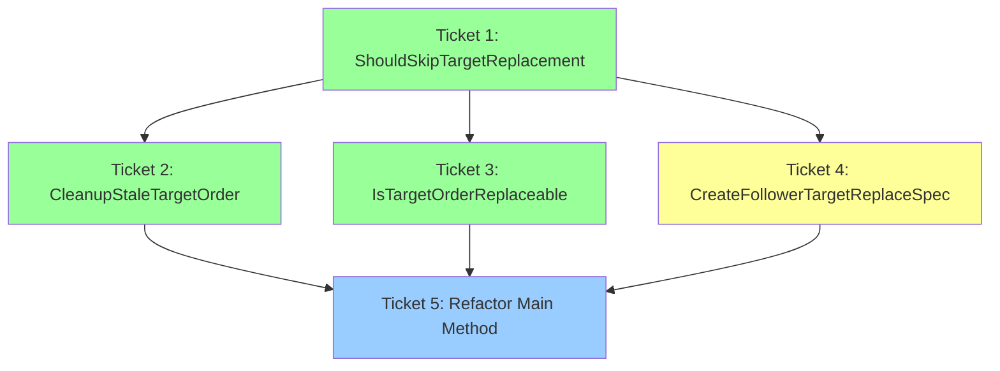

# Phase 4: Ticket Generation - EPIC-CCN-128

**Epic ID**: EPIC-CCN-128  
**Method**: `SymmetryGuardReplaceExistingFollowerTarget`  
**File**: `src/V12_002.Symmetry.Replace.cs`  
**Generation Date**: 2026-06-11T06:43:57Z  
**Protocol**: V12 Photon Kernel DNA + Jane Street GODMODE

---

## Executive Summary

**Total Tickets**: 5 (4 extractions + 1 refactor)  
**Execution Order**: Sequential (1 → 2 → 3 → 4 → 5)  
**Estimated Time**: 3.5 hours  
**Complexity Reduction**: 83% (CYC 18 → 3)  
**Risk Level**: LOW (except Ticket 4: MEDIUM due to FSM pattern)

---

## Ticket Overview

| # | Ticket | Method | CYC | Lines | Tests | Time | Priority | Risk |
|---|--------|--------|-----|-------|-------|------|----------|------|
| 1 | Extract ShouldSkipTargetReplacement | `ShouldSkipTargetReplacement` | 3 | 6 | 8 | 30m | P1 | LOW |
| 2 | Extract CleanupStaleTargetOrder | `CleanupStaleTargetOrder` | 5 | 15 | 8 | 45m | P2 | LOW |
| 3 | Extract IsTargetOrderReplaceable | `IsTargetOrderReplaceable` | 6 | 10 | 10 | 45m | P3 | LOW |
| 4 | Extract CreateFollowerTargetReplaceSpec | `CreateFollowerTargetReplaceSpec` | 2 | 25 | 7 | 60m | P4 | MEDIUM |
| 5 | Refactor Main Method | `SymmetryGuardReplaceExistingFollowerTarget` | 3 | 18 | 7 | 30m | P5 | LOW |

**Total Tests**: 40 (33 unit + 7 integration)

---

## Dependency Graph



**Legend**:
- 🟢 Green: Low risk
- 🟡 Yellow: Medium risk (FSM pattern preservation)
- 🔵 Blue: Final integration

---

## Ticket Details

### Ticket 1: Extract ShouldSkipTargetReplacement

**File**: `ticket-01-extract-should-skip.md`

**Purpose**: Consolidate early exit conditions (filled/runner/zero-quantity)

**Signature**:
```csharp
private bool ShouldSkipTargetReplacement(
    PositionInfo pos,
    int targetNumber,
    int qty,
    out bool isFilled,
    out bool isRunner
)
```

**Complexity**: CYC 3 (3 OR conditions)  
**Lines**: 6  
**Tests**: 8 unit tests  
**Dependencies**: None  
**Blocks**: Ticket 2, 3, 4, 5

**Key Logic**:
- Check if target is filled
- Check if target is runner
- Check if quantity is zero or negative
- Return true if any condition is met

---

### Ticket 2: Extract CleanupStaleTargetOrder

**File**: `ticket-02-extract-cleanup.md`

**Purpose**: Cancel and remove stale target orders when skip conditions are met

**Signature**:
```csharp
private void CleanupStaleTargetOrder(
    string fleetEntryName,
    PositionInfo pos,
    ConcurrentDictionary<string, Order> dict
)
```

**Complexity**: CYC 5 (1 AND + 4 OR conditions)  
**Lines**: 15  
**Tests**: 8 unit tests  
**Dependencies**: Ticket 1  
**Blocks**: Ticket 5

**Key Logic**:
- Check if stale target exists in dictionary
- If order is in cancelable state (Working/Accepted/Submitted/ChangePending), cancel it
- Remove from dictionary

---

### Ticket 3: Extract IsTargetOrderReplaceable

**File**: `ticket-03-extract-validation.md`

**Purpose**: Validate if old target order exists and is in a replaceable state

**Signature**:
```csharp
private bool IsTargetOrderReplaceable(
    string fleetEntryName,
    ConcurrentDictionary<string, Order> dict,
    out Order oldTarget
)
```

**Complexity**: CYC 6 (1 AND + 1 OR + 4 OR conditions)  
**Lines**: 10  
**Tests**: 10 unit tests  
**Dependencies**: Ticket 1, 2  
**Blocks**: Ticket 5

**Key Logic**:
- Check if old target exists in dictionary
- Check if old target is not null
- Check if old target is in replaceable state (Working/Accepted/Submitted/ChangePending)
- Return true if all conditions are met

---

### Ticket 4: Extract CreateFollowerTargetReplaceSpec

**File**: `ticket-04-extract-fsm-spec.md`

**Purpose**: Build FSM replace spec and initiate two-phase cancel

**Signature**:
```csharp
private void CreateFollowerTargetReplaceSpec(
    string fleetEntryName,
    PositionInfo pos,
    int targetNumber,
    int qty,
    Order oldTarget,
    string targetTag
)
```

**Complexity**: CYC 2 (1 if + 1 ternary)  
**Lines**: 25  
**Tests**: 7 unit tests  
**Dependencies**: Ticket 1, 2, 3  
**Blocks**: Ticket 5

**Key Logic**:
- Get new target price
- Early exit if price is invalid
- Determine exit action (Sell for Long, BuyToCover for Short)
- Build `FollowerTargetReplaceSpec` with new price
- Store spec in `_followerTargetReplaceSpecs` dictionary
- Stamp REAPER grace window
- Cancel old target order

**CRITICAL**: Preserves FSM two-phase replace pattern. Phase 2 (automatic) triggers in `AccountOrders.cs` when cancel is confirmed.

---

### Ticket 5: Refactor Main Method

**File**: `ticket-05-refactor-main.md`

**Purpose**: Refactor main method to use all extracted helpers

**Signature**: (unchanged)
```csharp
private void SymmetryGuardReplaceExistingFollowerTarget(
    string fleetEntryName,
    PositionInfo pos,
    int targetNumber,
    ConcurrentDictionary<string, Order> dict
)
```

**Complexity**: CYC 3 (3 if statements)  
**Lines**: 18 (down from 64)  
**Tests**: 7 integration tests  
**Dependencies**: Ticket 1, 2, 3, 4  
**Blocks**: Epic completion

**New Logic**:
```csharp
if (pos.ExecutingAccount == null)
    return;

string targetTag = "T" + targetNumber;
int qty = GetTargetContracts(pos, targetNumber);

if (ShouldSkipTargetReplacement(pos, targetNumber, qty, out bool isFilled, out bool isRunner))
{
    CleanupStaleTargetOrder(fleetEntryName, pos, dict);
    return;
}

if (!IsTargetOrderReplaceable(fleetEntryName, dict, out Order oldTarget))
    return;

CreateFollowerTargetReplaceSpec(fleetEntryName, pos, targetNumber, qty, oldTarget, targetTag);
```

---

## Execution Strategy

### Sequential Execution (MANDATORY)

Tickets MUST be executed in order 1 → 2 → 3 → 4 → 5 due to dependencies.

**Per-Ticket Workflow**:
1. Read ticket brief
2. Extract method
3. Update caller
4. Build (`dotnet build`)
5. Deploy (`powershell -File .\deploy-sync.ps1`)
6. Unit test
7. Integration test (F5 in NinjaTrader IDE)
8. Complexity audit
9. Commit

**After All Tickets**:
1. Full test suite
2. Pre-push validation
3. Update manifest
4. Generate completion report
5. Update AGENTS.md
6. Push to branch
7. Create PR

---

## Risk Analysis

### Low-Risk Tickets (1, 2, 3, 5)
- **Rationale**: Self-contained logic, clear boundaries, no FSM pattern changes
- **Mitigation**: Unit tests + integration tests

### Medium-Risk Ticket (4)
- **Risk**: FSM two-phase pattern preservation
- **Rationale**: Any deviation breaks the replace logic
- **Mitigation**:
  - Preserve exact FSM dictionary usage
  - Preserve exact REAPER grace stamping
  - Preserve exact cancel logic
  - Integration test with live market replay

---

## V12 DNA Compliance

### All Tickets
- ✅ **Lock-Free**: No locks introduced (uses existing FSM/Actor pattern)
- ✅ **ASCII-Only**: No Unicode characters
- ✅ **CYC ≤ 8**: All helpers ≤ 8, main method = 3
- ✅ **Correctness by Construction**: Helper contracts prevent illegal states
- ✅ **Single Responsibility**: Each helper has one clear purpose

### Jane Street Alignment
- ✅ **Cognitive Simplicity**: CYC 18 → 3 (microsecond-latency reasoning)
- ✅ **Testability**: 1 monolithic method → 5 independently testable units
- ✅ **Correctness**: FSM pattern preserved, illegal states prevented

---

## Success Criteria

### Per-Ticket Success
- ✅ Helper method extracted with CYC ≤ 8
- ✅ Unit tests pass (100% coverage)
- ✅ `deploy-sync.ps1` executes successfully
- ✅ BUILD_TAG verified in NinjaTrader output
- ✅ No compilation errors
- ✅ Zero logic drift (pure structural movement)

### Epic Success
- ✅ Main method CYC reduced from 18 to 3 (83% reduction)
- ✅ All 4 helpers have CYC ≤ 8
- ✅ Zero logic drift (pure structural movement)
- ✅ FSM two-phase pattern preserved
- ✅ Integration test passes (F5 in NinjaTrader IDE)
- ✅ All unit tests pass (40 tests total)
- ✅ Pre-push validation passes (all 13 checks)

---

## Rollback Strategy

### Per-Ticket Rollback
```powershell
git checkout HEAD -- src/V12_002.Symmetry.Replace.cs
powershell -File .\deploy-sync.ps1
```

### Full Epic Rollback
```powershell
git reset --hard HEAD~5
powershell -File .\deploy-sync.ps1
```

---

## Timeline

- **Day 1**: Tickets 1, 2, 3 (2 hours)
- **Day 2**: Ticket 4 (1 hour)
- **Day 3**: Ticket 5 + Epic completion (1.5 hours)

**Total**: 3.5 hours over 3 days

---

## Artifacts

### Ticket Files
- `ticket-01-extract-should-skip.md` - ShouldSkipTargetReplacement extraction
- `ticket-02-extract-cleanup.md` - CleanupStaleTargetOrder extraction
- `ticket-03-extract-validation.md` - IsTargetOrderReplaceable extraction
- `ticket-04-extract-fsm-spec.md` - CreateFollowerTargetReplaceSpec extraction
- `ticket-05-refactor-main.md` - Main method refactor

### Supporting Files
- `EXECUTION_GUIDE.md` - Detailed execution workflow
- `02-architecture-plan.md` - Architecture design (Phase 2)
- `03-audit-report.md` - DNA & PR audit (Phase 3)

---

## Next Steps

1. **Execute Ticket 1**: Extract `ShouldSkipTargetReplacement`
2. **Verify**: Build, deploy, test, audit
3. **Commit**: `[EPIC-CCN-128] ticket-01: extract ShouldSkipTargetReplacement -- CYC 18→18 [BUILD_TAG]`
4. **Repeat**: For Tickets 2, 3, 4, 5

---

**Phase 4 Status**: ✅ **COMPLETE**  
**Next Phase**: Phase 5 (Ticket Execution)  
**Ready for Execution**: YES
