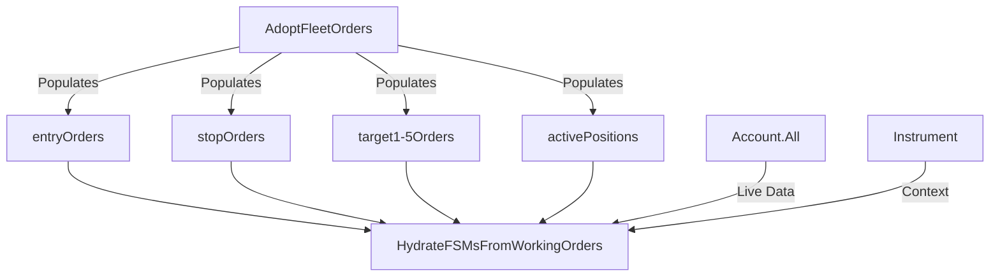
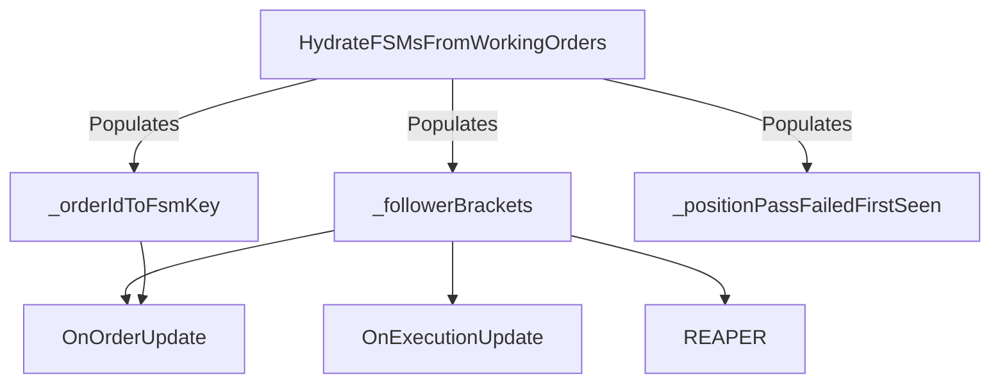

# EPIC-CCN-16 Dependency Analysis

## Phase 2: Architecture Planning - Dependency Map

### Target Method Overview
- **Method**: `HydrateFSMsFromWorkingOrders`
- **File**: [`src/V12_002.SIMA.Lifecycle.cs:464-759`](src/V12_002.SIMA.Lifecycle.cs:464)
- **Caller**: `HydrateWorkingOrdersFromBroker` (line 445)
- **Call Context**: Phase 5 of broker reconnection hydration

---

## Dependency Graph

### Upstream Dependencies (What This Method Reads)

#### 1. Instance Fields (Read-Only Access)
```csharp
// Dictionaries populated by AdoptFleetOrders (Phase 4)
entryOrders          // Dictionary<string, Order>
stopOrders           // Dictionary<string, Order>
target1Orders        // Dictionary<string, Order>
target2Orders        // Dictionary<string, Order>
target3Orders        // Dictionary<string, Order>
target4Orders        // Dictionary<string, Order>
target5Orders        // Dictionary<string, Order>
activePositions      // Dictionary<string, PositionInfo>

// Tracking dictionaries (Write Access)
_followerBrackets    // ConcurrentDictionary<string, FollowerBracketFSM>
_orderIdToFsmKey     // ConcurrentDictionary<string, string>
_positionPassFailedFirstSeen  // ConcurrentDictionary<string, DateTime>

// NinjaTrader API
Account.All          // IEnumerable<Account>
Instrument           // Current instrument
```

**Dependency Type**: Data Dependencies
**Risk**: LOW - All dictionaries are pre-populated by caller
**Extraction Impact**: NONE - Extracted methods will receive these as parameters

#### 2. Helper Methods (Called)
```csharp
IsFleetAccount(Account acct)  // Fleet account filter
Print(string message)         // Logging
```

**Dependency Type**: Utility Dependencies
**Risk**: NONE - Pure functions, no side effects
**Extraction Impact**: NONE - Extracted methods can call these directly

#### 3. External Types (Used)
```csharp
FollowerBracketFSM           // FSM data structure
FollowerBracketState         // FSM state enum
PositionInfo                 // Position metadata
Order                        // NinjaTrader order
OrderState                   // NinjaTrader order state enum
Account                      // NinjaTrader account
Position                     // NinjaTrader position
MarketPosition               // NinjaTrader position enum
```

**Dependency Type**: Type Dependencies
**Risk**: NONE - Stable NinjaTrader API + V12 types
**Extraction Impact**: NONE - Extracted methods will use same types

---

### Downstream Dependencies (What Depends On This Method)

#### 1. Direct Caller
**Method**: `HydrateWorkingOrdersFromBroker` (line 445)
**Call Site**: 
```csharp
// Phase 5: Rebuild FSMs from adopted orders before enabling REAPER
HydrateFSMsFromWorkingOrders();
```

**Dependency Type**: Control Flow Dependency
**Risk**: NONE - Single caller, no return value used
**Extraction Impact**: NONE - Caller doesn't change

#### 2. Indirect Consumers (Via Populated Dictionaries)
```csharp
_followerBrackets        // Read by: REAPER, OnOrderUpdate, OnExecutionUpdate
_orderIdToFsmKey         // Read by: OnOrderUpdate (order routing)
```

**Dependency Type**: Data Flow Dependency
**Risk**: LOW - Dictionaries are thread-safe (ConcurrentDictionary)
**Extraction Impact**: NONE - Extracted methods populate same dictionaries

---

## Blast Radius Analysis

### Files Affected by Extraction
1. **src/V12_002.SIMA.Lifecycle.cs** - Target file (extraction site)

**Total Files**: 1

### Methods Affected by Extraction
1. **HydrateFSMsFromWorkingOrders** - Target method (will be split)
2. **6 New Methods** - Extracted methods (will be created)

**Total Methods**: 7 (1 modified, 6 created)

### No Changes Required In:
- ❌ Caller method (`HydrateWorkingOrdersFromBroker`)
- ❌ Helper methods (`IsFleetAccount`, `Print`)
- ❌ Data structures (`FollowerBracketFSM`, `PositionInfo`)
- ❌ Other SIMA methods
- ❌ Test files (new tests will be created)

**Blast Radius**: MINIMAL (single method extraction)

---

## Thread Safety Analysis

### Current Thread Safety Model
**Pattern**: Actor-Serialized (Single-Writer)

**Documentation** (line 463):
```csharp
/// ACTOR-SERIALIZED: Must be called on strategy thread (via EnumerateApexAccounts).
/// THREAD-SAFETY: Single-write operations to ConcurrentDictionary are safe.
```

**Guarantees**:
1. Method called only from strategy thread (NinjaTrader main thread)
2. No concurrent writes to `_followerBrackets` or `_orderIdToFsmKey`
3. ConcurrentDictionary provides thread-safe reads during writes

### Extraction Impact on Thread Safety
**Status**: ✅ PRESERVED

**Rationale**:
1. Extracted methods will be `private` (same class)
2. Extracted methods called only from parent method (same thread)
3. No new concurrency introduced
4. ConcurrentDictionary semantics unchanged

**Verification**: No `lock()` statements needed (already zero)

---

## State Machine Invariants

### FSM State Transitions
**Source**: OrderState (NinjaTrader) → FollowerBracketState (V12)

**Mapping** (lines 488-503):
```
OrderState.Filled       → FollowerBracketState.Active
OrderState.PartFilled   → FollowerBracketState.Active
OrderState.Accepted     → FollowerBracketState.Accepted
OrderState.Working      → FollowerBracketState.Submitted
OrderState.Submitted    → FollowerBracketState.Submitted
OrderState.Initialized  → FollowerBracketState.Submitted
OrderState.ChangePending → FollowerBracketState.Submitted
OrderState.ChangeSubmitted → FollowerBracketState.Submitted
(Terminal states)       → Skip (no FSM created)
```

**Invariant**: Mapping must be deterministic and complete

**Extraction Impact**: ✅ PRESERVED
- Extract to `MapOrderStateToFSMState(OrderState)` method
- Pure function (no side effects)
- Easy to test (11 inputs → 4 outputs + skip)

### Idempotency Invariant
**Guard** (line 484):
```csharp
if (_followerBrackets.ContainsKey(entryKey))
    continue;
```

**Invariant**: Method can be called multiple times without creating duplicate FSMs

**Extraction Impact**: ✅ PRESERVED
- Guard remains in parent method (orchestration level)
- Extracted methods assume no duplicates (precondition)

### Order Linking Invariant
**Constraint**: Each OrderId maps to exactly one FSM key

**Implementation** (lines 537-538, repeated 6 times):
```csharp
if (!string.IsNullOrEmpty(stopOrd.OrderId))
{
    _orderIdToFsmKey[stopOrd.OrderId] = entryKey;
    ordersIndexed++;
}
```

**Invariant**: 1:1 mapping between OrderId and FSM key

**Extraction Impact**: ✅ PRESERVED
- Extract to `LinkTargetOrder(...)` method
- Same logic, just parameterized
- Dictionary semantics unchanged

---

## Data Flow Analysis

### Input Data Flow


**Critical Path**: AdoptFleetOrders → HydrateFSMsFromWorkingOrders
**Ordering Constraint**: AdoptFleetOrders MUST complete before HydrateFSMsFromWorkingOrders

**Extraction Impact**: NONE - Data flow unchanged

### Output Data Flow


**Critical Path**: HydrateFSMsFromWorkingOrders → OnOrderUpdate/REAPER
**Ordering Constraint**: HydrateFSMsFromWorkingOrders MUST complete before `_orderAdoptionComplete = true`

**Extraction Impact**: NONE - Output dictionaries unchanged

---

## Performance Characteristics

### Current Performance
**Latency**: Cold path (startup/reconnect only)
**Target**: <100ms for 50 accounts (per documentation, line 766)
**Actual**: Unknown (no benchmarks exist)

**Complexity**:
- **Time**: O(N × M) where N = entry orders, M = accounts
- **Space**: O(N) for FSM storage

### Extraction Impact on Performance
**Expected**: NEUTRAL to SLIGHT IMPROVEMENT

**Rationale**:
1. **Method Call Overhead**: Negligible (~1ns per call)
2. **Inlining**: JIT compiler will inline small methods
3. **Cache Locality**: Better (smaller methods fit in L1 cache)
4. **Branch Prediction**: Better (simpler control flow)

**Verification**: No benchmarks needed (cold path, <100ms target)

---

## Error Handling Analysis

### Current Error Handling
**Pattern**: Defensive Programming

**Examples**:
1. **Null Checks** (line 473): `if (entryOrder == null) continue;`
2. **Dictionary Lookups** (line 532): `if (stopOrders.TryGetValue(...) && stopOrd != null)`
3. **Empty String Checks** (line 535): `if (!string.IsNullOrEmpty(stopOrd.OrderId))`
4. **Position Pass Warnings** (lines 645-650): Log warning if no stop order found

**Error Strategy**: Fail-safe (skip invalid entries, log warnings)

### Extraction Impact on Error Handling
**Status**: ✅ PRESERVED

**Rationale**:
1. Extracted methods will use same defensive checks
2. No new error paths introduced
3. Logging remains at orchestration level
4. Fail-safe semantics unchanged

---

## Testing Strategy

### Current Test Coverage
**Status**: ❌ ZERO TESTS

**Gap**: No existing tests for `HydrateFSMsFromWorkingOrders`

### Required Test Coverage (Post-Extraction)
**Target**: 100% of extracted methods

**Test Types**:
1. **Unit Tests**: Each extracted method in isolation
2. **Integration Tests**: Full hydration cycle
3. **Invariant Tests**: FSM state mapping, idempotency, order linking
4. **Regression Tests**: Snapshot tests (before/after extraction)

**Test File**: `tests/V12_Performance.Tests/Core/FSMHydrationTests.cs` (new)

---

## Migration Path

### Extraction Order (Dependency-Driven)
1. **MapOrderStateToFSMState** - No dependencies, pure function
2. **ResolveRemainingContracts** - Depends on #1
3. **BuildFSM** - Depends on #1, #2
4. **LinkTargetOrder** - Independent, can be done anytime
5. **RegisterFSM** - Independent, can be done anytime
6. **HydrateFromOpenPositions** - Depends on #3, #4, #5
7. **Refactor Parent** - Depends on all above

**Parallelization**: Steps 4 and 5 can be done in parallel

### Verification Gates
After each extraction:
1. ✅ Build passes (`build_readiness.ps1`)
2. ✅ Tests pass (new tests for extracted method)
3. ✅ No new warnings
4. ✅ Git commit (checkpoint)

---

## Risk Assessment

### Low-Risk Extractions
1. **MapOrderStateToFSMState** - Pure function, easy to test
2. **BuildFSM** - Simple factory, no side effects
3. **LinkTargetOrder** - Repetitive code, well-understood

**Confidence**: HIGH

### Medium-Risk Extractions
1. **ResolveRemainingContracts** - Position lookup logic, edge cases
2. **RegisterFSM** - Dictionary updates, thread safety

**Confidence**: MEDIUM (requires careful testing)

### High-Risk Extractions
1. **HydrateFromOpenPositions** - Complex logic, nested loops, multiple edge cases

**Confidence**: MEDIUM (requires extensive testing)

**Mitigation**: Extract in smaller sub-methods first

---

## Approval Status
- **Phase 1**: ✅ Complete (Scope Definition)
- **Phase 1.5**: ✅ Complete (Pattern Analysis)
- **Phase 2**: ✅ Complete (This Document)
- **Phase 2.3**: ⏳ Pending (Sentinel Audit)

## Next Steps
1. Create extraction approach document (03-approach.md)
2. Define method signatures and contracts
3. Design test strategy for each method
4. Proceed to Phase 2.3 (Sentinel Audit)