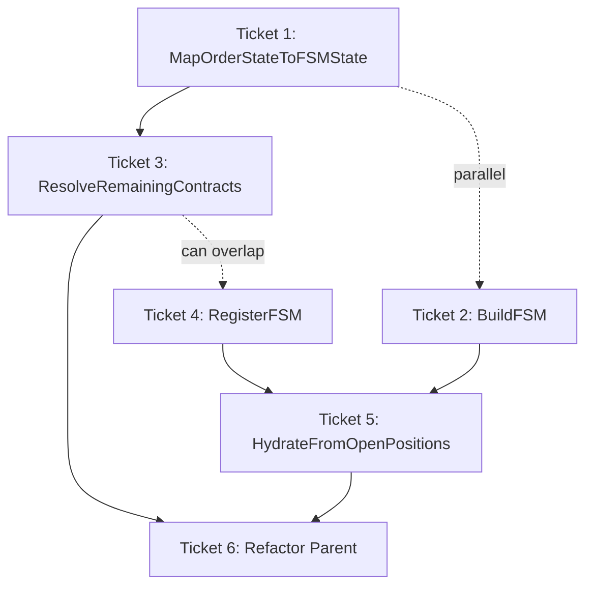

# EPIC-CCN-16 Execution Guide

## Epic Overview
**Target**: HydrateFSMsFromWorkingOrders (CYC 45 → ≤8)
**File**: [`src/V12_002.SIMA.Lifecycle.cs:464-759`](src/V12_002.SIMA.Lifecycle.cs:464)
**Strategy**: Extract 5 methods + refactor parent
**Total Tickets**: 6

## How to Execute Tickets (Bob Edition)

For each ticket in sequence order:
1. Open a NEW Bob session (separate from this planning session)
2. Switch to `/v12-engineer` mode
3. Type: `/ticket docs/brain/EPIC-CCN-16/ticket-XX-[name].md`
4. Bob will execute the PLAN-THEN-EXECUTE protocol
5. Await `[EXTRACT-COMPLETE]` report
6. Director runs manual gates (deploy-sync, F5, complexity_audit)
7. Confirm ticket done before opening next ticket session

## Ticket Sequence

### Phase 1: Low-Risk Extractions (Parallel)
**Duration**: ~1 hour total
**Risk**: LOW

#### Ticket 1: MapOrderStateToFSMState
- **File**: [`docs/brain/EPIC-CCN-16/ticket-01-map-state.md`](docs/brain/EPIC-CCN-16/ticket-01-map-state.md)
- **Depends on**: NONE
- **Scope**: Extract state mapping logic (lines 488-503)
- **Complexity**: CYC ~8 → ~8 (readability improvement)
- **Can run parallel with**: Ticket 2

#### Ticket 2: BuildFSM
- **File**: [`docs/brain/EPIC-CCN-16/ticket-02-build-fsm.md`](docs/brain/EPIC-CCN-16/ticket-02-build-fsm.md)
- **Depends on**: NONE
- **Scope**: Extract FSM factory (lines 520-528)
- **Complexity**: CYC ~1 → ~1 (encapsulation improvement)
- **Can run parallel with**: Ticket 1

### Phase 2: Medium-Risk Extractions (Sequential)
**Duration**: ~1.5 hours total
**Risk**: MEDIUM

#### Ticket 3: ResolveRemainingContracts
- **File**: [`docs/brain/EPIC-CCN-16/ticket-03-resolve-contracts.md`](docs/brain/EPIC-CCN-16/ticket-03-resolve-contracts.md)
- **Depends on**: Ticket 1 (uses MapOrderStateToFSMState result)
- **Scope**: Extract position quantity resolution (lines 505-518)
- **Complexity**: CYC ~3 → ~3 (encapsulation improvement)
- **Must run after**: Ticket 1

#### Ticket 4: RegisterFSM
- **File**: [`docs/brain/EPIC-CCN-16/ticket-04-register-fsm.md`](docs/brain/EPIC-CCN-16/ticket-04-register-fsm.md)
- **Depends on**: NONE (independent extraction)
- **Scope**: Extract FSM registration (lines 590-598)
- **Complexity**: CYC ~2 → ~2 (encapsulation improvement)
- **Can run parallel with**: Tickets 1-3 (but sequential execution recommended)

### Phase 3: High-Risk Extraction (Sequential)
**Duration**: ~1.5 hours
**Risk**: HIGH

#### Ticket 5: HydrateFromOpenPositions
- **File**: [`docs/brain/EPIC-CCN-16/ticket-05-position-pass.md`](docs/brain/EPIC-CCN-16/ticket-05-position-pass.md)
- **Depends on**: Ticket 2 (BuildFSM), Ticket 4 (RegisterFSM)
- **Scope**: Extract Position Pass logic (lines 602-743)
- **Complexity**: CYC ~15 → ~8 (major reduction)
- **Must run after**: Tickets 2, 4
- **Critical**: Preserves REAPER grace window logic

### Phase 4: Refactor Parent (Sequential)
**Duration**: ~30 minutes
**Risk**: LOW

#### Ticket 6: Refactor HydrateFSMsFromWorkingOrders
- **File**: [`docs/brain/EPIC-CCN-16/ticket-06-refactor-parent.md`](docs/brain/EPIC-CCN-16/ticket-06-refactor-parent.md)
- **Depends on**: ALL previous tickets (1-5)
- **Scope**: Refactor parent to orchestrate extracted methods
- **Complexity**: CYC 45 → ≤8 (82.2% reduction) ✅ TARGET MET
- **Must run after**: Tickets 1-5 complete

## Dependency Diagram



## Verification Gates

### After Each Ticket
```powershell
# 1. Re-establish hard links (MANDATORY)
powershell -File .\deploy-sync.ps1

# 2. Complexity audit
python scripts/complexity_audit.py

# 3. Lock regression check
grep -r "lock(" src/

# 4. ASCII gate
grep -Prn "[^\x00-\x7F]" src/

# 5. Build verification
powershell -File .\scripts\build_readiness.ps1

# 6. F5 in NinjaTrader (Director manual gate)
# Verify BUILD_TAG banner visible
```

### After Final Ticket (Ticket 6)
```powershell
# Full verification suite
powershell -File .\scripts\pre_push_validation.ps1 -Fast

# Verify complexity target met
python scripts/complexity_audit.py | grep "HydrateFSMsFromWorkingOrders"
# Expected: CYC ≤8
```

## Epic Success Criteria

### Quantitative Metrics
- ✅ HydrateFSMsFromWorkingOrders: CYC ≤8 (currently 45)
- ✅ All extracted methods: CYC ≤8
- ✅ Zero new compilation errors
- ✅ Zero new runtime errors
- ✅ Build passes: `build_readiness.ps1`
- ✅ F5 in NinjaTrader successful

### Qualitative Metrics
- ✅ Code is more readable (single-responsibility methods)
- ✅ Easier to test (focused unit tests)
- ✅ Easier to maintain (clear separation of concerns)
- ✅ Preserves exact behavior (zero functional changes)
- ✅ Maintains idempotency guarantees
- ✅ Preserves actor-serialization safety

### V12 DNA Compliance
- ✅ Zero `lock()` statements
- ✅ ASCII-only string literals
- ✅ Correctness by construction (FSM invariants preserved)
- ✅ Jane Street alignment (CYC ≤8)

## Complexity Reduction Projection

### Before Extraction
| Method | CYC | Lines |
|--------|-----|-------|
| HydrateFSMsFromWorkingOrders | 45 | 295 |
| **Total** | **45** | **295** |

### After Extraction
| Method | CYC | Lines |
|--------|-----|-------|
| HydrateFSMsFromWorkingOrders (refactored) | ≤8 | ~75 |
| MapOrderStateToFSMState | ~8 | ~20 |
| BuildFSM | ~1 | ~12 |
| ResolveRemainingContracts | ~3 | ~18 |
| RegisterFSM | ~2 | ~12 |
| HydrateFromOpenPositions | ~8 | ~130 |
| **Total** | **~30** | **~267** |

### Reduction Metrics
- **Max CYC Reduction**: 45 → 8 (82.2% reduction) ✅
- **Total CYC Reduction**: 45 → 30 (33.3% reduction)
- **Jane Street Compliance**: ✅ All methods ≤15 (target: ≤8)

## Rollback Plan

If any ticket fails:
1. **Identify failure point** in ticket execution
2. **Review ticket output** and error messages
3. **Fix issues** in separate session
4. **Re-run ticket** from checkpoint
5. **If unfixable**: Rollback via Git
   ```powershell
   git reset --hard HEAD~1  # Undo last commit
   ```

## Notes

- **YOLO MODE**: Full autonomous execution approved
- **No permission requests** needed except F5 verification gates
- **Work on `gitbutler/workspace` branch** only
- **Manifest-based workflow**: Update after each phase
- **LinkTargetOrderToFSM**: Already exists (line 463) - no extraction needed

## Contact

**Director**: Available for F5 verification gates and approval
**Epic Planner**: This document generated by Phase 4 (Ticket Generation)
**Next Phase**: Phase 5 (Ticket Execution) - Use Bob CLI `/v12-engineer` mode