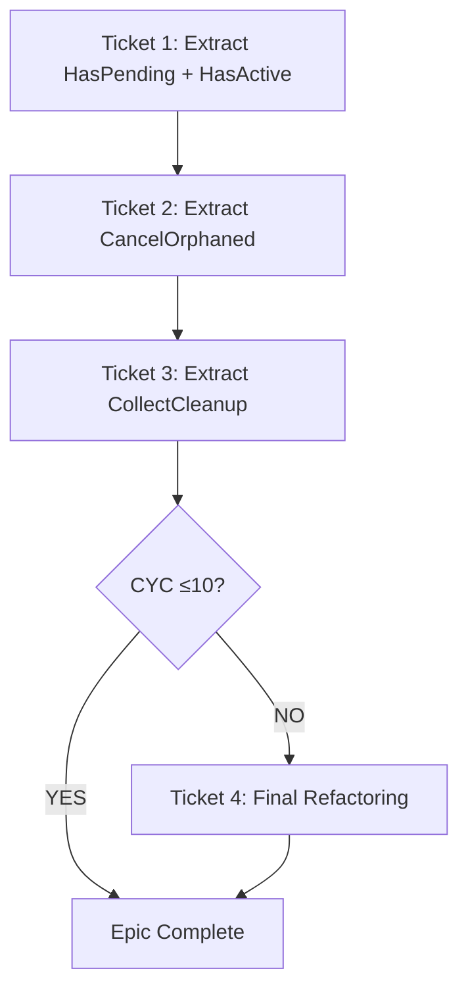

# EPIC-CCN-18: Phase 1 - Scope Definition

**Epic**: EPIC-CCN-18  
**Target**: [`HandleFlatPositionUpdate()`](src/V12_002.Orders.Callbacks.Execution.cs:69)  
**Date**: 2026-06-09  
**Phase**: 1 (Scope Definition)  
**Status**: READY FOR PHASE 1.5 VALIDATION

---

## Executive Summary

This epic reduces [`HandleFlatPositionUpdate()`](src/V12_002.Orders.Callbacks.Execution.cs:69) complexity from **CYC 37 → ≤10** (73% reduction) through **4 surgical extractions**. The method is a Rank #6 hotspot with 2.5x Jane Street threshold violation. Scope is tightly bounded to prevent V12.23 scope creep violations.

**Risk Profile**: LOW (private method, single caller, clear boundaries)  
**Extraction Strategy**: Pure structural refactoring, zero logic drift  
**Estimated Tickets**: 4 tickets (one per extraction)

---

## 1. In-Scope Work

### 1.1 Core Refactoring Objectives

**PRIMARY GOAL**: Reduce [`HandleFlatPositionUpdate()`](src/V12_002.Orders.Callbacks.Execution.cs:69) cyclomatic complexity from 37 to ≤10 through 4 helper method extractions.

#### Extraction 1: `HasPendingEntryForAccount(string accountName)`
**Lines**: 78-92 (15 lines)  
**Purpose**: Detect if account has pending entry orders in flight  
**CYC Reduction**: 37 → 29 (-8)  
**Type**: Pure function (read-only, no side effects)  
**Signature**:
```csharp
private bool HasPendingEntryForAccount(string accountName)
```

**Logic Extracted**:
- Loop through `entryOrders.ToArray()`
- Check: `ord != null && !IsOrderTerminal(ord.OrderState)`
- Check: `activePositions.TryGetValue(kvp.Key, out var pos)`
- Check: `pos.ExecutingAccount != null && pos.ExecutingAccount.Name == accountName`
- Return: `true` if match found, `false` otherwise

**Estimated Helper CYC**: 6 (loop + 5-way condition)

---

#### Extraction 2: `HasActivePositionForAccount(string accountName)`
**Lines**: 97-109 (13 lines)  
**Purpose**: Detect if account has active unfilled positions  
**CYC Reduction**: 29 → 23 (-6)  
**Type**: Pure function (read-only, no side effects)  
**Signature**:
```csharp
private bool HasActivePositionForAccount(string accountName)
```

**Logic Extracted**:
- Loop through `activePositions.ToArray()`
- Check: `kvp.Value.ExecutingAccount != null`
- Check: `kvp.Value.ExecutingAccount.Name == accountName`
- Check: `!kvp.Value.EntryFilled`
- Return: `true` if match found, `false` otherwise

**Estimated Helper CYC**: 5 (loop + 4-way condition)

---

#### Extraction 3: `CancelOrphanedOrdersForPosition(string posKey, PositionInfo pos)`
**Lines**: 144-166 (23 lines)  
**Purpose**: Cancel stop and target orders for orphaned position  
**CYC Reduction**: 23 → 13 (-10)  
**Type**: Actor-serialized (modifies state via `CancelOrderSafe`)  
**Signature**:
```csharp
private void CancelOrphanedOrdersForPosition(string posKey, PositionInfo pos)
```

**Logic Extracted**:
- Check stop order: `stopOrders.TryGetValue(posKey, out var stopOrder)`
- Cancel if: `stopOrder != null && (Working || Accepted)`
- Loop 5 target orders: `for (int tNum = 1; tNum <= 5; tNum++)`
- Check each target: `tDict.TryGetValue(posKey, out var tOrder)`
- Cancel if: `tOrder != null && (Working || Accepted)`

**Estimated Helper CYC**: 8 (stop check + 5-iteration loop + target checks)

---

#### Extraction 4: `CollectPositionsForCleanup()`
**Lines**: 136-169 (34 lines → refactored to ~18 lines)  
**Purpose**: Identify positions requiring cleanup after external close  
**CYC Reduction**: 13 → 7 (-6)  
**Type**: Pure function (returns list, no side effects)  
**Signature**:
```csharp
private List<string> CollectPositionsForCleanup()
```

**Logic Extracted**:
- Loop through `activePositions.ToArray()`
- Check: `activePositions.ContainsKey(kvp.Key)` (concurrent safety)
- Check: `pos.EntryFilled && pos.RemainingContracts > 0`
- Call: `CancelOrphanedOrdersForPosition(kvp.Key, pos)` (Extraction 3)
- Collect: `positionsToCleanup.Add(kvp.Key)`
- Return: `List<string>` of position keys

**Estimated Helper CYC**: 6 (loop + entry check + remaining check)

---

### 1.2 Test-Driven Development (TDD)

**MANDATORY**: Write tests BEFORE each extraction.

#### Test Coverage Requirements

**Total Tests**: 20-25 tests across 4 helper methods

**Extraction 1 Tests** (`HasPendingEntryForAccount`): 6 tests
1. Returns `false` when `entryOrders` is empty
2. Returns `false` when no orders match account name
3. Returns `true` when pending entry exists for account
4. Returns `false` when order is terminal (Filled/Cancelled)
5. Returns `false` when position doesn't exist in `activePositions`
6. Returns `false` when `ExecutingAccount` is null

**Extraction 2 Tests** (`HasActivePositionForAccount`): 5 tests
1. Returns `false` when `activePositions` is empty
2. Returns `false` when no positions match account name
3. Returns `true` when active unfilled position exists
4. Returns `false` when position is already filled (`EntryFilled == true`)
5. Returns `false` when `ExecutingAccount` is null

**Extraction 3 Tests** (`CancelOrphanedOrdersForPosition`): 8 tests
1. Cancels stop order when state is `Working`
2. Cancels stop order when state is `Accepted`
3. Does NOT cancel stop order when state is `Filled`
4. Handles missing stop order gracefully (no exception)
5. Cancels all 5 target orders when state is `Working`
6. Cancels all 5 target orders when state is `Accepted`
7. Does NOT cancel target orders when state is `Filled`
8. Handles missing target orders gracefully (no exception)

**Extraction 4 Tests** (`CollectPositionsForCleanup`): 6 tests
1. Returns empty list when `activePositions` is empty
2. Returns empty list when no positions meet cleanup criteria
3. Collects position when `EntryFilled == true` and `RemainingContracts > 0`
4. Skips position when `EntryFilled == false`
5. Skips position when `RemainingContracts == 0`
6. Handles concurrent modification (position removed during iteration)

---

### 1.3 Verification Gates

**F5 Gate**: MANDATORY after each ticket

1. **Build Gate**: `dotnet build` must succeed (zero errors)
2. **Test Gate**: All new TDD tests must pass
3. **Complexity Gate**: `python scripts/complexity_audit.py` must show CYC reduction
4. **F5 Gate**: Load strategy in NinjaTrader, verify no runtime errors
5. **Sync Gate**: `powershell -File .\deploy-sync.ps1` must succeed

---

## 2. Out-of-Scope Work (V12.23 No Scope Creep)

### 2.1 Explicitly Excluded

**❌ Pre-existing bugs**: Do NOT fix unrelated compilation errors  
**❌ Caller refactoring**: Do NOT modify [`OnPositionUpdate()`](src/V12_002.Orders.Callbacks.Execution.cs:45)  
**❌ Signature changes**: Do NOT change method parameters or return types  
**❌ Performance optimization**: Do NOT add caching, memoization, or algorithmic improvements  
**❌ New features**: Do NOT add logging, metrics, or telemetry beyond existing  
**❌ Related methods**: Do NOT refactor [`ReconcileOrphanedOrders()`](src/V12_002.Orders.Callbacks.Execution.cs:132) or other methods in same file  
**❌ While-we're-here improvements**: Do NOT fix code style, naming, or comments outside extraction scope

### 2.2 Boundary Enforcement

**ONE EPIC = ONE CONCERN**: This epic ONLY reduces complexity of [`HandleFlatPositionUpdate()`](src/V12_002.Orders.Callbacks.Execution.cs:69).

**If unrelated issues found**:
1. STOP immediately
2. Document issue in `docs/brain/EPIC-CCN-18/discovered-issues.md`
3. Report to Director
4. Create separate epic/ticket for unrelated work
5. Resume EPIC-CCN-18 only after Director approval

---

## 3. Success Criteria

### 3.1 Quantitative Metrics

| Metric | Current | Target | Stretch | Status |
|--------|---------|--------|---------|--------|
| **Main Method CYC** | 37 | ≤10 | ≤8 | ❌ |
| **Max Helper CYC** | N/A | ≤12 | ≤10 | ❌ |
| **Max Nesting Depth** | 6 | ≤4 | ≤3 | ❌ |
| **Main Method LOC** | 108 | <50 | <40 | ❌ |
| **Test Coverage** | 0% | 100% | 100% | ❌ |
| **Compilation Errors** | 0 | 0 | 0 | ✅ |
| **Logic Drift** | 0 | 0 | 0 | ✅ |

**MANDATORY THRESHOLDS**:
- Main method CYC ≤10 (Jane Street aligned)
- Each helper CYC ≤12 (Jane Street aligned)
- All 20-25 tests passing
- Zero compilation errors
- Zero logic drift (pure structural refactoring)

---

### 3.2 Qualitative Criteria

**Code Readability**:
- ✅ Main method reads like prose (self-documenting)
- ✅ Each helper has single responsibility
- ✅ Method names clearly describe intent
- ✅ No comments needed to explain logic (code is self-explanatory)

**Architectural Alignment**:
- ✅ Preserved Actor model (no new `lock()` statements)
- ✅ Maintained thread-safety via `Enqueue` pattern
- ✅ ASCII-only compliance (no Unicode/emoji)
- ✅ Jane Street cognitive simplicity (functions fit in working memory)

**Testability**:
- ✅ Pure functions where possible (Extractions 1, 2, 4)
- ✅ Actor-serialized where necessary (Extraction 3)
- ✅ Clear input/output contracts
- ✅ No hidden dependencies or global state

---

## 4. Ticket Structure

### 4.1 Ticket Breakdown

**Total Tickets**: 4 (one per extraction)

#### Ticket 1: Extract `HasPendingEntryForAccount()` + `HasActivePositionForAccount()`
**Rationale**: Both are pure boolean checks, can be extracted together  
**CYC Reduction**: 37 → 23 (-14, 38% reduction)  
**Tests**: 11 tests (6 + 5)  
**Estimated Effort**: 2-3 hours

**Steps**:
1. Write 11 TDD tests (BEFORE extraction)
2. Extract `HasPendingEntryForAccount()` helper
3. Extract `HasActivePositionForAccount()` helper
4. Replace inline logic with helper calls
5. Run tests (all 11 must pass)
6. Run complexity audit (verify CYC 37 → 23)
7. F5 verification in NinjaTrader
8. Commit with message: `EPIC-CCN-18 Ticket 1: Extract pending/active position checks (CYC 37→23)`

---

#### Ticket 2: Extract `CancelOrphanedOrdersForPosition()`
**Rationale**: Complex order cancellation logic with 5-iteration loop  
**CYC Reduction**: 23 → 13 (-10, 43% reduction)  
**Tests**: 8 tests  
**Estimated Effort**: 3-4 hours

**Steps**:
1. Write 8 TDD tests (BEFORE extraction)
2. Extract `CancelOrphanedOrdersForPosition()` helper
3. Replace inline cancellation logic with helper call
4. Run tests (all 8 must pass)
5. Run complexity audit (verify CYC 23 → 13)
6. F5 verification in NinjaTrader
7. Commit with message: `EPIC-CCN-18 Ticket 2: Extract orphaned order cancellation (CYC 23→13)`

---

#### Ticket 3: Extract `CollectPositionsForCleanup()`
**Rationale**: Position cleanup orchestration with nested conditionals  
**CYC Reduction**: 13 → 7 (-6, 46% reduction)  
**Tests**: 6 tests  
**Estimated Effort**: 2-3 hours

**Steps**:
1. Write 6 TDD tests (BEFORE extraction)
2. Extract `CollectPositionsForCleanup()` helper
3. Replace inline cleanup loop with helper call
4. Run tests (all 6 must pass)
5. Run complexity audit (verify CYC 13 → 7)
6. F5 verification in NinjaTrader
7. Commit with message: `EPIC-CCN-18 Ticket 3: Extract position cleanup collection (CYC 13→7)`

---

#### Ticket 4: Final Refactoring (CONDITIONAL)
**Trigger**: If CYC still >10 after Ticket 3  
**Rationale**: Additional simplification if target not met  
**CYC Reduction**: 7 → ≤10 (if needed)  
**Tests**: 4 tests (if new extraction required)  
**Estimated Effort**: 1-2 hours

**Steps**:
1. Run complexity audit (check if CYC ≤10)
2. If CYC >10: Identify remaining complexity hotspot
3. Write 4 TDD tests (if extraction needed)
4. Extract additional helper (if needed)
5. Run tests (all must pass)
6. Run complexity audit (verify CYC ≤10)
7. F5 verification in NinjaTrader
8. Commit with message: `EPIC-CCN-18 Ticket 4: Final complexity reduction (CYC X→≤10)`

**Note**: Ticket 4 may not be needed if Tickets 1-3 achieve CYC ≤10.

---

### 4.2 Ticket Dependencies



**Sequential Execution**: Tickets MUST be executed in order (1 → 2 → 3 → 4).  
**No Parallelization**: Each ticket depends on previous ticket's completion.

---

## 5. Risk Assessment & Mitigation

### 5.1 Identified Risks

#### Risk 1: Triple Nested Loops Hard to Extract
**Severity**: MEDIUM  
**Probability**: LOW  
**Impact**: Extraction may require additional helper methods

**Mitigation**:
- Use TDD to verify behavior before extraction
- Extract inner loops first, then outer loops
- Maintain `ToArray()` pattern for concurrent safety
- Verify no logic drift via comprehensive tests

---

#### Risk 2: Multi-Condition Guards Complex Boolean Algebra
**Severity**: MEDIUM  
**Probability**: LOW  
**Impact**: Helper methods may have higher CYC than estimated

**Mitigation**:
- Keep original boolean logic intact (no simplification)
- Use De Morgan's laws only if CYC reduction proven
- Write tests for all condition combinations
- Complexity audit after each extraction

---

#### Risk 3: Position State Management Critical (No Drift Allowed)
**Severity**: HIGH  
**Probability**: LOW  
**Impact**: Logic drift could cause order management bugs

**Mitigation**:
- **ZERO TOLERANCE** for logic drift
- TDD tests BEFORE extraction (capture current behavior)
- F5 verification after each ticket
- Manual testing: Place entry → verify stop/target cancellation
- Rollback immediately if any behavioral change detected

---

#### Risk 4: Concurrent Modification During Iteration
**Severity**: MEDIUM  
**Probability**: LOW  
**Impact**: Race condition if `activePositions` modified during loop

**Mitigation**:
- Maintain `ToArray()` pattern (creates snapshot)
- Add `ContainsKey()` check before accessing position
- Test concurrent modification scenarios
- Preserve existing thread-safety guarantees

---

### 5.2 Rollback Protocol

**If any ticket fails F5 verification**:
1. STOP immediately (do not proceed to next ticket)
2. Revert commit: `git revert HEAD`
3. Document failure in `docs/brain/EPIC-CCN-18/ticket-N-failure.md`
4. Analyze root cause (logic drift, test gap, etc.)
5. Fix issue in separate session
6. Re-run ticket with corrected approach
7. Report to Director before proceeding

---

## 6. Dependencies & Prerequisites

### 6.1 Prerequisites (SATISFIED)

- ✅ Phase 0 complete (hotspot analysis)
- ✅ Manifest initialized
- ✅ Target method identified
- ✅ Blast radius assessed (LOW risk)
- ✅ Codebase compiles cleanly (zero errors)

### 6.2 Blockers

**NONE IDENTIFIED**

### 6.3 External Dependencies

- ✅ NinjaTrader 8 installed (for F5 verification)
- ✅ `complexity_audit.py` script available
- ✅ `deploy-sync.ps1` script available
- ✅ Test framework configured (`tests/V12_Performance.Tests/`)

---

## 7. Estimated Timeline

| Phase | Duration | Cumulative |
|-------|----------|------------|
| **Ticket 1** | 2-3 hours | 2-3 hours |
| **Ticket 2** | 3-4 hours | 5-7 hours |
| **Ticket 3** | 2-3 hours | 7-10 hours |
| **Ticket 4** (if needed) | 1-2 hours | 8-12 hours |
| **Final Review** | 1 hour | 9-13 hours |

**Total Estimated Effort**: 9-13 hours (1.5-2 days)

---

## 8. Acceptance Criteria

### 8.1 Epic Completion Checklist

- [ ] All 4 tickets completed (or 3 if Ticket 4 not needed)
- [ ] Main method CYC ≤10 (verified via `complexity_audit.py`)
- [ ] All 20-25 tests passing (verified via `dotnet test`)
- [ ] Zero compilation errors (verified via `dotnet build`)
- [ ] F5 verification successful (verified in NinjaTrader)
- [ ] Hard-link sync successful (verified via `deploy-sync.ps1`)
- [ ] Zero logic drift (verified via TDD tests)
- [ ] No scope creep violations (verified via Phase 1.5)

### 8.2 Phase 1.5 Readiness

**This scope document is READY for Phase 1.5 (Scope Boundary Validation).**

Phase 1.5 will validate:
- ✅ ONE EPIC = ONE CONCERN (no scope creep)
- ✅ In-scope vs out-of-scope clearly defined
- ✅ No "while-we're-here" improvements
- ✅ No pre-existing bug fixes bundled
- ✅ Clear extraction boundaries
- ✅ Risk mitigation strategies documented

---

## 9. References

### 9.1 Source Files

- **Target Method**: [`HandleFlatPositionUpdate()`](src/V12_002.Orders.Callbacks.Execution.cs:69-176)
- **Caller Method**: [`OnPositionUpdate()`](src/V12_002.Orders.Callbacks.Execution.cs:45)
- **Helper Method**: [`ReconcileOrphanedOrders()`](src/V12_002.Orders.Callbacks.Execution.cs:132)
- **Helper Method**: [`CancelOrderSafe()`](src/V12_002.Orders.Management.cs)
- **Helper Method**: [`CleanupPosition()`](src/V12_002.Orders.Management.cs)

### 9.2 Documentation

- **Hotspot Report**: `docs/brain/EPIC-CCN-18/00-hotspots.md`
- **Manifest**: `docs/brain/EPIC-CCN-18/manifest.json`
- **Complexity Protocol**: `docs/protocol/COMPLEXITY_REDUCTION_PROTOCOL.md`
- **Jane Street Standards**: `docs/standards/JANE_STREET_DEVIATIONS.md`
- **V12.23 No Scope Creep**: `docs/protocol/NO_SCOPE_CREEP_PROTOCOL.md`

### 9.3 Tools

- **Complexity Audit**: `python scripts/complexity_audit.py`
- **Build Readiness**: `powershell -File .\scripts\build_readiness.ps1`
- **Hard-Link Sync**: `powershell -File .\deploy-sync.ps1`
- **Test Runner**: `dotnet test tests/V12_Performance.Tests/`

---

## 10. Next Steps

1. **Phase 1.5**: Scope Boundary Validation (mandatory gate)
2. **Phase 2**: Architecture Planning (method signatures, contracts)
3. **Phase 2.3**: Sentinel Audit (DNA & PR audit)
4. **Phase 3**: Architecture Validation (approach approval)
5. **Phase 4**: Ticket Generation (executable tickets)
6. **Phase 5**: Ticket Execution (Bob CLI `v12-engineer` mode)
7. **Phase 6**: Final Review (completion report)

---

**[SCOPE-GATE]** Phase 1 complete. Ready for Phase 1.5 (Scope Boundary Validation).