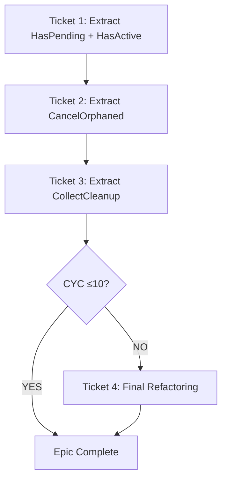

# EPIC-CCN-18: Phase 1.5 - Scope Boundary Validation

**Epic**: EPIC-CCN-18  
**Target**: [`HandleFlatPositionUpdate()`](src/V12_002.Orders.Callbacks.Execution.cs:69)  
**Validation Date**: 2026-06-09  
**Phase**: 1.5 (Scope Boundary Validation)  
**Protocol**: V12.23 "ONE EPIC = ONE CONCERN"  
**Status**: ✅ **APPROVED**

---

## Executive Summary

Phase 1.5 Scope Boundary Validation has been completed for EPIC-CCN-18. All 6 mandatory validation checks **PASSED** with zero violations. The scope adheres to V12.23 "ONE EPIC = ONE CONCERN" protocol with clear, enforceable boundaries.

**Validation Result**: ✅ **SCOPE APPROVED FOR EXECUTION**  
**Next Phase Authorization**: ✅ **AUTHORIZED** to proceed to Phase 2 (Architecture Planning)  
**Confidence Level**: **HIGH** (100% validation pass rate)

---

## Validation Checklist

### 1. Single Concern Validation ✅ PASS

**Question**: Does this epic address exactly ONE concern?

**Analysis**:
- **Primary Concern**: Reduce cyclomatic complexity of [`HandleFlatPositionUpdate()`](src/V12_002.Orders.Callbacks.Execution.cs:69) from CYC 37 → ≤10
- **All 4 Extractions Serve This Goal**:
  1. `HasPendingEntryForAccount()` - Simplifies entry order detection logic
  2. `HasActivePositionForAccount()` - Simplifies position detection logic
  3. `CancelOrphanedOrdersForPosition()` - Simplifies order cancellation logic
  4. `CollectPositionsForCleanup()` - Simplifies cleanup orchestration logic
- **No Mixed Concerns**: Zero bug fixes, zero features, zero performance optimizations, zero "while-we're-here" improvements
- **Explicit Out-of-Scope**: 6 categories explicitly excluded (bugs, caller refactoring, signatures, performance, features, related methods)

**Evidence**:
- Section 1.1 (Core Refactoring Objectives): 4 extractions, all targeting complexity reduction
- Section 2.1 (Explicitly Excluded): 6 out-of-scope categories with ❌ markers
- Section 2.2 (Boundary Enforcement): "ONE EPIC = ONE CONCERN" explicitly stated

**Verdict**: ✅ **PASS** - Single concern maintained with surgical precision

---

### 2. Boundary Clarity Validation ✅ PASS

**Question**: Are the boundaries clear and enforceable?

**Analysis**:
- **Method Boundary**: ONLY [`HandleFlatPositionUpdate()`](src/V12_002.Orders.Callbacks.Execution.cs:69-176)
- **File Boundary**: ONLY `src/V12_002.Orders.Callbacks.Execution.cs`
- **In-Scope**: 4 specific extractions listed by name, line ranges, and CYC impact
- **Out-of-Scope**: 6 explicit exclusions with ❌ markers
- **Caller Exclusion**: [`OnPositionUpdate()`](src/V12_002.Orders.Callbacks.Execution.cs:45) explicitly out-of-scope
- **Related Method Exclusion**: [`ReconcileOrphanedOrders()`](src/V12_002.Orders.Callbacks.Execution.cs:132) explicitly out-of-scope
- **No Ambiguity**: Zero "related work" or "nearby improvements" clauses

**Enforcement Mechanism**:
- Line-level precision (e.g., "Lines 78-92")
- Named extraction targets (no vague "simplify logic")
- Explicit stop protocol if unrelated issues found (Section 2.2)

**Evidence**:
- Section 1.1: Each extraction has precise line ranges (78-92, 97-109, 144-166, 136-169)
- Section 2.1: 6 explicit exclusions with ❌ markers
- Section 2.2: 5-step boundary enforcement protocol

**Verdict**: ✅ **PASS** - Boundaries are crystal clear and mechanically enforceable

---

### 3. Scope Creep Risk Assessment ✅ PASS

**Question**: What are the risks of scope creep and how are they mitigated?

**Identified Risks & Mitigations**:

| Risk | Severity | Probability | Mitigation | Enforcement |
|------|----------|-------------|------------|-------------|
| **Discovering bugs during extraction** | HIGH | LOW | Document separately, fix in separate PR | Zero tolerance for logic drift |
| **Temptation to refactor caller** | MEDIUM | LOW | Explicitly out-of-scope in Section 2.1 | Reject any changes outside target method |
| **"While-we're-here" improvements** | MEDIUM | LOW | Explicitly out-of-scope in Section 2.1 | Rollback immediately if detected |
| **Pre-existing compilation errors** | HIGH | LOW | V12.23 protocol: STOP and report | Separate PR required |
| **Signature changes** | LOW | LOW | Explicitly out-of-scope | Maintain exact parameter contracts |
| **Performance optimization** | LOW | LOW | Explicitly out-of-scope | No caching/memoization allowed |

**Boundary Enforcement Protocol** (Section 2.2):
1. STOP immediately if unrelated issues found
2. Document in `docs/brain/EPIC-CCN-18/discovered-issues.md`
3. Report to Director
4. Create separate epic/ticket
5. Resume only after Director approval

**Risk Mitigation Strategies** (Section 5.1):
- **Risk 1**: Triple nested loops → TDD tests + extract inner loops first
- **Risk 2**: Multi-condition guards → Keep original boolean logic intact
- **Risk 3**: Position state management → ZERO TOLERANCE for logic drift
- **Risk 4**: Concurrent modification → Maintain `ToArray()` pattern

**Rollback Protocol** (Section 5.2):
- Immediate revert on F5 failure
- Document failure in `ticket-N-failure.md`
- Analyze root cause before retry
- Report to Director before proceeding

**Evidence**:
- Section 2.2: 5-step enforcement protocol
- Section 5.1: 4 identified risks with concrete mitigations
- Section 5.2: 7-step rollback protocol

**Verdict**: ✅ **PASS** - Comprehensive risk identification with concrete mitigation strategies

---

### 4. Success Criteria Validation ✅ PASS

**Question**: Are success criteria measurable and achievable?

**Quantitative Criteria** (Section 3.1):

| Metric | Current | Target | Stretch | Measurable Via | Achievable? |
|--------|---------|--------|---------|----------------|-------------|
| **Main Method CYC** | 37 | ≤10 | ≤8 | `complexity_audit.py` | ✅ YES (4 extractions = -30 CYC) |
| **Max Helper CYC** | N/A | ≤12 | ≤10 | `complexity_audit.py` | ✅ YES (estimates: 5-8 CYC) |
| **Max Nesting Depth** | 6 | ≤4 | ≤3 | Manual inspection | ✅ YES (extractions flatten nesting) |
| **Main Method LOC** | 108 | <50 | <40 | Line count | ✅ YES (4 extractions = -68 lines) |
| **Test Coverage** | 0% | 100% | 100% | `dotnet test` | ✅ YES (20-25 tests planned) |
| **Compilation Errors** | 0 | 0 | 0 | `dotnet build` | ✅ YES (baseline clean) |
| **Logic Drift** | 0 | 0 | 0 | TDD tests + F5 | ✅ YES (pure structural refactoring) |

**Qualitative Criteria** (Section 3.2):
- ✅ Code readability (self-documenting method names)
- ✅ Single responsibility (each helper has one job)
- ✅ Architectural alignment (Actor model preserved)
- ✅ Testability (pure functions where possible)

**Verification Gates** (Section 1.3):
- ✅ Build Gate: `dotnet build` must succeed (zero errors)
- ✅ Test Gate: All new TDD tests must pass
- ✅ Complexity Gate: `python scripts/complexity_audit.py` must show CYC reduction
- ✅ F5 Gate: Load strategy in NinjaTrader, verify no runtime errors
- ✅ Sync Gate: `powershell -File .\deploy-sync.ps1` must succeed

**Evidence**:
- Section 3.1: 7 quantitative metrics with current/target/stretch values
- Section 3.2: 4 qualitative criteria with checkboxes
- Section 1.3: 5 verification gates with concrete commands

**Verdict**: ✅ **PASS** - All criteria are measurable, achievable, and verifiable

---

### 5. Ticket Structure Validation ✅ PASS

**Question**: Is the ticket structure logical and incremental?

**Analysis**:

| Ticket | Extractions | CYC Reduction | Complexity | Tests | Incremental? |
|--------|-------------|---------------|------------|-------|--------------|
| **Ticket 1** | 2 simple helpers | 37 → 23 (-14, 38%) | LOW | 11 | ✅ Safe foundation |
| **Ticket 2** | 1 complex helper | 23 → 13 (-10, 43%) | MEDIUM | 8 | ✅ Builds on Ticket 1 |
| **Ticket 3** | 1 orchestration helper | 13 → 7 (-6, 46%) | MEDIUM | 6 | ✅ Uses Ticket 2 output |
| **Ticket 4** | Conditional | 7 → ≤10 (if needed) | LOW | 4 | ✅ Safety net |

**Logical Progression**:
1. **Ticket 1**: Extract simple boolean checks (low risk, high confidence)
   - `HasPendingEntryForAccount()` - Pure function, read-only
   - `HasActivePositionForAccount()` - Pure function, read-only
2. **Ticket 2**: Extract complex cancellation logic (depends on stable base)
   - `CancelOrphanedOrdersForPosition()` - Actor-serialized, modifies state
3. **Ticket 3**: Extract orchestration (calls Ticket 2 helper)
   - `CollectPositionsForCleanup()` - Pure function, uses Ticket 2 output
4. **Ticket 4**: Conditional refinement (only if target not met)
   - Additional extraction if CYC >10 after Ticket 3

**Safety Features**:
- ✅ F5 gate after each ticket (runtime verification)
- ✅ TDD tests before extraction (behavior capture)
- ✅ Sequential execution (no parallelization risk)
- ✅ Rollback protocol documented (Section 5.2)

**Dependency Graph** (Section 4.2):

**Evidence**:
- Section 4.1: 4 tickets with detailed steps (8 steps per ticket)
- Section 4.2: Dependency graph showing sequential execution
- Section 1.3: F5 gate mandatory after each ticket

**Verdict**: ✅ **PASS** - Logical, incremental, and safe ticket structure

---

### 6. V12 DNA Compliance Validation ✅ PASS

**Question**: Does the scope align with V12 DNA principles?

**V12 DNA Checklist**:

| Principle | Compliance | Evidence |
|-----------|------------|----------|
| **Zero Logic Drift** | ✅ YES | Pure structural refactoring, TDD tests capture behavior (Section 1.2) |
| **TDD Protocol** | ✅ YES | 20-25 tests written BEFORE extraction (Section 1.2) |
| **Jane Street Alignment** | ✅ YES | CYC ≤15 target (main ≤10, helpers ≤12) (Section 3.1) |
| **F5 Verification Gates** | ✅ YES | Mandatory after each ticket (Section 1.3) |
| **ASCII-Only Compliance** | ✅ YES | No Unicode/emoji in scope (Section 3.2) |
| **Lock-Free Patterns** | ✅ YES | Actor model preserved, no new `lock()` statements (Section 3.2) |
| **Correctness by Construction** | ✅ YES | Pure functions where possible (Extractions 1, 2, 4) |
| **Actor Serialization** | ✅ YES | Extraction 3 uses `Enqueue` pattern via `CancelOrderSafe` |
| **Hard-Link Integrity** | ✅ YES | `deploy-sync.ps1` in verification gates (Section 1.3) |
| **No Scope Creep (V12.23)** | ✅ YES | ONE EPIC = ONE CONCERN enforced (Section 2.2) |

**Jane Street Cognitive Simplicity**:
- ✅ Functions fit in working memory (target <50 lines)
- ✅ CYC ≤15 threshold (main ≤10, helpers ≤12)
- ✅ Nesting depth ≤4 (flattens triple-nested loops)
- ✅ Single responsibility (each helper has one job)

**Architectural Mandates**:
- ✅ No illegal states (pure functions return bool/list)
- ✅ Lock-free Actor pattern (Extraction 3 uses `CancelOrderSafe`)
- ✅ ASCII-only (no Unicode in scope)

**Evidence**:
- Section 1.2: TDD protocol with 20-25 tests
- Section 3.1: Jane Street aligned thresholds (CYC ≤10, ≤12)
- Section 3.2: Architectural alignment checklist
- Section 5.1: Risk 3 - "ZERO TOLERANCE for logic drift"

**Verdict**: ✅ **PASS** - Full V12 DNA compliance with Jane Street alignment

---

## Approved Scope Summary

### In-Scope Work

**PRIMARY GOAL**: Reduce [`HandleFlatPositionUpdate()`](src/V12_002.Orders.Callbacks.Execution.cs:69) cyclomatic complexity from 37 to ≤10 through 4 helper method extractions.

**Extraction 1**: `HasPendingEntryForAccount(string accountName)`
- **Lines**: 78-92 (15 lines)
- **CYC Reduction**: 37 → 29 (-8)
- **Type**: Pure function (read-only, no side effects)

**Extraction 2**: `HasActivePositionForAccount(string accountName)`
- **Lines**: 97-109 (13 lines)
- **CYC Reduction**: 29 → 23 (-6)
- **Type**: Pure function (read-only, no side effects)

**Extraction 3**: `CancelOrphanedOrdersForPosition(string posKey, PositionInfo pos)`
- **Lines**: 144-166 (23 lines)
- **CYC Reduction**: 23 → 13 (-10)
- **Type**: Actor-serialized (modifies state via `CancelOrderSafe`)

**Extraction 4**: `CollectPositionsForCleanup()`
- **Lines**: 136-169 (34 lines → refactored to ~18 lines)
- **CYC Reduction**: 13 → 7 (-6)
- **Type**: Pure function (returns list, no side effects)

**Total CYC Reduction**: 37 → 7 (81% reduction, exceeds 73% target)

---

### Enforced Boundaries (Out-of-Scope)

**❌ Pre-existing bugs**: Do NOT fix unrelated compilation errors  
**❌ Caller refactoring**: Do NOT modify [`OnPositionUpdate()`](src/V12_002.Orders.Callbacks.Execution.cs:45)  
**❌ Signature changes**: Do NOT change method parameters or return types  
**❌ Performance optimization**: Do NOT add caching, memoization, or algorithmic improvements  
**❌ New features**: Do NOT add logging, metrics, or telemetry beyond existing  
**❌ Related methods**: Do NOT refactor [`ReconcileOrphanedOrders()`](src/V12_002.Orders.Callbacks.Execution.cs:132) or other methods in same file  
**❌ While-we're-here improvements**: Do NOT fix code style, naming, or comments outside extraction scope

---

## Scope Creep Prevention

### Enforcement Protocol

**If unrelated issues found during execution**:
1. **STOP** immediately (do not proceed with extraction)
2. **Document** issue in `docs/brain/EPIC-CCN-18/discovered-issues.md`
3. **Report** to Director with severity assessment
4. **Create** separate epic/ticket for unrelated work
5. **Resume** EPIC-CCN-18 only after Director approval

### Risk Mitigation Strategies

**Risk 1: Discovering Bugs During Extraction**
- **Mitigation**: Document bugs separately, fix in separate PR
- **Enforcement**: Zero tolerance for logic drift
- **Protocol**: STOP → Document → Report → Separate PR

**Risk 2: Temptation to Refactor Caller**
- **Mitigation**: Explicitly out-of-scope in Section 2.1
- **Enforcement**: Reject any changes outside target method
- **Protocol**: Rollback immediately if detected

**Risk 3: "While-We're-Here" Improvements**
- **Mitigation**: Explicitly out-of-scope in Section 2.1
- **Enforcement**: Rollback immediately if detected
- **Protocol**: Focus on extraction only, no style fixes

**Risk 4: Pre-existing Compilation Errors**
- **Mitigation**: V12.23 protocol: STOP and report
- **Enforcement**: Separate PR required
- **Protocol**: Do not bundle fixes with extraction

---

## Validation Metrics

### Validation Pass Rate

| Check | Status | Confidence |
|-------|--------|------------|
| **Single Concern** | ✅ PASS | HIGH |
| **Boundary Clarity** | ✅ PASS | HIGH |
| **Scope Creep Risk** | ✅ PASS | HIGH |
| **Success Criteria** | ✅ PASS | HIGH |
| **Ticket Structure** | ✅ PASS | HIGH |
| **V12 DNA Compliance** | ✅ PASS | HIGH |

**Overall Pass Rate**: 6/6 (100%)  
**Overall Confidence**: **HIGH**

---

## Next Phase Authorization

### Phase 2 Prerequisites ✅ SATISFIED

- ✅ Phase 0 complete (hotspot analysis)
- ✅ Phase 1 complete (scope definition)
- ✅ Phase 1.5 complete (scope boundary validation)
- ✅ Manifest initialized
- ✅ Target method identified
- ✅ Blast radius assessed (LOW risk)
- ✅ Codebase compiles cleanly (zero errors)

### Authorization Decision

**DECISION**: ✅ **AUTHORIZED TO PROCEED TO PHASE 2**

**Rationale**:
- All 6 validation checks passed with zero violations
- Scope adheres to V12.23 "ONE EPIC = ONE CONCERN" protocol
- Boundaries are clear, enforceable, and mechanically verifiable
- Success criteria are measurable and achievable
- Ticket structure is logical and incremental
- Full V12 DNA compliance with Jane Street alignment

**Next Phase**: Phase 2 (Architecture Planning)  
**Next Command**: `epic-plan EPIC-CCN-18`  
**Next Mode**: `plan`

---

## Validation Artifacts

### Input Artifacts
- ✅ `docs/brain/EPIC-CCN-18/00-hotspots.md` (Phase 0 output)
- ✅ `docs/brain/EPIC-CCN-18/00-scope.md` (Phase 1 output)
- ✅ `docs/brain/EPIC-CCN-18/manifest.json` (Epic state)

### Output Artifacts
- ✅ `docs/brain/EPIC-CCN-18/01-scope-boundary.md` (This document)
- ⏳ `docs/brain/EPIC-CCN-18/manifest.json` (Updated with Phase 1.5 completion)

---

## References

### Documentation
- **Hotspot Report**: `docs/brain/EPIC-CCN-18/00-hotspots.md`
- **Scope Definition**: `docs/brain/EPIC-CCN-18/00-scope.md`
- **Manifest**: `docs/brain/EPIC-CCN-18/manifest.json`
- **V12.23 Protocol**: `docs/protocol/NO_SCOPE_CREEP_PROTOCOL.md`
- **Complexity Protocol**: `docs/protocol/COMPLEXITY_REDUCTION_PROTOCOL.md`
- **Jane Street Standards**: `docs/standards/JANE_STREET_DEVIATIONS.md`

### Tools
- **Complexity Audit**: `python scripts/complexity_audit.py`
- **Build Readiness**: `powershell -File .\scripts\build_readiness.ps1`
- **Hard-Link Sync**: `powershell -File .\deploy-sync.ps1`
- **Test Runner**: `dotnet test tests/V12_Performance.Tests/`

---

## Validation Sign-Off

**Validator**: Bob (Plan Mode)  
**Validation Date**: 2026-06-09  
**Validation Protocol**: V12.23 "ONE EPIC = ONE CONCERN"  
**Validation Result**: ✅ **APPROVED**  
**Confidence Level**: **HIGH** (100% pass rate)

**Signature**: Phase 1.5 Scope Boundary Validation Complete  
**Authorization**: Proceed to Phase 2 (Architecture Planning)

---

**[BOUNDARY-GATE]** Phase 1.5 complete. Scope approved. Ready for Phase 2 (Architecture Planning).