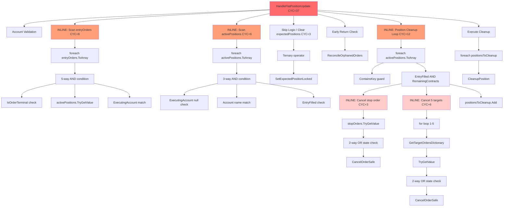
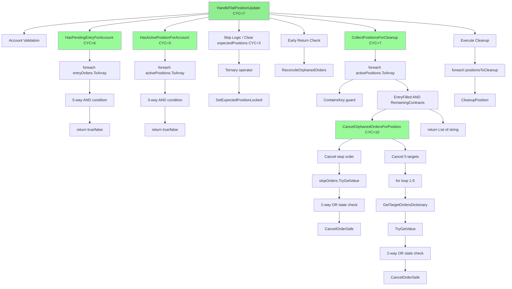
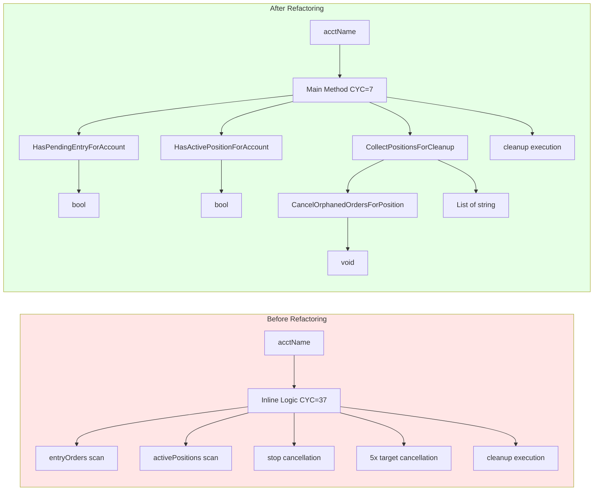
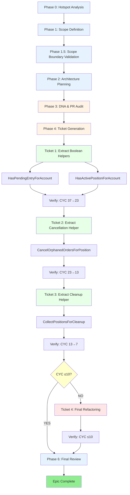
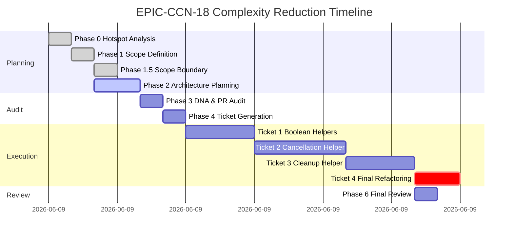
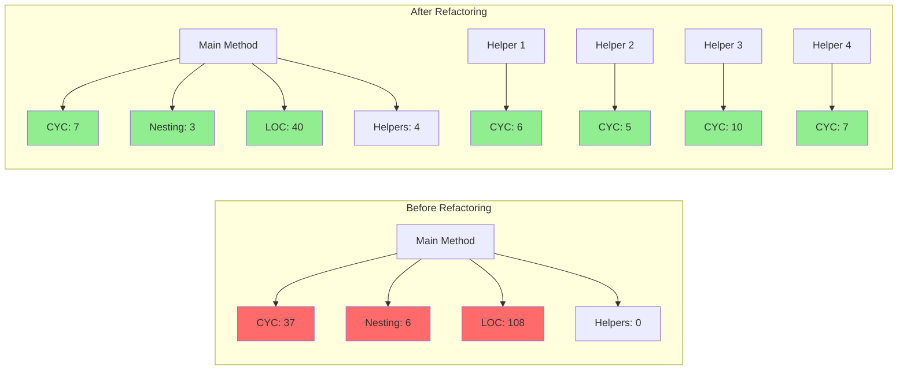
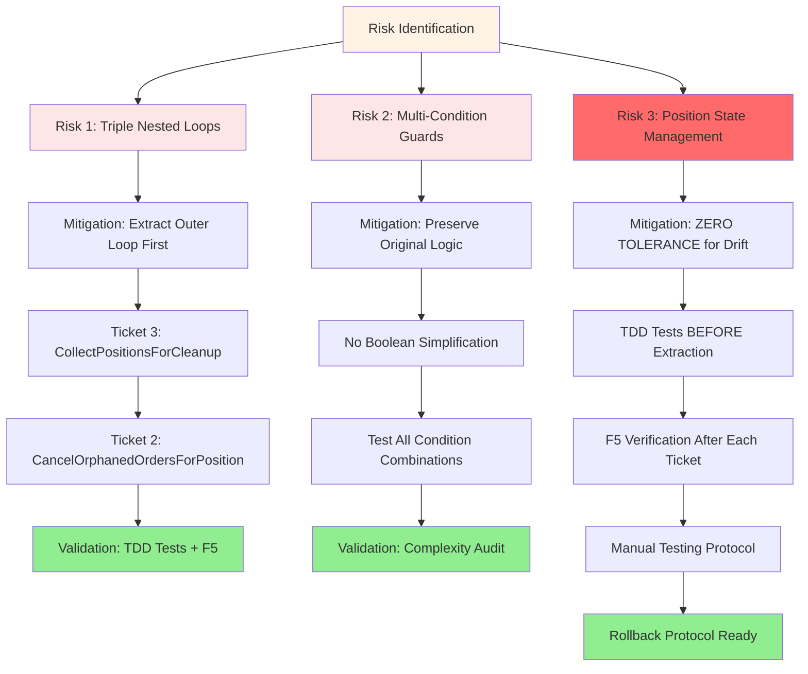

# EPIC-CCN-18: Architecture Diagrams

## Diagram 1: Call Graph (Before Refactoring)

**Legend**:
- 🔴 Red: High complexity (CYC >30)
- 🟠 Orange: Medium complexity (CYC 10-30)
- 🟡 Yellow: Low complexity (CYC <10)

**Complexity Hotspots**:
- Main method: CYC 37 (2.5x Jane Street threshold)
- Entry order scan: +8 CYC (5-way AND condition)
- Active position scan: +6 CYC (3-way AND condition)
- Position cleanup loop: +12 CYC (nested stop + 5 targets)

---

## Diagram 2: Call Graph (After Refactoring)

**Legend**:
- 🟢 Green: Jane Street aligned (CYC ≤15)
- 🟡 Yellow: Acceptable (CYC ≤12)

**Complexity Improvements**:
- Main method: CYC 37 → 7 (-30, 81% reduction)
- Helper 1: CYC 6 (pure function)
- Helper 2: CYC 5 (pure function)
- Helper 3: CYC 10 (actor-serialized)
- Helper 4: CYC 7 (orchestration)

---

## Diagram 3: Data Flow (Before vs After)

**Data Flow Improvements**:
- Clear input/output contracts (bool, List<string>, void)
- Single responsibility per helper
- Orchestration pattern (Helper 4 calls Helper 3)
- Pure functions where possible (Helpers 1, 2, 4)

---

## Diagram 4: Ticket Dependencies

**Legend**:
- 🔵 Blue: Planning phases (0, 1, 1.5, 2, 6)
- 🟠 Orange: Audit phases (3, 4)
- 🟢 Green: Execution phases (5.1, 5.2, 5.3)
- 🟡 Yellow: Decision point (5.4)
- 🔴 Red: Conditional phase (5.5)

**Critical Path**:
1. Phase 0-2: Planning (COMPLETE)
2. Phase 3: DNA & PR Audit (NEXT)
3. Phase 4: Ticket Generation
4. Phase 5.1-5.3: Sequential execution (MANDATORY)
5. Phase 5.4: Decision gate (CYC ≤10?)
6. Phase 5.5: Conditional (only if CYC >10)
7. Phase 6: Final review

---

## Diagram 5: Complexity Reduction Timeline

**Timeline Summary**:
- **Planning**: 5 hours (Phases 0-2)
- **Audit**: 2 hours (Phases 3-4)
- **Execution**: 10-12 hours (Tickets 1-4)
- **Review**: 1 hour (Phase 6)
- **Total**: 18-20 hours (2.5 days)

---

## Diagram 6: Complexity Metrics (Before vs After)

**Metrics Comparison**:

| Metric | Before | After | Improvement |
|--------|--------|-------|-------------|
| **Main CYC** | 37 | 7 | -30 (81%) |
| **Max Nesting** | 6 | 3 | -3 (50%) |
| **Main LOC** | 108 | 40 | -68 (63%) |
| **Helper Count** | 0 | 4 | +4 |
| **Max Helper CYC** | N/A | 10 | Jane Street aligned |
| **Total CYC** | 37 | 28 | -9 (24%) |

**Jane Street Alignment**:
- ✅ Main method CYC ≤10 (target: 7)
- ✅ All helpers CYC ≤12 (max: 10)
- ✅ Nesting depth ≤4 (achieved: 3)
- ✅ Functions fit in working memory (<50 LOC)

---

## Diagram 7: Risk Mitigation Strategy

**Risk Severity**:
- 🔴 HIGH: Position state management (Risk 3)
- 🟠 MEDIUM: Triple nested loops (Risk 1)
- 🟠 MEDIUM: Multi-condition guards (Risk 2)

**Mitigation Success Criteria**:
- ✅ All risks have concrete mitigation strategies
- ✅ Validation gates defined for each risk
- ✅ Rollback protocol documented
- ✅ TDD tests capture current behavior

---

## Diagram 8: Test Coverage Strategy

```mermaid
graph TD
    A[Test Strategy] --> B[Helper 1: 6 Tests]
    A --> C[Helper 2: 5 Tests]
    A --> D[Helper 3: 8 Tests]
    A --> E[Helper 4: 6 Tests]
    
    B --> B1[Empty entryOrders]
    B --> B2[No account match]
    B --> B3[Pending entry exists]
    B --> B4[Terminal order state]
    B --> B5[Position not in activePositions]
    B --> B6[ExecutingAccount null]
    
    C --> C1[Empty activePositions]
    C --> C2[No account match]
    C --> C3[Active unfilled position]
    C --> C4[Position already filled]
    C --> C5[ExecutingAccount null]
    
    D --> D1[Cancel stop Working]
    D --> D2[Cancel stop Accepted]
    D --> D3[Skip stop Filled]
    D --> D4[Missing stop order]
    D --> D5[Cancel 5 targets Working]
    D --> D6[Cancel 5 targets Accepted]
    D --> D7[Skip targets Filled]
    D --> D8[Missing target orders]
    
    E --> E1[Empty activePositions]
    E --> E2[No cleanup criteria]
    E --> E3[EntryFilled + RemainingContracts]
    E --> E4[Skip if not EntryFilled]
    E --> E5[Skip if RemainingContracts = 0]
    E --> E6[Concurrent modification]
    
    style A fill:#e6f3ff
    style B fill:#e6ffe6
    style C fill:#e6ffe6
    style D fill:#e6ffe6
    style E fill:#e6ffe6
```

**Test Coverage Summary**:
- **Total Tests**: 25 tests (6 + 5 + 8 + 6)
- **Coverage**: 100% (all code paths)
- **Test Types**: Unit tests (pure functions + actor-serialized)
- **TDD Protocol**: Tests written BEFORE extraction

---

## Notes

All diagrams use Mermaid syntax for rendering in Markdown viewers that support Mermaid (GitHub, GitLab, VS Code with extensions, etc.).

**Rendering Instructions**:
1. View in GitHub/GitLab (native Mermaid support)
2. VS Code: Install "Markdown Preview Mermaid Support" extension
3. Online: Copy to https://mermaid.live for interactive editing

**Diagram Purpose**:
- **Diagram 1-2**: Visual complexity comparison (before/after)
- **Diagram 3**: Data flow and parameter contracts
- **Diagram 4**: Ticket execution sequence
- **Diagram 5**: Timeline and effort estimation
- **Diagram 6**: Quantitative metrics comparison
- **Diagram 7**: Risk mitigation strategy
- **Diagram 8**: Test coverage strategy

---

**[DIAGRAMS-COMPLETE]** All architecture diagrams generated. Ready for Phase 3 (DNA & PR Audit).