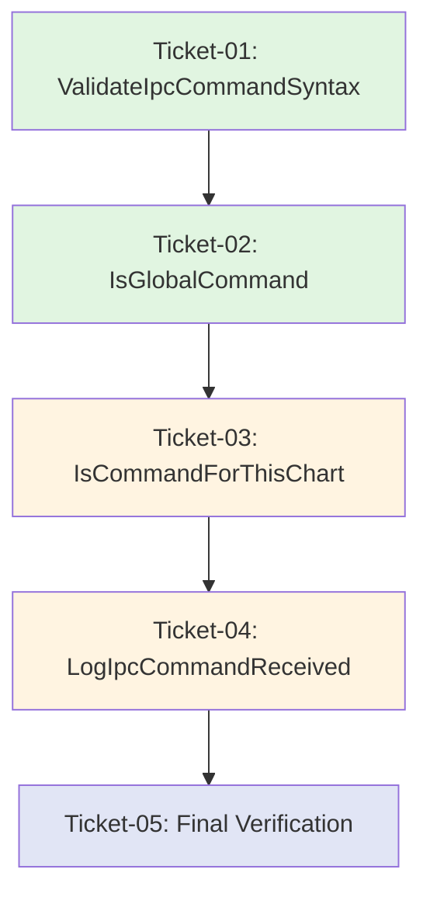

# Epic: EPIC-CCN-2 -- Execution Guide

**Epic ID**: EPIC-CCN-2  
**Target**: [`ProcessIpcCommands()`](../../../src/V12_002.UI.IPC.cs:260)  
**Goal**: Reduce cyclomatic complexity from 76 to ≤ 8  
**Strategy**: Incremental extraction (4 sub-methods + 1 verification)

---

## How to Execute Tickets (Bob Edition)

For each ticket in sequence order:

1. **Open a NEW Bob session** (separate from this planning session)
2. **Switch to /v12-engineer mode**
3. **Type**: `/ticket docs/brain/EPIC-CCN-2/ticket-XX-[name].md`
4. **Bob will execute** the PLAN-THEN-EXECUTE protocol
5. **Await** `[EXTRACT-COMPLETE]` or `[PHASE7-COMPLETE]` report
6. **Director runs manual gates**:
   ```powershell
   # After each ticket completion
   powershell -File .\deploy-sync.ps1
   python scripts/complexity_audit.py
   ```
7. **Press F5 in NinjaTrader** to verify strategy loads
8. **Confirm ticket done** before opening next ticket session

---

## Ticket Sequence

### Ticket 01: Extract ValidateIpcCommandSyntax()
**File**: [`ticket-01-validate-syntax.md`](ticket-01-validate-syntax.md)  
**Depends on**: NONE  
**Goal**: Extract validation cascade (lines 280-310)  
**CYC Impact**: 76 → ~60  
**Estimated Time**: 30-45 minutes

**Verification**:
- [ ] Method created with 5 parameters (1 in, 4 out)
- [ ] All 7 validation checks moved in correct order
- [ ] Call site updated to single-line method call
- [ ] `complexity_audit.py` shows CYC ≤ 8 for new method
- [ ] F5 loads, malformed command test passes

---

### Ticket 02: Extract IsGlobalCommand()
**File**: [`ticket-02-global-command.md`](ticket-02-global-command.md)  
**Depends on**: Ticket 01  
**Goal**: Extract global command classification (lines 312-330)  
**CYC Impact**: ~60 → ~45  
**Estimated Time**: 30-45 minutes

**Verification**:
- [ ] Method created with local functions (IsFleetCommand, IsModeCommand, IsTargetCommand)
- [ ] All 17 global command checks preserved
- [ ] `StartsWith("MOVE_TARGET")` logic preserved
- [ ] `complexity_audit.py` shows CYC = 4 for new method
- [ ] F5 loads, TOGGLE_ACCOUNT test passes

---

### Ticket 03: Extract IsCommandForThisChart()
**File**: [`ticket-03-symbol-matching.md`](ticket-03-symbol-matching.md)  
**Depends on**: Ticket 02  
**Goal**: Extract symbol matching logic (lines 332-350)  
**CYC Impact**: ~45 → ~25  
**Estimated Time**: 45-60 minutes

**Verification**:
- [ ] Method created with guard clauses and local functions
- [ ] All 10+ symbol matching rules preserved
- [ ] `out string mySym` parameter correctly populated
- [ ] Micro contract mappings (MES→ES, MYM→YM, MGC→GC) work
- [ ] `complexity_audit.py` shows CYC = 6 for new method
- [ ] F5 loads, multi-chart symbol routing test passes

---

### Ticket 04: Extract LogIpcCommandReceived()
**File**: [`ticket-04-logging.md`](ticket-04-logging.md)  
**Depends on**: Ticket 03  
**Goal**: Extract diagnostic logging (lines 352-365)  
**CYC Impact**: ~25 → ≤ 8  
**Estimated Time**: 15-30 minutes

**Verification**:
- [ ] Method created with 5 parameters, void return
- [ ] Log message format preserved exactly
- [ ] Conditional `[GLOBAL CMD]` suffix logic preserved
- [ ] `complexity_audit.py` shows CYC ≤ 3 for new method
- [ ] `complexity_audit.py` shows CYC ≤ 8 for `ProcessIpcCommands()` (FINAL TARGET)
- [ ] F5 loads, log format test passes

---

### Ticket 05: Final Verification and BUILD_TAG Bump
**File**: [`ticket-05-final-verification.md`](ticket-05-final-verification.md)  
**Depends on**: Ticket 04  
**Goal**: Verify all CYC targets met, bump BUILD_TAG  
**CYC Impact**: Verification only (no code changes)  
**Estimated Time**: 30-45 minutes

**Verification**:
- [ ] All 5 methods pass complexity audit
- [ ] All 5 methods meet 15-LOC extraction floor
- [ ] Zero new `lock()` statements
- [ ] ASCII-only compliance verified
- [ ] All 5 IPC command tests pass
- [ ] BUILD_TAG bumped in [`V12_002.cs`](../../../src/V12_002.cs)
- [ ] Final `deploy-sync.ps1` executed successfully

---

## Dependency Graph



**Legend**:
- 🟢 Green: Foundation extractions (validation, classification)
- 🟡 Yellow: Complex extractions (symbol matching, logging)
- 🔵 Blue: Verification only (no code changes)

---

## Complexity Reduction Roadmap

| Stage | Method | CYC Before | CYC After | Delta | Status |
|-------|--------|------------|-----------|-------|--------|
| **Initial** | `ProcessIpcCommands()` | 76 | - | - | ❌ |
| **After T01** | `ProcessIpcCommands()` | 76 | ~60 | -16 | ⏳ |
| | `ValidateIpcCommandSyntax()` | - | ≤8 | +8 | ⏳ |
| **After T02** | `ProcessIpcCommands()` | ~60 | ~45 | -15 | ⏳ |
| | `IsGlobalCommand()` | - | 4 | +4 | ⏳ |
| **After T03** | `ProcessIpcCommands()` | ~45 | ~25 | -20 | ⏳ |
| | `IsCommandForThisChart()` | - | 6 | +6 | ⏳ |
| **After T04** | `ProcessIpcCommands()` | ~25 | ≤8 | -17 | ⏳ |
| | `LogIpcCommandReceived()` | - | ≤3 | +3 | ⏳ |
| **Final** | **Total CYC** | **76** | **≤29** | **-47** | ✅ |

**Net Complexity Reduction**: 76 → ≤29 (62% reduction)  
**Cognitive Load Improvement**: 1 god-method → 5 focused methods

---

## Epic Success Criteria

### Functional Correctness
- ✅ All IPC commands continue to work (TOGGLE_ACCOUNT, SET_SIMA, FLATTEN, etc.)
- ✅ Symbol matching logic unchanged (MGC→GC, MES→ES, etc.)
- ✅ Validation pipeline unchanged (syntax, timestamp, hardening, allowlist)
- ✅ Diagnostic logging output identical
- ✅ Queue drain behavior unchanged

### Complexity Reduction
- ✅ `ProcessIpcCommands()`: CYC ≤ 8 (down from 76)
- ✅ `ValidateIpcCommandSyntax()`: CYC ≤ 8
- ✅ `IsGlobalCommand()`: CYC = 4
- ✅ `IsCommandForThisChart()`: CYC = 6
- ✅ `LogIpcCommandReceived()`: CYC ≤ 3
- ✅ All extracted methods ≥ 15 LOC

### V12 DNA Compliance
- ✅ Zero new `lock()` statements
- ✅ ASCII-only in all string literals
- ✅ `deploy-sync.ps1` executed after every ticket
- ✅ BUILD_TAG bumped and verified in NinjaTrader output

### Testing
- ✅ F5 in NinjaTrader compiles without errors (after each ticket)
- ✅ Strategy loads and runs (after each ticket)
- ✅ IPC commands tested via Remote App UI (after each ticket)
- ✅ `complexity_audit.py` confirms all CYC targets met (final verification)

---

## Rollback Strategy

### Per-Ticket Rollback
If a ticket fails verification:
1. Identify failure point (compile, complexity, runtime, test)
2. Revert the specific ticket's commit
3. Document failure in `docs/brain/EPIC-CCN-2/failure-analysis.md`
4. Report to Director for guidance

### Full Epic Rollback
If multiple tickets fail or epic is abandoned:
1. Revert all commits back to pre-epic baseline
2. Document lessons learned in `docs/brain/EPIC-CCN-2/failure-analysis.md`
3. Reassess approach with Director

---

## Post-Epic Actions

Once Ticket 05 verification passes:

1. **Commit BUILD_TAG bump** with message:
   ```
   EPIC-CCN-2 COMPLETE: ProcessIpcCommands complexity reduction (CYC 76 → 8)
   
   - Extracted ValidateIpcCommandSyntax() (CYC ≤8)
   - Extracted IsGlobalCommand() (CYC 4)
   - Extracted IsCommandForThisChart() (CYC 6)
   - Extracted LogIpcCommandReceived() (CYC ≤3)
   - Residual ProcessIpcCommands() (CYC ≤8)
   
   All V12 DNA constraints satisfied.
   ```

2. **Update Epic Tracking**:
   - Mark EPIC-CCN-2 as COMPLETE in [`epic_roadmap.json`](../../../epic_roadmap.json)
   - Update hotspot score in [`jcodemunch_hotspots.json`](../../../jcodemunch_hotspots.json)

3. **Report to Director**:
   - Present final complexity audit results
   - Share IPC command test outcomes
   - Confirm all V12 DNA constraints satisfied

4. **Archive Epic Artifacts**:
   - All ticket files remain in `docs/brain/EPIC-CCN-2/`
   - Analysis, approach, and execution guide preserved for future reference

---

## Estimated Timeline

| Ticket | Estimated Time | Cumulative |
|--------|---------------|------------|
| Ticket 01 | 30-45 min | 0:45 |
| Ticket 02 | 30-45 min | 1:30 |
| Ticket 03 | 45-60 min | 2:30 |
| Ticket 04 | 15-30 min | 3:00 |
| Ticket 05 | 30-45 min | 3:45 |
| **Total** | **2.5-3.75 hours** | **~3 hours** |

**Note**: Times include Bob execution + Director verification gates. Actual time may vary based on test complexity and verification thoroughness.

---

## References

- **Scope**: [`docs/brain/EPIC-CCN-2/00-scope.md`](00-scope.md)
- **Analysis**: [`docs/brain/EPIC-CCN-2/01-analysis.md`](01-analysis.md)
- **Approach**: [`docs/brain/EPIC-CCN-2/02-approach.md`](02-approach.md)
- **V12 DNA**: [`src/AGENTS.md`](../../../src/AGENTS.md) (lines 18-39)
- **Jane Street GODMODE**: CYC ≤ 8 threshold for microsecond-latency reasoning