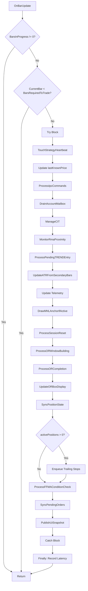

# EPIC-CCN-21: Architecture Plan

**Epic ID**: EPIC-CCN-21  
**Method**: `OnBarUpdate`  
**File**: `src/V12_002.BarUpdate.cs`  
**Current CYC**: 10  
**Target CYC**: ≤8  
**Status**: Phase 2 - Architecture Planning  
**Date**: 2026-06-09

---

## Extraction Strategy

### Overview
Extract 2 helper methods to reduce `OnBarUpdate` from CYC 10 to CYC 8. Each extraction removes one conditional branch, achieving Jane Street GODMODE threshold.

### Jane Street Principles Applied
- **Correctness by Construction**: Helper methods prevent invalid states through clear preconditions
- **Cognitive Simplicity**: Each helper has single, clear responsibility
- **Testability**: Each helper can be unit tested in isolation
- **Lock-Free**: No state mutations (pure orchestration)

---

## Ticket Breakdown

### Ticket 1: Extract Pending Entry Processing
**File**: `src/V12_002.BarUpdate.cs`  
**Target Method**: `OnBarUpdate`  
**CYC Reduction**: 10 → 9 (-1 point)

**Helper Method Signature**:
```csharp
/// <summary>
/// Processes pending TREND entry if armed.
/// Calculates stop distance, position size, and executes entry.
/// </summary>
private void ProcessPendingTRENDEntry()
{
    if (!pendingTRENDEntry)
        return;
    
    double trendDist = CalculateTRENDStopDistance();
    int trendContracts = CalculatePositionSize(trendDist);
    ExecuteTRENDEntry(trendContracts);
}
```

**Extraction Details**:
- **Lines to Extract**: 323-327
- **Preconditions**: None (guard inside helper)
- **Postconditions**: `pendingTRENDEntry` cleared by `ExecuteTRENDEntry`
- **Side Effects**: Order submission via `ExecuteTRENDEntry`
- **CYC**: 1 (single if-return guard)

**Call Site Change**:
```csharp
// BEFORE (lines 323-327)
if (pendingTRENDEntry)
{
    double trendDist = CalculateTRENDStopDistance();
    int trendContracts = CalculatePositionSize(trendDist);
    ExecuteTRENDEntry(trendContracts);
}

// AFTER (single line)
ProcessPendingTRENDEntry();
```

---

### Ticket 2: Extract FFMA Condition Check
**File**: `src/V12_002.BarUpdate.cs`  
**Target Method**: `OnBarUpdate`  
**CYC Reduction**: 9 → 8 (-1 point)

**Helper Method Signature**:
```csharp
/// <summary>
/// Checks FFMA conditions if mode is armed and enabled.
/// Triggers FFMA entry logic when conditions are met.
/// </summary>
private void ProcessFFMAConditionCheck()
{
    if (!isFFMAModeArmed || !FFMAEnabled)
        return;
    
    CheckFFMAConditions();
}
```

**Extraction Details**:
- **Lines to Extract**: 378-381
- **Preconditions**: None (guards inside helper)
- **Postconditions**: FFMA entry may be triggered
- **Side Effects**: Order submission via `CheckFFMAConditions`
- **CYC**: 2 (if with OR condition = 2 branches)

**Call Site Change**:
```csharp
// BEFORE (lines 378-381)
if (isFFMAModeArmed && FFMAEnabled)
{
    CheckFFMAConditions();
}

// AFTER (single line)
ProcessFFMAConditionCheck();
```

---

## Alternative Strategy (If Ticket 2 Insufficient)

### Ticket 2-ALT: Extract ATR Update Logic
**File**: `src/V12_002.BarUpdate.cs`  
**Target Method**: `OnBarUpdate`  
**CYC Reduction**: 9 → 8 (-1 point)

**Helper Method Signature**:
```csharp
/// <summary>
/// Updates ATR value from secondary 5-minute bars if available.
/// Requires BarsArray[1] to be initialized with sufficient data.
/// </summary>
private void UpdateATRFromSecondaryBars()
{
    if (BarsArray[1] == null || BarsArray[1].Count <= RMAATRPeriod)
        return;
    
    currentATR = atrIndicator[0];
}
```

**Extraction Details**:
- **Lines to Extract**: 330-333
- **Preconditions**: None (guards inside helper)
- **Postconditions**: `currentATR` updated
- **Side Effects**: Field mutation (thread-safe, single-threaded context)
- **CYC**: 2 (if with OR condition = 2 branches)

---

## Call Graph Analysis

### Before Extraction (CYC 10)
```
OnBarUpdate (CYC 10)
├─ BarsInProgress guard (+1)
├─ CurrentBar guard (+1)
├─ try-catch-finally (+1)
├─ pendingTRENDEntry check (+1) ← EXTRACT
├─ BarsArray[1] check (+1) ← EXTRACT (ALT)
├─ sessionCrossesMidnight check (+1)
├─ activePositions check (+1)
├─ isFFMAModeArmed check (+1) ← EXTRACT
└─ Helper calls (0)
    ├─ DrawMNLAnchorIfActive()
    ├─ ProcessSessionReset()
    ├─ ProcessORWindowBuilding()
    ├─ ProcessORCompletion()
    └─ UpdateORBoxDisplay()
```

### After Extraction (CYC 8)
```
OnBarUpdate (CYC 8)
├─ BarsInProgress guard (+1)
├─ CurrentBar guard (+1)
├─ try-catch-finally (+1)
├─ sessionCrossesMidnight check (+1)
├─ activePositions check (+1)
└─ Helper calls (0)
    ├─ DrawMNLAnchorIfActive()
    ├─ ProcessSessionReset()
    ├─ ProcessORWindowBuilding()
    ├─ ProcessORCompletion()
    ├─ UpdateORBoxDisplay()
    ├─ ProcessPendingTRENDEntry() ← NEW (CYC 1)
    └─ ProcessFFMAConditionCheck() ← NEW (CYC 2)
```

---

## Mermaid Diagrams

### Before: OnBarUpdate Flow (CYC 10)
```mermaid
graph TD
    A[OnBarUpdate] --> B{BarsInProgress != 0?}
    B -->|Yes| Z[Return]
    B -->|No| C{CurrentBar < BarsRequiredToTrade?}
    C -->|Yes| Z
    C -->|No| D[Try Block]
    D --> E[TouchStrategyHeartbeat]
    E --> F[Update lastKnownPrice]
    F --> G[ProcessIpcCommands]
    G --> H[DrainAccountMailbox]
    H --> I[ManageCIT]
    I --> J[MonitorRmaProximity]
    J --> K{pendingTRENDEntry?}
    K -->|Yes| L[Calculate & Execute TREND]
    K -->|No| M{BarsArray[1] valid?}
    M -->|Yes| N[Update currentATR]
    M -->|No| O[Update Telemetry]
    L --> O
    N --> O
    O --> P[DrawMNLAnchorIfActive]
    P --> Q[ProcessSessionReset]
    Q --> R[ProcessORWindowBuilding]
    R --> S[ProcessORCompletion]
    S --> T[UpdateORBoxDisplay]
    T --> U[SyncPositionState]
    U --> V{activePositions > 0?}
    V -->|Yes| W[Enqueue Trailing Stops]
    V -->|No| X{isFFMAModeArmed && FFMAEnabled?}
    W --> X
    X -->|Yes| Y[CheckFFMAConditions]
    X -->|No| AA[SyncPendingOrders]
    Y --> AA
    AA --> AB[PublishUiSnapshot]
    AB --> AC[Catch Block]
    AC --> AD[Finally: Record Latency]
    AD --> Z
```

### After: OnBarUpdate Flow (CYC 8)


---

## Verification Strategy

### Per-Ticket Verification
1. **Extract helper method** (copy-paste exact logic)
2. **Replace call site** (single line call)
3. **Run complexity audit**: `python scripts/complexity_audit.py`
4. **Verify CYC reduction**: Parent method CYC decreased by 1
5. **Run build**: `powershell -File .\scripts\build_readiness.ps1`
6. **Run deploy-sync**: `powershell -File .\deploy-sync.ps1`
7. **F5 verification**: BUILD_TAG appears in NinjaTrader output
8. **Update BUILD_TAG**: Increment in source file

### Epic Verification
1. **Final complexity audit**: Verify CYC ≤8 for all methods
2. **Full test suite**: All tests passing
3. **F5 verification**: Strategy loads without errors
4. **Manifest update**: Mark epic complete
5. **Roadmap update**: Update final_cyc to 8

---

## Success Criteria

### Ticket 1 Success
- [ ] `ProcessPendingTRENDEntry()` extracted (CYC 1)
- [ ] `OnBarUpdate` CYC reduced to 9
- [ ] Build passes
- [ ] Deploy-sync passes
- [ ] F5 verification passes
- [ ] BUILD_TAG updated

### Ticket 2 Success
- [ ] `ProcessFFMAConditionCheck()` extracted (CYC 2)
- [ ] `OnBarUpdate` CYC reduced to 8
- [ ] Build passes
- [ ] Deploy-sync passes
- [ ] F5 verification passes
- [ ] BUILD_TAG updated

### Epic Success
- [ ] `OnBarUpdate` CYC = 8 (Jane Street GODMODE)
- [ ] All extracted methods CYC ≤8
- [ ] Zero logic drift
- [ ] All tests passing
- [ ] All F5 verifications passed
- [ ] Manifest updated
- [ ] Roadmap updated

---

## Risk Mitigation

### Risk: Logic Drift
**Mitigation**: Use exact copy-paste, verify with diff tools

### Risk: Scope Creep
**Mitigation**: Strict adherence to extraction targets only

### Risk: Build Breakage
**Mitigation**: Run build after each extraction, rollback if needed

---

## Next Phase

**Phase 3**: DNA & PR Audit
- Run `droid /review` (focus on P0-P3 findings)
- Run `powershell -File .\scripts\verify_pr_hygiene.ps1`
- Verify complexity targets (CYC ≤8)
- Check Jane Street alignment

**Orchestrator**: Architecture plan complete. Ready to proceed to Phase 3?
