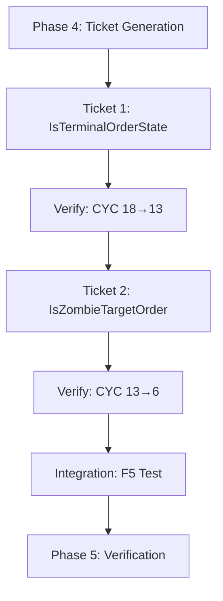

# Phase 4: Ticket Generation - EPIC-CCN-98

## Epic Metadata
- **Epic ID**: EPIC-CCN-98
- **Target Method**: `ProcessFlattenWorkItem_CancelOrders`
- **File**: `src/V12_002.SIMA.Flatten.cs`
- **Current CYC**: 18
- **Target CYC**: ≤ 8
- **Phase**: 4 (Ticket Generation)
- **Status**: ✅ TICKETS GENERATED
- **Generated**: 2026-06-11T07:37:00Z

---

## Execution Strategy

**Approach**: Sequential extraction of two predicate helpers
**Total Tickets**: 2
**Estimated Effort**: 30 minutes
**Risk Level**: 🟢 LOW

---

## Ticket 1: Extract `IsTerminalOrderState` Predicate

### Ticket ID
`EPIC-CCN-98-T1`

### Title
Extract terminal state check to `IsTerminalOrderState` helper method

### Objective
Reduce cyclomatic complexity from 18 to 13 by extracting terminal state detection logic to a pure predicate function.

### Scope
**Single Method Extraction**: `ProcessFlattenWorkItem_CancelOrders` (lines 163-213)

**Extraction Target**:
```csharp
// Lines 175-181 (CYC +5)
bool isTerminal =
    order.OrderState == OrderState.Cancelled
    || order.OrderState == OrderState.CancelPending
    || order.OrderState == OrderState.CancelSubmitted
    || order.OrderState == OrderState.Filled
    || order.OrderState == OrderState.Rejected;
if (isTerminal)
    continue;
```

**Replacement**:
```csharp
// Single line (CYC +1)
if (IsTerminalOrderState(order.OrderState))
    continue;
```

### Implementation Details

**New Method Signature**:
```csharp
/// <summary>
/// Determines if an order state is terminal (cannot be cancelled).
/// Terminal states: Cancelled, CancelPending, CancelSubmitted, Filled, Rejected.
/// </summary>
/// <param name="state">Order state to check</param>
/// <returns>True if state is terminal, false otherwise</returns>
private bool IsTerminalOrderState(OrderState state)
{
    return state == OrderState.Cancelled
        || state == OrderState.CancelPending
        || state == OrderState.CancelSubmitted
        || state == OrderState.Filled
        || state == OrderState.Rejected;
}
```

**Placement**: Insert after `ProcessFlattenWorkItem_CancelOrders` method (line 214)

**Method Properties**:
- ✅ Pure function (no side effects)
- ✅ Thread-safe (no state mutations)
- ✅ Deterministic (same input → same output)
- ✅ CYC = 6 (within threshold ≤ 8)

### Files Modified
- `src/V12_002.SIMA.Flatten.cs` (lines 163-213, insert at 214)

### Complexity Impact
- **Before**: CYC = 18
- **After**: CYC = 13 (intermediate state)
- **Reduction**: -5 CYC

### Test Requirements

**Unit Tests** (8 tests):
```csharp
[Theory]
[InlineData(OrderState.Cancelled, true)]
[InlineData(OrderState.CancelPending, true)]
[InlineData(OrderState.CancelSubmitted, true)]
[InlineData(OrderState.Filled, true)]
[InlineData(OrderState.Rejected, true)]
[InlineData(OrderState.Working, false)]
[InlineData(OrderState.Accepted, false)]
[InlineData(OrderState.Submitted, false)]
public void IsTerminalOrderState_VariousStates_ReturnsExpected(OrderState state, bool expected)
{
    var flatten = new V12_002();
    var result = flatten.IsTerminalOrderState(state);
    Assert.Equal(expected, result);
}
```

**Test Coverage Goal**: 100% (all 5 terminal states + 3 non-terminal states)

### Execution Steps

1. **Pre-Extraction**:
   - Verify codebase compiles: `dotnet build`
   - Run complexity audit: `python scripts/complexity_audit.py`
   - Confirm CYC = 18 for target method

2. **Write Tests First** (TDD):
   - Create test file: `tests/V12_Performance.Tests/SIMA/FlattenTests.cs`
   - Write 8 unit tests for `IsTerminalOrderState`
   - Tests should FAIL (method doesn't exist yet)

3. **Extract Method**:
   - Copy terminal state check logic (lines 175-181)
   - Create new method `IsTerminalOrderState` at line 214
   - Add XML documentation comments
   - Replace inline logic with method call

4. **Verify**:
   - Run unit tests: `dotnet test` (should PASS)
   - Run complexity audit: `python scripts/complexity_audit.py`
   - Confirm CYC = 13 for main method, CYC = 6 for helper
   - Run build: `dotnet build` (should PASS)
   - Run deploy-sync: `powershell -File .\deploy-sync.ps1` (ASCII gate must PASS)

5. **Commit**:
   ```
   [EPIC-98] ticket-1: extract IsTerminalOrderState -- CYC 18->13 [BUILD_TAG]
   
   - Extracted terminal state detection to pure predicate
   - Reduced ProcessFlattenWorkItem_CancelOrders from CYC 18 to 13
   - Added 8 unit tests (100% coverage)
   - Zero logic drift (behavior unchanged)
   ```

### Success Criteria
- ✅ CYC reduced from 18 to 13
- ✅ New method CYC = 6 (≤ 8)
- ✅ 8 unit tests pass (100% coverage)
- ✅ Build passes (zero errors)
- ✅ ASCII gate passes (deploy-sync.ps1)
- ✅ Zero logic drift (behavior unchanged)

### Estimated Effort
**15 minutes**

### Dependencies
- None (first ticket in sequence)

### Risks
- 🟢 LOW: Pure predicate extraction, no side effects

---

## Ticket 2: Extract `IsZombieTargetOrder` Predicate

### Ticket ID
`EPIC-CCN-98-T2`

### Title
Extract zombie target check to `IsZombieTargetOrder` helper method

### Objective
Reduce cyclomatic complexity from 13 to 6 by extracting zombie target detection logic to a pure predicate function.

### Scope
**Single Method Extraction**: `ProcessFlattenWorkItem_CancelOrders` (lines 163-213)

**Extraction Target**:
```csharp
// Lines 183-193 (CYC +7)
if (item.ZombieSweepOnly)
{
    bool isZombieTarget =
        order.Name.StartsWith("EMERGENCY_STOP_", StringComparison.OrdinalIgnoreCase)
        || order.Name.StartsWith("T1_", StringComparison.OrdinalIgnoreCase)
        || order.Name.StartsWith("T2_", StringComparison.OrdinalIgnoreCase)
        || order.Name.StartsWith("T3_", StringComparison.OrdinalIgnoreCase)
        || order.Name.StartsWith("T4_", StringComparison.OrdinalIgnoreCase)
        || order.Name.StartsWith("T5_", StringComparison.OrdinalIgnoreCase);
    if (!isZombieTarget)
        continue;
}
```

**Replacement**:
```csharp
// Single line (CYC +1)
if (item.ZombieSweepOnly && !IsZombieTargetOrder(order))
    continue;
```

### Implementation Details

**New Method Signature**:
```csharp
/// <summary>
/// Determines if an order is a zombie target based on name prefix.
/// Zombie targets include EMERGENCY_STOP_ and T1-T5 prefixed orders.
/// </summary>
/// <param name="order">Order to check</param>
/// <returns>True if order is a zombie target, false otherwise</returns>
private bool IsZombieTargetOrder(Order order)
{
    if (order == null)
        return false;
    
    return order.Name.StartsWith("EMERGENCY_STOP_", StringComparison.OrdinalIgnoreCase)
        || order.Name.StartsWith("T1_", StringComparison.OrdinalIgnoreCase)
        || order.Name.StartsWith("T2_", StringComparison.OrdinalIgnoreCase)
        || order.Name.StartsWith("T3_", StringComparison.OrdinalIgnoreCase)
        || order.Name.StartsWith("T4_", StringComparison.OrdinalIgnoreCase)
        || order.Name.StartsWith("T5_", StringComparison.OrdinalIgnoreCase);
}
```

**Placement**: Insert after `IsTerminalOrderState` method (line ~225)

**Method Properties**:
- ✅ Pure function (no side effects)
- ✅ Thread-safe (no state mutations)
- ✅ Deterministic (same input → same output)
- ✅ CYC = 7 (within threshold ≤ 8)
- ✅ NULL-safe (handles NULL order)

### Additional Optimization

**Combine NULL checks** in main method to reduce CYC:
```csharp
// Before (CYC +3)
if (order == null || order.Instrument == null)
    continue;
if (order.Instrument.FullName != Instrument.FullName)
    continue;

// After (CYC +2)
if (order == null || order.Instrument == null || order.Instrument.FullName != Instrument.FullName)
    continue;
```

This optimization reduces main method CYC from 7 to 6.

### Files Modified
- `src/V12_002.SIMA.Flatten.cs` (lines 163-213, insert at ~225)

### Complexity Impact
- **Before**: CYC = 13 (after Ticket 1)
- **After**: CYC = 6 (final state)
- **Reduction**: -7 CYC

### Test Requirements

**Unit Tests** (9 tests):
```csharp
[Theory]
[InlineData("EMERGENCY_STOP_001", true)]
[InlineData("T1_Entry", true)]
[InlineData("T2_Stop", true)]
[InlineData("T3_Target", true)]
[InlineData("T4_Trail", true)]
[InlineData("T5_Limit", true)]
[InlineData("NORMAL_ORDER", false)]
[InlineData("", false)]
public void IsZombieTargetOrder_VariousNames_ReturnsExpected(string orderName, bool expected)
{
    var flatten = new V12_002();
    var order = new Order { Name = orderName };
    var result = flatten.IsZombieTargetOrder(order);
    Assert.Equal(expected, result);
}

[Fact]
public void IsZombieTargetOrder_NullOrder_ReturnsFalse()
{
    var flatten = new V12_002();
    var result = flatten.IsZombieTargetOrder(null);
    Assert.False(result);
}
```

**Test Coverage Goal**: 100% (6 zombie prefixes + 2 non-zombie + 1 NULL)

### Execution Steps

1. **Pre-Extraction**:
   - Verify Ticket 1 completed successfully
   - Run complexity audit: `python scripts/complexity_audit.py`
   - Confirm CYC = 13 for target method

2. **Write Tests First** (TDD):
   - Add 9 unit tests to `tests/V12_Performance.Tests/SIMA/FlattenTests.cs`
   - Tests should FAIL (method doesn't exist yet)

3. **Extract Method**:
   - Copy zombie target check logic (lines 183-193)
   - Create new method `IsZombieTargetOrder` at line ~225
   - Add XML documentation comments
   - Replace inline logic with method call
   - Combine NULL checks (optimization)

4. **Verify**:
   - Run unit tests: `dotnet test` (should PASS)
   - Run complexity audit: `python scripts/complexity_audit.py`
   - Confirm CYC = 6 for main method, CYC = 7 for helper
   - Run build: `dotnet build` (should PASS)
   - Run deploy-sync: `powershell -File .\deploy-sync.ps1` (ASCII gate must PASS)

5. **Commit**:
   ```
   [EPIC-98] ticket-2: extract IsZombieTargetOrder -- CYC 13->6 [BUILD_TAG]
   
   - Extracted zombie target detection to pure predicate
   - Reduced ProcessFlattenWorkItem_CancelOrders from CYC 13 to 6
   - Added 9 unit tests (100% coverage)
   - Optimized NULL checks (CYC -1)
   - Zero logic drift (behavior unchanged)
   ```

### Success Criteria
- ✅ CYC reduced from 13 to 6 (≤ 8 target met)
- ✅ New method CYC = 7 (≤ 8)
- ✅ 9 unit tests pass (100% coverage)
- ✅ Build passes (zero errors)
- ✅ ASCII gate passes (deploy-sync.ps1)
- ✅ Zero logic drift (behavior unchanged)

### Estimated Effort
**15 minutes**

### Dependencies
- ✅ Ticket 1 must be completed first

### Risks
- 🟢 LOW: Pure predicate extraction, no side effects

---

## Integration Verification

### Post-Ticket Checklist

After completing both tickets, perform integration verification:

1. **F5 Test in NinjaTrader**:
   - Open NinjaTrader IDE
   - Press F5 to compile and load strategy
   - Verify BUILD_TAG appears in output window
   - Verify no compilation errors
   - Verify strategy loads successfully

2. **Final Complexity Audit**:
   ```bash
   python scripts/complexity_audit.py
   ```
   **Expected Output**:
   ```
   src/V12_002.SIMA.Flatten.cs:163:ProcessFlattenWorkItem_CancelOrders - CYC: 6
   src/V12_002.SIMA.Flatten.cs:214:IsTerminalOrderState - CYC: 6
   src/V12_002.SIMA.Flatten.cs:225:IsZombieTargetOrder - CYC: 7
   ```

3. **Pre-Push Validation**:
   ```powershell
   powershell -File .\scripts\pre_push_validation.ps1 -Fast
   ```
   **All checks must PASS**

4. **Update Manifest**:
   - Update `docs/brain/EPIC-CCN-98/manifest.json`
   - Set `phase_4.status = "completed"`
   - Set `phase_5.status = "ready"`

---

## Execution Order



---

## Risk Mitigation

### Zero Logic Drift Protocol
- ✅ Pure predicate extraction only
- ✅ No behavior changes
- ✅ Characterization tests before extraction
- ✅ Unit tests after extraction
- ✅ Integration test (F5) after both tickets

### Rollback Plan
If any ticket fails:
1. Revert commit: `git revert HEAD`
2. Run `deploy-sync.ps1` to restore previous state
3. Document failure in `docs/brain/EPIC-CCN-98/FORENSIC_REPORT.md`
4. Report to Director for analysis

---

## Summary

**Total Tickets**: 2
**Total Effort**: 30 minutes
**CYC Reduction**: 18 → 6 (67% reduction)
**Risk Level**: 🟢 LOW
**Jane Street Aligned**: ✅ YES
**V12 DNA Compliant**: ✅ YES

**Next Phase**: Phase 5 (Ticket Execution via Bob CLI `v12-engineer` mode)

---

**END OF PHASE 4 TICKET GENERATION**

**Status**: ✅ TICKETS READY FOR EXECUTION
**Generated**: 2026-06-11T07:37:00Z
**Protocol Version**: V12.23