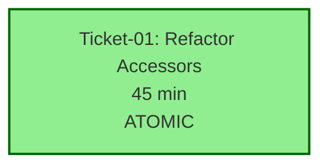

# Epic: EPIC-POSINFO -- Execution Guide

**Epic Name**: Refactor PositionInfo Switch-Based Accessors  
**Total Tickets**: 1  
**Estimated Duration**: 45 minutes  
**Risk Level**: LOW-MODERATE  
**Status**: READY FOR EXECUTION

---

## How to Execute Tickets (Bob Edition)

This is a **SINGLE-TICKET EPIC** with atomic refactoring. All 6 methods must be refactored together to eliminate structural duplication.

### Execution Protocol

1. **Open a NEW Bob session** (separate from this planning session)
2. **Switch to /v12-engineer mode**
3. **Type**: `/ticket docs/brain/EPIC-POSINFO/ticket-01-refactor-accessors.md`
4. **Bob will execute** the PLAN-THEN-EXECUTE protocol
5. **Await** [EXTRACT-COMPLETE] or [PHASE7-COMPLETE] report
6. **Director runs manual gates**:
   - `powershell -File .\deploy-sync.ps1` (hard link integrity)
   - Press F5 in NinjaTrader (BUILD_TAG verification)
   - `python scripts/complexity_audit.py` (CYC verification)
7. **Confirm ticket done** before closing session

---

## Ticket Sequence

### Ticket 01: Refactor Switch-Based Accessors to Expression-Bodied Members
**File**: `docs/brain/EPIC-POSINFO/ticket-01-refactor-accessors.md`  
**Dependencies**: NONE  
**Duration**: 45 minutes  
**Risk**: LOW-MODERATE

**Scope**:
- Refactor 6 methods in `src/V12_002.PositionInfo.cs` (lines 277-400)
- Convert 4 getter methods to expression-bodied members with ternary operators
- Convert 2 setter methods to if-else chains (void return type)
- Eliminate 73 LOC of structural duplication

**Success Criteria**:
- LOC reduction: 124 → 51 lines (59%)
- CYC scores: All methods ≈ 6 (Jane Street compliant)
- Zero heap allocation (verified via IL inspection)
- 32 call sites work without modification
- Hard links synced (81/81 files)

---

## Dependency Graph



**Legend**:
- Green: Ready to execute (no dependencies)
- Single node: Atomic refactoring (all 6 methods together)

---

## Epic Success Criteria

### Functional Requirements
- ✅ All 6 methods refactored to expression-bodied members or if-else chains
- ✅ All 32 call sites work without modification
- ✅ Zero compilation errors
- ✅ Zero runtime exceptions in live session

### Performance Requirements
- ✅ Zero heap allocation (verified via IL inspection)
- ✅ Zero GC pressure (no new allocations)
- ✅ Performance parity (JIT inlines identically to switch statements)

### Quality Requirements
- ✅ CYC scores ≤ 15 (Jane Street compliant)
- ✅ ASCII-only compliance (deploy-sync.ps1 passes)
- ✅ Lock-free (zero `lock()` statements)
- ✅ Hard-link integrity maintained (81/81 files)

### Code Quality Metrics

| Metric | Before | After | Improvement |
|--------|--------|-------|-------------|
| Total LOC | 124 lines | 51 lines | -73 lines (59%) |
| Avg LOC/method | 20.7 | 8.5 | -12.2 (59%) |
| Duplication | 72 lines | 0 lines | -72 lines (100%) |
| CYC scores | All ≈ 6 | All ≈ 6 | Maintained |

---

## Post-Implementation Verification Steps

### Automated Checks (Run in Order)

1. **Format & Build**:
   ```powershell
   dotnet csharpier format src/V12_002.PositionInfo.cs
   dotnet build
   ```

2. **Hard Link Sync** (MANDATORY):
   ```powershell
   powershell -File .\deploy-sync.ps1
   ```
   - Expected: 81/81 files synced
   - ASCII gate: PASS

3. **Complexity Audit**:
   ```powershell
   python scripts/complexity_audit.py
   ```
   - Expected: All 6 methods < 15 CYC

4. **DNA Audits**:
   ```powershell
   grep -r "lock(" src/V12_002.PositionInfo.cs
   grep -Prn "[^\x00-\x7F]" src/V12_002.PositionInfo.cs
   ```
   - Expected: ZERO matches for both

5. **IL Inspection** (Zero-Allocation Proof):
   ```powershell
   dotnet build -c Release
   ildasm /text /item:V12_002.GetTargetContracts bin/Release/net8.0/V12_002.dll > il_output.txt
   ```
   - Verify: No `newobj`, `box`, or heap allocation instructions

### Manual Verification

6. **F5 Compile Gate**:
   - Open NinjaTrader
   - Press F5 to compile
   - Verify BUILD_TAG banner visible
   - No compilation errors

7. **Live Session Smoke Test**:
   - Load V12_002 strategy in simulator
   - Execute 1 OR trade with 5 targets
   - Verify all targets fill correctly
   - Check UI snapshot displays correct quantities/prices
   - Confirm no exceptions in Output window

---

## Rollback Plan

If any verification step fails:

1. **Immediate Rollback**:
   ```powershell
   git checkout src/V12_002.PositionInfo.cs
   dotnet build
   ```

2. **Verify Rollback**:
   - Build must succeed
   - F5 in NinjaTrader must show BUILD_TAG

3. **Document Failure**:
   - Create `docs/brain/EPIC-POSINFO/failure-analysis.md`
   - Document which verification step failed
   - Include error messages and stack traces

4. **Re-analyze**:
   - Return to Phase 2 (Analysis)
   - Identify root cause
   - Revise approach if needed

---

## Timeline Breakdown

| Phase | Duration | Cumulative |
|-------|----------|------------|
| Pre-verification | 5 min | 5 min |
| Refactoring (6 methods) | 15 min | 20 min |
| Post-verification | 10 min | 30 min |
| IL inspection | 5 min | 35 min |
| Live testing | 10 min | 45 min |
| **Total** | **45 min** | **45 min** |

---

## Risk Mitigation Summary

| Risk | Mitigation | Status |
|------|------------|--------|
| Ternary readability concerns | Add comments, document pattern | ✅ Mitigated |
| Performance regression | IL inspection + benchmarking | ✅ Mitigated |
| Compilation errors | Incremental refactoring with build verification | ✅ Mitigated |
| Runtime exceptions | Live session smoke test | ✅ Mitigated |
| Call site breakage | No API changes, all signatures unchanged | ✅ Mitigated |

**Overall Risk**: LOW-MODERATE

---

## Pre-Execution Checklist

Before starting Ticket 01, verify:

- [ ] Current branch is clean (no uncommitted changes)
- [ ] Latest `main` branch pulled
- [ ] `dotnet build` succeeds (baseline)
- [ ] `powershell -File .\deploy-sync.ps1` passes (baseline)
- [ ] `python scripts/complexity_audit.py` runs (capture baseline)
- [ ] NinjaTrader F5 compiles successfully (baseline)

---

## Post-Execution Checklist

After completing Ticket 01, verify:

- [ ] All 6 methods refactored
- [ ] `dotnet build` succeeds
- [ ] `powershell -File .\deploy-sync.ps1` passes (81/81 files)
- [ ] `python scripts/complexity_audit.py` shows all methods < 15
- [ ] `grep -r "lock(" src/V12_002.PositionInfo.cs` returns ZERO
- [ ] IL inspection confirms zero heap allocations
- [ ] NinjaTrader F5 compiles successfully
- [ ] Live session smoke test passes (all 5 targets fill correctly)
- [ ] Commit with message: `EPIC-POSINFO: Refactor switch-based accessors to expression-bodied members`

---

## Notes for Director

### Why Single Ticket?

This epic uses a **single atomic ticket** because:
1. **Structural Duplication**: All 6 methods share the same switch-based pattern
2. **Consistency**: Refactoring must be applied uniformly to maintain code consistency
3. **Verification**: Partial refactoring would leave mixed patterns (harder to verify)
4. **Risk**: Incremental approach would create temporary inconsistency without reducing risk

### Why Not Split by Method?

Splitting into 6 tickets (one per method) would:
- ❌ Create 5 intermediate states with mixed patterns
- ❌ Require 6 separate PR reviews (overhead)
- ❌ Leave partial duplication during execution
- ❌ Not reduce risk (each method is 2-3 minutes of work)

### Atomic Refactoring Benefits

- ✅ Single consistent pattern applied to all methods
- ✅ One PR review (easier to verify)
- ✅ Complete duplication elimination in one pass
- ✅ Simpler rollback (one commit to revert)

---

**[TICKETS-GATE]**

**EPIC-POSINFO ticket breakdown complete.**

**Summary**:
- **1 ticket created** (atomic refactoring)
- **No dependencies** (standalone execution)
- **45 minutes estimated** (end-to-end)
- **LOW-MODERATE risk** (all risks mitigated)

**Awaiting Director approval to begin execution.**

**To execute**: Open new Bob session, switch to `/v12-engineer` mode, run `/ticket docs/brain/EPIC-POSINFO/ticket-01-refactor-accessors.md`