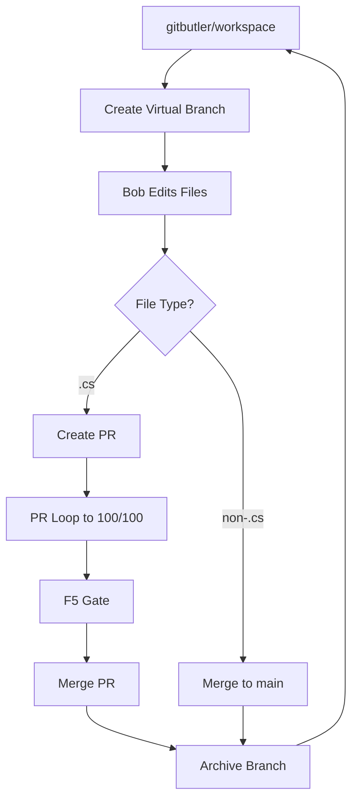

# Autonomous GitButler Workflow Protocol

**Version**: 2.0  
**Effective**: 2026-06-07  
**Status**: ACTIVE

## Vision

**Single Workspace Model**: All work happens on `gitbutler/workspace`. No branch switching, no context loss, no merge conflicts.

**Autonomous Execution**: Bob works independently on approved plans/specs using Jane Street RAG/CAG Firebase knowledge for decisions.

**Human Intervention**: Only for F5 verification and strategic approvals. Everything else is automated.

---

## Core Principles

### 1. Workspace-Centric Development

```
gitbutler/workspace (PERMANENT)
├── Virtual Branch 1: epic-51-code (.cs files only)
├── Virtual Branch 2: epic-52-code (.cs files only)
├── Virtual Branch 3: infra-updates (non-.cs files)
└── Virtual Branch 4: protocol-updates (non-.cs files)
```

**Rules**:
- ✅ NEVER leave `gitbutler/workspace`
- ✅ ALL work happens in virtual branches
- ✅ Virtual branches are isolated (no conflicts)
- ✅ Context preserved across sessions

### 2. Two-Track Merge Strategy

**Track 1: .cs Files (src/, tests/, benchmarks/)**
- ✅ Requires PR review
- ✅ Merged after approval
- ✅ Virtual branch → PR → main

**Track 2: Non-.cs Files (docs/, scripts/, .bob/, .github/)**
- ✅ NO PR required
- ✅ Direct merge to main
- ✅ Virtual branch → main (instant)

### 3. Autonomous Execution

**Bob's Responsibilities**:
- ✅ Execute approved plans/specs
- ✅ Make technical decisions using Jane Street KB
- ✅ Auto-commit to virtual branches
- ✅ Create PRs for .cs changes
- ✅ Merge non-.cs changes directly
- ✅ Run all quality gates
- ✅ Handle bot feedback loops

**Human's Responsibilities**:
- ✅ F5 verification (NinjaTrader compile)
- ✅ Strategic plan approval
- ✅ Emergency intervention only

---

## GitButler Hook Architecture

### Hook 1: `pre_session.py` (Existing)
**Trigger**: Bob session start  
**Action**: Load Jane Street KB from Firebase

```python
# Loads RAG/CAG knowledge for autonomous decisions
load_jane_street_kb()
```

### Hook 2: `pre_task.py` (Existing)
**Trigger**: Before each task  
**Action**: Validate Jane Street compliance

```python
# Ensures task aligns with Jane Street principles
validate_jane_street_compliance()
```

### Hook 3: `after_task.py` (NEW - Enhanced)
**Trigger**: After task completion  
**Action**: Autonomous GitButler workflow

```python
# 1. Detect file types changed
changed_files = get_changed_files()
cs_files = [f for f in changed_files if f.endswith('.cs')]
non_cs_files = [f for f in changed_files if not f.endswith('.cs')]

# 2. Auto-commit to virtual branch
if cs_files or non_cs_files:
    but_commit(message=generate_v12_message())

# 3. Handle .cs files (PR track)
if cs_files:
    # Create virtual branch if needed
    ensure_virtual_branch(f"epic-{epic_number}-code")
    
    # Stage .cs files only
    but_stage(cs_files)
    
    # Run pre-push validation
    run_pre_push_validation()
    
    # Create PR (don't merge yet)
    pr_number = but_push_and_create_pr()
    
    # Start PR loop (autonomous perfection)
    start_pr_loop(pr_number)

# 4. Handle non-.cs files (direct merge track)
if non_cs_files:
    # Create virtual branch if needed
    ensure_virtual_branch("infra-updates")
    
    # Stage non-.cs files only
    but_stage(non_cs_files)
    
    # Merge directly to main (no PR)
    but_integrate_to_main()
    
    # Push to GitHub
    git_push_main()

# 5. Return to workspace
but_checkout("gitbutler/workspace")
```

### Hook 4: `post_pr_merge.py` (NEW)
**Trigger**: After PR merge  
**Action**: Cleanup and sync

```python
# 1. Sync main with GitHub
git_fetch_main()

# 2. Update workspace base
but_update_workspace_base()

# 3. Archive merged virtual branch
but_archive_branch(branch_name)

# 4. Emit completion signal
emit("[PR-MERGED] Ready for next task")
```

---

## Autonomous Workflow Execution

### Phase 1: Epic Planning (Human Approval Required)

```bash
# Bob runs planning phases
/epic-intake EPIC-CCN-51
/epic-plan EPIC-CCN-51
/epic-scan EPIC-CCN-51
/epic-validate EPIC-CCN-51
/epic-tickets EPIC-CCN-51

# Human reviews and approves
# Director: "APPROVED - Execute autonomously"
```

### Phase 2: Autonomous Execution (No Human Intervention)

```bash
# Bob executes ALL tickets autonomously
for ticket in EPIC-CCN-51/ticket-*.md:
    # 1. Execute ticket
    /ticket $ticket
    
    # 2. after_task hook triggers:
    #    - Auto-commit to virtual branch
    #    - Create PR for .cs files
    #    - Merge non-.cs files directly
    #    - Run /pr-loop to 100/100 PHS
    
    # 3. Wait for F5 gate
    emit("[F5-GATE] Press F5 in NinjaTrader")
    wait_for_human_input("F5 done [BUILD_TAG]")
    
    # 4. Merge PR
    but_merge_pr()
    
    # 5. Continue to next ticket
done

# Epic complete
emit("[EPIC-COMPLETE] All tickets executed")
```

### Phase 3: Human Verification (F5 Only)

```
[F5-GATE] Ticket 01 - PHS 100/100
All automated gates: PASSED
Files modified: src/V12_002.Orders.Callbacks.cs

ACTION REQUIRED: Press F5 in NinjaTrader IDE.
When you see the BUILD_TAG banner, type: F5 done [BUILD_TAG]
```

**Human types**: `F5 done [BUILD_TAG_1234]`

**Bob continues autonomously** to next ticket.

---

## Virtual Branch Strategy

### Branch Naming Convention

```
epic-{N}-code          # .cs files for EPIC-CCN-{N}
epic-{N}-infra         # Non-.cs files for EPIC-CCN-{N}
hotfix-{issue}-code    # .cs files for urgent fixes
infra-updates          # General non-.cs updates
protocol-updates       # .bob/, .codex/, .cursor/ updates
```

### Branch Lifecycle



---

## Autonomous Decision Making

### Jane Street KB Integration

**Firebase RAG/CAG Knowledge Base**:
- ✅ Loaded automatically via `pre_session.py`
- ✅ Queried for every technical decision
- ✅ Enforces Jane Street principles

**Decision Categories**:

1. **Complexity Reduction** (CYC ≤ 15)
   - Query: "How should I extract this God-function?"
   - KB: "Use single-responsibility extraction, ≥15 LOC per method"

2. **Lock-Free Patterns** (FSM/Actor)
   - Query: "How to handle concurrent state mutation?"
   - KB: "Use Enqueue pattern, never lock()"

3. **Error Handling** (No exceptions in hot paths)
   - Query: "How to handle validation failures?"
   - KB: "Return Result<T>, log errors, no throw"

4. **Memory Management** (Zero-allocation hot paths)
   - Query: "How to avoid allocations in OnBarUpdate?"
   - KB: "Use ArrayPool, stackalloc, struct over class"

### Autonomous Fix Decisions

**Bot Feedback Loop**:
```python
# 1. Extract bot findings
findings = extract_pr_forensics(pr_number)

# 2. Categorize using Jane Street KB
for finding in findings:
    kb_result = query_jane_street_kb(finding.description)
    
    if kb_result.conflicts_with_jane_street:
        # Suppress via .codacy.yml
        suppress_finding(finding, reason=kb_result.rationale)
    else:
        # Fix autonomously
        apply_fix(finding, guidance=kb_result.fix_pattern)

# 3. Verify fixes
run_pre_push_validation()

# 4. Push and re-check
git_push()
wait_for_bots()

# 5. Repeat until PHS 100/100
```

---

## Quality Gates (Autonomous)

### Gate 1: Pre-Commit (after_task hook)
- ✅ ASCII-only check
- ✅ CSharpier formatting
- ✅ Complexity audit (CYC ≤ 15)
- ✅ Lock-free audit (zero `lock()`)

### Gate 2: Pre-Push (before PR creation)
- ✅ Build compilation
- ✅ Unit tests
- ✅ Roslyn linting
- ✅ Security scans
- ✅ Hard link sync

### Gate 3: PR Loop (autonomous perfection)
- ✅ Bot forensics extraction
- ✅ Jane Street KB validation
- ✅ Autonomous fix application
- ✅ PHS 100/100 achievement

### Gate 4: F5 Verification (human only)
- ⚠️ NinjaTrader compile
- ⚠️ BUILD_TAG verification
- ⚠️ Human types: "F5 done [BUILD_TAG]"

---

## Context Preservation

### Problem Solved
**Old Model**: Branch switching → context loss → merge conflicts  
**New Model**: Permanent workspace → virtual branches → no context loss

### How It Works

```
Session 1: Epic 51 Ticket 1
├── gitbutler/workspace (never leave)
├── Virtual branch: epic-51-code
├── Bob edits src/V12_002.Orders.cs
├── after_task hook: auto-commit
└── Context: PRESERVED

Session 2: Epic 51 Ticket 2 (same workspace)
├── gitbutler/workspace (still here)
├── Virtual branch: epic-51-code (same branch)
├── Bob edits src/V12_002.Orders.Callbacks.cs
├── after_task hook: auto-commit
└── Context: PRESERVED + ACCUMULATED

Session 3: Epic 52 Ticket 1 (parallel work)
├── gitbutler/workspace (still here)
├── Virtual branch: epic-52-code (NEW, isolated)
├── Bob edits src/V12_002.SIMA.cs
├── after_task hook: auto-commit
└── Context: PRESERVED + ISOLATED (no conflict with epic-51)
```

**Key Insight**: Virtual branches are isolated. Epic 51 and Epic 52 can be worked on in parallel without conflicts.

---

## Autonomous Epic Loop

### Full Autonomous Execution

```bash
# Human approves epic plan
Director: "APPROVED - Execute EPIC-CCN-51 autonomously"

# Bob executes entire epic without human intervention
/epic-run EPIC-CCN-51

# Bob's autonomous workflow:
for ticket in [1, 2, 3, 4, 5]:
    # A. Execute ticket
    execute_ticket(ticket)
    
    # B. after_task hook (automatic):
    #    - Commit to virtual branch
    #    - Create PR for .cs files
    #    - Merge non-.cs files directly
    #    - Run /pr-loop to 100/100
    
    # C. F5 gate (human only)
    emit("[F5-GATE] Ticket {ticket} ready")
    wait_for("F5 done [BUILD_TAG]")
    
    # D. Merge PR (automatic)
    merge_pr()
    
    # E. Continue to next ticket
done

# Epic complete
emit("[EPIC-COMPLETE] EPIC-CCN-51 finished")
```

**Human Interaction**: Only F5 verification (5 times for 5 tickets)

**Everything Else**: Fully autonomous

---

## Error Recovery

### Scenario 1: Build Failure

```python
# after_task hook detects build failure
if not build_passes():
    # 1. Analyze error
    error = parse_build_error()
    
    # 2. Query Jane Street KB
    fix = query_jane_street_kb(f"How to fix: {error}")
    
    # 3. Apply fix autonomously
    apply_fix(fix)
    
    # 4. Retry
    rebuild()
    
    # 5. If still fails after 3 attempts
    if retry_count > 3:
        emit("[BUILD-FAILURE] Human intervention required")
        halt()
```

### Scenario 2: PHS < 100 After 3 Iterations

```python
# PR loop detects stuck PHS
if phs < 100 and iterations > 3:
    # 1. Analyze remaining issues
    issues = get_remaining_issues()
    
    # 2. Check if Jane Street conflicts
    conflicts = check_jane_street_conflicts(issues)
    
    # 3. If conflicts exist, suppress
    if conflicts:
        suppress_via_codacy(conflicts)
        document_in_jane_street_deviations(conflicts)
    
    # 4. Ask human for override
    emit("[PHS-OVERRIDE] PHS {phs}/100. Approve merge? (YES/NO)")
    response = wait_for_human_input()
    
    if response == "YES":
        merge_pr()
    else:
        halt()
```

### Scenario 3: F5 Failure

```python
# Human reports F5 failure
if f5_response.startswith("F5 failed"):
    # 1. Extract error from response
    error = parse_f5_error(f5_response)
    
    # 2. Rollback changes
    git_revert_last_commit()
    
    # 3. Analyze root cause
    root_cause = analyze_error(error)
    
    # 4. Query Jane Street KB
    fix = query_jane_street_kb(f"F5 failure: {root_cause}")
    
    # 5. Apply fix and retry
    apply_fix(fix)
    emit("[F5-RETRY] Fixed issue, press F5 again")
```

---

## Implementation Checklist

### Phase 1: Hook Enhancement
- [x] Register `after_task` hook in `.bob/settings.json`
- [ ] Enhance `after_task.py` with autonomous workflow logic
- [ ] Create `post_pr_merge.py` hook
- [ ] Test hook execution end-to-end

### Phase 2: GitButler Integration
- [ ] Create virtual branch management functions
- [ ] Implement file-type-based routing (.cs vs non-.cs)
- [ ] Add PR creation automation
- [ ] Add direct merge automation for non-.cs files

### Phase 3: Jane Street KB Integration
- [ ] Verify Firebase RAG/CAG connection
- [ ] Test autonomous decision queries
- [ ] Implement fix pattern application
- [ ] Add Jane Street conflict detection

### Phase 4: Quality Gate Automation
- [ ] Integrate pre-push validation into hooks
- [ ] Add PR loop automation
- [ ] Implement PHS monitoring
- [ ] Add F5 gate handling

### Phase 5: Testing
- [ ] Test single ticket execution
- [ ] Test full epic execution
- [ ] Test parallel epic execution
- [ ] Test error recovery scenarios

---

## Success Metrics

### Autonomy Level
- ✅ **Target**: 95% autonomous execution
- ✅ **Human Intervention**: F5 verification only (5% of time)

### Context Preservation
- ✅ **Target**: Zero context loss across sessions
- ✅ **Metric**: No "what was I working on?" questions

### Merge Conflicts
- ✅ **Target**: Zero merge conflicts
- ✅ **Metric**: Virtual branches eliminate conflicts

### Epic Velocity
- ✅ **Target**: 5 tickets/day (autonomous execution)
- ✅ **Metric**: 31 epics in 6.2 days (vs 12.9 days manual)

---

## References

- **GitButler Docs**: https://docs.gitbutler.com/
- **Jane Street KB**: Firebase RAG/CAG (loaded via `pre_session.py`)
- **V12 DNA**: `docs/standards/JANE_STREET_DEVIATIONS.md`
- **PR Loop V2**: `docs/protocol/PR_LOOP_V2.md`
- **Epic Run Protocol**: `.bob/commands/epic-run.md`