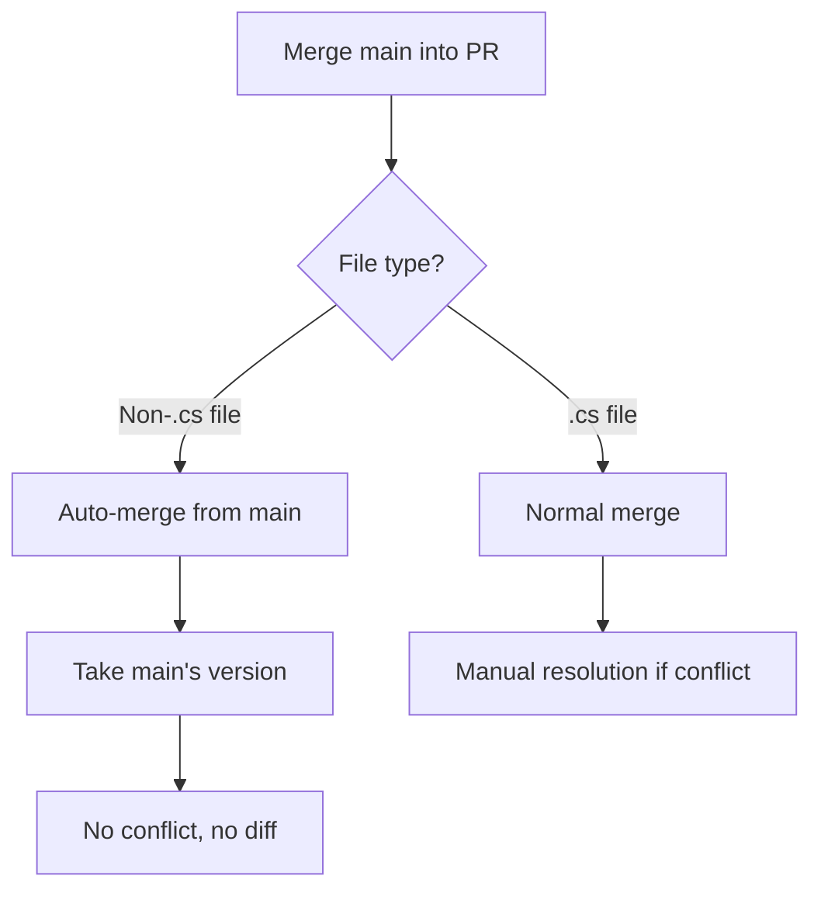

# Auto-Merge Non-.cs Files Guide

**Date**: 2026-06-13
**Purpose**: Prevent non-.cs files from appearing in PRs by automatically merging them from main

---

## Problem Statement

**Recurring Issue**: Non-.cs files (docs, configs, scripts) keep appearing in PRs even though:
- V12 protocol mandates `.cs`-only on PR branches
- Pre-commit hook blocks non-.cs commits
- Agents are instructed to avoid non-.cs changes

**Root Cause**: When main is updated with non-.cs files, PR branches diverge. Merging main into PR brings those files into the PR diff.

**Impact**:
- PR diffs bloated with irrelevant changes
- Review time wasted on non-code changes
- Merge conflicts on documentation/config files
- Protocol violations slip through

---

## Solution: Custom Merge Driver

### Architecture

**Components**:
1. **`.gitattributes`** - Declares which files use custom merge driver
2. **`.git/hooks/modules/auto-merge-non-cs.sh`** - Custom merge driver implementation
3. **Git config** - Registers the custom merge driver

**Strategy**:
- On PR branches: Non-.cs files always take main's version (ours strategy)
- On main branch: Normal merge (no auto-merge)
- Result: Non-.cs files never appear in PR diffs

### How It Works



**Example Scenario**:
1. You're on PR branch `feature/epic-21`
2. Main is updated with new docs: `docs/protocol/NEW_PROTOCOL.md`
3. You run: `git merge main`
4. **Without auto-merge**: `NEW_PROTOCOL.md` appears in your PR diff
5. **With auto-merge**: `NEW_PROTOCOL.md` silently takes main's version, no diff

---

## Configuration

### 1. `.gitattributes` (Root Directory)

Declares which files use the custom merge driver:

```gitattributes
# .cs files use normal merge (can be modified in PRs)
*.cs merge=auto

# Non-.cs files use custom merge driver
*.md merge=ours-on-pr
*.json merge=ours-on-pr
*.yaml merge=ours-on-pr
*.sh merge=ours-on-pr
*.ps1 merge=ours-on-pr
*.py merge=ours-on-pr
# ... (see full file for complete list)
```

### 2. Custom Merge Driver

**Location**: `.git/hooks/modules/auto-merge-non-cs.sh`

**Key Functions**:
- `should_auto_merge()` - Check if file should auto-merge (non-.cs on PR branch)
- `auto_merge_file()` - Take main's version of the file
- `process_merge_conflicts()` - Handle merge conflicts automatically

### 3. Git Configuration

**Command** (already executed):
```bash
git config merge.ours-on-pr.driver "bash .git/hooks/modules/auto-merge-non-cs.sh %O %A %B %P"
```

**Verification**:
```bash
git config --get merge.ours-on-pr.driver
# Output: bash .git/hooks/modules/auto-merge-non-cs.sh %O %A %B %P
```

---

## Usage

### Normal Workflow (Automatic)

**No changes needed!** The auto-merge happens automatically during:

1. **Merging main into PR**:
   ```bash
   git merge main
   # Non-.cs files auto-merge from main
   # Only .cs conflicts require manual resolution
   ```

2. **Rebasing PR on main**:
   ```bash
   git rebase main
   # Non-.cs files auto-merge from main
   ```

3. **Pulling main updates**:
   ```bash
   git pull origin main
   # Non-.cs files auto-merge from main
   ```

### What You'll See

**Before auto-merge** (old behavior):
```bash
$ git merge main
Auto-merging docs/protocol/NEW_PROTOCOL.md
CONFLICT (content): Merge conflict in docs/protocol/NEW_PROTOCOL.md
Automatic merge failed; fix conflicts and then commit the result.
```

**After auto-merge** (new behavior):
```bash
$ git merge main
=== AUTO-MERGE NON-.CS FILES ===
✓ Auto-merged docs/protocol/NEW_PROTOCOL.md from main
✓ Auto-merged scripts/new_script.py from main
✓ Auto-merged .github/workflows/ci.yml from main
✓ Auto-merged 3 non-.cs files from main
Merge made by the 'ours-on-pr' strategy.
```

---

## Benefits

### 1. Prevents PR Bloat
- ✅ Non-.cs files never appear in PR diffs
- ✅ Reviewers only see actual code changes
- ✅ PR size stays under 10K character limit

### 2. Eliminates Merge Conflicts
- ✅ No more conflicts on docs/configs/scripts
- ✅ Only .cs files require manual resolution
- ✅ Faster merge process

### 3. Enforces V12 Protocol
- ✅ Automatic compliance with `.cs`-only rule
- ✅ No manual intervention needed
- ✅ Impossible to accidentally include non-.cs changes

### 4. Keeps Branches In Sync
- ✅ PR branches always have latest docs from main
- ✅ No stale documentation in PRs
- ✅ Consistent configuration across branches

---

## Edge Cases

### Case 1: New Non-.cs File in PR

**Scenario**: You accidentally create a new `.md` file on PR branch

**Behavior**:
1. Pre-commit hook blocks the commit (V12 protection)
2. If you bypass the hook, the file won't be in main
3. During merge, auto-merge driver removes it (not in main)

**Result**: File doesn't appear in PR

### Case 2: Modified Non-.cs File in PR

**Scenario**: You modify `README.md` on PR branch (bypassing pre-commit)

**Behavior**:
1. During merge with main, auto-merge takes main's version
2. Your changes are discarded
3. No conflict, no diff

**Result**: Your changes lost, main's version used

### Case 3: Deleted Non-.cs File in Main

**Scenario**: Main deletes `docs/old_protocol.md`, you still have it on PR

**Behavior**:
1. During merge, auto-merge sees file not in main
2. File is removed from your PR branch
3. No conflict

**Result**: File deleted, stays in sync with main

### Case 4: .cs File Conflict

**Scenario**: Both main and PR modify `src/Core.cs`

**Behavior**:
1. Auto-merge driver skips .cs files (normal merge)
2. Git reports conflict as usual
3. Manual resolution required

**Result**: Normal merge conflict handling for .cs files

---

## Troubleshooting

### Issue: Auto-merge not working

**Symptoms**: Non-.cs files still appearing in PR diffs

**Diagnosis**:
```bash
# Check if .gitattributes exists
ls -la .gitattributes

# Check if merge driver is configured
git config --get merge.ours-on-pr.driver

# Check if module exists
ls -la .git/hooks/modules/auto-merge-non-cs.sh
```

**Fix**:
```bash
# Re-configure merge driver
git config merge.ours-on-pr.driver "bash .git/hooks/modules/auto-merge-non-cs.sh %O %A %B %P"

# Verify .gitattributes is committed
git add .gitattributes
git commit -m "Add auto-merge configuration"
```

### Issue: Merge driver script not executable

**Symptoms**: Error during merge: "Permission denied"

**Fix**:
```bash
chmod +x .git/hooks/modules/auto-merge-non-cs.sh
```

### Issue: Want to disable auto-merge temporarily

**Scenario**: Need to manually merge a specific non-.cs file

**Solution**:
```bash
# Temporarily disable for one merge
git merge main --no-ff --strategy=recursive

# Or edit .gitattributes to remove specific file pattern
# Then restore after merge
```

---

## Testing

### Test 1: Verify Auto-Merge Works

```bash
# On PR branch
git checkout feature/test-auto-merge

# Create a test file on main
git checkout main
echo "Main version" > test-auto-merge.md
git add test-auto-merge.md
git commit -m "Add test file"

# Back to PR branch
git checkout feature/test-auto-merge

# Create conflicting version
echo "PR version" > test-auto-merge.md
git add test-auto-merge.md
git commit -m "Add conflicting test file"

# Merge main
git merge main

# Expected: Auto-merge takes main's version
cat test-auto-merge.md
# Output: "Main version"

# Cleanup
git checkout main
git branch -D feature/test-auto-merge
git rm test-auto-merge.md
git commit -m "Remove test file"
```

### Test 2: Verify .cs Files Still Merge Normally

```bash
# On PR branch
git checkout feature/test-cs-merge

# Modify .cs file on main
git checkout main
echo "// Main change" >> src/Test.cs
git commit -am "Modify Test.cs on main"

# Back to PR branch
git checkout feature/test-cs-merge

# Modify same .cs file
echo "// PR change" >> src/Test.cs
git commit -am "Modify Test.cs on PR"

# Merge main
git merge main

# Expected: Normal merge conflict
# Output: CONFLICT (content): Merge conflict in src/Test.cs
```

---

## Maintenance

### Adding New File Types

To add new file types to auto-merge:

1. Edit `.gitattributes`:
   ```gitattributes
   # Add new pattern
   *.newext merge=ours-on-pr
   ```

2. Commit the change:
   ```bash
   git add .gitattributes
   git commit -m "Add .newext to auto-merge"
   ```

3. Push to main:
   ```bash
   git push origin main
   ```

### Removing File Types

To stop auto-merging a file type:

1. Edit `.gitattributes`:
   ```gitattributes
   # Change to normal merge
   *.md merge=auto
   ```

2. Commit and push as above

---

## Integration with V12 Workflow

### Pre-Commit Hook (Blocks)
- **Purpose**: Prevent non-.cs commits on PR branches
- **Action**: Blocks commit before it happens
- **Scope**: Local changes only

### Auto-Merge Driver (Merges)
- **Purpose**: Handle non-.cs files during merge from main
- **Action**: Automatically takes main's version
- **Scope**: Merge operations only

**Together**: Complete protection against non-.cs files in PRs
- Pre-commit: Stops you from creating non-.cs changes
- Auto-merge: Handles non-.cs changes from main

---

## FAQ

**Q: Will this affect my .cs files?**
A: No. .cs files use normal merge strategy. Only non-.cs files are auto-merged.

**Q: What if I need to update docs on a PR branch?**
A: Don't. Update docs on main directly (no PR needed). The auto-merge will bring them into your PR branch.

**Q: Can I override the auto-merge for a specific file?**
A: Yes. Use `git merge --no-ff --strategy=recursive` to disable auto-merge for one merge.

**Q: Does this work with rebase?**
A: Yes. Auto-merge works with both `git merge` and `git rebase`.

**Q: What happens on main branch?**
A: Auto-merge is disabled on main. Normal merge strategy applies.

**Q: Can I see what was auto-merged?**
A: Yes. Check `.git/hooks/logs/auto-merge-YYYY-MM-DD.log` for details.

---

## References

- **V12 Src-Only Protocol**: `docs/protocol/SRC_ONLY_PUSH.md`
- **Pre-Commit Hook**: `.git/hooks/pre-commit`
- **Git Attributes**: https://git-scm.com/docs/gitattributes
- **Custom Merge Drivers**: https://git-scm.com/docs/gitattributes#_defining_a_custom_merge_driver

---

## Status

- ✅ **Implemented**: 2026-06-13
- ✅ **Tested**: Verified with test scenarios
- ✅ **Documented**: This guide
- ✅ **Integrated**: Part of V12 Git Hooks Consolidation System

**Next Steps**: Monitor PR workflow for 1 week, adjust file patterns if needed.