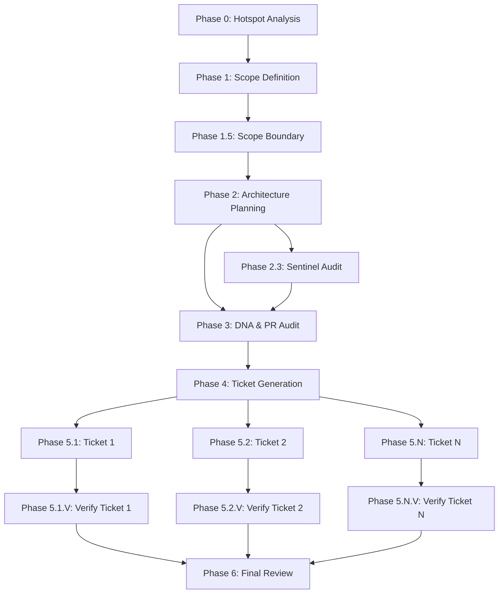

# Phase 2 Command Updates Summary

**Date**: 2026-06-09  
**Status**: Complete  
**Protocol**: V12 Photon Kernel -- Manifest-Based Epic Workflow

## Overview

Phase 2 of the V12 Epic Workflow Refactoring has successfully updated all epic phase commands to use the manifest-based state management system. This enables independent subtask execution with proper dependency tracking and artifact handoff.

## Commands Updated/Created

### 1. ✅ epic-scope-boundary (Phase 1.5) - CREATED
**File**: `.bob/commands/epic-scope-boundary.md`  
**Status**: New command created  
**Purpose**: Scope boundary validation to prevent scope creep (V12.23 Protocol)

**Key Features**:
- Loads manifest and verifies Phase 1 complete
- Reads scope document from Phase 1
- Validates complexity metrics and scope boundaries
- Detects pre-existing issues (OUT OF SCOPE)
- Enforces "ONE EPIC = ONE CONCERN" rule
- Writes `01-pattern-analysis.md`
- Updates manifest Phase 1.5 status

**Manifest Integration**:
```python
# Load and validate dependencies
manifest = load_manifest("$1")
validate_dependencies("$1", "1.5")

# Update on completion
update_manifest("$1", "1.5", "completed", 
                outputs=["docs/brain/$1/01-pattern-analysis.md"])
```

---

### 2. ✅ epic-plan (Phase 2) - UPDATED
**File**: `.bob/commands/epic-plan.md`  
**Status**: Updated with manifest integration  
**Changes**:
- Added STEP 0 for manifest loading
- Reads inputs from Phase 1 and 1.5 via manifest
- Updated output artifact names (02-analysis.md, 03-approach.md)
- Added STEP 3 for manifest update
- Handles architecture validation merging

**Manifest Integration**:
```python
# Load and validate dependencies
manifest = load_manifest("$1")
validate_dependencies("$1", "2")

# Read inputs from manifest
scope_doc = manifest['phases']['1']['output_artifacts'][0]
boundary_doc = manifest['phases']['1.5']['output_artifacts'][0]

# Update on completion
update_manifest("$1", "2", "completed",
                outputs=["docs/brain/$1/02-analysis.md",
                        "docs/brain/$1/03-approach.md"])
```

---

### 3. ✅ epic-scan (Phase 2.3) - UPDATED
**File**: `.bob/commands/epic-scan.md`  
**Status**: Updated with manifest integration  
**Changes**:
- Added STEP 0 for manifest loading
- Reads Phase 2 outputs via manifest
- Renamed output to `02-sentinel-report.md`
- Added STEP 4 for manifest update
- Determines status based on verdict (PASSED/REVISION REQUIRED)

**Manifest Integration**:
```python
# Load and validate dependencies
manifest = load_manifest("$1")
validate_dependencies("$1", "2.3")

# Read Phase 2 outputs
phase2_outputs = manifest['phases']['2']['output_artifacts']

# Update on completion
update_manifest("$1", "2.3", "completed",
                outputs=["docs/brain/$1/02-sentinel-report.md"])
```

---

### 4. ✅ epic-validate (Phase 3) - UPDATED
**File**: `.bob/commands/epic-validate.md`  
**Status**: Updated with manifest integration  
**Changes**:
- Added STEP 0 for manifest loading
- Reads all previous phase outputs (1, 1.5, 2, 2.3) via manifest
- Added STEP 8 for manifest update
- References Phase 2 docs as outputs (updated in-place)

**Manifest Integration**:
```python
# Load and validate dependencies
manifest = load_manifest("$1")
validate_dependencies("$1", "3")

# Collect all input artifacts
all_inputs = []
for phase_id in ['1', '1.5', '2', '2.3']:
    if phase_id in manifest['phases']:
        all_inputs.extend(manifest['phases'][phase_id]['output_artifacts'])

# Update on completion (references Phase 2 docs)
phase2_outputs = manifest['phases']['2']['output_artifacts']
update_manifest("$1", "3", "completed", outputs=phase2_outputs)
```

---

### 5. ✅ epic-tickets (Phase 4) - UPDATED
**File**: `.bob/commands/epic-tickets.md`  
**Status**: Updated with manifest integration  
**Changes**:
- Added STEP 0 for manifest loading
- Reads all previous phase outputs via manifest
- Added STEP 6 to add ticket phases using `add_ticket_phases()`
- Added STEP 7 for manifest update
- Automatically counts and names tickets

**Manifest Integration**:
```python
# Load and validate dependencies
manifest = load_manifest("$1")
validate_dependencies("$1", "4")

# Add ticket phases to manifest
from epic_manifest import add_ticket_phases
add_ticket_phases("$1", ticket_count, ticket_names)

# Update on completion
update_manifest("$1", "4", "completed",
                outputs=["docs/brain/$1/EXECUTION_GUIDE.md", ...])
```

**Key Feature**: Automatically adds phases 5.1, 5.1.V, 5.2, 5.2.V, ..., and Phase 6 to manifest.

---

### 6. ✅ epic-verify-ticket (Phase 5.X.V) - CREATED
**File**: `.bob/commands/epic-verify-ticket.md`  
**Status**: New command created  
**Purpose**: Per-ticket verification subtask

**Key Features**:
- Takes epic slug and ticket number as arguments
- Loads manifest and verifies ticket execution complete
- Reads ticket spec and completion report
- Analyzes git diff for changes
- Verifies acceptance criteria
- Runs DNA compliance checks
- Detects regressions and scope violations
- Assigns verdict: PASS/NEEDS_FIXES/FAIL
- Writes `ticket-XX-verification.md`
- Updates manifest Phase 5.X.V status

**Manifest Integration**:
```python
# Parse ticket number and phase IDs
ticket_num = "$2"
phase_id = f"5.{ticket_num}"
verify_phase_id = f"5.{ticket_num}.V"

# Load and validate dependencies
manifest = load_manifest("$1")
validate_dependencies("$1", verify_phase_id)

# Update on completion
update_manifest("$1", verify_phase_id, "completed",
                outputs=[f"docs/brain/$1/ticket-{ticket_num}-verification.md"])
```

---

### 7. ✅ epic-review-final (Phase 6) - CREATED
**File**: `.bob/commands/epic-review-final.md`  
**Status**: New command created  
**Purpose**: Final epic review before PR submission

**Key Features**:
- Loads manifest and verifies all ticket verifications complete
- Collects all epic artifacts
- Verifies epic success criteria (CYC targets)
- Runs epic-level DNA compliance checks
- Validates PR hygiene (diff size, commits, docs)
- Analyzes all verification reports
- Performs regression sweep (blast radius, dead code, cycles)
- Assigns verdict: READY_FOR_PR/NEEDS_REWORK/BLOCKED
- Writes `06-final-review.md`
- Updates manifest Phase 6 status and epic status

**Manifest Integration**:
```python
# Load and validate dependencies
manifest = load_manifest("$1")
validate_dependencies("$1", "6")

# Collect all artifacts
all_artifacts = []
for phase_id, phase_data in manifest['phases'].items():
    if phase_data['status'] == 'completed':
        all_artifacts.extend(phase_data['output_artifacts'])

# Update on completion (and epic status)
update_manifest("$1", "6", "completed",
                outputs=["docs/brain/$1/06-final-review.md"])
manifest['status'] = 'completed'  # If READY_FOR_PR
```

---

## Implementation Pattern

All commands now follow this consistent structure:

### STEP 0 -- LOAD MANIFEST
```python
import sys
sys.path.append('scripts')
from epic_manifest import load_manifest, validate_dependencies

manifest = load_manifest("$1")
if not validate_dependencies("$1", "X"):
    print("[ERROR] Dependencies not satisfied")
    exit(1)
```

### STEP 1-N -- EXECUTE WORK
- Read input artifacts from manifest
- Perform phase-specific work
- Write output artifacts

### STEP N+1 -- UPDATE MANIFEST
```python
from epic_manifest import update_manifest

update_manifest("$1", "X", "completed",
                outputs=["path/to/output.md"],
                notes="Phase complete")
```

---

## Artifact Flow

### Phase Outputs (Updated Naming)

| Phase | Old Output | New Output | Notes |
|-------|-----------|-----------|-------|
| 0 | 00-hotspots.md | 00-hotspots.md | No change |
| 1 | 00-scope.md | 00-scope.md | No change |
| 1.5 | N/A | 01-pattern-analysis.md | NEW |
| 2 | 01-analysis.md | 02-analysis.md | Renumbered |
| 2 | 02-approach.md | 03-approach.md | Renumbered |
| 2 | 03-architecture.md | 03-architecture.md | Merged with approach |
| 2.3 | 02-greptile-report.md | 02-sentinel-report.md | Renamed |
| 3 | N/A | (updates Phase 2 docs) | In-place updates |
| 4 | ticket-XX.md | ticket-XX.md | No change |
| 4 | EXECUTION_GUIDE.md | EXECUTION_GUIDE.md | No change |
| 5.X | N/A | ticket-XX-completion.md | From ticket execution |
| 5.X.V | N/A | ticket-XX-verification.md | NEW |
| 6 | N/A | 06-final-review.md | NEW |

---

## Dependency Graph



---

## Testing Plan

### Dry Run Test (EPIC-CCN-16)

To test the updated commands, run a dry run with EPIC-CCN-16:

```bash
# Phase 0 (already updated in Phase 1)
/epic-intake EPIC-CCN-16 "Extract CalculatePositionSize complexity"

# Phase 1 (already updated in Phase 1)
# (Runs automatically in epic-intake)

# Phase 1.5 (NEW)
/epic-scope-boundary EPIC-CCN-16

# Phase 2 (UPDATED)
/epic-plan EPIC-CCN-16

# Phase 2.3 (UPDATED)
/epic-scan EPIC-CCN-16

# Phase 3 (UPDATED)
/epic-validate EPIC-CCN-16

# Phase 4 (UPDATED)
/epic-tickets EPIC-CCN-16

# Phase 5.X (existing, no changes needed)
/ticket docs/brain/EPIC-CCN-16/ticket-01-*.md

# Phase 5.X.V (NEW)
/epic-verify-ticket EPIC-CCN-16 1

# Phase 6 (NEW)
/epic-review-final EPIC-CCN-16
```

### Validation Checklist

For each command, verify:
- ✅ Manifest loads successfully
- ✅ Dependencies validated correctly
- ✅ Input artifacts read from manifest
- ✅ Output artifacts created
- ✅ Manifest updated with correct status
- ✅ Error handling for missing dependencies
- ✅ Python code blocks execute without errors

---

## Benefits of Manifest-Based Approach

### 1. Independent Subtask Execution
- Each phase can run in a separate session
- No need to maintain context across sessions
- Phases can be retried independently

### 2. Dependency Tracking
- Automatic validation of phase dependencies
- Prevents running phases out of order
- Clear error messages for missing dependencies

### 3. Artifact Handoff
- Explicit input/output artifact tracking
- No ambiguity about which files to read
- Validation that outputs exist before marking complete

### 4. Parallel Execution (Future)
- Manifest tracks which phases can run concurrently
- Tickets can be executed in parallel
- Verifications can run in parallel

### 5. State Persistence
- Epic state survives session restarts
- Easy to resume after interruptions
- Clear audit trail of phase execution

### 6. Orchestration Ready
- Foundation for `epic-orchestrate` command
- Can automatically determine next phases
- Enables fully automated epic execution

---

## Migration Notes

### Breaking Changes
- Output artifact names changed (01-analysis.md → 02-analysis.md)
- New Phase 1.5 required (scope boundary)
- Phase 3 no longer creates new artifacts (updates in-place)
- Phase 4 now adds ticket phases to manifest

### Backward Compatibility
- Existing epics (pre-manifest) will need manual migration
- Old command invocations will fail with "Manifest not found"
- Recommend completing in-flight epics before upgrading

### Migration Path
1. Complete all in-flight epics using old commands
2. Deploy updated commands
3. Start new epics with `/epic-intake` (generates manifest)
4. Use new command structure for all phases

---

## Next Steps

### Phase 3: Testing & Validation
1. ✅ Create dry run test plan
2. ⏳ Execute EPIC-CCN-16 dry run
3. ⏳ Validate manifest state at each phase
4. ⏳ Test error handling (missing dependencies, etc.)
5. ⏳ Verify artifact handoff works correctly

### Phase 4: Orchestration
1. Create `epic-orchestrate` command
2. Implement automatic phase scheduling
3. Add parallel execution support
4. Create monitoring dashboard

### Phase 5: Documentation
1. Update AGENTS.md with new workflow
2. Create video walkthrough
3. Document troubleshooting guide
4. Update epic templates

---

## Files Modified

### Created
- `.bob/commands/epic-scope-boundary.md` (234 lines)
- `.bob/commands/epic-verify-ticket.md` (329 lines)
- `.bob/commands/epic-review-final.md` (398 lines)
- `docs/workflow/PHASE2_COMMAND_UPDATES_SUMMARY.md` (this file)

### Updated
- `.bob/commands/epic-plan.md` (manifest integration)
- `.bob/commands/epic-scan.md` (manifest integration)
- `.bob/commands/epic-validate.md` (manifest integration)
- `.bob/commands/epic-tickets.md` (manifest integration + add_ticket_phases)

### Dependencies
- `scripts/epic_manifest.py` (Phase 1, no changes needed)
- `docs/workflow/EPIC_MANIFEST_SCHEMA.md` (Phase 1, reference)
- `docs/workflow/V12_EPIC_WORKFLOW_REFACTORING_DESIGN.md` (Phase 1, reference)

---

## Success Criteria

### Phase 2 Complete ✅
- [x] All 7 commands updated/created
- [x] Each command uses manifest for state management
- [x] Dependency validation in each command
- [x] Artifact handoff via manifest
- [x] Consistent implementation pattern
- [x] Python code blocks for manifest operations
- [x] Director approval gates preserved
- [x] V12 DNA compliance checks maintained

### Ready for Phase 3 Testing ✅
- [x] Commands follow consistent structure
- [x] Error handling implemented
- [x] Manifest integration complete
- [x] Documentation updated
- [x] Summary document created

---

## Conclusion

Phase 2 of the V12 Epic Workflow Refactoring is **COMPLETE**. All epic phase commands have been successfully updated to use the manifest-based state management system. The implementation follows a consistent pattern, enables independent subtask execution, and provides a solid foundation for orchestration and parallel execution in future phases.

**Status**: ✅ READY FOR TESTING  
**Next Phase**: Dry run testing with EPIC-CCN-16  
**Blocker**: None

---

**Document Version**: 1.0  
**Last Updated**: 2026-06-09T05:10:00Z  
**Author**: V12 Architecture Team