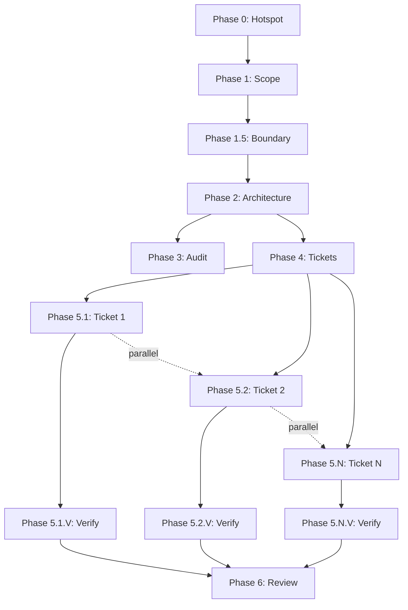

# Phase MCP Architecture

**Version**: V12.25
**Status**: Production Ready
**Last Updated**: 2026-06-10

## Overview

The Phase MCP Architecture implements a **manifest-based independent subtask workflow** for V12 epic execution. Each phase runs as a separate MCP server, enabling parallel execution, clear artifact handoff, and resilient failure recovery.

## Architecture Principles

### 1. Independent Subtasks
- Each phase is a fresh session (no context exhaustion)
- Clear input/output contracts via manifest
- No shared state between phases
- Resume from any phase after failure

### 2. Manifest-Based Coordination
- Central `manifest.json` tracks phase status
- Artifact paths stored in manifest
- Dependency validation before execution
- Atomic status updates

### 3. Parallel Execution
- Independent phases run concurrently
- Wave-based execution (e.g., Phase 0 for all epics)
- Ticket execution parallelization
- Watsonx Orchestrate integration ready

## MCP Server Inventory

| Server Name | Script | Tool | Purpose |
|-------------|--------|------|---------|
| `phase-0-hotspot` | `phase_0_hotspot_mcp.py` | `execute_phase_0` | Hotspot analysis via jcodemunch |
| `phase-1-scope` | `phase_1_scope_mcp.py` | `execute_phase_1` | Scope definition |
| `phase-1-5-boundary` | `phase_1_5_boundary_mcp.py` | `execute_phase_1_5` | Scope boundary validation |
| `phase-2-architecture` | `phase_2_architecture_mcp.py` | `execute_phase_2` | Architecture planning |
| `phase-3-audit` | `phase_3_audit_mcp.py` | `execute_phase_3` | DNA & PR audit |
| `phase-4-tickets` | `phase_4_tickets_mcp.py` | `execute_phase_4` | Ticket generation |
| `phase-5-execute` | `phase_5_execute_mcp.py` | `execute_phase_5` | Ticket execution (delegates to Bob CLI) |
| `phase-5-verify` | `phase_5_verify_mcp.py` | `execute_phase_5_verify` | Per-ticket verification |
| `phase-6-review` | `phase_6_review_mcp.py` | `execute_phase_6` | Final review & completion |

## Configuration

### MCP Server Configuration (`.bob/mcp.json`)

All 9 phase servers are configured in `.bob/mcp.json`:

```json
{
  "mcpServers": {
    "phase-0-hotspot": {
      "type": "stdio",
      "command": "python",
      "args": ["C:/WSGTA/universal-or-strategy/scripts/phase_0_hotspot_mcp.py"],
      "env": {"PYTHONPATH": "C:/WSGTA/universal-or-strategy"},
      "alwaysAllow": ["execute_phase_0"]
    },
    // ... 8 more phase servers
  }
}
```

### Python Dependencies

Install required packages:

```bash
pip install -r scripts/requirements_worker_mcp.txt
```

Required packages:
- `mcp>=1.0.0` - MCP SDK
- `asyncio` - Async execution
- Standard library: `json`, `pathlib`, `subprocess`, `datetime`

## Workflow Execution

### Phase Dependency Graph



### Sequential Execution (Single Epic)

```bash
# Phase 0: Hotspot Analysis
use_mcp_tool(
  server='phase-0-hotspot',
  tool='execute_phase_0',
  args={
    'epic_id': 'EPIC-CCN-22',
    'method': 'ProcessBarUpdate',
    'file': 'src/V12_002.BarUpdate.cs',
    'cyc': 28
  }
)

# Phase 1: Scope Definition
use_mcp_tool(
  server='phase-1-scope',
  tool='execute_phase_1',
  args={'epic_id': 'EPIC-CCN-22'}
)

# Phase 1.5: Scope Boundary Validation
use_mcp_tool(
  server='phase-1-5-boundary',
  tool='execute_phase_1_5',
  args={'epic_id': 'EPIC-CCN-22'}
)

# Phase 2: Architecture Planning
use_mcp_tool(
  server='phase-2-architecture',
  tool='execute_phase_2',
  args={'epic_id': 'EPIC-CCN-22'}
)

# Phase 3: DNA & PR Audit
use_mcp_tool(
  server='phase-3-audit',
  tool='execute_phase_3',
  args={'epic_id': 'EPIC-CCN-22'}
)

# Phase 4: Ticket Generation
use_mcp_tool(
  server='phase-4-tickets',
  tool='execute_phase_4',
  args={'epic_id': 'EPIC-CCN-22'}
)

# Phase 5: Ticket Execution (per ticket)
use_mcp_tool(
  server='phase-5-execute',
  tool='execute_phase_5',
  args={'epic_id': 'EPIC-CCN-22', 'ticket_id': 'TICKET-1'}
)

# Phase 5.V: Ticket Verification (per ticket)
use_mcp_tool(
  server='phase-5-verify',
  tool='execute_phase_5_verify',
  args={'epic_id': 'EPIC-CCN-22'}
)

# Phase 6: Final Review
use_mcp_tool(
  server='phase-6-review',
  tool='execute_phase_6',
  args={'epic_id': 'EPIC-CCN-22'}
)
```

### Parallel Execution (Wave-Based)

Execute Phase 0 for all pending epics:

```bash
python scripts/orchestrate_phase_execution.py --wave 0
```

This will:
1. Query `epic_roadmap.json` for pending epics
2. Execute Phase 0 for each epic in parallel
3. Update manifests atomically
4. Report success/failure for each epic

### Orchestration Script

The `orchestrate_phase_execution.py` script provides:

```bash
# Show execution plan for an epic
python scripts/orchestrate_phase_execution.py --epic EPIC-CCN-22 --plan

# Execute specific phase for an epic
python scripts/orchestrate_phase_execution.py --epic EPIC-CCN-22 --phase 0

# Execute phase for all ready epics (wave execution)
python scripts/orchestrate_phase_execution.py --wave 0
```

## Manifest Structure

### Location
`docs/brain/EPIC-{ID}/manifest.json`

### Schema

```json
{
  "epic_id": "EPIC-CCN-22",
  "created_at": "2026-06-10T12:00:00Z",
  "updated_at": "2026-06-10T14:30:00Z",
  "status": "in_progress",
  "phases": {
    "phase_0": {
      "status": "completed",
      "started_at": "2026-06-10T12:00:00Z",
      "completed_at": "2026-06-10T12:15:00Z",
      "outputs": ["00-hotspots.md"],
      "metadata": {
        "method": "ProcessBarUpdate",
        "file": "src/V12_002.BarUpdate.cs",
        "cyc_before": 28,
        "cyc_target": 15
      }
    },
    "phase_1": {
      "status": "completed",
      "started_at": "2026-06-10T12:20:00Z",
      "completed_at": "2026-06-10T12:45:00Z",
      "outputs": ["00-scope.md"],
      "dependencies": ["phase_0"]
    },
    "phase_1_5": {
      "status": "completed",
      "started_at": "2026-06-10T13:00:00Z",
      "completed_at": "2026-06-10T13:15:00Z",
      "outputs": ["01-scope-boundary.md"],
      "dependencies": ["phase_1"]
    },
    "phase_2": {
      "status": "in_progress",
      "started_at": "2026-06-10T13:30:00Z",
      "outputs": [],
      "dependencies": ["phase_1_5"]
    }
  }
}
```

### Status Values
- `pending` - Not started
- `in_progress` - Currently executing
- `completed` - Successfully finished
- `failed` - Execution failed
- `blocked` - Dependencies not satisfied

## Artifact Handoff

### Standard Artifacts

```
docs/brain/EPIC-{ID}/
  ├─ manifest.json              # Central state tracker
  ├─ 00-hotspots.md            # Phase 0 → Phase 1
  ├─ 00-scope.md               # Phase 1 → Phase 1.5
  ├─ 01-scope-boundary.md      # Phase 1.5 → Phase 2
  ├─ 02-architecture-plan.md   # Phase 2 → Phase 3, 4
  ├─ 02-diagrams.mmd           # Phase 2 diagrams
  ├─ 03-audit-report.md        # Phase 3 → Phase 4
  ├─ 04-tickets.md             # Phase 4 → Phase 5
  ├─ ticket-1-completion.md    # Phase 5.1 → Phase 5.1.V
  ├─ ticket-1-verification.md  # Phase 5.1.V → Phase 6
  ├─ ticket-2-completion.md    # Phase 5.2 → Phase 5.2.V
  ├─ ticket-2-verification.md  # Phase 5.2.V → Phase 6
  └─ 05-completion-report.md   # Phase 6 final output
```

### Artifact Loading Pattern

Each phase follows this pattern:

```python
# 1. Load manifest
manifest = load_manifest(epic_id)

# 2. Validate dependencies
if not validate_dependencies(manifest, current_phase):
    raise DependencyError("Prerequisites not met")

# 3. Load input artifacts
input_paths = manifest["phases"][prev_phase]["outputs"]
inputs = [load_artifact(path) for path in input_paths]

# 4. Execute phase logic
outputs = execute_phase_logic(inputs)

# 5. Write output artifacts
for artifact in outputs:
    write_artifact(artifact)

# 6. Update manifest
update_manifest(epic_id, current_phase, "completed", outputs)
```

## Testing

### Test Suite

Run the comprehensive test suite:

```bash
# Test all phase servers
python scripts/test_phase_mcp_servers.py

# Test specific server
python scripts/test_phase_mcp_servers.py --server phase-0-hotspot

# Verbose output
python scripts/test_phase_mcp_servers.py --verbose

# Generate report
python scripts/test_phase_mcp_servers.py --output test_report.json
```

### Test Coverage

The test suite validates:

1. **Configuration Tests**
   - Server exists in `.bob/mcp.json`
   - Required fields present (`type`, `command`, `args`)
   - Script file exists
   - Python executable available
   - `alwaysAllow` tools configured
   - Environment variables valid

2. **Syntax Tests**
   - Python script compiles without errors
   - No syntax errors in any phase script

3. **Integration Tests** (manual)
   - MCP server starts successfully
   - Tool invocation works
   - Manifest updates correctly
   - Artifacts written to correct locations

### Expected Test Output

```
============================================================
Phase MCP Server Test Suite
============================================================

ℹ️ Testing server: phase-0-hotspot
✅ Config exists
✅ Has type: stdio
✅ Has command: python
✅ Has args: ['C:/WSGTA/universal-or-strategy/scripts/phase_0_hotspot_mcp.py']
✅ Script exists: C:\WSGTA\universal-or-strategy\scripts\phase_0_hotspot_mcp.py
✅ Python available: Python 3.12.0
✅ Tools configured: 1
✅ PYTHONPATH valid: C:\WSGTA\universal-or-strategy
✅ Syntax valid: phase_0_hotspot_mcp.py

... (8 more servers)

============================================================
Test Summary
============================================================
Total Servers: 9
✅ Passed: 9
❌ Failed: 0
Success Rate: 100.0%
============================================================
```

## Failure Recovery

### Resume from Failed Phase

```bash
# 1. Check current status
python scripts/epic_manifest.py status EPIC-CCN-22

# 2. Identify failed phase
# Output shows: phase_2 status=failed

# 3. Fix issues (manual intervention)
# Review phase_2 error logs, fix code/config

# 4. Reset phase status
python scripts/epic_manifest.py reset EPIC-CCN-22 phase_2

# 5. Re-run phase
use_mcp_tool(
  server='phase-2-architecture',
  tool='execute_phase_2',
  args={'epic_id': 'EPIC-CCN-22'}
)
```

### Rollback Protocol

If a phase produces incorrect output:

1. **Identify Issue**: Review phase output artifacts
2. **Document**: Add notes to manifest
3. **Reset Status**: `python scripts/epic_manifest.py reset EPIC-CCN-22 phase_X`
4. **Fix Root Cause**: Update phase logic or inputs
5. **Re-execute**: Run phase again with corrected inputs

## Watsonx Orchestrate Integration

### Skills Available

- `v12-epic-start` - Initialize epic workflow
- `v12-epic-phase` - Execute single phase
- `v12-epic-status` - Check workflow status
- `v12-epic-wave` - Execute wave (phase for all epics)

### Orchestration Flow

```yaml
# Watsonx Orchestrate Workflow
name: V12 Epic Execution
trigger: manual

steps:
  - name: Initialize Epic
    skill: v12-epic-start
    inputs:
      epic_id: ${epic_id}
      method: ${method}
      file: ${file}
      cyc: ${cyc}
  
  - name: Execute Phases 0-4
    skill: v12-epic-phase
    inputs:
      epic_id: ${epic_id}
      phase: ${phase}
    loop:
      phases: [0, 1, 1.5, 2, 3, 4]
  
  - name: Execute Tickets
    skill: v12-epic-phase
    inputs:
      epic_id: ${epic_id}
      phase: 5
      ticket_id: ${ticket_id}
    parallel: true
    loop:
      tickets: ${manifest.tickets}
  
  - name: Verify Tickets
    skill: v12-epic-phase
    inputs:
      epic_id: ${epic_id}
      phase: 5.V
    depends_on: Execute Tickets
  
  - name: Final Review
    skill: v12-epic-phase
    inputs:
      epic_id: ${epic_id}
      phase: 6
    depends_on: Verify Tickets
```

## Performance Characteristics

### Execution Times (Typical)

| Phase | Duration | Bottleneck |
|-------|----------|------------|
| 0 | 2-5 min | jcodemunch analysis |
| 1 | 3-7 min | LLM scope definition |
| 1.5 | 1-2 min | Boundary validation |
| 2 | 5-10 min | Architecture planning |
| 3 | 3-5 min | DNA audit |
| 4 | 2-4 min | Ticket generation |
| 5 | 10-30 min/ticket | Bob CLI execution |
| 5.V | 2-3 min/ticket | Verification |
| 6 | 3-5 min | Final review |

**Total**: 30-70 minutes per epic (sequential)

### Parallelization Gains

**Wave Execution** (Phase 0 for 10 epics):
- Sequential: 10 × 5 min = 50 minutes
- Parallel: ~7 minutes (with 10 workers)
- **Speedup**: 7x

**Ticket Execution** (5 tickets):
- Sequential: 5 × 20 min = 100 minutes
- Parallel: ~25 minutes (with 5 workers)
- **Speedup**: 4x

## Migration from Old Workflow

### Deprecated Commands

- ❌ `epic-run` (monolithic workflow)
- ❌ `epic-intake` (replaced by Phase 0 MCP)
- ❌ `epic-scope-boundary` (replaced by Phase 1/1.5 MCP)
- ❌ `epic-plan` (replaced by Phase 2 MCP)
- ❌ `epic-scan` (replaced by Phase 3 MCP)
- ❌ `epic-tickets` (replaced by Phase 4 MCP)
- ❌ `epic-validate` (replaced by Phase 5 MCP)
- ❌ `epic-verify-ticket` (replaced by Phase 5.V MCP)
- ❌ `epic-review-final` (replaced by Phase 6 MCP)

### New Workflow

Use MCP tools directly via Bob CLI or orchestration script:

```bash
# Old way (deprecated)
epic-run EPIC-CCN-22

# New way (MCP-based)
python scripts/orchestrate_phase_execution.py --epic EPIC-CCN-22 --phase 0
python scripts/orchestrate_phase_execution.py --epic EPIC-CCN-22 --phase 1
# ... continue through phases
```

## Troubleshooting

### Common Issues

#### 1. MCP Server Not Found

**Symptom**: `Server 'phase-X-Y' not found`

**Solution**:
```bash
# Verify configuration
cat .bob/mcp.json | grep phase-X-Y

# Restart Bob CLI to reload config
bob --reload-config
```

#### 2. Python Module Not Found

**Symptom**: `ModuleNotFoundError: No module named 'mcp'`

**Solution**:
```bash
# Install dependencies
pip install -r scripts/requirements_worker_mcp.txt

# Verify PYTHONPATH in .bob/mcp.json
```

#### 3. Manifest Corruption

**Symptom**: `JSONDecodeError` when loading manifest

**Solution**:
```bash
# Backup corrupted manifest
cp docs/brain/EPIC-X/manifest.json docs/brain/EPIC-X/manifest.json.bak

# Restore from git
git checkout docs/brain/EPIC-X/manifest.json

# Or regenerate
python scripts/epic_manifest.py init EPIC-X
```

#### 4. Phase Hangs

**Symptom**: Phase execution never completes

**Solution**:
```bash
# Check for deadlocks in logs
tail -f logs/phase_X.log

# Kill hung process
taskkill /F /IM python.exe /FI "WINDOWTITLE eq phase-X*"

# Reset phase status
python scripts/epic_manifest.py reset EPIC-X phase_X
```

## Best Practices

### 1. Always Use Manifest

Never bypass the manifest system. All phase status updates MUST go through `epic_manifest.py`.

### 2. Validate Dependencies

Before executing a phase, always validate dependencies:

```python
if not validate_dependencies(manifest, current_phase):
    raise DependencyError("Prerequisites not met")
```

### 3. Atomic Updates

Use atomic file operations for manifest updates:

```python
# Write to temp file first
temp_path = manifest_path.with_suffix('.tmp')
with open(temp_path, 'w') as f:
    json.dump(manifest, f, indent=2)

# Atomic rename
temp_path.replace(manifest_path)
```

### 4. Idempotent Phases

Design phases to be idempotent - running twice should produce the same result:

```python
# Check if already complete
if manifest["phases"][phase]["status"] == "completed":
    return load_existing_output()

# Otherwise, execute
return execute_phase_logic()
```

### 5. Comprehensive Logging

Log all phase actions for debugging:

```python
logger.info(f"Phase {phase} started for {epic_id}")
logger.debug(f"Input artifacts: {input_paths}")
logger.info(f"Phase {phase} completed in {duration}s")
```

## Future Enhancements

### Planned Features

1. **Auto-Retry**: Automatic retry with exponential backoff for transient failures
2. **Progress Streaming**: Real-time progress updates via WebSocket
3. **Resource Limits**: CPU/memory limits per phase
4. **Distributed Execution**: Run phases across multiple machines
5. **Checkpoint Compression**: Compress large artifacts to save disk space
6. **Phase Profiling**: Detailed performance metrics per phase
7. **Smart Scheduling**: Optimize phase execution order based on dependencies

### Research Areas

- **LLM Caching**: Cache LLM responses for identical inputs
- **Incremental Execution**: Only re-run phases affected by changes
- **Predictive Scheduling**: ML-based estimation of phase duration
- **Fault Injection**: Chaos engineering for resilience testing

## References

- [V12 Epic Workflow Refactoring Design](V12_EPIC_WORKFLOW_REFACTORING_DESIGN.md)
- [Epic Workflow Walkthrough](EPIC_WORKFLOW_WALKTHROUGH.md)
- [Watsonx Orchestrate Integration](WATSONX_ORCHESTRATE_INTEGRATION.md)
- [Epic Workflow Migration Guide](EPIC_WORKFLOW_MIGRATION_GUIDE.md)

## Changelog

### V12.25 (2026-06-10)
- ✅ Initial implementation of 9 phase MCP servers
- ✅ Configuration in `.bob/mcp.json`
- ✅ Orchestration script for parallel execution
- ✅ Comprehensive test suite
- ✅ Architecture documentation

### Future Versions
- V12.26: Auto-retry and progress streaming
- V12.27: Distributed execution support
- V12.28: Watsonx Orchestrate full integration