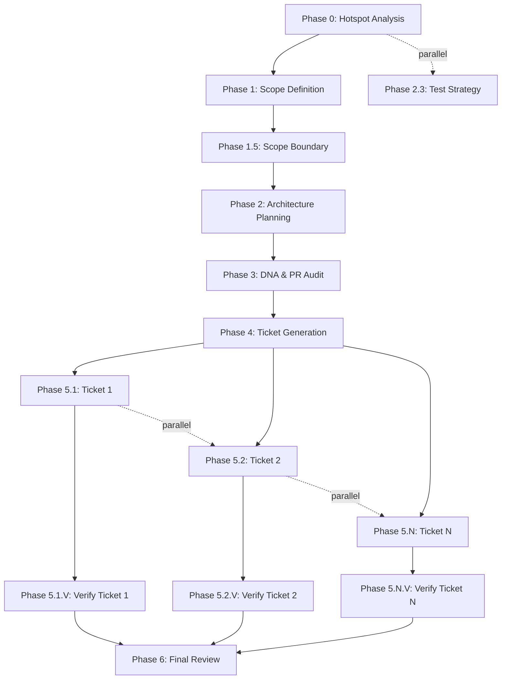

# V12 Epic Workflow Refactoring Design

**Version**: 1.0  
**Date**: 2026-06-09  
**Status**: Phase 1 - Foundation  
**Author**: V12 Architecture Team

## Executive Summary

This document outlines the refactoring of V12's epic workflow from a monolithic single-session model to Traycer's independent subtask pattern. The refactoring enables:
- **Phase Independence**: Each phase runs as a separate subtask with clear inputs/outputs
- **Parallel Execution**: Phases with no dependencies can run concurrently
- **Manifest-Based State**: Central manifest.json tracks epic progress and artifacts
- **Watsonx Orchestrate Integration**: Enables AI-driven workflow orchestration
- **Incremental Verification**: Per-ticket + final review validation

## Current State Analysis

### Existing Workflow (Monolithic)
```
epic-run EPIC-X
  ├─ Phase 0: Hotspot Analysis (ask mode)
  ├─ Phase 1: Scope Definition (plan mode)
  ├─ Phase 1.5: Scope Boundary (plan mode)
  ├─ Phase 2: Architecture Planning (plan mode)
  ├─ Phase 3: DNA & PR Audit (advanced mode)
  ├─ Phase 4: Ticket Generation (plan mode)
  ├─ Phase 5.X: Ticket Execution (v12-engineer mode)
  ├─ Phase 5.X.V: Verification (advanced mode)
  └─ Phase 6: Final Review (advanced mode)
```

**Problems**:
- Single long-running session (context window exhaustion)
- No checkpointing between phases
- Cannot parallelize independent work
- Difficult to resume after failure
- No clear artifact handoff protocol

### Target Workflow (Independent Subtasks)
```
epic-orchestrate EPIC-X
  ├─ Reads manifest.json for dependencies
  ├─ Launches independent phase subtasks
  ├─ Each phase:
  │   ├─ Reads manifest for inputs
  │   ├─ Executes work
  │   ├─ Writes output artifacts
  │   └─ Updates manifest status
  └─ Orchestrator monitors completion
```

**Benefits**:
- Each phase is a fresh session (no context exhaustion)
- Clear artifact handoff via manifest
- Parallel execution of independent phases
- Resume from any phase after failure
- Watsonx Orchestrate integration ready

## Phase Independence Map

### Phase Dependencies



### Parallel Execution Opportunities

**Group 1: Early Analysis**
- Phase 0 (Hotspot Analysis) + Phase 2.3 (Test Strategy)
- Can run concurrently if test strategy doesn't depend on hotspots

**Group 2: Ticket Execution**
- Phase 5.1, 5.2, ..., 5.N (all tickets)
- Can run concurrently if tickets are independent
- Requires dependency analysis in Phase 4

**Group 3: Verification**
- Phase 5.1.V, 5.2.V, ..., 5.N.V (all verifications)
- Can run concurrently after respective tickets complete

## Manifest Schema Design

### Core Structure

```json
{
  "epic_id": "EPIC-CCN-X",
  "description": "Brief epic description",
  "status": "in_progress",
  "created_at": "2026-06-09T04:00:00Z",
  "updated_at": "2026-06-09T04:30:00Z",
  "phases": {
    "0": {
      "name": "Hotspot Analysis",
      "status": "completed",
      "mode": "ask",
      "started_at": "2026-06-09T04:00:00Z",
      "completed_at": "2026-06-09T04:05:00Z",
      "input_artifacts": [],
      "output_artifacts": [
        "docs/brain/EPIC-CCN-X/00-hotspots.md"
      ],
      "notes": "Identified 3 high-complexity hotspots"
    },
    "1": {
      "name": "Scope Definition",
      "status": "completed",
      "mode": "plan",
      "started_at": "2026-06-09T04:05:00Z",
      "completed_at": "2026-06-09T04:15:00Z",
      "input_artifacts": [
        "docs/brain/EPIC-CCN-X/00-hotspots.md"
      ],
      "output_artifacts": [
        "docs/brain/EPIC-CCN-X/00-scope.md"
      ],
      "notes": "Scope limited to 3 methods, 2 files"
    },
    "1.5": {
      "name": "Scope Boundary",
      "status": "in_progress",
      "mode": "plan",
      "started_at": "2026-06-09T04:15:00Z",
      "completed_at": null,
      "input_artifacts": [
        "docs/brain/EPIC-CCN-X/00-scope.md"
      ],
      "output_artifacts": [],
      "notes": "Validating scope boundaries"
    }
  },
  "dependencies": {
    "1": ["0"],
    "1.5": ["1"],
    "2": ["1.5"],
    "3": ["2"],
    "4": ["3"],
    "5.1": ["4"],
    "5.2": ["4"],
    "5.1.V": ["5.1"],
    "5.2.V": ["5.2"],
    "6": ["5.1.V", "5.2.V"]
  },
  "parallel_groups": [
    {
      "group_id": "early_analysis",
      "phases": ["0", "2.3"],
      "description": "Hotspot analysis and test strategy can run concurrently"
    },
    {
      "group_id": "ticket_execution",
      "phases": ["5.1", "5.2", "5.3"],
      "description": "Independent tickets can run concurrently"
    },
    {
      "group_id": "verification",
      "phases": ["5.1.V", "5.2.V", "5.3.V"],
      "description": "Verifications can run concurrently"
    }
  ],
  "metadata": {
    "total_tickets": 3,
    "completed_tickets": 0,
    "failed_phases": [],
    "retry_count": 0,
    "estimated_duration_minutes": 120,
    "actual_duration_minutes": null
  }
}
```

### Status Values

- `pending`: Phase not yet started
- `in_progress`: Phase currently executing
- `completed`: Phase finished successfully
- `failed`: Phase encountered error
- `blocked`: Phase waiting on dependencies
- `skipped`: Phase intentionally skipped

### Validation Rules

1. **Phase ID Format**: Must match pattern `^\d+(\.\d+)?(\.[A-Z])?$`
   - Examples: `0`, `1.5`, `5.1`, `5.1.V`

2. **Status Transitions**:
   - `pending` -> `in_progress` -> `completed`
   - `pending` -> `in_progress` -> `failed`
   - `pending` -> `blocked` -> `in_progress`
   - `pending` -> `skipped`

3. **Dependency Validation**:
   - All dependencies must exist in phases
   - No circular dependencies
   - Dependencies must be completed before phase starts

4. **Artifact Validation**:
   - Output artifacts must exist on disk
   - Input artifacts must be in previous phase outputs

5. **Timestamp Validation**:
   - `started_at` must be after `created_at`
   - `completed_at` must be after `started_at`
   - `updated_at` must be latest timestamp

## Artifact Handoff Protocol

### Standard Artifacts by Phase

| Phase | Input Artifacts | Output Artifacts |
|-------|----------------|------------------|
| 0 | None | `00-hotspots.md` |
| 1 | `00-hotspots.md` | `00-scope.md` |
| 1.5 | `00-scope.md` | `01-scope-boundary.md` |
| 2 | `01-scope-boundary.md` | `02-architecture-plan.md`, `02-diagrams.mmd` |
| 3 | `02-architecture-plan.md` | `03-audit-report.md` |
| 4 | `02-architecture-plan.md`, `03-audit-report.md` | `04-tickets.md` |
| 5.X | `04-tickets.md`, `02-architecture-plan.md` | `ticket-X-completion.md` |
| 5.X.V | `ticket-X-completion.md` | `ticket-X-verification.md` |
| 6 | All `ticket-X-verification.md` | `05-completion-report.md` |

### Artifact Naming Convention

```
docs/brain/EPIC-{ID}/
  ├─ manifest.json
  ├─ 00-hotspots.md
  ├─ 00-scope.md
  ├─ 01-scope-boundary.md
  ├─ 02-architecture-plan.md
  ├─ 02-diagrams.mmd
  ├─ 03-audit-report.md
  ├─ 04-tickets.md
  ├─ ticket-1-completion.md
  ├─ ticket-1-verification.md
  ├─ ticket-2-completion.md
  ├─ ticket-2-verification.md
  └─ 05-completion-report.md
```

### Handoff Validation

Each phase must:
1. **Read manifest** to verify dependencies satisfied
2. **Load input artifacts** specified in manifest
3. **Execute work** using input artifacts
4. **Write output artifacts** to standard locations
5. **Update manifest** with status and output paths
6. **Validate outputs** exist and are non-empty

## Mode Selection Strategy

### Reuse Existing Modes (No New Modes)

| Phase | Mode | Rationale |
|-------|------|-----------|
| 0 | `ask` | Analysis and explanation, no code changes |
| 1 | `plan` | Strategic planning, no code changes |
| 1.5 | `plan` | Scope validation, no code changes |
| 2 | `plan` | Architecture design, no code changes |
| 3 | `advanced` | PR audit requires MCP tools |
| 4 | `plan` | Ticket generation, no code changes |
| 5.X | `v12-engineer` | Code changes in src/ (Bob CLI) |
| 5.X.V | `advanced` | Verification requires MCP tools |
| 6 | `advanced` | Final review requires MCP tools |

### Mode Capabilities Matrix

| Mode | Code Changes | MCP Tools | Browser | Use Case |
|------|--------------|-----------|---------|----------|
| `ask` | ❌ | ❌ | ❌ | Analysis, explanation |
| `plan` | ❌ | ❌ | ❌ | Design, planning |
| `advanced` | ✅ | ✅ | ✅ | Verification, audit |
| `v12-engineer` | ✅ (src/) | ✅ | ✅ | Surgical refactoring |

## Implementation Phases

### Phase 1: Foundation (Week 1-2)

**Goal**: Establish independent subtask infrastructure

**Tasks**:
1. Create `manifest.json` schema
2. Create `scripts/epic_manifest.py` helper functions
3. Refactor `epic-intake` to generate manifest
4. Test single-phase independence (Phase 0 -> Phase 1)

**Success Criteria**:
- ✅ Manifest schema documented
- ✅ Helper functions tested
- ✅ epic-intake generates valid manifest
- ✅ Phase 1 can read Phase 0 outputs from manifest

### Phase 2: Phase Refactoring (Week 3-4)

**Goal**: Refactor all phases to use manifest

**Tasks**:
1. Refactor Phase 1.5 (scope-boundary)
2. Refactor Phase 2 (architecture-plan)
3. Refactor Phase 3 (dna-audit)
4. Refactor Phase 4 (ticket-generation)
5. Refactor Phase 5.X (ticket-execution)
6. Refactor Phase 5.X.V (verification)
7. Refactor Phase 6 (final-review)

**Success Criteria**:
- ✅ All phases read/write manifest
- ✅ All phases validate dependencies
- ✅ All phases produce standard artifacts
- ✅ End-to-end test passes (EPIC-CCN-16 pilot)

### Phase 3: Orchestration (Week 5-6)

**Goal**: Create orchestrator for automated workflow

**Tasks**:
1. Create `epic-orchestrate` command
2. Implement dependency resolution
3. Implement parallel execution
4. Add failure recovery
5. Add progress monitoring

**Success Criteria**:
- ✅ Orchestrator launches phases automatically
- ✅ Parallel phases execute concurrently
- ✅ Failed phases can be retried
- ✅ Progress visible in real-time

### Phase 4: Watsonx Integration (Week 7-8)

**Goal**: Enable AI-driven orchestration

**Tasks**:
1. Create Watsonx Orchestrate skill definitions
2. Implement webhook endpoints
3. Add authentication/authorization
4. Create monitoring dashboard
5. Document integration guide

**Success Criteria**:
- ✅ Watsonx can trigger epic workflow
- ✅ Watsonx receives progress updates
- ✅ Watsonx can retry failed phases
- ✅ Integration documented

## Helper Functions Design

### `scripts/epic_manifest.py`

```python
"""
Epic Manifest Management

Provides functions for creating, reading, updating, and validating
epic workflow manifests.
"""

import json
import os
from datetime import datetime
from typing import Dict, List, Optional, Any
from pathlib import Path

MANIFEST_SCHEMA_VERSION = "1.0"
BRAIN_DIR = Path("docs/brain")

def load_manifest(epic_id: str) -> Dict[str, Any]:
    """
    Load and validate manifest for an epic.
    
    Args:
        epic_id: Epic identifier (e.g., "EPIC-CCN-15")
        
    Returns:
        Parsed manifest dictionary
        
    Raises:
        FileNotFoundError: If manifest doesn't exist
        ValueError: If manifest is invalid
    """
    pass

def update_manifest(
    epic_id: str,
    phase: str,
    status: str,
    outputs: Optional[List[str]] = None,
    notes: Optional[str] = None
) -> None:
    """
    Update phase status and outputs in manifest.
    
    Args:
        epic_id: Epic identifier
        phase: Phase ID (e.g., "1.5", "5.1")
        status: New status (pending/in_progress/completed/failed)
        outputs: List of output artifact paths
        notes: Optional notes about phase execution
        
    Raises:
        ValueError: If status transition is invalid
    """
    pass

def validate_dependencies(epic_id: str, phase: str) -> bool:
    """
    Check if all dependencies for a phase are satisfied.
    
    Args:
        epic_id: Epic identifier
        phase: Phase ID to check
        
    Returns:
        True if all dependencies completed, False otherwise
        
    Raises:
        ValueError: If phase doesn't exist or has circular dependencies
    """
    pass

def get_next_phases(epic_id: str) -> List[str]:
    """
    Determine which phases can be executed next.
    
    Returns phases that:
    - Have status "pending"
    - Have all dependencies satisfied
    - Are not blocked
    
    Args:
        epic_id: Epic identifier
        
    Returns:
        List of phase IDs ready to execute
    """
    pass

def generate_manifest(
    epic_id: str,
    description: str,
    ticket_count: Optional[int] = None
) -> Dict[str, Any]:
    """
    Create new manifest for an epic.
    
    Args:
        epic_id: Epic identifier
        description: Brief epic description
        ticket_count: Number of tickets (if known)
        
    Returns:
        New manifest dictionary
        
    Side Effects:
        Writes manifest.json to docs/brain/{epic_id}/
    """
    pass
```

## Testing Strategy

### Unit Tests

**Test File**: `tests/test_epic_manifest.py`

```python
def test_load_manifest_valid()
def test_load_manifest_missing()
def test_load_manifest_invalid_json()
def test_update_manifest_status_transition()
def test_update_manifest_invalid_transition()
def test_validate_dependencies_satisfied()
def test_validate_dependencies_unsatisfied()
def test_validate_dependencies_circular()
def test_get_next_phases_empty()
def test_get_next_phases_multiple()
def test_get_next_phases_parallel()
def test_generate_manifest_minimal()
def test_generate_manifest_with_tickets()
```

### Integration Tests

**Test File**: `tests/test_epic_workflow_integration.py`

```python
def test_phase_0_to_phase_1_handoff()
def test_phase_1_to_phase_1_5_handoff()
def test_parallel_ticket_execution()
def test_failed_phase_recovery()
def test_end_to_end_epic_ccn_16()
```

### Pilot Test: EPIC-CCN-16

**Objective**: Validate Phase 1 implementation with real epic

**Steps**:
1. Run `epic-intake EPIC-CCN-16` (generates manifest)
2. Verify manifest.json created
3. Run Phase 1 manually (reads manifest)
4. Verify Phase 1 updates manifest
5. Run Phase 1.5 manually (reads Phase 1 outputs)
6. Verify artifact handoff works

**Success Criteria**:
- ✅ Manifest generated correctly
- ✅ Phase 1 reads hotspots from manifest
- ✅ Phase 1 writes scope to manifest
- ✅ Phase 1.5 reads scope from manifest
- ✅ No manual file path editing required

## Watsonx Orchestrate Integration

### Skill Definitions

**Skill 1: Start Epic**
```yaml
name: v12-epic-start
description: Initialize V12 epic workflow
inputs:
  - name: epic_id
    type: string
    required: true
  - name: description
    type: string
    required: true
outputs:
  - name: manifest_path
    type: string
  - name: status
    type: string
```

**Skill 2: Execute Phase**
```yaml
name: v12-epic-phase
description: Execute a single epic phase
inputs:
  - name: epic_id
    type: string
    required: true
  - name: phase
    type: string
    required: true
outputs:
  - name: status
    type: string
  - name: artifacts
    type: array
```

**Skill 3: Check Status**
```yaml
name: v12-epic-status
description: Get epic workflow status
inputs:
  - name: epic_id
    type: string
    required: true
outputs:
  - name: status
    type: string
  - name: completed_phases
    type: array
  - name: next_phases
    type: array
```

### Orchestration Flow

```yaml
flow:
  - step: start_epic
    skill: v12-epic-start
    inputs:
      epic_id: "${input.epic_id}"
      description: "${input.description}"
    
  - step: execute_phases
    skill: v12-epic-phase
    loop:
      condition: "${has_next_phases}"
      parallel: true
      items: "${next_phases}"
    inputs:
      epic_id: "${input.epic_id}"
      phase: "${item}"
    
  - step: check_completion
    skill: v12-epic-status
    inputs:
      epic_id: "${input.epic_id}"
    condition: "${all_phases_complete}"
```

## Migration Strategy

### Backward Compatibility

**During Transition**:
- Keep existing `epic-run` command functional
- Add new `epic-orchestrate` command
- Both commands can coexist
- Gradually migrate epics to new workflow

**Deprecation Timeline**:
- Week 1-2: Phase 1 implementation (foundation)
- Week 3-4: Phase 2 implementation (refactoring)
- Week 5-6: Phase 3 implementation (orchestration)
- Week 7-8: Phase 4 implementation (Watsonx)
- Week 9: Pilot EPIC-CCN-16 with new workflow
- Week 10: Migrate EPIC-CCN-17 to new workflow
- Week 11-12: Deprecate `epic-run` command

### Rollback Plan

If critical issues arise:
1. Revert to `epic-run` command
2. Document issues in `docs/workflow/MIGRATION_ISSUES.md`
3. Fix issues in separate branch
4. Re-test with pilot epic
5. Resume migration

## Success Metrics

### Phase 1 Metrics
- ✅ Manifest schema documented
- ✅ Helper functions implemented (5/5)
- ✅ epic-intake generates manifest
- ✅ Phase 0 -> Phase 1 handoff works
- ✅ Unit tests pass (100%)

### Phase 2 Metrics
- ✅ All phases refactored (7/7)
- ✅ End-to-end test passes
- ✅ EPIC-CCN-16 pilot successful
- ✅ Integration tests pass (100%)

### Phase 3 Metrics
- ✅ Orchestrator implemented
- ✅ Parallel execution works
- ✅ Failure recovery works
- ✅ Progress monitoring works

### Phase 4 Metrics
- ✅ Watsonx skills defined
- ✅ Webhook endpoints working
- ✅ Authentication implemented
- ✅ Integration guide complete

## Risk Analysis

### High Risks

**Risk 1: Context Window Exhaustion in Long Phases**
- **Mitigation**: Break long phases into sub-phases
- **Example**: Phase 5.X.V can be split if verification is complex

**Risk 2: Artifact Corruption**
- **Mitigation**: Validate artifacts before updating manifest
- **Example**: Check file exists and is non-empty

**Risk 3: Circular Dependencies**
- **Mitigation**: Validate dependency graph on manifest creation
- **Example**: Reject manifest if cycles detected

### Medium Risks

**Risk 4: Parallel Execution Race Conditions**
- **Mitigation**: Use file locking for manifest updates
- **Example**: Lock manifest.json during write operations

**Risk 5: Failed Phase Recovery**
- **Mitigation**: Store phase state before execution
- **Example**: Checkpoint before starting Phase 5.X

### Low Risks

**Risk 6: Watsonx Integration Complexity**
- **Mitigation**: Start with simple webhook integration
- **Example**: POST endpoint for phase completion

## Appendix A: Example Manifest (EPIC-CCN-15)

```json
{
  "epic_id": "EPIC-CCN-15",
  "description": "Extract ProcessOrderUpdate complexity",
  "status": "completed",
  "created_at": "2026-06-08T10:00:00Z",
  "updated_at": "2026-06-08T14:30:00Z",
  "phases": {
    "0": {
      "name": "Hotspot Analysis",
      "status": "completed",
      "mode": "ask",
      "started_at": "2026-06-08T10:00:00Z",
      "completed_at": "2026-06-08T10:05:00Z",
      "input_artifacts": [],
      "output_artifacts": [
        "docs/brain/EPIC-CCN-15/00-hotspots.md"
      ],
      "notes": "ProcessOrderUpdate identified with CYC 28"
    },
    "1": {
      "name": "Scope Definition",
      "status": "completed",
      "mode": "plan",
      "started_at": "2026-06-08T10:05:00Z",
      "completed_at": "2026-06-08T10:20:00Z",
      "input_artifacts": [
        "docs/brain/EPIC-CCN-15/00-hotspots.md"
      ],
      "output_artifacts": [
        "docs/brain/EPIC-CCN-15/00-scope.md"
      ],
      "notes": "Scope: 1 method, 1 file, extract 5 helpers"
    },
    "1.5": {
      "name": "Scope Boundary",
      "status": "completed",
      "mode": "plan",
      "started_at": "2026-06-08T10:20:00Z",
      "completed_at": "2026-06-08T10:30:00Z",
      "input_artifacts": [
        "docs/brain/EPIC-CCN-15/00-scope.md"
      ],
      "output_artifacts": [
        "docs/brain/EPIC-CCN-15/01-scope-boundary.md"
      ],
      "notes": "Boundary validated, no scope creep"
    },
    "2": {
      "name": "Architecture Planning",
      "status": "completed",
      "mode": "plan",
      "started_at": "2026-06-08T10:30:00Z",
      "completed_at": "2026-06-08T11:00:00Z",
      "input_artifacts": [
        "docs/brain/EPIC-CCN-15/01-scope-boundary.md"
      ],
      "output_artifacts": [
        "docs/brain/EPIC-CCN-15/02-architecture-plan.md",
        "docs/brain/EPIC-CCN-15/02-diagrams.mmd"
      ],
      "notes": "5 helper methods designed"
    },
    "3": {
      "name": "DNA & PR Audit",
      "status": "completed",
      "mode": "advanced",
      "started_at": "2026-06-08T11:00:00Z",
      "completed_at": "2026-06-08T11:15:00Z",
      "input_artifacts": [
        "docs/brain/EPIC-CCN-15/02-architecture-plan.md"
      ],
      "output_artifacts": [
        "docs/brain/EPIC-CCN-15/03-audit-report.md"
      ],
      "notes": "Plan approved, no DNA violations"
    },
    "4": {
      "name": "Ticket Generation",
      "status": "completed",
      "mode": "plan",
      "started_at": "2026-06-08T11:15:00Z",
      "completed_at": "2026-06-08T11:30:00Z",
      "input_artifacts": [
        "docs/brain/EPIC-CCN-15/02-architecture-plan.md",
        "docs/brain/EPIC-CCN-15/03-audit-report.md"
      ],
      "output_artifacts": [
        "docs/brain/EPIC-CCN-15/04-tickets.md"
      ],
      "notes": "5 tickets generated"
    },
    "5.1": {
      "name": "Ticket 1: Extract ValidateOrderState",
      "status": "completed",
      "mode": "v12-engineer",
      "started_at": "2026-06-08T11:30:00Z",
      "completed_at": "2026-06-08T12:00:00Z",
      "input_artifacts": [
        "docs/brain/EPIC-CCN-15/04-tickets.md",
        "docs/brain/EPIC-CCN-15/02-architecture-plan.md"
      ],
      "output_artifacts": [
        "docs/brain/EPIC-CCN-15/ticket-1-completion.md"
      ],
      "notes": "Helper extracted, CYC reduced by 5"
    },
    "5.1.V": {
      "name": "Verify Ticket 1",
      "status": "completed",
      "mode": "advanced",
      "started_at": "2026-06-08T12:00:00Z",
      "completed_at": "2026-06-08T12:10:00Z",
      "input_artifacts": [
        "docs/brain/EPIC-CCN-15/ticket-1-completion.md"
      ],
      "output_artifacts": [
        "docs/brain/EPIC-CCN-15/ticket-1-verification.md"
      ],
      "notes": "Verification passed, build successful"
    },
    "5.2": {
      "name": "Ticket 2: Extract CalculateRiskMetrics",
      "status": "completed",
      "mode": "v12-engineer",
      "started_at": "2026-06-08T12:10:00Z",
      "completed_at": "2026-06-08T12:40:00Z",
      "input_artifacts": [
        "docs/brain/EPIC-CCN-15/04-tickets.md",
        "docs/brain/EPIC-CCN-15/02-architecture-plan.md"
      ],
      "output_artifacts": [
        "docs/brain/EPIC-CCN-15/ticket-2-completion.md"
      ],
      "notes": "Helper extracted, CYC reduced by 7"
    },
    "5.2.V": {
      "name": "Verify Ticket 2",
      "status": "completed",
      "mode": "advanced",
      "started_at": "2026-06-08T12:40:00Z",
      "completed_at": "2026-06-08T12:50:00Z",
      "input_artifacts": [
        "docs/brain/EPIC-CCN-15/ticket-2-completion.md"
      ],
      "output_artifacts": [
        "docs/brain/EPIC-CCN-15/ticket-2-verification.md"
      ],
      "notes": "Verification passed, build successful"
    },
    "6": {
      "name": "Final Review",
      "status": "completed",
      "mode": "advanced",
      "started_at": "2026-06-08T13:00:00Z",
      "completed_at": "2026-06-08T14:30:00Z",
      "input_artifacts": [
        "docs/brain/EPIC-CCN-15/ticket-1-verification.md",
        "docs/brain/EPIC-CCN-15/ticket-2-verification.md"
      ],
      "output_artifacts": [
        "docs/brain/EPIC-CCN-15/05-completion-report.md"
      ],
      "notes": "Epic completed, CYC reduced from 28 to 16"
    }
  },
  "dependencies": {
    "1": ["0"],
    "1.5": ["1"],
    "2": ["1.5"],
    "3": ["2"],
    "4": ["3"],
    "5.1": ["4"],
    "5.2": ["4"],
    "5.1.V": ["5.1"],
    "5.2.V": ["5.2"],
    "6": ["5.1.V", "5.2.V"]
  },
  "parallel_groups": [
    {
      "group_id": "ticket_execution",
      "phases": ["5.1", "5.2"],
      "description": "Tickets are independent, can run concurrently"
    },
    {
      "group_id": "verification",
      "phases": ["5.1.V", "5.2.V"],
      "description": "Verifications can run concurrently"
    }
  ],
  "metadata": {
    "total_tickets": 2,
    "completed_tickets": 2,
    "failed_phases": [],
    "retry_count": 0,
    "estimated_duration_minutes": 240,
    "actual_duration_minutes": 270
  }
}
```

## Appendix B: Command Reference

### epic-intake (Updated)
```bash
# Generate manifest and run Phase 0
epic-intake EPIC-CCN-X "Description"

# Output:
# - docs/brain/EPIC-CCN-X/manifest.json
# - docs/brain/EPIC-CCN-X/00-hotspots.md
```

### epic-orchestrate (New)
```bash
# Run entire epic workflow
epic-orchestrate EPIC-CCN-X

# Run specific phase
epic-orchestrate EPIC-CCN-X --phase 1.5

# Run with parallelization
epic-orchestrate EPIC-CCN-X --parallel

# Resume from failure
epic-orchestrate EPIC-CCN-X --resume
```

### epic-status (New)
```bash
# Check epic status
epic-status EPIC-CCN-X

# Output:
# Epic: EPIC-CCN-X
# Status: in_progress
# Completed: 5/10 phases
# Next: Phase 5.2, Phase 5.3 (parallel)
```

## Appendix C: References

- **Traycer Documentation**: `docs/Traycer_docs.md`
- **V12 DNA Principles**: `AGENTS.md`
- **Branch Strategy**: `docs/workflow/BRANCH_STRATEGY.md`
- **Epic Roadmap**: `epic_roadmap.json`
- **Complexity Protocol**: `docs/protocol/COMPLEXITY_REDUCTION_PROTOCOL.md`

---

**Document Status**: Draft v1.0  
**Next Review**: After Phase 1 implementation  
**Approval Required**: Director sign-off before Phase 2