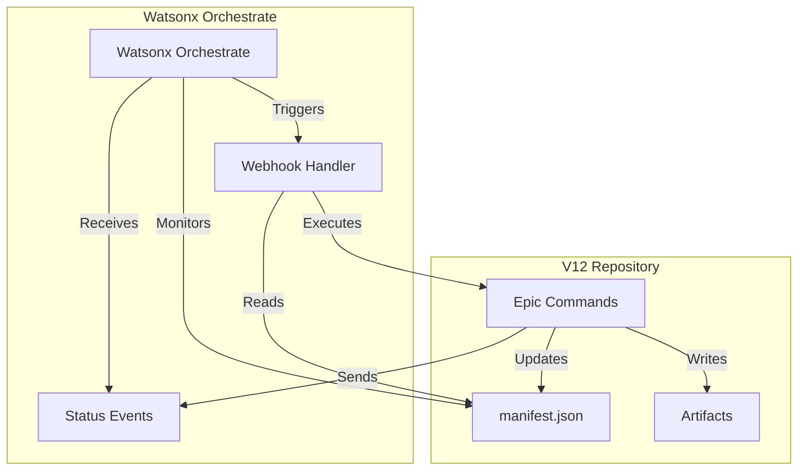

# Watsonx Orchestrate Integration Guide

**Version**: 1.0  
**Date**: 2026-06-09  
**Status**: Design Phase  
**Author**: V12 Architecture Team

## Executive Summary

This guide documents the integration between V12's manifest-based epic workflow and IBM Watsonx Orchestrate. The integration enables AI-driven workflow orchestration, parallel execution, and intelligent failure recovery.

## Table of Contents

1. [Overview](#overview)
2. [Prerequisites](#prerequisites)
3. [Architecture](#architecture)
4. [Skill Definitions](#skill-definitions)
5. [Authentication & Authorization](#authentication--authorization)
6. [Orchestration Flows](#orchestration-flows)
7. [Monitoring & Observability](#monitoring--observability)
8. [Error Handling](#error-handling)
9. [Fallback Strategy](#fallback-strategy)
10. [Deployment](#deployment)

## Overview

### What is Watsonx Orchestrate?

IBM Watsonx Orchestrate is an AI-powered automation platform that:
- Orchestrates complex multi-step workflows
- Integrates with external tools via skills
- Provides intelligent decision-making
- Monitors execution and handles failures
- Scales horizontally for parallel execution

### Integration Benefits

**For V12 Epic Workflow**:
- ✅ Automated phase orchestration (no manual command execution)
- ✅ Intelligent dependency resolution
- ✅ Parallel execution of independent phases
- ✅ Real-time progress monitoring
- ✅ Automatic failure recovery and retry
- ✅ Audit trail and compliance tracking

**For Development Teams**:
- ✅ Reduced manual intervention
- ✅ Faster epic completion (parallel execution)
- ✅ Consistent workflow execution
- ✅ Better visibility into epic progress
- ✅ Automated quality gates

## Prerequisites

### Required Components

1. **Watsonx Orchestrate Instance**
   - Version: 2.0 or higher
   - License: Standard or Enterprise
   - Access: Admin privileges for skill creation

2. **Watsonx Orchestrate ADK (Automation Development Kit)**
   - Installation: `npm install -g @ibm/watsonx-orchestrate-adk`
   - Documentation: https://www.ibm.com/docs/en/watsonx/orchestrate

3. **V12 Repository Setup**
   - Manifest-based workflow implemented (Phase 1 complete)
   - `scripts/epic_manifest.py` helper functions available
   - All epic phase commands functional

4. **Authentication**
   - IBM Cloud API Key
   - Watsonx Orchestrate service credentials
   - GitHub Personal Access Token (for repository access)

### Environment Variables

```bash
# IBM Cloud
export IBM_CLOUD_API_KEY="your-api-key"
export WATSONX_ORCHESTRATE_URL="https://your-instance.watsonx.ibm.com"
export WATSONX_ORCHESTRATE_INSTANCE_ID="your-instance-id"

# GitHub
export GITHUB_TOKEN="your-github-token"
export GITHUB_REPO="malhitticrypto-debug/universal-or-strategy"

# V12 Repository
export V12_REPO_PATH="/path/to/universal-or-strategy"
export V12_MANIFEST_DIR="docs/brain"
```

## Architecture

### High-Level Architecture



### Component Responsibilities

| Component | Responsibility |
|-----------|---------------|
| **Watsonx Orchestrate** | Workflow orchestration, dependency resolution, parallel execution |
| **Webhook Handler** | Receives commands from Watsonx, executes epic commands |
| **Epic Commands** | Phase execution (epic-intake, epic-plan, epic-validate, etc.) |
| **Manifest** | State tracking, dependency management, artifact registry |
| **Status Events** | Real-time progress updates sent to Watsonx |

### Data Flow

1. **Workflow Initiation**:
   - User triggers epic via Watsonx UI or API
   - Watsonx calls `v12-epic-start` skill
   - Skill executes `epic-intake` command
   - Manifest created with initial state

2. **Phase Execution**:
   - Watsonx reads manifest for next phases
   - Calls `v12-epic-phase` skill for each phase
   - Skill executes phase command (e.g., `epic-plan`)
   - Command updates manifest with status/outputs
   - Skill sends status event to Watsonx

3. **Parallel Execution**:
   - Watsonx identifies independent phases
   - Launches multiple `v12-epic-phase` skills concurrently
   - Each skill executes in isolated environment
   - Manifest updates are serialized (file locking)

4. **Completion**:
   - All phases reach `completed` status
   - Watsonx calls `v12-epic-status` skill
   - Final report generated
   - Workflow marked complete

## Skill Definitions

### Skill 1: v12-epic-start

**Purpose**: Initialize a new V12 epic workflow

**Skill Definition** (`skills/v12-epic-start.yaml`):
```yaml
name: v12-epic-start
version: 1.0.0
description: Initialize V12 epic workflow with manifest generation
category: development

inputs:
  - name: epic_id
    type: string
    required: true
    description: Epic identifier (e.g., EPIC-CCN-16)
    pattern: ^EPIC-[A-Z]+-\d+$
    
  - name: description
    type: string
    required: true
    description: Brief epic description
    maxLength: 500

outputs:
  - name: manifest_path
    type: string
    description: Path to generated manifest.json
    
  - name: hotspots_path
    type: string
    description: Path to hotspot analysis report
    
  - name: status
    type: string
    enum: [success, failed]
    
  - name: message
    type: string
    description: Status message

execution:
  type: webhook
  url: ${WEBHOOK_BASE_URL}/epic/start
  method: POST
  timeout: 300
  retry:
    max_attempts: 3
    backoff: exponential
```

**Webhook Handler** (`webhooks/epic_start.py`):
```python
from flask import Flask, request, jsonify
import subprocess
import os
from pathlib import Path

app = Flask(__name__)

@app.route('/epic/start', methods=['POST'])
def epic_start():
    """
    Execute epic-intake command and return manifest path.
    """
    data = request.json
    epic_id = data['epic_id']
    description = data['description']
    
    try:
        # Execute epic-intake command
        result = subprocess.run(
            ['epic-intake', epic_id, description],
            cwd=os.environ['V12_REPO_PATH'],
            capture_output=True,
            text=True,
            timeout=300
        )
        
        if result.returncode != 0:
            return jsonify({
                'status': 'failed',
                'message': f'epic-intake failed: {result.stderr}'
            }), 500
        
        # Verify manifest created
        manifest_path = Path(os.environ['V12_MANIFEST_DIR']) / epic_id / 'manifest.json'
        hotspots_path = Path(os.environ['V12_MANIFEST_DIR']) / epic_id / '00-hotspots.md'
        
        if not manifest_path.exists():
            return jsonify({
                'status': 'failed',
                'message': 'Manifest not created'
            }), 500
        
        return jsonify({
            'status': 'success',
            'manifest_path': str(manifest_path),
            'hotspots_path': str(hotspots_path),
            'message': f'Epic {epic_id} initialized successfully'
        })
        
    except subprocess.TimeoutExpired:
        return jsonify({
            'status': 'failed',
            'message': 'epic-intake timed out after 5 minutes'
        }), 500
    except Exception as e:
        return jsonify({
            'status': 'failed',
            'message': f'Unexpected error: {str(e)}'
        }), 500
```

### Skill 2: v12-epic-phase

**Purpose**: Execute a single epic phase

**Skill Definition** (`skills/v12-epic-phase.yaml`):
```yaml
name: v12-epic-phase
version: 1.0.0
description: Execute a single V12 epic phase
category: development

inputs:
  - name: epic_id
    type: string
    required: true
    description: Epic identifier
    
  - name: phase
    type: string
    required: true
    description: Phase ID (e.g., "1.5", "5.1")
    pattern: ^\d+(\.\d+)?(\.[A-Z])?$
    
  - name: ticket_number
    type: integer
    required: false
    description: Ticket number (for Phase 5.X only)

outputs:
  - name: status
    type: string
    enum: [completed, failed, blocked]
    
  - name: artifacts
    type: array
    items:
      type: string
    description: List of output artifact paths
    
  - name: duration_seconds
    type: integer
    description: Phase execution duration
    
  - name: message
    type: string
    description: Status message

execution:
  type: webhook
  url: ${WEBHOOK_BASE_URL}/epic/phase
  method: POST
  timeout: 1800
  retry:
    max_attempts: 2
    backoff: exponential
```

**Webhook Handler** (`webhooks/epic_phase.py`):
```python
from flask import Flask, request, jsonify
import subprocess
import os
import time
from pathlib import Path
import sys

# Add scripts directory to path
sys.path.append(os.path.join(os.environ['V12_REPO_PATH'], 'scripts'))
from epic_manifest import load_manifest, validate_dependencies, update_manifest

app = Flask(__name__)

PHASE_COMMANDS = {
    '1': 'epic-scope-boundary --phase 1',
    '1.5': 'epic-scope-boundary --phase 1.5',
    '2': 'epic-plan',
    '3': 'epic-scan',
    '4': 'epic-tickets',
    '5': 'epic-validate --ticket',  # Requires ticket_number
    '5.V': 'epic-verify-ticket --ticket',  # Requires ticket_number
    '6': 'epic-review-final'
}

@app.route('/epic/phase', methods=['POST'])
def epic_phase():
    """
    Execute epic phase command and update manifest.
    """
    data = request.json
    epic_id = data['epic_id']
    phase = data['phase']
    ticket_number = data.get('ticket_number')
    
    try:
        # Validate dependencies
        if not validate_dependencies(epic_id, phase):
            return jsonify({
                'status': 'blocked',
                'message': f'Dependencies not satisfied for phase {phase}'
            }), 400
        
        # Determine command
        phase_key = phase.split('.')[0] if '.' in phase else phase
        if phase.endswith('.V'):
            phase_key = '5.V'
        elif phase.startswith('5.') and not phase.endswith('.V'):
            phase_key = '5'
        
        command = PHASE_COMMANDS.get(phase_key)
        if not command:
            return jsonify({
                'status': 'failed',
                'message': f'Unknown phase: {phase}'
            }), 400
        
        # Add ticket number if needed
        if ticket_number is not None:
            command += f' {ticket_number}'
        
        # Add epic_id
        command = f'{command} {epic_id}'
        
        # Update manifest: phase started
        update_manifest(epic_id, phase, 'in_progress')
        
        # Execute command
        start_time = time.time()
        result = subprocess.run(
            command.split(),
            cwd=os.environ['V12_REPO_PATH'],
            capture_output=True,
            text=True,
            timeout=1800
        )
        duration = int(time.time() - start_time)
        
        if result.returncode != 0:
            update_manifest(epic_id, phase, 'failed', notes=result.stderr)
            return jsonify({
                'status': 'failed',
                'message': f'Phase {phase} failed: {result.stderr}',
                'duration_seconds': duration
            }), 500
        
        # Load manifest to get output artifacts
        manifest = load_manifest(epic_id)
        phase_data = manifest['phases'].get(phase, {})
        artifacts = phase_data.get('output_artifacts', [])
        
        # Update manifest: phase completed
        update_manifest(epic_id, phase, 'completed')
        
        return jsonify({
            'status': 'completed',
            'artifacts': artifacts,
            'duration_seconds': duration,
            'message': f'Phase {phase} completed successfully'
        })
        
    except subprocess.TimeoutExpired:
        update_manifest(epic_id, phase, 'failed', notes='Timeout after 30 minutes')
        return jsonify({
            'status': 'failed',
            'message': f'Phase {phase} timed out after 30 minutes'
        }), 500
    except Exception as e:
        update_manifest(epic_id, phase, 'failed', notes=str(e))
        return jsonify({
            'status': 'failed',
            'message': f'Unexpected error: {str(e)}'
        }), 500
```

### Skill 3: v12-epic-status

**Purpose**: Check epic workflow status

**Skill Definition** (`skills/v12-epic-status.yaml`):
```yaml
name: v12-epic-status
version: 1.0.0
description: Get V12 epic workflow status
category: development

inputs:
  - name: epic_id
    type: string
    required: true
    description: Epic identifier

outputs:
  - name: status
    type: string
    enum: [pending, in_progress, completed, failed]
    
  - name: completed_phases
    type: array
    items:
      type: string
    description: List of completed phase IDs
    
  - name: next_phases
    type: array
    items:
      type: string
    description: List of phases ready to execute
    
  - name: failed_phases
    type: array
    items:
      type: string
    description: List of failed phase IDs
    
  - name: progress_percent
    type: integer
    description: Overall progress percentage

execution:
  type: webhook
  url: ${WEBHOOK_BASE_URL}/epic/status
  method: GET
  timeout: 30
```

**Webhook Handler** (`webhooks/epic_status.py`):
```python
from flask import Flask, request, jsonify
import os
import sys

sys.path.append(os.path.join(os.environ['V12_REPO_PATH'], 'scripts'))
from epic_manifest import load_manifest, get_next_phases

app = Flask(__name__)

@app.route('/epic/status', methods=['GET'])
def epic_status():
    """
    Return epic workflow status from manifest.
    """
    epic_id = request.args.get('epic_id')
    
    try:
        manifest = load_manifest(epic_id)
        
        # Calculate statistics
        phases = manifest['phases']
        total_phases = len(phases)
        completed = [p for p, data in phases.items() if data['status'] == 'completed']
        failed = [p for p, data in phases.items() if data['status'] == 'failed']
        next_phases = get_next_phases(epic_id)
        
        progress = int((len(completed) / total_phases) * 100) if total_phases > 0 else 0
        
        # Determine overall status
        if len(failed) > 0:
            overall_status = 'failed'
        elif len(completed) == total_phases:
            overall_status = 'completed'
        elif len(completed) > 0:
            overall_status = 'in_progress'
        else:
            overall_status = 'pending'
        
        return jsonify({
            'status': overall_status,
            'completed_phases': completed,
            'next_phases': next_phases,
            'failed_phases': failed,
            'progress_percent': progress
        })
        
    except FileNotFoundError:
        return jsonify({
            'status': 'failed',
            'message': f'Manifest not found for epic {epic_id}'
        }), 404
    except Exception as e:
        return jsonify({
            'status': 'failed',
            'message': f'Unexpected error: {str(e)}'
        }), 500
```

## Authentication & Authorization

### IBM Cloud Authentication

**Setup**:
```bash
# Install IBM Cloud CLI
curl -fsSL https://clis.cloud.ibm.com/install/linux | sh

# Login
ibmcloud login --apikey $IBM_CLOUD_API_KEY

# Target Watsonx Orchestrate service
ibmcloud target --cf
ibmcloud target -g watsonx-orchestrate-rg
```

**Service Credentials**:
```json
{
  "apikey": "your-api-key",
  "iam_apikey_description": "Auto-generated for Watsonx Orchestrate",
  "iam_apikey_name": "watsonx-orchestrate-key",
  "iam_role_crn": "crn:v1:bluemix:public:iam::::serviceRole:Manager",
  "iam_serviceid_crn": "crn:v1:bluemix:public:iam-identity::a/...",
  "url": "https://your-instance.watsonx.ibm.com"
}
```

### Webhook Authentication

**API Key Authentication**:
```python
from flask import Flask, request, jsonify
from functools import wraps
import os

def require_api_key(f):
    @wraps(f)
    def decorated_function(*args, **kwargs):
        api_key = request.headers.get('X-API-Key')
        if api_key != os.environ['WEBHOOK_API_KEY']:
            return jsonify({'error': 'Invalid API key'}), 401
        return f(*args, **kwargs)
    return decorated_function

@app.route('/epic/start', methods=['POST'])
@require_api_key
def epic_start():
    # Handler implementation
    pass
```

**Environment Setup**:
```bash
# Generate secure API key
export WEBHOOK_API_KEY=$(openssl rand -hex 32)

# Configure in Watsonx Orchestrate skill
# Settings > Authentication > API Key > $WEBHOOK_API_KEY
```

### GitHub Authentication

**Personal Access Token**:
```bash
# Create token with repo scope
# https://github.com/settings/tokens/new

export GITHUB_TOKEN="ghp_..."

# Configure in webhook handlers for git operations
```

## Orchestration Flows

### Flow 1: Complete Epic Workflow

**Orchestration Definition** (`flows/complete-epic.yaml`):
```yaml
name: complete-epic-workflow
version: 1.0.0
description: Execute complete V12 epic workflow with parallel execution

inputs:
  - name: epic_id
    type: string
    required: true
  - name: description
    type: string
    required: true

flow:
  # Step 1: Initialize epic
  - id: init
    skill: v12-epic-start
    inputs:
      epic_id: ${input.epic_id}
      description: ${input.description}
    outputs:
      manifest_path: ${init.manifest_path}
      
  # Step 2: Execute planning phases sequentially
  - id: phase_1
    skill: v12-epic-phase
    inputs:
      epic_id: ${input.epic_id}
      phase: "1"
    depends_on: [init]
    
  - id: phase_1_5
    skill: v12-epic-phase
    inputs:
      epic_id: ${input.epic_id}
      phase: "1.5"
    depends_on: [phase_1]
    
  - id: phase_2
    skill: v12-epic-phase
    inputs:
      epic_id: ${input.epic_id}
      phase: "2"
    depends_on: [phase_1_5]
    
  - id: phase_3
    skill: v12-epic-phase
    inputs:
      epic_id: ${input.epic_id}
      phase: "3"
    depends_on: [phase_2]
    
  - id: phase_4
    skill: v12-epic-phase
    inputs:
      epic_id: ${input.epic_id}
      phase: "4"
    depends_on: [phase_3]
    
  # Step 3: Execute tickets in parallel
  - id: tickets
    skill: v12-epic-phase
    parallel: true
    loop:
      items: ${phase_4.ticket_numbers}
    inputs:
      epic_id: ${input.epic_id}
      phase: "5.${item}"
      ticket_number: ${item}
    depends_on: [phase_4]
    
  # Step 4: Verify tickets in parallel
  - id: verifications
    skill: v12-epic-phase
    parallel: true
    loop:
      items: ${phase_4.ticket_numbers}
    inputs:
      epic_id: ${input.epic_id}
      phase: "5.${item}.V"
      ticket_number: ${item}
    depends_on: [tickets]
    
  # Step 5: Final review
  - id: phase_6
    skill: v12-epic-phase
    inputs:
      epic_id: ${input.epic_id}
      phase: "6"
    depends_on: [verifications]
    
  # Step 6: Check final status
  - id: final_status
    skill: v12-epic-status
    inputs:
      epic_id: ${input.epic_id}
    depends_on: [phase_6]

outputs:
  - name: status
    value: ${final_status.status}
  - name: completed_phases
    value: ${final_status.completed_phases}
```

### Flow 2: Resume Failed Epic

**Orchestration Definition** (`flows/resume-epic.yaml`):
```yaml
name: resume-epic-workflow
version: 1.0.0
description: Resume V12 epic workflow from failed phase

inputs:
  - name: epic_id
    type: string
    required: true

flow:
  # Step 1: Check current status
  - id: check_status
    skill: v12-epic-status
    inputs:
      epic_id: ${input.epic_id}
      
  # Step 2: Execute next phases
  - id: resume_phases
    skill: v12-epic-phase
    parallel: true
    loop:
      items: ${check_status.next_phases}
    inputs:
      epic_id: ${input.epic_id}
      phase: ${item}
    condition: ${length(check_status.next_phases) > 0}
    
  # Step 3: Check completion
  - id: final_status
    skill: v12-epic-status
    inputs:
      epic_id: ${input.epic_id}
    depends_on: [resume_phases]

outputs:
  - name: status
    value: ${final_status.status}
```

## Monitoring & Observability

### Real-Time Progress Tracking

**Webhook Events**:
```python
import requests

def send_progress_event(epic_id, phase, status, progress_percent):
    """
    Send progress event to Watsonx Orchestrate.
    """
    event_data = {
        'epic_id': epic_id,
        'phase': phase,
        'status': status,
        'progress_percent': progress_percent,
        'timestamp': datetime.utcnow().isoformat()
    }
    
    response = requests.post(
        f'{os.environ["WATSONX_ORCHESTRATE_URL"]}/api/v1/events',
        headers={
            'Authorization': f'Bearer {get_access_token()}',
            'Content-Type': 'application/json'
        },
        json=event_data
    )
    
    return response.status_code == 200
```

### Dashboard Integration

**Watsonx Orchestrate Dashboard**:
- Real-time workflow visualization
- Phase completion timeline
- Resource utilization metrics
- Error logs and stack traces

**Custom Dashboard** (Optional):
```python
from flask import Flask, render_template
import sys
sys.path.append(os.path.join(os.environ['V12_REPO_PATH'], 'scripts'))
from epic_manifest import load_manifest

app = Flask(__name__)

@app.route('/dashboard/<epic_id>')
def dashboard(epic_id):
    manifest = load_manifest(epic_id)
    return render_template('dashboard.html', manifest=manifest)
```

### Logging

**Structured Logging**:
```python
import logging
import json

logger = logging.getLogger('v12-epic-workflow')
logger.setLevel(logging.INFO)

handler = logging.FileHandler('epic-workflow.log')
handler.setFormatter(logging.Formatter(
    '%(asctime)s - %(name)s - %(levelname)s - %(message)s'
))
logger.addHandler(handler)

def log_phase_event(epic_id, phase, event_type, data):
    logger.info(json.dumps({
        'epic_id': epic_id,
        'phase': phase,
        'event_type': event_type,
        'data': data
    }))
```

## Error Handling

### Retry Strategy

**Exponential Backoff**:
```yaml
retry:
  max_attempts: 3
  backoff: exponential
  initial_delay: 5
  max_delay: 300
  multiplier: 2
```

**Retry Logic**:
```python
import time

def execute_with_retry(command, max_attempts=3):
    for attempt in range(max_attempts):
        try:
            result = subprocess.run(command, ...)
            if result.returncode == 0:
                return result
        except Exception as e:
            if attempt == max_attempts - 1:
                raise
            delay = min(5 * (2 ** attempt), 300)
            time.sleep(delay)
```

### Failure Notifications

**Slack Integration**:
```python
import requests

def notify_failure(epic_id, phase, error_message):
    webhook_url = os.environ['SLACK_WEBHOOK_URL']
    payload = {
        'text': f'🚨 Epic {epic_id} Phase {phase} Failed',
        'attachments': [{
            'color': 'danger',
            'fields': [
                {'title': 'Epic', 'value': epic_id, 'short': True},
                {'title': 'Phase', 'value': phase, 'short': True},
                {'title': 'Error', 'value': error_message, 'short': False}
            ]
        }]
    }
    requests.post(webhook_url, json=payload)
```

### Rollback Procedures

**Automatic Rollback**:
```python
def rollback_phase(epic_id, phase):
    """
    Rollback failed phase to previous state.
    """
    # 1. Revert manifest status
    update_manifest(epic_id, phase, 'pending')
    
    # 2. Delete output artifacts
    manifest = load_manifest(epic_id)
    phase_data = manifest['phases'][phase]
    for artifact in phase_data.get('output_artifacts', []):
        if os.path.exists(artifact):
            os.remove(artifact)
    
    # 3. Restore git state (if needed)
    subprocess.run(['git', 'restore', '.'], cwd=os.environ['V12_REPO_PATH'])
```

## Fallback Strategy

### Bob CLI Orchestrator

If Watsonx Orchestrate is unavailable, fall back to Bob CLI orchestrator:

**Detection**:
```python
def is_watsonx_available():
    try:
        response = requests.get(
            f'{os.environ["WATSONX_ORCHESTRATE_URL"]}/health',
            timeout=5
        )
        return response.status_code == 200
    except:
        return False
```

**Fallback Execution**:
```bash
# If Watsonx unavailable, use Bob CLI
if ! is_watsonx_available; then
    echo "Watsonx unavailable, falling back to Bob CLI orchestrator"
    bob orchestrate EPIC-CCN-X
fi
```

### Manual Execution

If both Watsonx and Bob CLI fail, execute phases manually:

```bash
# Manual phase execution
epic-intake EPIC-CCN-X "Description"
epic-scope-boundary EPIC-CCN-X --phase 1
epic-scope-boundary EPIC-CCN-X --phase 1.5
epic-plan EPIC-CCN-X
epic-scan EPIC-CCN-X
epic-tickets EPIC-CCN-X
epic-validate EPIC-CCN-X --ticket 1
epic-verify-ticket EPIC-CCN-X --ticket 1
epic-review-final EPIC-CCN-X
```

## Deployment

### Webhook Server Deployment

**Docker Deployment**:
```dockerfile
FROM python:3.11-slim

WORKDIR /app

COPY requirements.txt .
RUN pip install -r requirements.txt

COPY webhooks/ ./webhooks/
COPY scripts/ ./scripts/

ENV FLASK_APP=webhooks.app
ENV FLASK_ENV=production

EXPOSE 5000

CMD ["gunicorn", "-w", "4", "-b", "0.0.0.0:5000", "webhooks.app:app"]
```

**Kubernetes Deployment**:
```yaml
apiVersion: apps/v1
kind: Deployment
metadata:
  name: v12-epic-webhooks
spec:
  replicas: 3
  selector:
    matchLabels:
      app: v12-epic-webhooks
  template:
    metadata:
      labels:
        app: v12-epic-webhooks
    spec:
      containers:
      - name: webhooks
        image: v12-epic-webhooks:latest
        ports:
        - containerPort: 5000
        env:
        - name: WEBHOOK_API_KEY
          valueFrom:
            secretKeyRef:
              name: v12-secrets
              key: webhook-api-key
        - name: V12_REPO_PATH
          value: /mnt/repo
        volumeMounts:
        - name: repo
          mountPath: /mnt/repo
      volumes:
      - name: repo
        persistentVolumeClaim:
          claimName: v12-repo-pvc
```

### Skill Registration

**Register Skills in Watsonx**:
```bash
# Install ADK
npm install -g @ibm/watsonx-orchestrate-adk

# Login
watsonx-adk login --apikey $IBM_CLOUD_API_KEY

# Register skills
watsonx-adk skill create skills/v12-epic-start.yaml
watsonx-adk skill create skills/v12-epic-phase.yaml
watsonx-adk skill create skills/v12-epic-status.yaml

# Deploy flows
watsonx-adk flow create flows/complete-epic.yaml
watsonx-adk flow create flows/resume-epic.yaml
```

### Testing

**Integration Test**:
```bash
# Test complete workflow
watsonx-adk flow run complete-epic-workflow \
  --input epic_id=EPIC-TEST-1 \
  --input description="Test epic"

# Verify completion
watsonx-adk flow status complete-epic-workflow
```

## Next Steps

1. **Phase 1**: Implement webhook handlers (Week 7)
2. **Phase 2**: Create skill definitions (Week 7)
3. **Phase 3**: Deploy webhook server (Week 8)
4. **Phase 4**: Register skills in Watsonx (Week 8)
5. **Phase 5**: Test with EPIC-CCN-16 pilot (Week 8)
6. **Phase 6**: Production rollout (Week 9)

## References

- **Watsonx Orchestrate Documentation**: https://www.ibm.com/docs/en/watsonx/orchestrate
- **Watsonx Orchestrate ADK**: https://github.com/IBM/watsonx-orchestrate-adk
- **V12 Epic Workflow Design**: `docs/workflow/V12_EPIC_WORKFLOW_REFACTORING_DESIGN.md`
- **Manifest Schema**: `docs/workflow/EPIC_MANIFEST_SCHEMA.md`
- **Epic Commands**: `.bob/commands/epic-*.md`

---

**Document Status**: Design v1.0  
**Implementation Status**: Not Started  
**Target Completion**: Week 8 (2026-06-23)